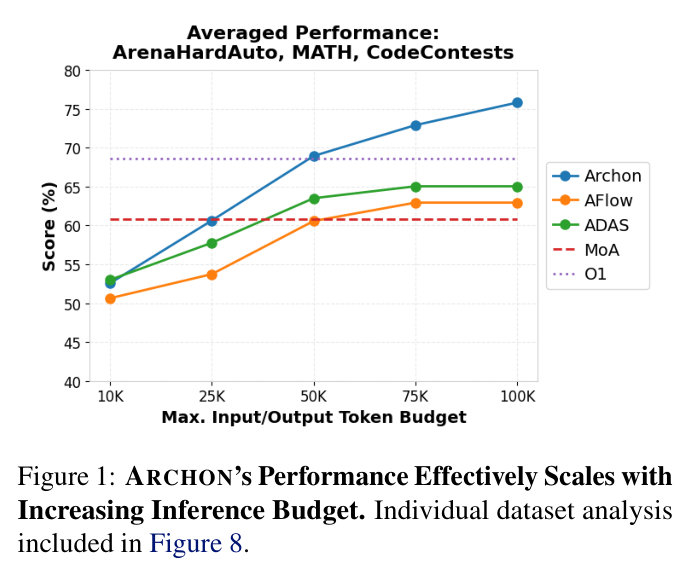
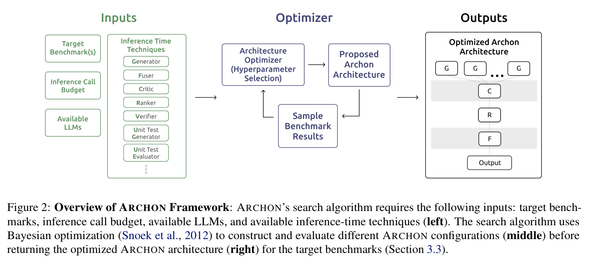
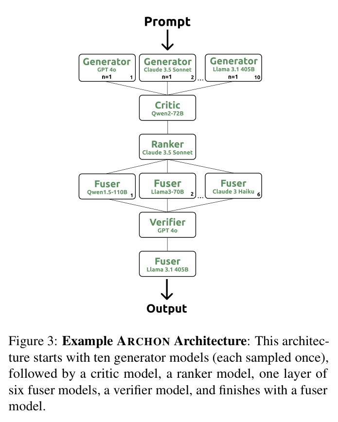
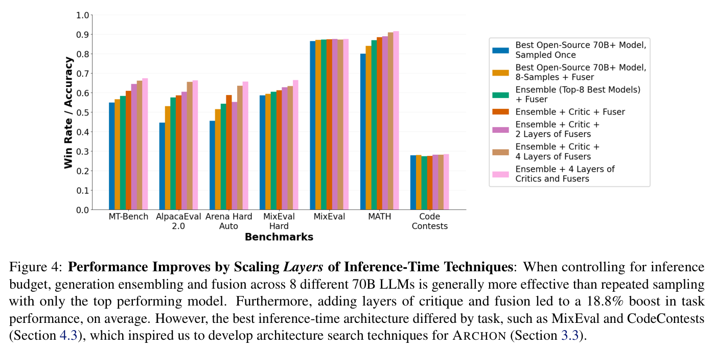
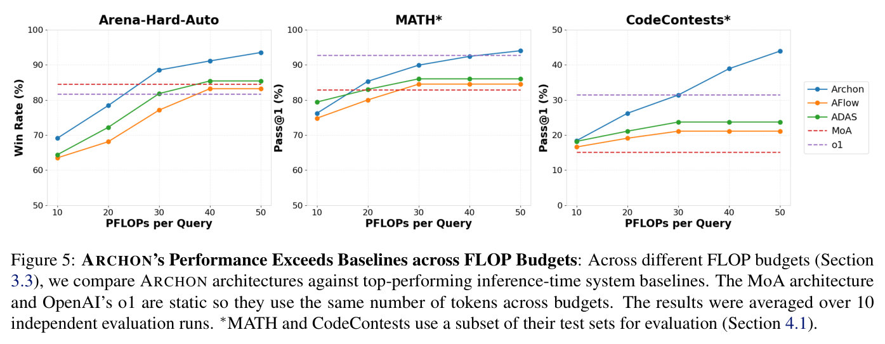

# Archon: An Architecture Search Framework for Inference-Time Techniques — main body

Full text of Saad-Falcon et al. (2024), transcribed from the arXiv LaTeX source and reproduced under CC BY 4.0; copyright the authors. Figures are crops of the published PDF, shown with the paper's own caption; this knowledge base adds no description of its own, so what a figure shows is what its caption and the paper's text say. Citations are resolved to author–year; the bibliography is omitted — follow the arXiv link for it. The appendices are not transcribed in this knowledge base; they are in the arXiv version linked above.

## Contents

| § | Heading | Figures | Tables |
|---|---|---|---|
| — | Abstract | | |
| 1 | Introduction | Figure 1, Figure 2 | |
| 2 | Related Work | | |
| 3 | Inference-Time Techniques for Archon | Figure 3, Figure 4 | |
| 3.1 | LLM Components of Archon | | |
| 3.2 | Combining the LLM Components | Figure 3, Figure 4 | |
| 3.3 | Architecture Search Algorithms | | |
| 4 | Experiments | Figure 5 | Table 1, Table 2 |
| 4.1 | Benchmarks and Models | | Table 1 |
| 4.2 | Archon vs. Closed-Source LLMs and Other Inference-Time Architectures | Figure 5 | Table 2 |
| 4.3 | Archon by Task | | |
| 4.4 | Discussion | | |
| — | Acknowledgments | | |

## Abstract

Inference-time techniques, such as repeated sampling or iterative revisions, are emerging as powerful ways to enhance large-language models (LLMs) at test time. However, best practices for developing systems that combine these techniques remain underdeveloped due to our limited understanding of the utility of each technique across models and tasks, the interactions between them, and the massive search space for combining them. To address these challenges, we introduce Archon, a modular and automated framework for optimizing the process of selecting and combining inference-time techniques and LLMs. Given a compute budget and a set of available LLMs, Archon explores a large design space to discover optimized configurations tailored to target benchmarks. It can design custom or general-purpose architectures that advance the Pareto frontier of accuracy vs. maximum token budget compared to top-performing baselines. Across instruction-following, reasoning, and coding tasks, we show that Archon can leverage additional inference compute budget to design systems that outperform frontier models such as OpenAI's o1, GPT-4o, and Claude 3.5 Sonnet by an average of 15.1%.

## 1 Introduction

**Figure 1.** **Archon's Performance Effectively Scales with Increasing Inference Budget.** Individual dataset analysis included in Figure 8.

Inference-time techniques---strategies that use additional compute during model inference---are gaining traction as effective methods for improving model capabilities.
LLMs, such as OpenAI's o1 (OpenAI, 2024), QwQ (Team, 2024), and Sky-T1 (Team, 2025), utilize such techniques to translate additional inference compute into better performance across a broad set of tasks.
Example techniques include generation ensembling, ranking, and fusion, where models in the ensemble are queried in parallel, their responses are ranked, and the best ones are fused into a single, higher quality output, respectively (Jiang et al., 2023b; Wang et al., 2024a).
Other types of inference-time techniques are based on querying a single LLM successively (via repeated sampling) and using a voting strategy or unit tests to select the top generation (Brown et al., 2024; Chen et al., 2024; Li et al., 2024a).

Recent work has made progress towards building robust *inference-time architectures*: systems composed of one or more large language models (LLMs) leveraging inference-time techniques.
Examples include Mixture-of-Agents (MoA) (Wang et al., 2024a) and LLM-Blender (Jiang et al., 2023b), as well as single-model systems like ADAS (Hu et al., 2024) and AFlow (Zhang et al., 2024).
However, our experiments show that these top-performing baselines have limitations in compute utilization and task generalization. (see Section 4.2).
We argue that designing effective and generalizable inference-time architectures requires the following:

**Figure 2.** **Overview of Archon Framework**: Archon's search algorithm requires the following inputs: target benchmarks, inference call budget, available LLMs, and available inference-time techniques (**left**). The search algorithm uses Bayesian optimization (Snoek et al., 2012) to construct and evaluate different Archon configurations (**middle**) before returning the optimized Archon architecture (**right**) for the target benchmarks (Section 3.3).

- **Understanding the Utilities of Inference-Time Techniques**:
Inference-time architectures typically delegate their additional inference budget towards more model sampling calls (Chen et al., 2024; Brown et al., 2024), which can be effective for math and coding tasks.
Other tasks, such as following instructions and reasoning, have been shown to benefit from additional techniques, including ranking and fusion (Wang et al., 2024a; Jiang et al., 2023b).
While all of these methods are valuable, *it is essential to identify which inference-time techniques are most effective for different task categories.*
- **Understanding the Interactions Between Inference-Time Techniques**:
While previous studies analyzed these techniques individually (e.g., generation sampling in Chen et al. (2024)), *we need a more comprehensive understanding of the relationships between different inference-time techniques* across different tasks (e.g., is it better to use more models or generate more samples per model?).
- **Efficiently and Automatically Searching the Large Design Space of Inference-Time Architectures**: Given a set of available LLMs and target tasks, there is currently no single prevailing inference-time architecture for maximizing downstream accuracy across all tasks (Table 1). The search space for inference-time architectures is expansive, requiring practitioners to make several key configuration decisions, such as *which LLMs to use, how many times to sample them, and how to combine and filter the candidate generations*. These motivate the need for automated and adaptive architecture search approaches.

In our work, we address each of these challenges.
First, we **evaluate the utilities of a comprehensive set of existing and proposed inference-time techniques** across instruction-following, reasoning, and coding tasks.
Using both open-source and closed-source models, we examine a range of techniques such as *ensembling, fusion, ranking, critiquing, verification, and model-based unit test generation/evaluation* (Sections 3.1 and 3.2).
We find that no single technique completely dominates across all tasks, with different approaches being more effective for different tasks.

Second, we **analyze the interactions between inference-time techniques** and explore the benefits of adding new models and new techniques individually.
We find that generation ensembling combined with critique, verification, and fusion improves the final response quality beyond the oracle best candidate from individual (non-fused) responses, particularly for instruction-following and reasoning tasks (Figure 4; Figure 7; Table 5).
We also demonstrate increased performance as we scale up the layers of inference-time techniques and combine multiple approaches together, allowing us to discover effective new combinations of inference-time techniques (Sections 3.2, 4.2, Appendix A.3).
Combining multiple strategies significantly improves task performance, but determining the specific combination remains challenging. This requires manually testing models, inference-time techniques, architecture designs, inference budgets, and more.

Third, drawing upon our analysis of inference-time techniques, we present **Archon**, an open-source modular framework for automatically designing LLM systems composed of existing inference-time techniques (or new ones), allowing practitioners to optimize for their desired objective functions: accuracy, latency, and cost (Sections 3.1, 3.3).
Unlike alternative LM systems that perform prompt engineering and tool use over a single LM (Khattab et al., 2023; Yuksekgonul et al., 2024; Hu et al., 2024; Zhang et al., 2024), our approach integrates multiple LMs in a single architecture and reduces prompt selection to a set of core components.
The Archon framework utilizes automatic architecture search algorithms to maximize generation quality for the given tasks(s), leveraging Bayesian optimization (Snoek et al., 2012; Nardi et al., 2019) techniques inspired by (NAS) (Zoph and Le, 2017; Ren et al., 2021) to rapidly traverse the space of potential inference architectures (Section 3.3).

We evaluate Archon architectures across a diverse set of instruction-following, reasoning, and coding benchmarks (Table 1): MT-Bench, Arena-Hard-Auto, Alpaca-2.0 Eval, MixEval, MATH, and CodeContests (Zheng et al., 2023; Li et al., 2024b; Li et al., 2023; Ni et al., 2024; Hendrycks et al., 2021; Li et al., 2022).
Our best Archon architectures surpass both frontier models
(e.g. OpenAI's O1, GPT-4o and Claude-3.5 Sonnet)
and prior top-performing inference-time architectures
(e.g. ADAS, AFlow, and MoA),
*boosting state-of-the-art (SOTA) performance by 15.1%*, on average.
Furthermore, Archon achieves SOTA performances while using *20.0% less inference calls, 15.1% less input tokens, and 13.5% less output tokens* than alternative inference-time architectures (Figure 1; Table 1; Figure 8).
Even when solely using open-source LLMs, Archon architectures, on average, surpass SOTA LLMs by 11.2%.

Overall, we present Archon as an open-source inference-time framework, readily extensible to new inference-time techniques, models, and tasks via user-friendly interfaces.

## 2 Related Work

Despite advancements in inference-time architectures,
many architectures focus on additional generations (Jiang et al., 2023b; Chen et al., 2024; Davis et al., 2024), which is effective for reasoning tasks (Brown et al., 2024).
However, for tasks like instruction-following and reasoning, techniques such as fusion and ranking are effective for bolstering task performances (Wang et al., 2024a; Jiang et al., 2023b).
Prior studies have explored limited aspects of configurations, often focusing on specific benchmarks (Jiang et al., 2023b; Wang et al., 2024a; Chen et al., 2024; Li et al., 2024a).
It's crucial to efficiently develop inference-time architectures, as optimal configurations vary based on benchmarks, available models, and inference compute limits (Section 4.2).
Furthermore, LM orchestration frameworks, such as DSPy (Khattab et al., 2023), only optimize a single prompt for a single LM, better equipping it for tool use by utilizing supervised data but still unable to leverage multiple inference-time techniques in parallel or sequentially.
While each of these approaches manually selects a subset of existing techniques, Archon unifies available inference-time techniques and automates architecture construction with search algorithms, simplifying the model and component selection process for each set of tasks (Sections 3.1 and 3.3).

## 3 Inference-Time Techniques for Archon

With the proliferation of inference-time techniques, Archon introduces a systematic framework for understanding and unifying these methods into inference-time architectures.
Below, we elaborate on the structure, inputs, and outputs of each of the inference-time techniques (Table 3).
Then, we discuss how to combine the different techniques into an inference-time architecture (Section 3.2)
before finally exploring automatic approaches for constructing inference-time architectures (Section 3.3).

### 3.1 LLM Components of Archon

In this section, we discuss the *LLM components* of Archon, which are LLMs that perform a specific inference-time technique.
We test an array of different components inspired by recent work, incorporating approaches for generating, ranking, and fusing candidates (Wang et al., 2024a; Jiang et al., 2023b) as well as approaches for improving candidate response quality through critiquing, verifying, and unit testing (Bai et al., 2022; Zheng et al., 2023).
The components and their prompts are summarized in Table 3 and Appendix A.2.
We also perform an extensive ablation study of the given Archon components across instruction-following, reasoning, and coding benchmarks to better understand their individual utilities and their optimal combinations for different tasks (Appendix A.3).

**Generator** is an LLM that takes in the instruction prompt and outputs candidate responses.
Generators can be called in parallel to perform *generation ensembling* (i.e. calling multiple LLMs in parallel) (Wang et al., 2024a), or sampled multiple times (Brown et al., 2024).
The number of models, samples, and generation temperature can be adjusted.

We find additional model sampling to significantly boost performance (Figure 6), particularly for coding tasks (Table 1).
We see a similar pattern for model ensembling, where sampling from additional models leads to continual performance increases (assuming the models are ordered from best to worst for the given task) (Figure 7).

**Fuser** is an LLM that, given an instruction prompt and a set of proposed responses as input, combines these responses to generate one or more higher-quality fused responses.

For every benchmark explored, we found that the Fuser module substantially improved performance (8.9% on average) (Figure 6; Figure 7; Figure 4).
Additionally, we observed similar benefits in the Archon framework when adding multiple layers of Fusers (Figure 4).
The number of Fuser layers needed to improve performance varied by task (Figure 12), with some tasks receiving limited benefits from added layers (1-2 point increase in accuracy for MixEval) while others experienced significant benefits with 3-4 fusion layers and more (10 to 15 point increase in win rate for MT Bench and Alpaca Eval 2.0).

**Ranker** is an LLM that, given an instruction prompt and a set of proposed responses as input, ranks the candidate generations based on their quality, producing a ranked list of responses as output. This ranking is then used to filter the set of responses to the $\text{top-}K$, as specified.

From our results in Table 5, Figure 6, and Figure 7, our results show the Ranker was most effective for instruction-following and reasoning tasks by using pair-wise comparisons that focus on style and prompt adherence.
We found that on MT Bench and Arena-Hard-Auto benchmarks, the Ranker improved output quality by 10.8% over random selection while performing within 2.7% of oracle selection.

**Critic** is an LLM that, given an instruction prompt and a set of proposed responses as input, produces a list of strengths and weaknesses for each response, which is then used to improve the quality of the final response (Section 3.2; Figure 4).

The Critic module proved effective for every task we explored in Figure 4 and Table 5.
With our 10-model 70B+ Generator ensemble and Fuser configuration of Archon, the added Critic improved performance on average by 11.5 percentage points across the benchmarks explored.

**Verifier** is an LLM that verifies whether a provided candidate response has appropriate reasoning for a given instruction prompt.
It proceeds in two stages: **Stage #1** takes in the instruction prompt and a candidate response as input and outputs reasoning for why the candidate response is correct; **Stage #2** takes in the instruction prompt, candidate response, and produced reasoning before outputting reasoning and a verdict (i.e., binary [Correct] or [Incorrect]) for whether or not the candidate response is correct according to the provided instruction prompt and reasoning.
Only verified responses are passed to the next Archon layer.

The Verifier was most effective for the reasoning benchmarks explored in Table 5, improving performance by 8.4% for MixEval, MixEval Hard, and MATH.
When just using a 70B+ Generator ensemble with Verifier module after generation, the Archon configuration lagged behind the Archon ensemble and fuser configuration by 1.5%, on average, across all benchmarks explored, suggesting verification is most effective when combined with other inference-time techniques.

**Unit Test Generator** and **Unit Test Evaluator** are complementary LLM components in our system: the Unit Test Generator takes an instruction prompt and produces 5-10 concise test statements (Section 4.2; examples in Table 22) for assessing response accuracy and relevance, while the Evaluator takes the instruction prompt, candidate response(s), and these tests as input to rank responses by test passage. The Evaluator justifies and aggregates test verdicts across candidates, scoring each response for reasoning and coding tasks, and only responses passing all tests proceed to the next Archon layer. This approach extends evaluation beyond coding to various task types through configurable test quantities.

The Unit Test Generator and Evaluator were most effective on reasoning and coding tasks, improving performance on benchmarks that required more verification steps (7.4% boost) (Table 5).
When the 70B+ ensemble of Generators was only combined with unit tests, it was less effective for reasoning tasks like Arena-Hard-Auto and MixEval, lagging behind the ensemble and fuser configuration by 3.1%.
However, when we increased generation sampling and added unit test generation/evaluation for CodeContests, we observed a 56% boost in Pass@1 performance (Table 1), increasing from 17.9 to 29.3% Pass@1.

### 3.2 Combining the LLM Components

**Performance Gains from Scaling Inference-Time Techniques**:
We explore the utilities of individual Archon components and evaluate whether combinations of inference-time techniques enable us to *build LM systems greater than the sum of their parts*.
For our analysis, we look at seven datasets spanning instruction-following, reasoning, mathematics, and coding: MT-Bench (Zheng et al., 2023), AlpacaEval 2.0 (Li et al., 2023), Arena Hard Auto (Li et al., 2024b), MixEval (Ni et al., 2024), MixEval-Hard, MATH (Hendrycks et al., 2021), and CodeContests (Li et al., 2022).
We also test across the current SOTA open-source and closed-source LMs (Table 34; Table 35).
For the analysis of each inference-time technique, we focus on **1)** testing it across different benchmarks, **2)** scaling its usage individually, **3)** scaling it while randomly choosing another technique and holding that technique constant, and **4)** varying its position among different components.
We include these ablation experiments in Section A.3, where we include the Archon component combinations in Table 5 and the model type used in the combinations in Table 6 and Table 9.

From our analysis, we find several trends (designated with **T**s) across the combinations of inference-time architectures:

- **T1**: Repeated model sampling and additional ensemble models leads to substantial gains, leading to 9.3% and 18.5% increases, respectively (Figure 11; Figure 7).
- **T2**: Scaling the layers of inference-time techniques significantly improves performance across instruction-following, reasoning, and coding tasks, such as always adding a single fuser as the last layer (Figure 4).
- **T3**: Scaling the diversity of inference-time techniques included also bolsters task performance across the explored tasks, with critics and rankers before fusers being particularly effective (Figure 4; Figure 11).
- **T4**: In reasoning tasks, incorporating the Verifier and Unit Test Generator/Evaluator modules alongside the Fuser improves performance by filtering out flawed responses, contributing to significant performance gains in tasks like MixEval and CodeContests (Table 5; Section A.9).

**Framework Overview**:
Drawing upon our analysis of the inference-time components, we propose **Archon**, a framework for automatically designing LLM systems composed of existing inference-time techniques (or new ones).
Inspired by the structure of neural networks (Hinton et al., 1992), Archon consists of layers of LLM components (Figure 2; Section 3.1).
Each layer is composed of sets of LLM components called in parallel. These components perform a text-to-text operation on the initial instruction prompt and the candidate responses from the previous layer.
Furthermore, like a neural network, some layers perform *transformations* of the provided list of strings (e.g., Generator and Fuser), converting a list of strings into a different list of strings (the numbers of candidates can vary from the original number of candidates).
Other components introduce non-linearities into the Archon structure, performing filtering of the list of strings (e.g., Ranker and Verifier).
Ultimately, the inputs and outputs for each layer is always a list of strings, whether that is the instruction prompt (i.e., a single string) or a list of candidate responses.
If a list of strings is outputted at the last layer of the Archon structure, the first string in the list is returned.

Unlike a classical neural network, no weights are learned between the LLM components and the layers; in turn, the Archon architecture can be deployed off-the-shelf without any tuning.
Additionally, a single state is transformed sequentially from the input layer to the final output; this single state is the initial instruction prompt and the current candidate responses (example architecture in Figure 3).

**Figure 3.** **Example Archon Architecture**: This architecture starts with ten generator models (each sampled once), followed by a critic model, a ranker model, one layer of six fuser models, a verifier model, and finishes with a fuser model.

**Rules for Construction**: The LLM components in Section 3.1 can only be placed in specific orders (Table 4).
While alternative combinations and orderings of Archon components are technically viable, we found these orderings to be optimal after conducting an ablation study of Archon components across seven benchmarks and two model classes (open-source and closed-source) (Appendix A.3).

1. Only one type of component is allowed in any given layer.
2. Generator components can only be placed in the first layer of Archon; you can place one or more Generators.
3. The Critic must come before a Ranker or a Fuser. Otherwise, the generated strengths and weaknesses cannot be incorporated into generation ranking or fusion.
4. Ranker, Critic, Verifier, and Unit Test Generator/Evaluator layers can go anywhere in Archon except the first layer. For each of these components, it must be the only module in its layer.
5. Fuser components can go anywhere in Archon except the first layer. Multiple Fusers can be used in a layer.
6. Unit Test Generators and Evaluators are placed in consecutive layers, with the Unit Test Generator always first.

**Figure 4.** **Performance Improves by Scaling *Layers* of Inference-Time Techniques**: When controlling for inference budget, generation ensembling and fusion across 8 different 70B LLMs is generally more effective than repeated sampling with only the top performing model. Furthermore, adding layers of critique and fusion led to a 18.8% boost in task performance, on average. However, the best inference-time architecture differed by task, such as MixEval and CodeContests (Section 4.3), which inspired us to develop architecture search techniques for Archon (Section 3.3).

### 3.3 Architecture Search Algorithms

**Search Hyperparameters**: In this section, we explore how to automatically design inference-time architectures for target tasks via Archon's architecture search algorithms.
Guided by the trends found in our analysis in Section 3.2, we establish six axes of hyperparameters for the search space:

1. **$\text{Top-}K$ Generators for Ensemble**: The $\text{top-}K$ models for the initial Generator ensemble, ranging from 1 to 10 (**T1**).
The $\text{top-}K$ models are selected greedily based on their individual performances on target task(s)(Table 35).
2. **$\text{Top-}K$ Generator Samples**: The number of samples gathered from each ensemble generator (same for all the models), ranging from 1 to 5 (**T1**).
For CodeContests, we explore high-sample settings: [1, 10, 100, 500, 1000].
3. **Number of Fusion Layers**: Ranges from 1 to 4.
The last fusion layer will always have a single Fuser (**T2**).
4. **$\text{Top-}K$ Fusers**: Number of models used for each fusion layer, ranges from 2 to 10 in increments of 2 (**T2,3**).
5. **Critic and Ranker Layers**: We add critic and ranker layers before each fuser layer since we find they provide added benefits across the benchmarks explored (**T3**) (Section 3.2; Figure 4; Figure 7).
6. **Evaluation Layer**: Option to add Verifier, Unit Test Gen./Eval., or neither before the last Fuser layer (**T4**).

While it is possible to further expand the search space of potential Archon architectures (e.g., different temperatures for generative LLM components, alternative prompts for each LLM component, additional LLM components for Archon, etc.),
the trends we identify from Section 3.2 reasonably constrain the search space of configurations to focus on the most influential hyperparameters.
In total, our search space contains 9,576 configurations, which we obtain by combining all possible hyperparameters and removing invalid configurations (for example, we discard configurations where the number of initial generations exceeds the context window of the fusers).

**Search Method**:
The Archon search method takes in four inputs: the target benchmark(s), the inference call budget, the set of available LLMs, and the inference-time techniques for construction (Figure 2).
As output, the search method outputs a single optimized Archon architecture.
We use 20% of each target dataset as a development set for guiding architecture search.
We explore three approaches for Archon's architecture search: *random search* (randomly test potential architectures in the search space), *greedy search* (greedily optimize individual hyperparameters one at a time, starting from a random initial architecture), and *Bayesian Optimization* (Snoek et al., 2012) (global hyperparameter optimization with Gaussian processes).
As inputs, Bayesian optimization takes in a vector specifying the configuration choices for the generators (i.e., number of models and samples), layers of fusers, numbers of fusers per layer, and final verifier / unit tester (Section 3.2).
Bayesian optimization begins by sampling a specified number of random Archon architectures to calibrate its surrogate model. The task performance of these sampled architectures is used to guide more informed architecture suggestions during the configuration search.
The algorithm repeats the following cycle---evaluating each suggested architecture and using its performance to refine future suggestions---until it discovers the optimal Archon configuration, or until the inference call budget is exhausted.
For more details on our open-source Bayesian optimization approach, please see Appendix A.4, where we further discuss implementation and how to utilize alternative optimization functions, such as latency.

Bayesian optimization found the best architectures in 96.0% of searches and required 88.5% fewer architecture evaluations than greedy search and 90.4% fewer than random search (Figure 10).
The effectiveness of Bayesian optimization increases with the number of initial randomly sampled architectures, up to around 230-240 samples, after which further testing is better focused on configuration search (Table 26).
For limited inference call budgets (<20 calls), Bayesian optimization is less effective, and traditional methods like greedy search may perform comparably (Table 27).

**Adding Search Restrictions**:
To impose compute constraints during architecture search, we exclude any Archon architecture that would exceed the inference call, input token, or output token budgets from the search space.
Multiple restrictions can be added.
For example, you can filter out architectures with more than 20 inference calls or more than 20,000 input tokens.
This prevents our Bayesian optimization algorithm from even considering these invalid architectures in our architecture search, allowing us to compute-match Archon against alternate inference-time frameworks such as ADAS and AFlow (Figure 8; Figure 5).

## 4 Experiments

Our experiments focus on answering the following questions:
**(1)** how does Archon compare to existing SOTA LLMs and inference-time architectures in terms of accuracy and compute efficiency (Section 4.2)?
**(2)** how does Archon performance compare across the tasks explored (Section 4.3)?
**(3)** what are the considerations for model size, latency, and cost surrounding Archon (Section 4.4)?
We outline the benchmarks, models, and techniques for constructing Archon architectures in Section 4.1.

### 4.1 Benchmarks and Models

**Table 1.** Archon's Strong Performance with Open Source, Closed Source, and All Source Models: Consistent outperformance over SOTA LLMs and LM Systems across explored benchmarks. The standard error numbers were calculated from 10 independent evaluation runs. \*MATH and CodeContests use a subset of their test sets for evaluation (Section 4.1).

| Group | Category | Approaches | Avg. Infer. Calls | Avg. Input Tokens | Avg. Output Tokens | Avg. PFLOPs per Query | Dollars per Query | MT Bench W.R. | AlpacaEval 2.0 L.C. W.R. | Arena Hard Auto W.R | MixEval Hard Acc. | MixEval Acc. | MATH\* Pass@1 | CodeContests\* Pass@1 |
|---|---|---|---|---|---|---|---|---|---|---|---|---|---|---|
| Baselines | LM | GPT-4o | 1 | 95 | 549 | 0.6 ± 0.1 | 0.01 ± 0.01 | 44.2% ±0.5 | 57.8% ±0.6 | 80.6% ±0.6 | 63.4% ±0.2 | 87.5% ±0.3 | 83.5% ±0.4 | 18.1% ±0.2 |
| Baselines | LM | Claude 3.5 Sonnet | 1 | 105 | 602 | 1.4 ± 0.2 | 0.01 ± 0.01 | N/A | 52.7% ±0.4 | 81.4% ±0.4 | 68.7% ±0.2 | 89.1% ±0.2 | 82.5% ±0.7 | 12.3% ±0.4 |
| Baselines | LM | Llama 3.1 405B | 1 | 118 | 631 | 1.5 ± 0.1 | 0.01 ± 0.01 | 44.1% ±0.3 | 40.7% ±0.5 | 64.5% ±0.7 | 66.0% ±0.3 | 88.2% ±0.2 | 85.0% ±0.5 | 20.4% ±0.5 |
| Baselines | LM Systems | MoA | 19 | 25,109 | 17,422 | 15.3 ± 0.3 | 0.06 ± 0.01 | 51.6% ±0.6 | 65.0% ±0.3 | 85.3% ±0.3 | 62.3% ±0.4 | 86.9% ±0.2 | 82.9% ±0.6 | 15.1% ±0.5 |
| Baselines | LM Systems | ADAS | 52 | 72,804 | 44,872 | 58.8 ± 0.3 | 0.63 ± 0.04 | 66.3% ±0.7 | 60.1% ±0.5 | 85.4% ±0.4 | 64.2% ±0.2 | 87.0% ±0.2 | 86.0% ±0.8 | 23.7% ±0.3 |
| Baselines | LM Systems | AFlow | 48 | 68,596 | 41,748 | 55.2 ± 0.4 | 0.59 ± 0.05 | 62.4% ±0.2 | 57.8% ±0.6 | 83.2% ±0.6 | 63.5% ±0.3 | 87.2% ±0.4 | 84.5% ±0.2 | 21.1% ±0.6 |
| Baselines | LM Systems | o1 | Unk. | 112 | Unk. | Unk. | 0.52 ±0.05 | 56.3% ±0.5 | 59.3% ±0.5 | 81.7% ±0.3 | 72.0% ±0.4 | 87.5% ±0.2 | **92.7% ±0.5** | **31.5% ±0.8** |
| Archon | Open Source | General Purpose | 35 | 51,113 | 31,508 | 3.1 ± 0.3 | 0.12 ± 0.02 | 67.2% ±0.4 | 63.3% ±0.6 | 85.6% ±0.5 | 65.3% ±0.3 | 86.2% ±0.2 | 87.5% ±0.6 | 18.2% ±0.4 |
| Archon | Open Source | Task Specific | 44 | 63,157 | 39,949 | 3.7 ± 0.3 | 0.15 ± 0.02 | 71.1% ±0.6 | 68.1% ±0.4 | 89.6% ±0.4 | 67.5% ±0.2 | 88.8% ±0.3 | 89.5% ±0.3 | 28.9% ±0.9 |
| Archon | Closed Source | General Purpose | 32 | 52,747 | 27,894 | 40.3 ± 0.5 | 0.44 ± 0.04 | 72.7% ±0.3 | 63.9% ±0.7 | 86.2% ±0.7 | 67.5% ±0.4 | 87.2% ±0.2 | 87.9% ±0.7 | 20.2% ±0.6 |
| Archon | Closed Source | Task Specific | 40 | 59,085 | 37,271 | 48.2 ± 0.4 | 0.49 ± 0.05 | **77.0% ±0.5** | **68.9% ±0.5** | 90.5% ±0.3 | **72.3% ±0.3** | **89.5% ±0.3** | 92.1% ±0.4 | 25.1% ±0.6 |
| Archon | All Source | General Purpose | 35 | 50,427 | 30,461 | 27.8 ± 0.4 | 0.32 ± 0.04 | 76.2% ±0.7 | 66.4% ±0.3 | **89.8% ±0.6** | 69.8% ±0.2 | 87.3% ±0.4 | 89.3% ±0.5 | 23.4% ±0.9 |
| Archon | All Source | Task Specific | 39 | 58,250 | 36,114 | 33.7 ± 0.6 | 0.37 ± 0.04 | **79.5% ±0.4** | **69.0% ±0.6** | **92.5% ±0.5** | **72.7% ±0.3** | **89.7% ±0.2** | **93.5% ±0.6** | **41.4% ±0.7** |

*The "Group" and "Category" columns flatten a `\multirow` spanning multiple rows in the LaTeX (e.g. "Baselines" spans the LM and LM Systems rows; "Archon" spans the Open/Closed/All Source rows). Bold cells mark values LaTeX underlines or bolds (best-baseline or best-overall per column); all other formatting is plain.*

**Benchmarks**: We evaluate our models with several benchmarks for instruction-following, reasoning, and coding: MT-Bench (Zheng et al., 2023), AlpacaEval 2.0 (Li et al., 2023), Arena Hard Auto (Li et al., 2024b), MixEval (Ni et al., 2024), MixEval-Hard, MATH (Hendrycks et al., 2021), and CodeContests (Li et al., 2022).
We provide an overview of each dataset in Table 28.
Since we perform automatic architecture search on a randomly sampled 20% subset of each benchmark, we evaluate on the remaining held-out 80% subset of the benchmark (Table 1) (for Archon performances on the entire benchmarks, please see Table 33).
The delta between the Archon performance on the entire benchmark vs. 80% held-out subset is relatively small: only 0.44%, on average, across these datasets with an S.D. of 0.20%.
For MATH, we evaluate a random sample of 200 problems from the dataset's test set.
For CodeContests, we evaluate on the 140 test set questions that do not include image tags in the problem description.

**Models**: We test the efficacy of the Archon framework by creating different Archon architectures across three model categories: 8B or less parameter models, 70B or more parameter models, and closed-source model APIs.
For our 8B and 70B+ models, we selected the top-10 performing chat models for each parameter range on the Chatbot Arena Leaderboard (Chiang et al., 2024) as of July 2024.
For our Archon architectures, we explore multiple model types: open-source, closed-source, and *all-source* (i.e. both open-source and closed-source available).
For our closed-source model APIs, we include GPT-4o, GPT-4-Turbo, Claude Opus 3.0, Claude Haiku 3.0, and Claude Sonnet 3.5.
We list and compare all of the models tested in the Archon framework in Table 34 and Table 35.
For all the LLMs utilized and every Archon component, we set the generation temperature to $0.7$.
As baselines, we compare Archon against both SOTA single-call LLMs (GPT-4o (OpenAI et al., 2024), Claude 3.5 Sonnet (Anthropic, 2024), and Llama 3.1 405B Instruct (at Meta, 2024)) as well as SOTA inference-time approaches (OpenAI's o1 (OpenAI, 2024), MoA (Wang et al., 2024a), ADAS (Hu et al., 2024), and AFlow (Zhang et al., 2024)).

**Task-Specific and General-Purpose Archon Architectures**: We compare custom Archon architectures, specifically configured to a single evaluation dataset ("Task-specific Archon Architectures"), and a generalized Archon architecture configured to handle all the evaluation datasets ("General-purpose Archon Architectures") (Table 1).
For our three model selection settings for Archon (i.e. open-source, closed-source, and all-source), we utilize automatic architecture search to find targeted Archon architectures for each task (7 architectures total) and find a single generalized Archon architecture for maximizing performance over all the tasks (Table 1).
The benchmarks are concatenated together and shuffled for generalized Archon architecture search.
Importantly, all the Archon architectures utilized in Section 4 are automatically generated by our Bayesian architecture search technique, which searches over the hyperparameter search space for Archon as covered in Section 3.3.
For examples of targeted and generalized Archon architectures, please see Figure 3 and Appendix A.9.
For our architectures, we outline the average number of input tokens (i.e. combined total of tokens inputted over the entire architecture) and output tokens (i.e. combined total of tokens outputted over the entire architecture) for each category in Table 1.

### 4.2 Archon vs. Closed-Source LLMs and Other Inference-Time Architectures

**Task Performances**: We start by comparing Archon architectures to existing SOTA closed-source LLMs and inference-time architectures across a set of instruction-following, reasoning, and coding tasks.
Based on our results in Table 1, we find that Archon architectures consistently match or surpass existing approaches across all the benchmarks explored.
Archon architectures with open-source models demonstrate a 11.2% average improvement over SOTA open-source approaches;
for its worst performance, our open-source Archon architectures are still 3.1% above SOTA open-source approaches on AlpacaEval 2.0.
Archon architectures with closed-source models achieve SOTA performance across MT Bench, Arena-Hard-Auto, MixEval, and MixEval-Hard, leading to a 15.1% average improvement over closed-source LMs and a 8.4% average improvement over open-source inference-time frameworks (i.e. MoA, ADAS, and AFlow).
Compared to o1 and o1-mini, Archon's best targeted architectures beat them by 8.1% and 9.7%, on average, on MT Bench, AlpacaEval 2.0, Arena Hard Auto, MixEval, MixEval Hard, MATH, and CodeContests.
For approaches that use all models available, both open and closed-source, Archon achieves an average 10.9% improvement over existing SOTA single-call LLMs and an average 8.6% improvement over existing inference-time frameworks.

**Compute Efficiency**: Compared to open-source inference-time frameworks (i.e. AFlow, ADAS, MoA), Archon is 20.0% more inference call efficient while having higher performances on all benchmarks tested (Table 1).
We also find that our best Archon architectures use 15.1% less input tokens and 13.5% less output tokens compared to the best alternative open-source inference-time frameworks.
When we utilize Archon's architecture search technique with different token budgets (Figure 8), we find that the generated Archon architectures achieve 12.4% higher performance than alternate baselines when given the same budget.
Overall, the generalized all-source Archon architecture achieves 6.4% better performance across all the tasks while being 31% more token efficient than the best LM system baselines (Table 1).
Furthermore, compared to the generalized all-source Archon architecture, the targeted all-source Archon architectures use 15.5% and 18.6% more input tokens and output tokens, respectively, but they achieve 8.4% higher accuracies, on average.
The targeted architectures are more compute intensive since they can further leverage additional LM operations towards a single set of specific task constraints (Appendix A.9).

**Discovered Architectures**: We include the targeted and generalized Archon architectures in Appendix A.9 (Figure 13).
The best performing all-source, general-purpose Archon architecture starts with a broad initial layer of our 10 best generators before four successive layers of critique and fusion with Qwen2 72B and Claude 3.5 Sonnet, respectively.
Each subsequent layer has fewer fuser models (i.e. 8, 6, and 4), leading to a "funneling" effect on the generations before the final output.
The best targeted architectures can vary by task.
For instruction-following and reasoning tasks, the targeted architectures tend to be multiple layers of critiquing and fusing with a diverse mix of LMs (Figure 14).
For math tasks, the targeted architectures tend to consist of an initial broad set of generations before being reduced quickly to a chosen answer (Figure 15).
For coding tasks, the targeted architectures tend to focus on multiple iterations of generation, critique, and fusion over a single response before outputting an answer (Figure 16).
Besides the Archon architectures included in Appendix A.9, we include all the generalized and targeted Archon architectures in our supplementary files.

To explore the efficacy of our general purpose Archon architectures, we evaluate them on three previously unseen tasks: GPQA (Rein et al., 2024), MMLU (Hendrycks et al., 2021), and MMLU Pro (Wang et al., 2024b).
We find that our all-source general purpose Archon architecture captures 91 to 94% of the task-specific Archon architectures performances on these benchmarks, suggesting that our architectures are more broadly applicable to out-of-domain tasks (Table 2).
The generalized ADAS and AFlow architectures only achieve 66% and 74% of their specialized architecture performance, respectively.

**Table 2.** Generalized Archon Architecture Strong Performance on Out-of-Domain Tasks: The generalized Archon architectures achieved 91 to 95% the performance of the specialized Archon architectures on GPQA, MMLU, and MMLU Pro, despite not being trained for these tasks. Standard error calculated from 10 independent evaluation runs. \*For MMLU and MMLU Pro, we use a randomly selected 500 query sample of the test set for evaluation.

| | GPQA Diamond | MMLU\* | MMLU Pro\* |
|---|---|---|---|
| All-Source Generalized AFlow | 37.1%±0.2 | 53.0%±0.4 | 43.4%±0.4 |
| Task-Specific AFlow | 52.4%±0.1 | 71.8%±0.5 | 62.9%±0.5 |
| AFlow Performance Preservation | 70.8% | 73.8% | 67.0% |
| All-Source Generalized ADAS | 39.8%±0.3 | 53.5%±0.3 | 44.1%±0.7 |
| Task-Specific ADAS | 54.4%±0.5 | 73.0%±0.4 | 66.0%±0.4 |
| ADAS Performance Preservation | 73.2% | 73.3% | 66.8% |
| All-Source Generalized Archon | 56.1%±0.4 | 76.5%±0.3 | 71.0%±0.1 |
| Task-Specific Archon | 61.2%±0.5 | 81.5%±0.3 | 75.4%±0.4 |
| Archon Performance Preservation | 91.7% | 93.9% | 94.2% |

**Figure 5.** **Archon's Performance Exceeds Baselines across FLOP Budgets**: Across different FLOP budgets (Section 3.3), we compare Archon architectures against top-performing inference-time system baselines. The MoA architecture and OpenAI's o1 are static so they use the same number of tokens across budgets. The results were averaged over 10 independent evaluation runs. \*MATH and CodeContests use a subset of their test sets for evaluation (Section 4.1).

### 4.3 Archon by Task

**Instruction-Following and Reasoning**:
On MT Bench, AlpacaEval 2.0, and Arena-Hard-Auto, open-source Archon architectures outperform current open-source baselines by 10.5%, on average, while closed-source Archon outperforms current closed-source baselines by 14.6% (Table 1).
With Archon, multiple models used for Generators and the depth of fusion layers lead to performance boosts on instruction-following tasks, increasing the richness of responses and allowing multiple iterations for step-by-step instruction-following (Table 36).
For reasoning, while the performance boost from Archon is smaller when we consider the *aggregate* scores for MixEval and MixEval-Hard, we do see meaningful increases in performance when we create inference-time architectures for each individual task under MixEval and MixEval-Hard (Table 30; Table 31).
When we create individual Archon architectures for each subtask, we see 3.7 and 8.9 percentage point increases in accuracy, on average, for MixEval and MixEval-Hard, respectively.
This finding suggests that reasoning tasks (e.g. math, sciences, logic) require more individualized inference-time architectures.

**Coding**:
We have observed that ensembling, fusion, and ranking techniques have limited impact on CodeContests (Figure 4).
For example, when we apply the general all-source architecture from Table 28 to CodeContests problems, we achieve small gains from Archon (see Table 1).
One contributing factor is that, unlike the distribution of instruction-following/reasoning tasks, coding tasks tend to have one or two LLMs that perform substantially better than the rest of models (Table 35).
However, when we add unit test generation/evaluation, and scale the number of samples,
Archon's performance on CodeContests improves significantly (Table 1), allowing us to boost GPT-4o Pass@1 performance by 44.3% for Pass@1 (from 40 to 58 out of 140 questions).
For model-based unit test generation/evaluation, we generate 5 unit tests and use the LM to evaluate each candidate response against the generated unit tests, allowing us to rank the different candidate responses (details are provided in Section A.2)

### 4.4 Discussion

**Impact of Model Size**:
The Archon framework is most effective when utilizing LLMs with 70B+ parameters.
When we build Archon architectures with 7B open-source models, we can boost task performance over the best individual 7B LM by 7.5%, on average, compared to the best individual 7B model (Table 38).
Across tasks, 7B models work well for ranking but are less effective for critique and fusion.

**Latency and Costs**:
Since Archon architectures make multiple LLM API calls successively for different operations
it can take 5x more time and money than a single LLM API call (Table 39; Table 40).
Note that these increases in compute costs and latency translate to higher quality responses, and can be justified in many application domains, such as science, programming, and complex agentic tasks (Rein et al., 2023; Mialon et al., 2023).
Furthermore, LLM vendors are rapidly decreasing their inference costs (Table 39).
For tasks in which speed is most preferred, future work should explore how distillation strategies (Sreenivas et al., 2024; DeepSeek-AI et al., 2025) could be used to pack the aggregate knowledge of Archon architectures into a smaller LM.

## Acknowledgments

We thank Simran Arora, Daniel Biderman, Bradley Brown, Ryan Ehrlich, Sabri Eyuboglu, Jordan Juravsky, Jerry Liu, Avanika Narayan, Benjamin Spector, Alyssa Unell, Benjamin Viggiano, and Michael Zhang for their constructive feedback during the composition of the paper.
We would also like to thank our collaborators at the Stanford Artificial Intelligence Laboratory
(SAIL) and TogetherAI.

We gratefully acknowledge the support of NIH under No. U54EB020405 (Mobilize); NSF under Nos. CCF2247015 (Hardware-Aware), CCF1763315 (Beyond Sparsity), CCF1563078 (Volume to Velocity), and 1937301 (RTML); US DEVCOM ARL under Nos. W911NF-23-2-0184 (Long-context) and W911NF-21-2-0251 (Interactive Human-AI Teaming); ONR under No. N000142312633 (Deep Signal Processing); Stanford HAI under No. 247183; Google DeepMind; Google Research; Google Cloud; NXP; Xilinx; LETI-CEA; Intel; IBM; Microsoft; NEC; Toshiba; TSMC; ARM; Hitachi; BASF; Accenture; Ericsson; Qualcomm; Analog Devices; Salesforce; Total; the HAI-GCP Cloud Credits for Research program; the Stanford Data Science Initiative (SDSI); members of the Stanford DAWN project: Meta, Google, and VMWare; and members of the Stanford SEAMS project: IBM and Felicis.
The U.S. Government is authorized to reproduce and distribute reprints for Governmental
purposes notwithstanding any copyright notation thereon. Any opinions, findings, and conclusions
or recommendations expressed in this material are those of the authors and do not necessarily
reflect the views, policies, or endorsements, either expressed or implied, of NIH, ONR, or the U.S.
Government.
