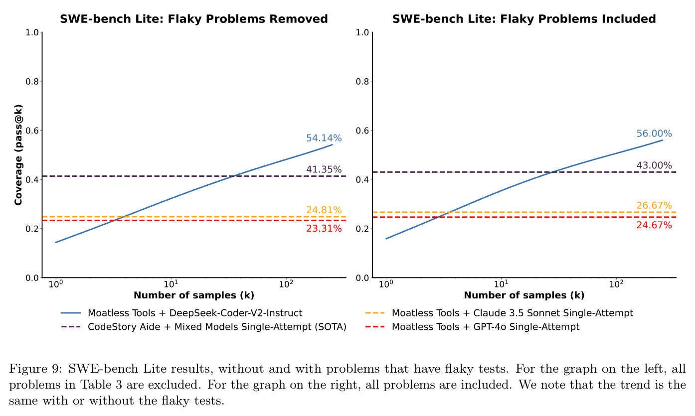
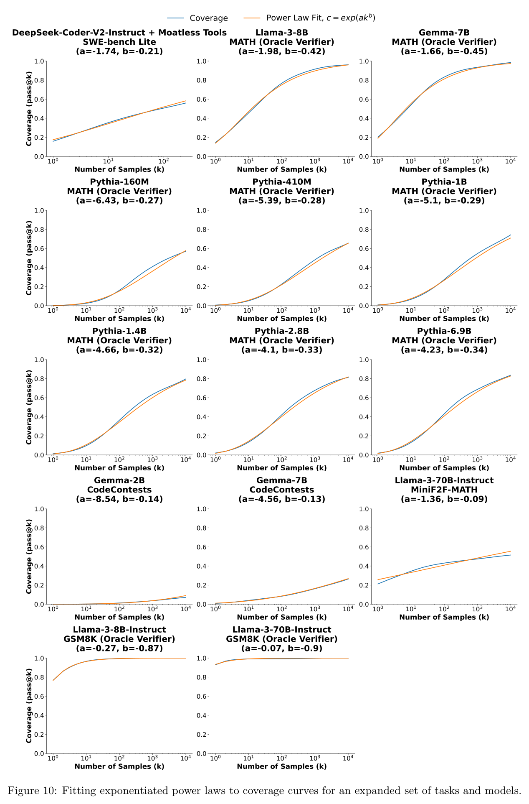

# Large Language Monkeys: Scaling Inference Compute with Repeated Sampling — appendix

Full text of Brown et al. (2024), transcribed from the arXiv LaTeX source and reproduced under CC BY 4.0; copyright the authors. Figures are crops of the published PDF, shown with the paper's own caption; this knowledge base adds no description of its own, so what a figure shows is what its caption and the paper's text say. Citations are resolved to author–year; the bibliography is omitted — follow the arXiv link for it.

## Contents

| § | Heading | Figures | Tables |
|---|---|---|---|
| A | Sampling Experimental Setup | | |
| A.1 | Lean Formal Proofs | | |
| A.2 | CodeContests | | |
| A.3 | MATH | | |
| A.4 | GSM8K | | |
| B | SWE-bench Lite | | |
| B.1 | Experimental Setup | | |
| B.2 | Test Suite Flakiness | Figure 9 | Table 3 |
| C | Scaling Law Details | | |
| C.1 | Experimental details | | |
| C.2 | Additional results | Figure 10 | |
| D | Precision Details | | |
| E | GSM8K incorrect answer | | |

## A Sampling Experimental Setup

### A.1 Lean Formal Proofs

We report results on the 130 questions in the test set of the [lean4 MiniF2F dataset](https://github.com/rah4927/lean-dojo-mew/blob/main/MiniF2F/Test.lean) that correspond to formalized MATH problems. This dataset is derived from the [fixed version](https://github.com/facebookresearch/miniF2F) of the original MiniF2F dataset created by Zheng et al. (2021). We sample with a temperature of 0.5 and do not use nucleus sampling. We generated 10,000 samples per problem. We use proofs of the following 5 theorems from the [validation set](https://github.com/rah4927/lean-dojo-mew/blob/main/MiniF2F/Validation.lean) as few-shot examples:

- `mathd_algebra_116`
- `amc12_2000_p5`
- `mathd_algebra_132`
- `mathd_algebra_11`
- `mathd_numbertheory_84`

Our prompt consists of:

1. Few shot examples.
2. Header imports present in each problem in the HuggingFace dataset `cat-searcher/minif2f-lean4` dataset, an upload of the lean4 MiniF2F dataset.
3. The theorem definition. In order to avoid leaking information about how to solve the theorem from its name, we replace the name of the theorem with `theorem_i`. $i \in \{1,2,3,4,5\}$ for the few-shot examples and $i=6$ for the current problem.

We set 200 as the max token length for the generated solution. To grade solutions, we use the `lean-dojo 1.1.2` library with lean version `4.3.0-rc2`. We set a timeout of 10 seconds for every tactic step.

**Few-Shot Example.**

````
Write a lean4 proof to the provided formal statement. You have access to the standard mathlib4 library.
```import Mathlib.Algebra.BigOperators.Basic
import Mathlib.Data.Real.Basic
import Mathlib.Data.Complex.Basic
import Mathlib.Data.Nat.Log
import Mathlib.Data.Complex.Exponential
import Mathlib.NumberTheory.Divisors
import Mathlib.Data.ZMod.Defs
import Mathlib.Data.ZMod.Basic
import Mathlib.Topology.Basic
import Mathlib.Data.Nat.Digits

open BigOperators
open Real
open Nat
open Topology
theorem theorem1
  Int.floor ((9:ℝ) / 160 * 100) = 5 :=
by (
  rw [Int.floor_eq_iff]
  constructor
  all_goals norm_num
)```
````

**Example Prompt.**

````
Write a lean4 proof to the provided formal statement. You have access to the standard mathlib4 library.
```import Mathlib.Algebra.BigOperators.Basic
import Mathlib.Data.Real.Basic
import Mathlib.Data.Complex.Basic
import Mathlib.Data.Nat.Log
import Mathlib.Data.Complex.Exponential
import Mathlib.NumberTheory.Divisors
import Mathlib.Data.ZMod.Defs
import Mathlib.Data.ZMod.Basic
import Mathlib.Topology.Basic
import Mathlib.Data.Nat.Digits

open BigOperators
open Real
open Nat
open Topology
theorem theorem6
  (b h v : ℝ)
  (h_0 : 0 < b ∧ 0 < h ∧ 0 < v)
  (h_1 : v = 1 / 3 * (b * h))
  (h_2 : b = 30)
  (h_3 : h = 13 / 2) :
  v = 65 :=
by (
````

*Note: the prompt ends mid-proof, right after* `by (`*.*

### A.2 CodeContests

We report results on the 140 test set questions that do not include image tags in the problem description. We sample with a temperature of 0.6 and a top-p value of 0.95 following the experiments in CodeLlama (Rozière et al., 2023). We generate 10,000 samples per problem. We use two few-shot examples from the training set that are randomly sampled per-problem. We set 1024 as the max token length for the generated solution. We use the same answer comparison function as (Li et al., 2022) and use the concatenation of public, private, and generated tests to validate correctness of solutions.

**Few-Shot Example.**

````
Q: Write python code to solve the following coding problem that obeys the constraints and passes the example test cases. The output code needs to read from and write to standard IO. Please wrap your code answer using ```:
Petya has equal...
...
(Rest of question and input/output examples)
...
A: ```
n = int(input())
a = int(input())
b = int(input())
ans = 6
cnt = 0
cur = 2
cnt += 2 * ((n - b) // a)
while cnt < 4:
    cur += 1
    cnt += (n // a)
ans = min(ans, cur)
if b * 2 <= n:
    cur, cnt = 0, 0
    cur = 1
    cnt += ((n - 2 * b) // a)
    while cnt < 4:
        cur += 1
        cnt += (n // a)
    ans = min(ans, cur)
print(ans)
```
````

**Example Prompt.**

````
Q: Write python code to solve the following coding problem that obeys the constraints and passes the example test cases. The output code needs to read from and write to standard IO. Please wrap your code answer using ```:
This is the...
...
(Rest of question and input/output examples)
...
A:
````

### A.3 MATH

We report results on 128 randomly selected test-set problems. We sample with a temperature of 0.6 and do not use nucleus sampling. We use the fixed 5 few-shot example from Lewkowycz et al. (2022) for each problem. We generate 10,000 samples per problem. We set 512 as the max token length for the generated solution. To grade solutions, we use the `minerva_math` functions from LMEval (Gao et al., 2023) to extract the model's final answer. We then check correctness if the extracted answer is an exact string match to the ground truth, or if the `is_equiv` function from `minerva_math` in LMEval evaluates to true.

**Few-Shot Example.**

> Problem:
>
> If $\det \mathbf{A} = 2$ and $\det \mathbf{B} = 12,$ then find $\det (\mathbf{A} \mathbf{B}).$
>
> Solution:
>
> We have that $\det (\mathbf{A} \mathbf{B}) = (\det \mathbf{A})(\det \mathbf{B}) = (2)(12) = \boxed{24}.$ Final Answer: The final answer is $24$. I hope it is correct.

**Example Prompt.**

> Problem:
>
> What is the domain of the function $f(x) = \frac{(2x-3)(2x+5)}{(3x-9)(3x+6)}\ ?$ Express your answer as an interval or as a union of intervals.
>
> Solution:

### A.4 GSM8K

We report results on 128 randomly sampled test-set problems. We sample with a temperature of 0.6 and do not use nucleus sampling. We use 5 few-shot examples from the training set that are randomly sampled per-problem. We generate 10,000 samples per problem. We set 512 as the max token length for the generated solution. To grade solutions, we follow LMEval (Gao et al., 2023) and extract answers using a regular expression that extracts the string after the quadruple hashes. Similar to MATH, we then assess correctness by checking if the extracted answer is an exact string match to the ground truth or if `is_equiv` evaluates to true.

**Few-Shot Example.**

> Question: James decides to replace his car.  He sold his \$20,000 car for 80% of its value and then was able to haggle to buy a \$30,000 sticker price car for 90% of its value.  How much was he out of pocket?
>
> Answer: He sold his car for 20000\*.8=\$<<20000\*.8=16000>>16,000
> He bought the new car for 30,000\*.9=\$<<30000\*.9=27000>>27,000
> That means he was out of pocket 27,000-16,000=\$<<27000-16000=11000>>11,000
> \#\#\#\# 11000

**Example Prompt.**

> Question: Mary has 6 jars of sprinkles in her pantry. Each jar of sprinkles can decorate 8 cupcakes. Mary wants to bake enough cupcakes to use up all of her sprinkles. If each pan holds 12 cupcakes, how many pans worth of cupcakes should she bake?
>
> Answer:

## B SWE-bench Lite

### B.1 Experimental Setup

For our experiments, we use DeepSeek-Coder-V2-Instruct with the Moatless Tools agent framework (at commit `a1017b78e3e69e7d205b1a3faa83a7d19fce3fa6`). We use Voyage AI (Voyage AI, 2024) embeddings for retrieval, the default used by Moatless Tools. We make no modifications to the model or framework, using them entirely as off-the-shelf components.

With this setup, we sample 250 independent completions for each problem using standard temperature-based sampling. To determine the optimal sampling temperature, we conducted a sweep on a random subset of 50 problems from the test set, testing temperatures of 1.0, 1.4, 1.6, and 1.8. Based on these results, we selected a temperature of 1.6 for our main experiments.

### B.2 Test Suite Flakiness

During our analysis, we identified 34 problems in SWE-bench Lite whose test suites had flaky tests. Using the SWE-bench testing harness provided by the authors of SWE-bench, we tested each solution repeatedly: for some solutions, sometimes the solution was marked as correct, and other times it was marked as incorrect. In 30 of these 34 cases, we observed flakiness even on the correct solutions provided by the dataset authors. Table 3 lists the problem IDs of the 34 instances with flaky tests.

**Table 3.** Instance IDs of problems from SWE-bench Lite that have flaky tests.

| Repository | Instance IDs |
|---|---|
| `django` | `django__django-13315, django__django-13447, django__django-13590, django__django-13710, django__django-13757, django__django-13933, django__django-13964, django__django-14017, django__django-14238, django__django-14382, django__django-14608, django__django-14672, django__django-14752, django__django-14915, django__django-14997, django__django-14999, django__django-15320, django__django-15738, django__django-15790, django__django-15814, django__django-15819, django__django-16229, django__django-16379, django__django-16400, django__django-17051` |
| `sympy` | `sympy__sympy-13146, sympy__sympy-13177, sympy__sympy-16988` |
| `requests` | `psf__requests-863, psf__requests-2317, psf__requests-2674, psf__requests-3362` |
| `scikit-learn` | `scikit-learn__scikit-learn-13241` |
| `matplotlib` | `matplotlib__matplotlib-23987` |

*Flattened here from a nested inner tabular per repository row.*

An additional instance, `astropy__astropy-6938`, was flaky on some machines and not others. The authors of SWE-bench were able to reproduce the flakiness; however, we were unable to. Our preliminary investigation indicates this specific issue is due to unpinned versions of dependencies in the docker environments that run the unit tests.

Here, we include results on a subset with the problems in Table 3 removed (266 problems). For the full dataset evaluation, on any problem that has flaky tests, we run the test suite 11 times and use majority voting to determine whether a solution passed or failed. For the evaluation on the subset without flaky tests, all baselines we compare against release which problems they correctly solve, so we simply removed the problems with flaky tests and recomputed their scores.

**Figure 9.** SWE-bench Lite results, without and with problems that have flaky tests. For the graph on the left, all problems in Table 3 are excluded. For the graph on the right, all problems are included. We note that the trend is the same with or without the flaky tests.



## C Scaling Law Details

### C.1 Experimental details

To fit exponentiated power laws to coverage curves, we first sample 40 points spaced evenly along a log scale from 0 to 10,000 and remove duplicates. We then use SciPy's (Virtanen et al., 2020) `curve_fit` function to find the $a$ and $b$ parameters from Equation (3) that best fit these points.

### C.2 Additional results

In Figure 10, we show additional results fitting power laws to coverage curves for an expanded set of datasets and models.

**Figure 10.** Fitting exponentiated power laws to coverage curves for an expanded set of tasks and models.



## D Precision Details

To calculate the Majority Vote, Reward Model + Best-of-N and Reward Model + Majority Vote metrics, we use the same 128 problem subsets for both MATH and GSM8K datasets introduced in Section 2. Each problem corresponds to 10,000 samples for each model we test. For each verification method, we take 100 random subsets of size $k$ and calculate the success rate using each subset. We report the mean and standard deviation across subsets in Figure 7. To calculate the Majority Vote answer, we take the plurality answer in each subset (note that two answers are considered equivalent if they are exact string matches or if `is_equiv` evaluates to true). For the Reward Model + Best-of-N, we take the answer with the highest score assigned by the reward model. For the Reward Model + Majority Vote metric, we sum the reward model score across all the samples with the same final answer, and use the final answer with the highest sum.

## E GSM8K incorrect answer

As discussed in Section 4.1, we identify that [a problem in the GSM8K test set (index 1042 on HuggingFace)](https://huggingface.co/datasets/openai/gsm8k/viewer/main/test?row=1042) has an incorrect ground truth solution.

**Question.**

> Johnny's dad brought him to watch some horse racing and his dad bet money. On the first race, he lost \$5. On the second race, he won \$1 more than twice the amount he previously lost. On the third race, he lost 1.5 times as much as he won in the second race. How much did he lose on average that day?

**Answer.**

> On the second race he won \$11 because 1+ 5 × 2 = <<1+5\*2=11>>11
> On the third race he lost \$15 because 10 × 1.5 = <<10\*1.5=15>>15
> He lost a total of \$20 on the first and third races because 15 + 5 = <<15+5=20>>20
>
> He lost \$9 that day because 11 - 20 = <<11-20=-9>>-9
> He lost an average of \$3 per race because 9 / 3 = <<9/3=3>>3
> \#\#\#\# 3

The mistake is in the second line of the answer: on the third race, Johnny's dad lost \$16.5, not \$15, meaning he made \$11 and lost \$16.5 + \$5 = \$21.5. So, the answer is an average loss of \$3.5 per race, not \$3 per race (the answer in the dataset).
