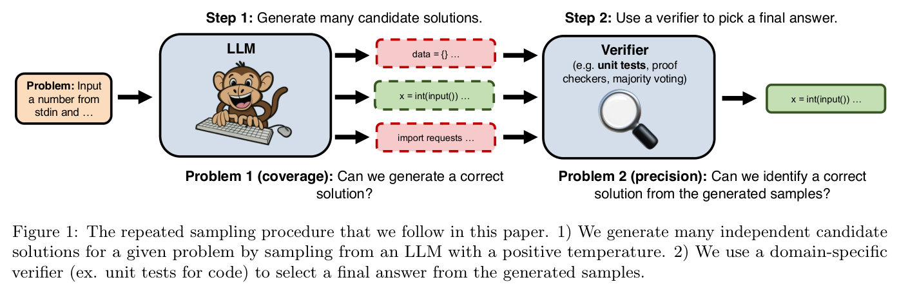
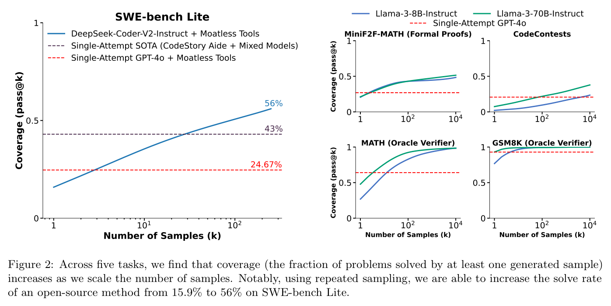
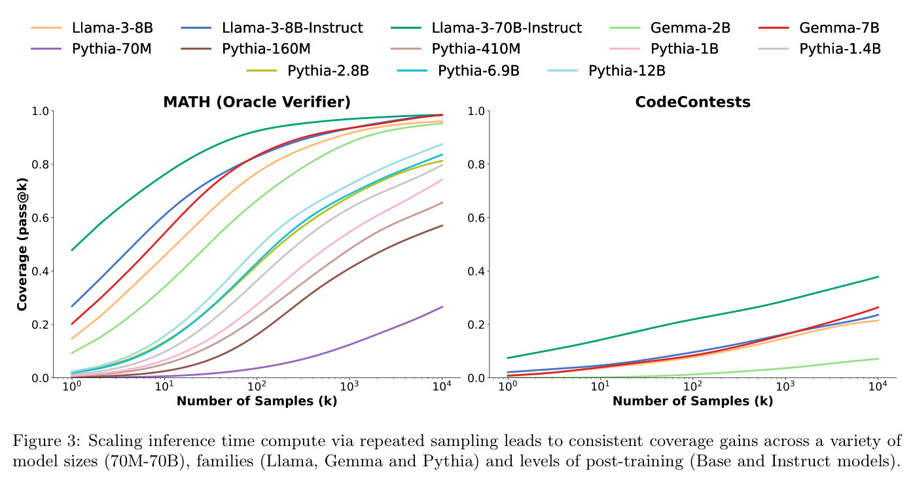
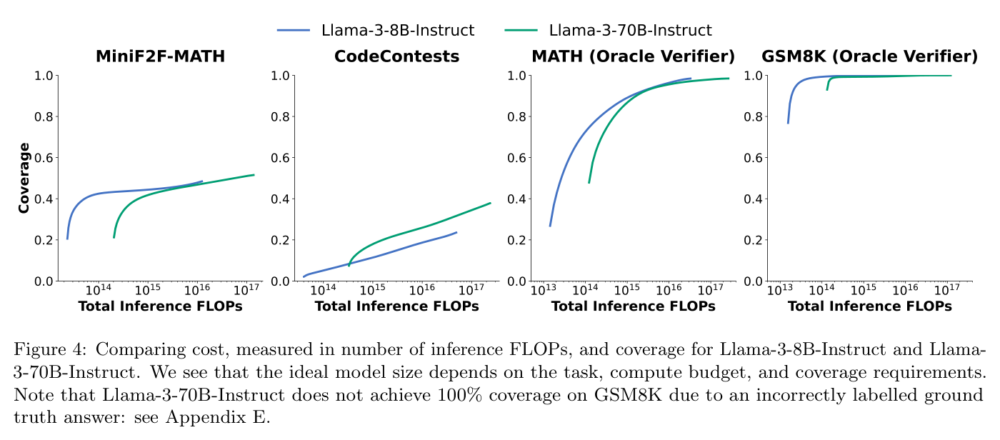
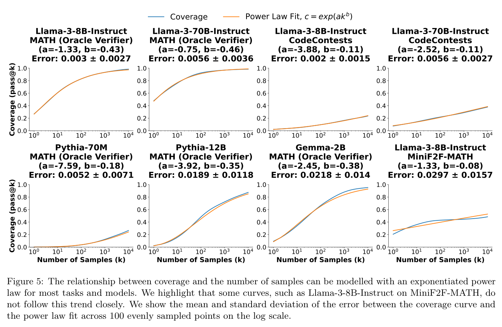
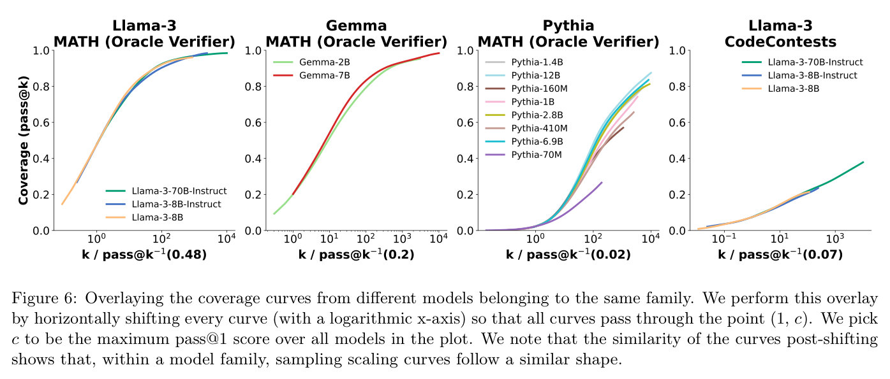
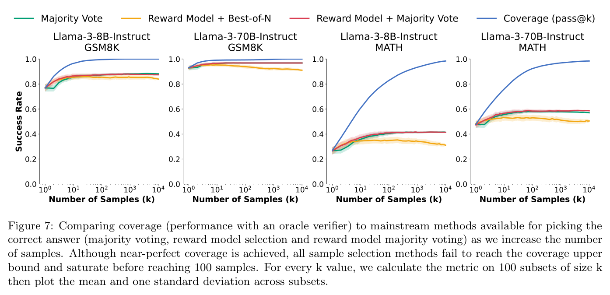
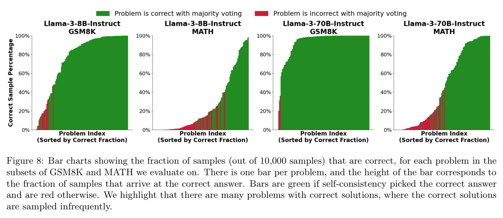

# Large Language Monkeys[^1]: Scaling Inference Compute with Repeated Sampling — main body

Full text of Brown et al. (2024), transcribed from the arXiv LaTeX source and reproduced under CC BY 4.0; copyright the authors. Figures are crops of the published PDF, each followed by a description written for this knowledge base (marked *Description*). Citations are resolved to author–year; the bibliography is omitted — follow the arXiv link for it. The appendices are in [the appendix file](02-large-language-monkeys-appendix.md).

## Contents

| § | Heading | Figures | Tables |
|---|---|---|---|
| — | Abstract | | |
| 1 | Introduction | Figure 1 | |
| 2 | Scaling Repeated Sampling | | |
| 2.1 | Repeated Sampling is Effective Across Tasks | Figure 2 | |
| 2.2 | Repeated Sampling is Effective Across Model Sizes and Families | Figure 3 | |
| 2.3 | Repeated Sampling Can Help Balance Performance and Cost | Figure 4 | Table 1 |
| 3 | Characterizing the Benefits of Repeated Sampling | | |
| 3.1 | Scaling Laws for Repeated Sampling | Figure 5 | |
| 3.2 | Similarities in Coverage Curves Across Models | Figure 6 | |
| 4 | Harnessing Repeated Sampling Requires Precision | | |
| 4.1 | Common Verification Methods Don't Always Scale with the Sample Budget | Figure 7 | Table 2 |
| 4.2 | Verifiers and Software Tasks: Two Cautionary Tales | Figure 8 | |
| 4.2.1 | Flaky Tests in SWE-bench Lite | | |
| 4.2.2 | False Negatives in CodeContests | | |
| 5 | Discussion and Limitations | | |
| 6 | Related Work | | |
| 7 | Acknowledgements | | |

## Abstract

Scaling the amount of compute used to train language models has dramatically improved their capabilities. However, when it comes to inference, we often limit models to making only one attempt at a problem. Here, we explore inference compute as another axis for scaling, using the simple technique of repeatedly sampling candidate solutions from a model. Across multiple tasks and models, we observe that coverage – the fraction of problems that are solved by any generated sample – scales with the number of samples over four orders of magnitude. Interestingly, the relationship between coverage and the number of samples is often log-linear and can be modelled with an exponentiated power law, suggesting the existence of inference-time scaling laws. In domains like coding and formal proofs, where answers can be automatically verified, these increases in coverage directly translate into improved performance. When we apply repeated sampling to SWE-bench Lite, the fraction of issues solved with DeepSeek-Coder-V2-Instruct increases from 15.9% with one sample to 56% with 250 samples, outperforming the single-sample state-of-the-art of 43%. In domains without automatic verifiers, we find that common methods for picking from a sample collection (majority voting and reward models) plateau beyond several hundred samples and fail to fully scale with the sample budget.[^2][^3][^4]

[^1]: Title inspired by https://en.m.wikipedia.org/wiki/Infinite_monkey_theorem.
[^2]: Code: https://github.com/ScalingIntelligence/large_language_monkeys.
[^3]: Data: https://huggingface.co/datasets/ScalingIntelligence/monkey_business.
[^4]: \* Equal Contribution (Bradley Brown, Jordan Juravsky, Ryan Ehrlich). Work done by BB as a visiting researcher at Stanford.

## 1 Introduction

The ability of large language models (LLMs) to solve coding, mathematics, and other reasoning tasks has improved dramatically over the past several years (Radford et al., 2019; Brown et al., 2020b; GPT-4o, 2024; Claude 3.5 Sonnet, 2024). Scaling the amount of training compute through bigger models, longer pre-training runs, and larger datasets has been a consistent driver of these gains (Hestness et al., 2017; Kaplan et al., 2020b; Hoffmann et al., 2022).

In contrast, a comparatively limited investment has been made in scaling the amount of computation used during inference. Larger models do require more inference compute than smaller ones, and prompting techniques like chain-of-thought (Wei et al., 2023) can increase answer quality at the cost of longer (and therefore more computationally expensive) outputs. However, when interacting with LLMs, users and developers often restrict models to making only one attempt when solving a problem.

In this work, we explore repeated sampling (Figure 1) as a simple approach to scaling inference compute in order to improve reasoning performance. Existing work provides encouraging examples that repeated sampling can be beneficial in math, coding, and puzzle-solving settings (Wang et al., 2023; Rozière et al., 2023; Greenblatt, 2024). Notably, AlphaCode (Li et al., 2022), a state-of-the-art system for competitive programming, finds that performance continues to improve with a million samples per problem. Our goal is to systematically characterize these benefits across a range of tasks, models, and sample budgets.

**Figure 1.** The repeated sampling procedure that we follow in this paper. 1) We generate many independent candidate solutions for a given problem by sampling from an LLM with a positive temperature. 2) We use a domain-specific verifier (ex. unit tests for code) to select a final answer from the generated samples.

*Description.* A left-to-right flow diagram in two labelled steps. "Step 1: Generate many candidate solutions" (left half): an orange box "Problem: Input a number from stdin and …" has an arrow into a blue box labelled "LLM" (illustrated with a cartoon monkey typing at a keyboard), from which three arrows fan out to three dashed candidate-solution boxes stacked vertically: a red-dashed box reading "data = {} …", a green-dashed box reading "x = int(input()) …", and a red-dashed box reading "import requests …" (two of the three candidates are marked wrong in red, one correct in green). Below these three boxes is the caption "Problem 1 (coverage): Can we generate a correct solution?" "Step 2: Use a verifier to pick a final answer" (right half): arrows from all three candidate boxes converge into a blue box labelled "Verifier" (subtitled "e.g. unit tests, proof checkers, majority voting" with a magnifying-glass icon), which has one arrow out to a final green box reading "x = int(input()) …" — the single selected answer. Below this half is the caption "Problem 2 (precision): Can we identify a correct solution from the generated samples?"

The effectiveness of repeated sampling is determined by two key properties:

1. **Coverage:** As the number of samples increases, what fraction of problems can we solve using any sample that was generated?
2. **Precision:** How often can we identify correct samples from our collection of generations?

Both properties are needed for achieving strong real-world performance. With unlimited samples, any model that assigns a non-zero probability to every sequence will achieve perfect coverage. However, repeated sampling is only practical if we can improve coverage with a feasible budget. Similarly, generating large sample collections is only useful if the correct samples in a collection can be identified. The difficulty of the precision problem can vary by task. In some settings, existing tools like proof checkers and unit tests can automatically verify every sample. In other cases, like when solving word problems, other methods for verification are needed.

Exploring coverage first, we find that sampling up to 10,000 times per problem can significantly boost coverage on math and coding tasks (Section 2). When solving CodeContests (Li et al., 2022) programming problems using Gemma-2B (Gemma Team et al., 2024), we increase coverage by over 300x, from 0.02% with one sample to 7.1% with 10,000 samples. Interestingly, the relationship between $\log(\text{coverage})$ and the number of samples often follows an approximate power law (Section 3). With Llama-3 (Meta Llama 3, 2024) and Gemma models, this leads to coverage growing nearly log-linearly with the number of samples over several orders of magnitude.

In settings with automatic verification tools, increases in coverage translate directly into improved task performance. When applying repeated sampling to competitive programming and writing Lean proofs, models like Llama-3-8B-Instruct can exceed the single-sample performance of much stronger ones like GPT-4o (GPT-4o, 2024). This ability to amplify weaker models extends to the challenging SWE-bench Lite dataset of real-life GitHub issues (Jimenez et al., 2024), where the current single-sample state-of-the-art (SOTA), achieved by a mixture of GPT-4o and Claude 3.5 Sonnet, is 43% (Aide.dev, 2024). When restricted to a single sample, DeepSeek-Coder-V2-Instruct (DeepSeek-AI et al., 2024) solves only 15.9% of issues. By simply increasing the number of samples to 250, we increase the fraction of solved issues to 56%, exceeding the state-of-the-art by 13%.

In addition to improving model quality, repeated sampling provides a new mechanism for minimizing LLM inference costs (Section 2.3). When holding the total number of inference FLOPs constant, we find that on some datasets (e.g. MATH), coverage is maximized with a smaller model and more samples, while on others (e.g CodeContests) it is better to sample fewer times from a larger model. We also compare API prices between DeepSeek-Coder-V2-Instruct, GPT-4o, and Claude Sonnet 3.5 in the context of solving SWE-bench Lite issues. When keeping the agent framework (Moatless Tools (Örwall, 2024)) constant, sampling five times from the weaker and cheaper DeepSeek model solves more issues than single samples from Claude or GPT while also being over 3x cheaper.

Finally, we demonstrate that scalable verification is necessary for fully benefiting from repeated sampling. As the number of samples increases, coverage improves through models generating correct solutions to problems they have not previously solved. However, these increasingly rare correct generations are only beneficial if verifiers can "find the needle in the haystack" and identify them from collections of mostly-incorrect samples. In math word problem settings, we find that two common methods for verification (majority voting and reward models) do not possess this ability. When solving MATH (Hendrycks et al., 2021b) problems with Llama-3-8B-Instruct, coverage increases from 82.9% with 100 samples to 98.44% with 10,000 samples. However, when using majority voting or reward models to select final answers, the biggest performance increase is only from 40.50% to 41.41% over the same sample range. As the number of samples increases, the gap between coverage (i.e. performance with a perfect verifier) and the performance of these methods increases as well (Figure 7).

In summary, our primary observations are:

1. We demonstrate that scaling inference compute through repeated sampling leads to large improvements in coverage across a variety of tasks and models. This makes it possible, and sometimes cost-effective, to amplify weaker models with many samples and outperform single samples from more capable models.
2. We show that the relationship between coverage and the number of samples can often be modelled using an exponentiated power law, suggesting a form of scaling laws for inference-time compute.
3. In domains without automatic verifiers, we show that common approaches to verification plateau beyond approximately 100 samples. This leads to a growing gap between the performance achieved with these methods and the coverage upper bound.

## 2 Scaling Repeated Sampling

We focus on pass-fail tasks where a candidate solution can be scored as right or wrong. The primary metric of interest for these tasks is the *success rate:* the fraction of problems that we are able to solve. With repeated sampling, we consider a setup where a model can generate many candidate solutions while attempting to solve a problem. The success rate is therefore influenced both by the ability to generate correct samples for many problems (i.e. coverage), as well as the ability to identify these correct samples (i.e. precision).

The difficulty of the precision problem depends on the availability of tools for sample verification. When proving formal statements in Lean, proof checkers can quickly identify whether a candidate solution is correct. Similarly, unit tests can be used to verify candidate solutions to coding tasks. In these cases, precision is handled automatically, and improving coverage directly translates into higher success rates. In contrast, the tools available for verifying solutions to math word problems from GSM8K and MATH are limited, necessitating additional verification methods that decide on a single final answer from many (often conflicting) samples.

We consider the following five tasks:

1. **GSM8K:** A dataset of grade-school level math word problems (Cobbe et al., 2021). We evaluate on a random subset of 128 problems from the GSM8K test set.
2. **MATH:** Another dataset of math word problems that are generally harder than those from GSM8K (Chen et al., 2024a). Similarly, we evaluate on 128 random problems from this dataset's test set.
3. **MiniF2F-MATH:** A dataset of mathematics problems that have been formalized into proof checking languages (Zheng et al., 2021). We use Lean4 as our language, and evaluate on the 130 test set problems that are formalized from the MATH dataset.
4. **CodeContests:** A dataset of competitive programming problems (Li et al., 2022). Each problem has a text description, along with a set of input-output test cases (hidden from the model) that can be used to verify the correctness of a candidate solution. We enforce that models write their solutions using Python3.
5. **SWE-bench Lite:** A dataset of real world Github issues, where each problem consists of a description and a snapshot of a code repository (Jimenez et al., 2024). To solve a problem, models must edit files in the codebase (in the Lite subset of SWE-bench that we use, only a single file needs to be changed). Candidate solutions can be automatically checked using the repository's suite of unit tests.

Among these tasks, MiniF2F-MATH, CodeContests, and SWE-bench Lite have automatic verifiers (in the form of the Lean4 proof checker, test cases, and unit test suites, respectively). We begin by investigating how repeated sampling improves model coverage. Coverage improvements correspond directly with increased success rates for tasks with automatic verifiers and in the general case provide an upper bound on the success rate. In coding settings, our definition of coverage is equivalent to the commonly-used pass@k metric (Chen et al., 2021), where $k$ denotes the number of samples per problem. We use this metric directly when evaluating on CodeContests and SWE-bench Lite. For MiniF2F the metric is similar, with a "pass" defined according to the Lean4 proof checker. For GSM8K and MATH, coverage corresponds to using an oracle verifier that checks if any sample "passes" by outputting the correct final answer. To reduce the variance when calculating coverage, we adopt the unbiased estimation formula from Chen et al. (2021). In each experiment, we first generate $N$ samples for each problem index $i$ and calculate the number of correct samples $C_i$. We then calculate the pass@k scores at each $k \le N$ of interest according to:

$$\text{pass@k} = \frac{1}{\text{\# of problems}} \sum_{i = 1}^{\text{\# of problems}} \left(1 - \frac{\binom{N - C_i}{k}}{\binom{N}{k}}\right) \tag{1}$$

We use the numerically stable implementation of the above formula suggested in Chen et al. (2021). Data and code is available at https://scalingintelligence.stanford.edu/pubs/large_language_monkeys/.

### 2.1 Repeated Sampling is Effective Across Tasks

**Figure 2.** Across five tasks, we find that coverage (the fraction of problems solved by at least one generated sample) increases as we scale the number of samples. Notably, using repeated sampling, we are able to increase the solve rate of an open-source method from 15.9% to 56% on SWE-bench Lite.

*Description.* Two panels. Left panel, titled "SWE-bench Lite": x-axis "Number of Samples (k)," log scale from 1 to a few hundred; y-axis "Coverage (pass@k)," linear from 0 to 1. Three series: a blue solid line "DeepSeek-Coder-V2-Instruct + Moatless Tools" rising from about 0.16 at k=1 to 56% at k=250 (end value labelled "56%"); a dark purple/black dashed horizontal reference line "Single-Attempt SOTA (CodeStory Aide + Mixed Models)" at 43% (labelled); a red dashed horizontal reference line "Single-Attempt GPT-4o + Moatless Tools" at 24.67% (labelled). Right panel: a 2×2 grid of four small plots, each with x-axis "Number of Samples (k)" (log scale, 1 to 10^4) and y-axis "Coverage (pass@k)" (0 to 1), sharing a legend of two series — Llama-3-8B-Instruct (blue) and Llama-3-70B-Instruct (teal) — plus a red dashed "Single-Attempt GPT-4o" reference line. "MiniF2F-MATH (Formal Proofs)": both curves rise from about 0.2–0.27 at k=1 to about 0.45–0.5 at k=10^4; GPT-4o reference ≈0.27. "CodeContests": curves rise from near 0 at k=1 to about 0.2 (8B) and 0.38 (70B) at k=10^4; GPT-4o reference ≈0.2. "MATH (Oracle Verifier)": curves rise from about 0.27–0.48 at k=1 to about 0.97–0.98 at k=10^4; GPT-4o reference ≈0.63. "GSM8K (Oracle Verifier)": curves rise from about 0.77–0.93 at k=1 to nearly 1.0 at k=10^4; GPT-4o reference ≈0.92.

Here, we establish that repeated sampling improves coverage across multiple tasks and a range of sample budgets. We evaluate Llama-3-8B-Instruct and Llama-3-70B-Instruct on CodeContests, MiniF2F, GSM8K, and MATH, generating 10,000 independent samples per problem. For SWE-bench Lite, we use DeepSeek-Coder-V2-Instruct (DeepSeek-AI et al., 2024), as the required context length of this task exceeds the limits of the Llama-3 models. As is standard when solving SWE-bench issues, we equip our LLM with a software framework that provides the model with tools for navigating through and editing codebases. In our work, we use the open-source Moatless Tools library (Örwall, 2024). Note that solving a SWE-bench issue involves a back-and-forth exchange between the LLM and Moatless Tools. One sample/attempt for this benchmark refers to one entire multi-turn trajectory. To minimize costs, we restrict the number of attempts per issue to 250, with all attempts made independently of one another.

We report our results in Figure 2. We also include the single-attempt performance of GPT-4o on each task, as well the single-attempt state-of-the-art for SWE-bench Lite (CodeStory Aide (Aide.dev, 2024) which uses a combination of GPT-4o and Claude 3.5 Sonnet). Across all five tasks, we find that coverage smoothly improves as the sample budget increases. When all LLMs are given a single attempt, GPT-4o outperforms the Llama and DeepSeek models at every task. However, as the number of samples increases, all three of the weaker models exceed GPT-4o's single-attempt performance. In the case of SWE-bench Lite, we solve 56% of problems, exceeding the single-attempt SOTA of 43%.

### 2.2 Repeated Sampling is Effective Across Model Sizes and Families

**Figure 3.** Scaling inference time compute via repeated sampling leads to consistent coverage gains across a variety of model sizes (70M-70B), families (Llama, Gemma and Pythia) and levels of post-training (Base and Instruct models).

*Description.* Two panels sharing a 13-series legend: Llama-3-8B (orange), Llama-3-8B-Instruct (blue), Llama-3-70B-Instruct (teal), Gemma-2B (light green), Gemma-7B (red), Pythia-70M (purple), Pythia-160M (brown), Pythia-410M (tan), Pythia-1B (pink), Pythia-1.4B (gray), Pythia-2.8B (olive), Pythia-6.9B (cyan), Pythia-12B (pale blue). Both panels: x-axis "Number of Samples (k)," log scale 1 to 10^4; y-axis "Coverage (pass@k)," 0 to 1.0. Left panel, "MATH (Oracle Verifier)": all thirteen series rise together, from pass@1 values around 0.01 (Pythia-70M, lowest) up to about 0.48 (Llama-3-70B-Instruct, highest) at k=1, converging by k=10^4 to values ranging from about 0.57 (Pythia-70M, lowest end value) up to about 0.97–0.98 (Llama-3-70B-Instruct and Gemma-7B, highest end values). Right panel, "CodeContests": only the Llama-3 and Gemma series are visible above zero — Llama-3-70B-Instruct rises to about 0.38 at k=10^4, Llama-3-8B-Instruct/Llama-3-8B/Gemma-7B rise to about 0.21–0.26, and Gemma-2B rises to about 0.07; the eight Pythia series remain flat at zero coverage across the whole sample range (per the accompanying text, Pythia achieves zero coverage on CodeContests even at k=10,000).

The results from Section 2.1 indicate that repeated sampling improves coverage. However, we only show this trend for three recent, instruction-tuned models with 8B or more parameters. We now show that these trends hold across other model sizes, families, and levels of post-training. We expand our evaluation to include a broader set of models:

- **Llama 3:** Llama-3-8B, Llama-3-8B-Instruct, Llama-3-70B-Instruct.
- **Gemma:** Gemma-2B, Gemma-7B (Gemma Team et al., 2024).
- **Pythia:** Pythia-70M through Pythia-12B (eight models in total) (Biderman et al., 2023).

We restrict evaluation to the MATH and CodeContests datasets to minimize inference costs, reporting results in Figure 3. Coverage increases across almost every model we test, with smaller models showing some of the sharpest increases in coverage when repeated sampling is applied. On CodeContests, the coverage of Gemma-2B increases by over 300x, from a pass@1 of 0.02% to a pass@10k of 7.1%. Similarly, when solving MATH problems with Pythia-160M, coverage increases from a pass@1 of 0.27% to a pass@10k of 57%.

The exception to this pattern of increasing coverage across models is with the Pythia family evaluated on CodeContests. All Pythia models achieve zero coverage on this dataset, even with a budget of 10,000 samples. We speculate that this due to Pythia being trained on less coding-specific data than Llama and Gemma.

### 2.3 Repeated Sampling Can Help Balance Performance and Cost

One takeaway from the results in Sections 2.1 and 2.2 is that repeated sampling makes it possible to amplify a weaker model's capabilities and outperform single samples from stronger models. Here, we demonstrate that this amplification can be more cost-effective than using a stronger, more expensive model, providing practitioners with a new degree of freedom when trying to jointly optimize performance and costs.

We first consider FLOPs as a cost metric, examining the Llama-3 results from Section 2.1. We re-plot our results from Figure 2, now visualizing coverage as a function of total inference FLOPs instead of the sample budget. Since Llama-3 models are dense transformers where the majority of parameters are used in matrix multiplications, we approximate inference FLOPs with the formula:

$$\text{FLOPsPerToken}(\text{ContextLen}) \approx 2 * \left( \text{NumParameters} + 2 * \text{NumLayers} * \text{TokenDim} * \text{ContextLen}\right)$$

$$\text{TotalInferenceFLOPs} \approx \left(\sum_{t=1}^{\text{NumPromptTokens}} \text{FLOPsPerToken}(t)\right) + \left(\sum_{t=1}^{\text{NumDecodeTokens}} \text{FLOPsPerToken}(t + \text{NumPromptTokens}) * \text{NumCompletions}\right)$$

We present our re-scaled results for MiniF2F, CodeContests, MATH, and GSM8K in Figure 4. Interestingly, the model that maximizes coverage varies with the compute budget and task. On MiniF2F, GSM8K and MATH, Llama-3-8B-Instruct always obtains higher coverage than the larger (and more expensive) 70B model when the FLOP budget is fixed. However for CodeContests, the 70B model is almost always more cost effective. We note that examining FLOPs alone can be a crude cost metric that ignores other aspects of system efficiency (Dehghani et al., 2022). In particular, repeated sampling can make use of high batch sizes and specialized optimizations that improve system throughput relative to single-attempt inference workloads (Juravsky et al., 2024; Athiwaratkun et al., 2024; Zheng et al., 2024). We discuss this in more detail in Section 5.

**Figure 4.** Comparing cost, measured in number of inference FLOPs, and coverage for Llama-3-8B-Instruct and Llama-3-70B-Instruct. We see that the ideal model size depends on the task, compute budget, and coverage requirements. Note that Llama-3-70B-Instruct does not achieve 100% coverage on GSM8K due to an incorrectly labelled ground truth answer: see Appendix E.

*Description.* Four panels, sharing a 2-series legend: Llama-3-8B-Instruct (blue), Llama-3-70B-Instruct (teal). All panels: x-axis "Total Inference FLOPs," log scale from about 10^13 to 10^17–10^18; y-axis "Coverage," 0 to 1.0. "MiniF2F-MATH": 8B starts at about 0.2 (lowest FLOP budget shown) and rises to plateau around 0.5; 70B begins later (around 10^14 FLOPs) at about 0.2 and rises to about 0.51 by the highest budget shown, ending slightly above 8B. "CodeContests": 8B rises slowly from about 0.03 to about 0.23; 70B begins later (around 4×10^14 FLOPs) at about 0.05 and rises to about 0.38, exceeding 8B's coverage for a given FLOP budget over most of the range. "MATH (Oracle Verifier)": 8B rises steeply from about 0.27 to about 0.97 by roughly 10^16 FLOPs and plateaus; 70B begins later (around 10^14 FLOPs) at about 0.48 and catches up to about 0.98 by the highest budget shown. "GSM8K (Oracle Verifier)": 8B rises quickly from about 0.77 to nearly 1.0 by about 2×10^13 FLOPs; 70B begins later (around 1.5×10^14 FLOPs) at about 0.93 and reaches close to but visibly just under 1.0 by the highest budget shown.

We also examine the dollar costs of repeated sampling when solving SWE-bench Lite issues using current API pricing. Keeping the agent framework (Moatless Tools) constant, we consider making a single attempt per issue with Claude 3.5 Sonnet and GPT-4o, as well as repeated sampling using DeepSeek-Coder-V2-Instruct. We report the average cost per issue and issue resolution rate with each approach in Table 1. While the DeepSeek model is weaker than the GPT and Claude models, it is also over 10x cheaper. In this case, repeated sampling provides a cheaper alternative to paying a premium for access to strong models while achieving a superior issue solve rate.

**Table 1.** Comparing API cost (in US dollars) and performance for various models on the SWE-bench Lite dataset using the Moatless Tools agent framework. When sampled more, the open-source DeepSeek-Coder-V2-Instruct model can achieve the same issue solve-rate as closed-source frontier models for under a third of the price.

| Model | Cost per attempt (USD) | Number of attempts | Issues solved (%) | Total cost (USD) | Relative total cost |
|---|---|---|---|---|---|
| DeepSeek-Coder-V2-Instruct | 0.0072 | 5 | 29.62 | 10.8 | 1x |
| GPT-4o | 0.13 | 1 | 24.00 | 39 | 3.6x |
| Claude 3.5 Sonnet | 0.17 | 1 | 26.70 | 51 | 4.7x |

## 3 Characterizing the Benefits of Repeated Sampling

The relationship between an LLM's loss and its training compute has been well-characterized with training scaling laws (Hestness et al., 2017; Kaplan et al., 2020a; Hoffmann et al., 2022). These laws have empirically held over many orders of magnitude and inspire confidence in model developers that large investments in training will pay off. Inspired by training scaling laws, here we aim to better characterize the relationship between coverage and the sample budget (i.e. the amount of inference compute), presenting two interesting observations:

1. The relationship between coverage and the number of samples can often be modelled with an exponentiated power law.
2. For a given task, the coverage curves of different models from the same family resemble S-curves with similar slopes but distinct horizontal offsets.

### 3.1 Scaling Laws for Repeated Sampling

**Figure 5.** The relationship between coverage and the number of samples can be modelled with an exponentiated power law for most tasks and models. We highlight that some curves, such as Llama-3-8B-Instruct on MiniF2F-MATH, do not follow this trend closely. We show the mean and standard deviation of the error between the coverage curve and the power law fit across 100 evenly sampled points on the log scale.

*Description.* A grid of 8 panels (2 rows × 4 columns), sharing a 2-series legend: "Coverage" (blue) and "Power Law Fit, $c = \exp(ak^b)$" (orange). Each panel's x-axis is "Number of Samples (k)," log scale from 1 to 10^4, and y-axis is "Coverage (pass@k)," 0 to 1.0; each panel title states the model/task and the fitted $(a,b)$ parameters plus the mean ± standard deviation fitting error. Row 1: "Llama-3-8B-Instruct, MATH (Oracle Verifier)" (a=-1.33, b=-0.43, error 0.003±0.0027), coverage rising from about 0.27 to about 0.97, fit line closely overlapping the coverage curve throughout. "Llama-3-70B-Instruct, MATH (Oracle Verifier)" (a=-0.75, b=-0.46, error 0.0056±0.0036), rising from about 0.48 to about 0.98, close overlap. "Llama-3-8B-Instruct, CodeContests" (a=-3.88, b=-0.11, error 0.002±0.0015), rising from about 0.02 to about 0.23, close overlap. "Llama-3-70B-Instruct, CodeContests" (a=-2.52, b=-0.11, error 0.0056±0.0027), rising from about 0.07 to about 0.38, close overlap. Row 2: "Pythia-70M, MATH (Oracle Verifier)" (a=-7.59, b=-0.18, error 0.0052±0.0071), rising from near 0 to about 0.26, close overlap. "Pythia-12B, MATH (Oracle Verifier)" (a=-3.92, b=-0.35, error 0.0189±0.0118), rising from near 0 to about 0.87, small visible gap between the two curves in the middle of the range. "Gemma-2B, MATH (Oracle Verifier)" (a=-2.45, b=-0.38, error 0.0218±0.014), rising from about 0.1 to about 0.95, small visible gap in the middle of the range. "Llama-3-8B-Instruct, MiniF2F-MATH" (a=-1.33, b=-0.08, error 0.0297±0.0157), rising from about 0.2 to about 0.5; this is the panel the caption highlights as not following the power law closely — the blue coverage curve visibly wobbles (dips and rises) around the smoother orange fit line rather than tracking it.

Here, we develop an explicit model for the relationship between coverage and the number of samples. The GPT-4 technical report (OpenAI et al., 2024) finds that the relationship between a model's mean-log-pass-rate on coding problems and its training compute can be modelled well using a power law. We start by adopting the same function class, but now modelling the log of coverage $c$ as a function of the number of samples $k$:

$$\log(c) \approx a k^{b} \tag{2}$$

where $a,b \in \mathbb{R}$ are fitted model parameters. In order to directly predict coverage, we exponentiate both sides, ending up with the final model of:

$$c \approx \exp(a k^{b}) \tag{3}$$

We provide examples of fitted coverage curves in Figure 5, and additional curves in Appendix C.2. While these laws are not as exact as training scaling laws (most strikingly on MiniF2F-MATH), they provide encouraging early evidence that the benefits of inference scaling can be characterized.

### 3.2 Similarities in Coverage Curves Across Models

**Figure 6.** Overlaying the coverage curves from different models belonging to the same family. We perform this overlay by horizontally shifting every curve (with a logarithmic x-axis) so that all curves pass through the point $(1, c)$. We pick $c$ to be the maximum pass@1 score over all models in the plot. We note that the similarity of the curves post-shifting shows that, within a model family, sampling scaling curves follow a similar shape.

*Description.* Four panels, each with y-axis "Coverage (pass@k)" from 0 to 1.0 and an x-axis labelled "k / pass@k$^{-1}(c)$" on a log scale, where $c$ (the anchor coverage value) is given in each panel's x-axis label. "Llama-3, MATH (Oracle Verifier)" ($c=0.48$): three series — Llama-3-70B-Instruct (teal), Llama-3-8B-Instruct (blue), Llama-3-8B (orange) — overlap closely along a single S-curve from about 0.14 up to about 0.98. "Gemma, MATH (Oracle Verifier)" ($c=0.2$): two series — Gemma-2B (light green), Gemma-7B (red) — overlap closely from about 0.1 up to about 0.98. "Pythia, MATH (Oracle Verifier)" ($c=0.02$): eight series — Pythia-1.4B (gray), Pythia-12B (pale blue), Pythia-160M (brown), Pythia-1B (pink), Pythia-2.8B (olive), Pythia-410M (tan), Pythia-6.9B (cyan), Pythia-70M (purple) — mostly overlap along a common S-curve rising to about 0.85–0.88, except Pythia-70M, which lags below the others and reaches only about 0.26 at the rightmost point shown. "Llama-3, CodeContests" ($c=0.07$): three series — Llama-3-70B-Instruct (teal), Llama-3-8B-Instruct (blue), Llama-3-8B (orange) — overlap closely, rising from about 0.02 to about 0.38.

Interestingly, when comparing the coverage curves (with a logarithmic x-axis) of different models from the same family on the same task (see Figure 3), it appears that the traced S-curves have the same slope, but unique horizontal offsets. To investigate this further, we overlay the coverage curves of different models from the same family in Figure 6. We do this by picking an anchor coverage value $c$, and shifting every curve leftward (in log-space) so that each passes through the point $(1, c)$. This corresponds to a leftward shift by $\log(\text{pass@k}^{-1}(c))$, where $\text{pass@k}^{-1}(c)$ denotes the closest natural number $k$ such that $\text{pass@k} = c$. We pick $c$ to be the maximum pass@1 score over all models from the same family. These similarities demonstrate that across models from the same family, the increase in the log-sample-budget (or equivalently, the multiplicative increase in the sample budget) needed to improve coverage from $c$ to $c'$ is approximately constant.

## 4 Harnessing Repeated Sampling Requires Precision

So far, we have focused on measuring model coverage, characterizing the benefits of repeated sampling under the scenario where we can always identify correct model samples. We now turn to the complementary problem of precision: given a collection of model samples, how often can we identify the correct ones? In particular, we are interested in the performance of verifiers as we scale up the number of samples. For some problems, correct solutions are sampled from the model at low probabilities (e.g. 1% or lower, see Figure 8). As the number of samples increases and rare, correct solutions are generated for more problems, model coverage improves. In order to convert these coverage improvements into higher success rates, verifiers must be able to find the "needle in the haystack" and identify infrequent correct samples.

### 4.1 Common Verification Methods Don't Always Scale with the Sample Budget

**Figure 7.** Comparing coverage (performance with an oracle verifier) to mainstream methods available for picking the correct answer (majority voting, reward model selection and reward model majority voting) as we increase the number of samples. Although near-perfect coverage is achieved, all sample selection methods fail to reach the coverage upper bound and saturate before reaching 100 samples. For every k value, we calculate the metric on 100 subsets of size k then plot the mean and one standard deviation across subsets.

*Description.* Four panels sharing a 4-series legend: "Majority Vote" (teal/green), "Reward Model + Best-of-N" (orange), "Reward Model + Majority Vote" (red), "Coverage (pass@k)" (blue); each non-coverage series has a shaded one-standard-deviation band. All panels: x-axis "Number of Samples (k)," log scale 1 to 10^4; y-axis "Success Rate," 0 to 1.0. "Llama-3-8B-Instruct, GSM8K": Coverage rises from about 0.77 to about 1.0; the three selection methods start around 0.77–0.8 and plateau by about k=10 in the range 0.83–0.88 (Reward Model + Best-of-N ending lowest, around 0.83). "Llama-3-70B-Instruct, GSM8K": Coverage rises from about 0.93 to about 1.0; the selection methods start around 0.93–0.95 and stay roughly flat, ending around 0.91–0.97 (Reward Model + Best-of-N ending lowest, around 0.91). "Llama-3-8B-Instruct, MATH": Coverage rises from about 0.27 to about 0.98; the selection methods start around 0.27 and plateau by about k=100 around 0.31–0.42 (Majority Vote and Reward Model + Majority Vote ending around 0.41–0.42, Reward Model + Best-of-N ending lowest around 0.31). "Llama-3-70B-Instruct, MATH": Coverage rises from about 0.47 to about 0.98; the selection methods start around 0.47 and plateau by about k=100 around 0.5–0.6 (Majority Vote and Reward Model + Majority Vote ending around 0.58–0.6, Reward Model + Best-of-N ending lowest around 0.5).

Of the five tasks we evaluate, only GSM8K and MATH lack tools for automatically verifying solutions. We test three simple and commonly used verification approaches on their ability to identify correct solutions from these datasets:

1. **Majority Vote:** We pick the most common final answer (Wang et al., 2023).
2. **Reward Model + Best-of-N:** We use a reward model (Christiano et al., 2017) to score each solution, and pick the answer from the highest-scoring sample.
3. **Reward Model + Majority Vote:** We calculate a majority vote where each sample is weighted by its reward model score.

We reuse the collections of 10,000 samples that we generated with Llama-3-8B-Instruct and Llama-3-70B-Instruct in Section 2. We use ArmoRM-Llama3-8B-v0.1 (Wang et al., 2024a) as a reward model, which scores highly on the reasoning section of the RewardBench leaderboard (Lambert et al., 2024). We report our results in Figure 7 as we increase the number of samples. While success rates initially increase with the number of samples for all three methods, they plateau around 100 samples. Meanwhile, coverage continues to increase with the number of samples and eventually exceeds 95%. In the case of majority voting, this success rate saturation is intuitive, since the occurrence of rare, correct solutions does not affect the most common answer that majority voting chooses.

Given the poor performance of these verifiers (in particular the reward model), it is reasonable to wonder how "hard" it is to verify a candidate solution. With GSM8K and MATH, only a sample's final answer is used for assessing correctness, with the intermediate chains of thought being discarded. If models generated only non-sensical chains of thought before guessing a correct final answer, verification may not be any easier than solving the problem in the first place. We investigate this question by manually evaluating 105 chains-of-thought from correct Llama-3-8B-Instruct samples to GSM8K problems, reporting our results in Table 2.

We find that over 90% of the chains-of-thought that we graded are faithful, even among problems where correct answers are generated infrequently. These correct reasoning steps indicate that there is signal for a verifier to exploit when identifying correct samples. Interestingly, during this process we also identified one GSM8K problem that has an incorrect ground truth answer (see Appendix E). This incorrect GSM8K problem is also the only one that Llama-3-70B-Instruct did not generate a "correct" sample for across 10,000 attempts.

**Table 2.** Human evaluation of the validity of the Chain-of-Thought reasoning in Llama-3-8B-Instruct answers to GSM8K problems. 3 chains of thought were graded per problem. Even for difficult questions, where the model only gets $\leq 10\%$ of samples correct, the CoTs almost always follow valid logical steps. For the model generations and human labels, [see here](https://docs.google.com/spreadsheets/d/1D-suvkheNA4fjLsO2TuwHNqwx2TIECmp).

| Pass@1 | # Problems | # CoT Graded | Correct CoT | Incorrect CoT | Incorrect Ground Truth |
|---|---|---|---|---|---|
| 0-10% | 5 | 15 | 11 | 1 | 1 problem, 3 CoTs |
| 10-25% | 10 | 30 | 27 | 3 | 0 problems |
| 25-75% | 29 | 30 | 28 | 2 | 0 problems |
| 75-100% | 84 | 30 | 30 | 0 | 0 problems |

### 4.2 Verifiers and Software Tasks: Two Cautionary Tales

Software development tasks can occupy a middle-ground with respect to available verification tools. On one hand, the ability to execute and test code allows for a higher degree of automatic verification than is possible with unstructured language tasks. However, tools like unit tests take a black-box approach to verifying a piece of code and are not as comprehensive as methods like proof checkers. These imperfections in the verification process can lead to false positives and/or false negatives that are important to consider when applying repeated sampling. Below we provide two examples of software verifier imperfections that we encountered when generating our results from Section 2.1.

#### 4.2.1 Flaky Tests in SWE-bench Lite

When producing our results on SWE-bench Lite, we identified that 11.3% of problems have flaky test suites that do not produce consistent results when running them on the same candidate solution. These flaky tests occasionally classify even the dataset's ground-truth issue solutions as incorrect. Additionally, the test suites for some issues can be non-determinstic depending on the candidate solution. For example, two SWE-bench Lite issues involve manipulating Python sets, which are naturally unordered. The gold solutions for these issues explicitly order the items in the set and pass the test suites reliably. However, some model-generated candidate solutions do not impose such an ordering, and therefore pass the tests on some "lucky" runs and not others. In Appendix B, we list all of the problem IDs where we identified flaky tests. We also report our SWE-bench Lite results from Figure 2 with the problematic issues removed, finding similar results to our evaluations on the whole dataset.

#### 4.2.2 False Negatives in CodeContests

Each problem from the CodeContests dataset comes with a set of input-output test cases used to asses the correctness of solutions. These test cases are more comprehensive than those from earlier coding benchmarks like APPS (Hendrycks et al., 2021a), cutting down on the frequency of false positive solutions that pass all test cases but do not fully solve the described problem. However, the construction of the CodeContests test suites leads to false negative solutions that are correct but fail the tests.

For some CodeContests problems, the problem description allows for multiple distinct correct outputs for a given test input. However, the corresponding test cases do not handle these scenarios, instead requiring that one particular correct output is emitted. Additionally, many CodeContests test cases have been programmatically generated by mutating original test cases from the problem. Some mutated inputs violate the problem's input specifications (e.g. a mutated input being zero when the description promises a positive integer). These malformed test cases can lead to inconsistent behaviour between different correct solutions.

We assess the prevalence of these issues by running each problem's test suite on the list of correct solutions that CodeContests provides. Of the 122 problems in the test set that have Python3 solutions, we find that 35 problems have "correct" solutions that fail the corresponding tests. Since we do not allow models to view all of a problem's test cases (and their peculiarities), applying repeated sampling to these problems contains an element of "rolling the dice" to generate a solution that is not only correct, but emits the particular outputs that pass the tests.

**Figure 8.** Bar charts showing the fraction of samples (out of 10,000 samples) that are correct, for each problem in the subsets of GSM8K and MATH we evaluate on. There is one bar per problem, and the height of the bar corresponds to the fraction of samples that arrive at the correct answer. Bars are green if self-consistency picked the correct answer and are red otherwise. We highlight that there are many problems with correct solutions, where the correct solutions are sampled infrequently.

*Description.* Four bar-chart panels, each with one bar per evaluated problem, x-axis "Problem Index (Sorted by Correct Fraction)" (problems sorted ascending by their correct-sample fraction, no numeric ticks) and y-axis "Correct Sample Percentage" from 0% to 100%. Shared legend: green bars = "Problem is correct with majority voting," red bars = "Problem is incorrect with majority voting." "Llama-3-8B-Instruct, GSM8K": most bars are green, climbing from 0% to 100% across the sorted index; a cluster of short red bars appears only among the lowest-percentage problems (left side, below about 50%). "Llama-3-8B-Instruct, MATH": similar rising shape, but the low-percentage region (below about 40%) contains many more red bars interspersed with green ones, and the climb to 100% is more gradual. "Llama-3-70B-Instruct, GSM8K": nearly all bars are green, climbing steeply to 100%, with only a handful of red bars near the lowest indices (below about 40%). "Llama-3-70B-Instruct, MATH": mostly green bars rising gradually to 100%, with red bars concentrated among the lowest-percentage problems (below about 45%).

## 5 Discussion and Limitations

In this work, we explore repeated sampling as an axis for scaling compute at inference time in order to improve model performance. Across a range of models and tasks, repeated sampling can significantly improve the fraction of problems solved using any generated sample (i.e. coverage). When correct solutions can be identified (either with automatic verification tools or other verification algorithms), repeated sampling can amplify model capabilities during inference. This amplification can make the combination of a weaker model and many samples more performant and cost-effective than using fewer attempts from a stronger, more expensive model.

**Improving Repeated Sampling:** In our experiments, we explore only a simple version of repeated sampling where all attempts to a problem are generated independently of one another using the exact same prompt and hyperparameters. We believe that this setup can be refined to improve performance, particularly along the following directions:

1. **Solution Diversity:** We currently rely on a positive sampling temperature as the sole mechanism for creating diversity among samples. Combining this token-level sampling with other, higher-level approaches may be able to further increase diversity. For example, AlphaCode conditions different samples with different metadata tags.
2. **Multi-Turn Interactions:** Despite automatic verification tools being available when solving CodeContests and MiniF2F problems, we use only a single-turn setup where models generate a solution without any ability to iterate on it. Providing models with execution feedback from these tools should improve solution quality. We are interested in the tradeoffs associated with multi-turn interactions, since each attempt becomes more expensive, but also may be more likely to succeed.
3. **Learning From Previous Attempts:** Currently, our experiments fully isolate attempts from each other. Access to existing samples, particularly if verification tools can provide feedback on them, may be helpful when generating future attempts.

**Repeated Sampling and Inference Systems:** Repeated sampling is a distinct LLM inference workload from serving chatbot requests. Production chatbot deployments place an emphasis on low response latencies, and adhering to latency targets can force a lower per-device batch size and reduce hardware utilization. In contrast, when sampling many completions to a single prompt, a larger emphasis can be placed on overall throughput and maximizing hardware utilization. Additionally, repeated sampling can benefit from specialized attention optimizations that exploit overlaps in prompts across sequences (Juravsky et al., 2024; Athiwaratkun et al., 2024; Zheng et al., 2024). Repeated sampling inference can therefore be accomplished at a lower cost than naively making many parallel requests to a chatbot-oriented API. These cost savings can further motivate choosing to sample many times from a cheaper model instead of fewer times from a more expensive one.

**Verifiers:** Our results from Section 4 highlight the importance of improving sample verification methods when tools for automatically doing so are unavailable. Equipping models with the ability to assess their own outputs will allow repeated sampling to be scaled to far more tasks. Of particular interest is applying repeated sampling to unstructured tasks like creative writing, which can require a more subjective comparison between different samples than the pass-fail tasks we consider. An alternative direction to developing model-based verifiers is to design converters that can make an unstructured task verifiable, for example by formalizing an informal math statement into a language like Lean so that proof checkers can be applied.

## 6 Related Work

**Scaling Inference Compute:** Methods that perform additional computation during inference have been successful across many areas of deep learning. Across a variety of game environments, state-of-the-art methods leverage inference-time search to examine many possible future game states before deciding on a move (Campbell et al., 2002; Silver et al., 2017; Brown et al., 2020a). Similar tree-based methods can also be effective in combination with LLMs, allowing models to better plan and explore different approaches (Yao et al., 2023; Besta et al., 2024; Tian et al., 2024; Trinh et al., 2024). Another axis for increasing LLM inference compute allows models to spend tokens deliberating on a problem before coming to a solution (Yao et al., 2022; Wei et al., 2023; Zelikman et al., 2024). Additionally, multiple models can be ensembled together at inference time to combine their strengths (Wang et al., 2024b; Chen et al., 2024b; Ong et al., 2024; Wan et al., 2024; Jiang et al., 2023). Yet another approach involves using LLMs to critique and refine their own responses (Madaan et al., 2023; Bai et al., 2022).

**Repeated Sampling:** Previous work has demonstrated that repeated sampling can improve LLM capabilities in multiple domains. One of the most effective use cases is coding (Rozière et al., 2023; Chen et al., 2021; Kulal et al., 2019), where performance continues to scale up to a million samples and verification tools (e.g. unit tests) are often available to automatically score every candidate solution. Recently, Greenblatt (2024) shows that repeated sampling is effective when solving puzzles from the ARC challenge (Chollet, 2019), observing log-linear scaling as the number of samples increases. In chat applications, repeated sampling combined with best-of-N ranking with a reward model can outperform greedily sampling a single response (Irvine et al., 2023). In domains without automatic verification tools, existing work shows that using majority voting (Wang et al., 2023), prompting an LLM (Davis et al., 2024), or training a model-based verifier (Cobbe et al., 2021; Lightman et al., 2023; Hosseini et al., 2024; Wang et al., 2024c; Kang et al., 2024), to decide on a final answer can improve performance on reasoning tasks relative to taking a single sample. Nguyen et al. (2024) finds that performing majority voting over answers that exceed a threshold length can outperform voting across all answers. Concurrent with our work, Song et al. (2024) finds that using the best available sample improves LLM performance on chat, math, and code tasks, sweeping up to a max of 128 samples. Additionally, Hassid et al. (2024) find that when solving coding tasks, it can be more effective to draw more samples from a smaller model than draw fewer samples from a larger one.

**Scaling Laws:** Characterizing how scaling affects model performance can lead to more informed decisions on how to allocate resources. Scaling laws for LLM training find a power law relationship between loss and the amount of training compute and provide estimates for the optimal model and dataset size given a fixed compute budget (Hestness et al., 2017; Kaplan et al., 2020a; Hoffmann et al., 2022). Jones (2021) finds scaling laws in the context of the board game Hex, observing that performance scales predictably with model size and the difficulty of the problem. Interestingly, they also show that performance scales with the amount of test-time compute spent while performing tree search. Recently, Shao et al. (2024) observe scaling laws when augmenting LLMs with external retrieval datasets, finding that performance on retrieval tasks scales smoothly with the size of the retrieval corpus.

## 7 Acknowledgements

We thank Together AI for partially sponsoring the compute for this project, as well as Rahul Chalamala and Ben Athiwaratkun for their help managing this infrastructure. We thank John Yang for his advice and support when running our SWE-bench experiments. Finally, we are grateful to Mayee Chen, Neel Guha, Quinn McIntyre, Jon Saad-Falcon, and Benjamin Spector for their helpful discussions and feedback throughout this project.

We gratefully acknowledge the support of NIH under No. U54EB020405 (Mobilize), NSF under Nos. CCF2247015 (Hardware-Aware), CCF1763315 (Beyond Sparsity), CCF1563078 (Volume to Velocity), and 1937301 (RTML); US DEVCOM ARL under Nos. W911NF-23-2-0184 (Long-context) and W911NF-21-2-0251 (Interactive Human-AI Teaming); ONR under Nos. N000142312633 (Deep Signal Processing); Stanford HAI under No. 247183; NXP, Xilinx, LETI-CEA, Intel, IBM, Microsoft, NEC, Toshiba, TSMC, ARM, Hitachi, BASF, Accenture, Ericsson, Qualcomm, Analog Devices, Google Cloud, Salesforce, Total, the HAI-GCP Cloud Credits for Research program, the Stanford Data Science Initiative (SDSI), and members of the Stanford DAWN project: Meta, Google, and VMWare. The U.S. Government is authorized to reproduce and distribute reprints for Governmental purposes notwithstanding any copyright notation thereon. Any opinions, findings, and conclusions or recommendations expressed in this material are those of the authors and do not necessarily reflect the views, policies, or endorsements, either expressed or implied, of NIH, ONR, or the U.S. Government.

This work was completed with the support of the Clarendon Fund Scholarships.
