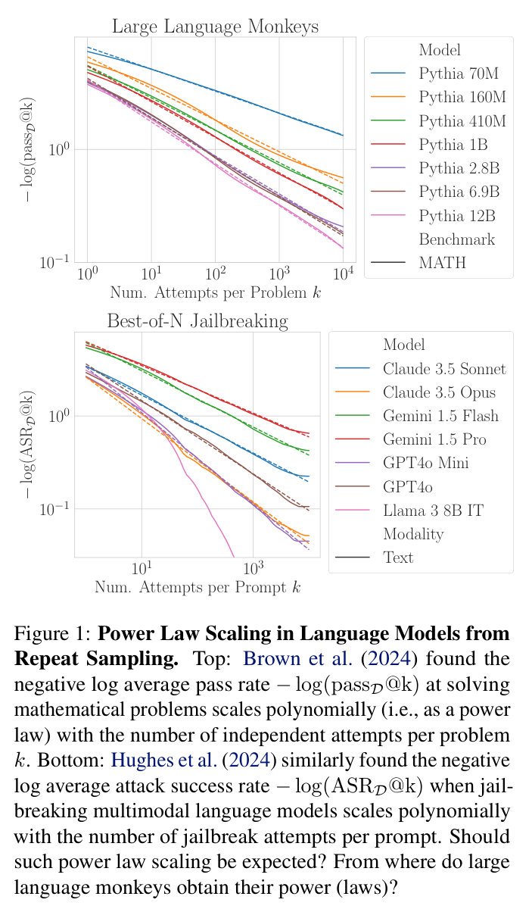
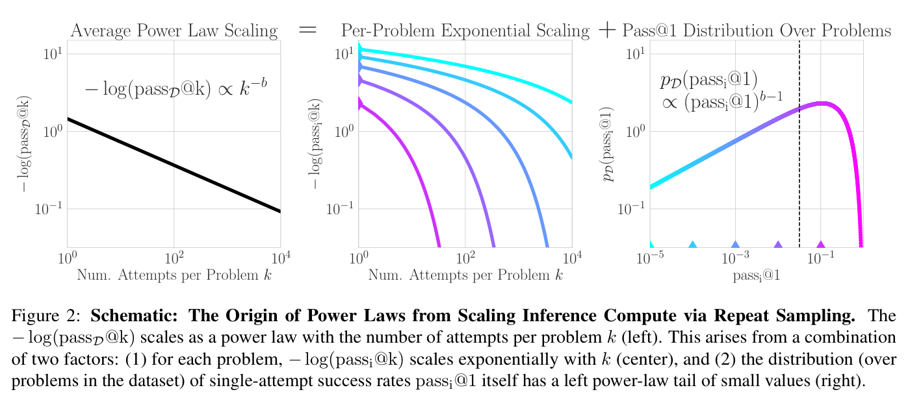
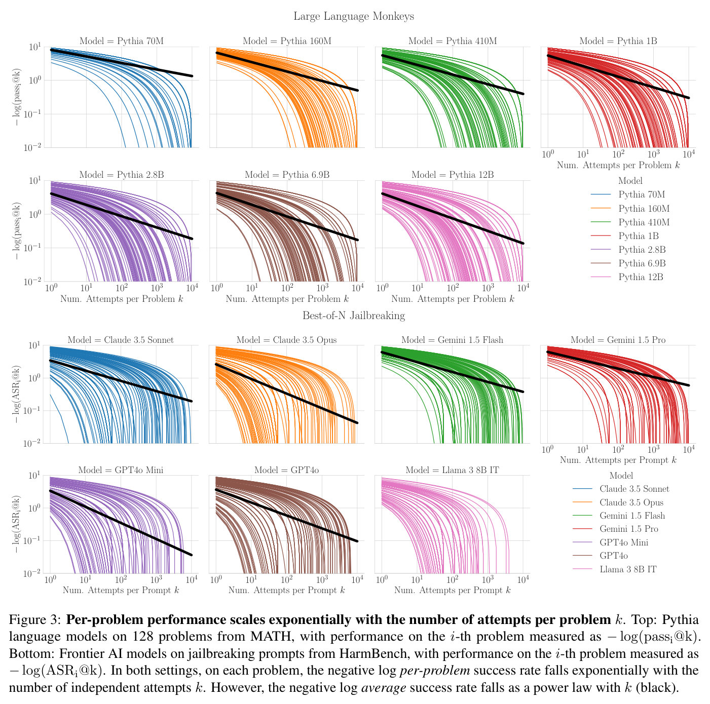
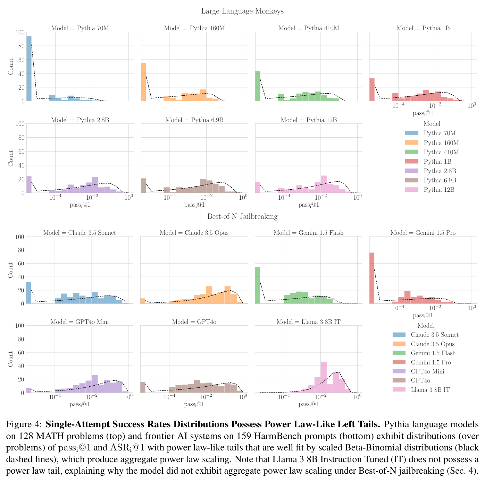
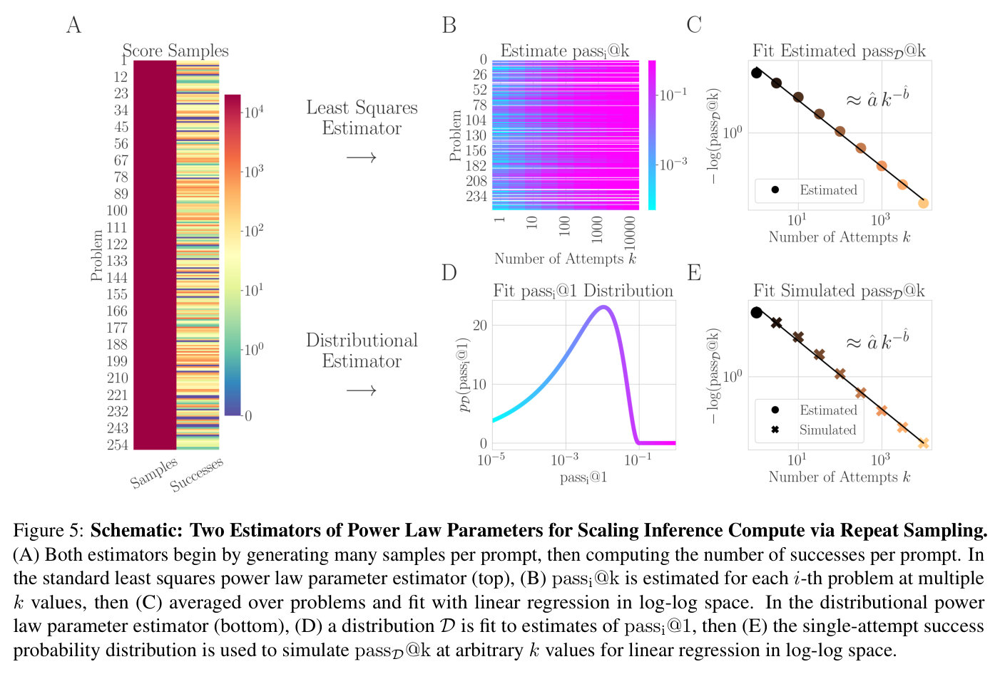
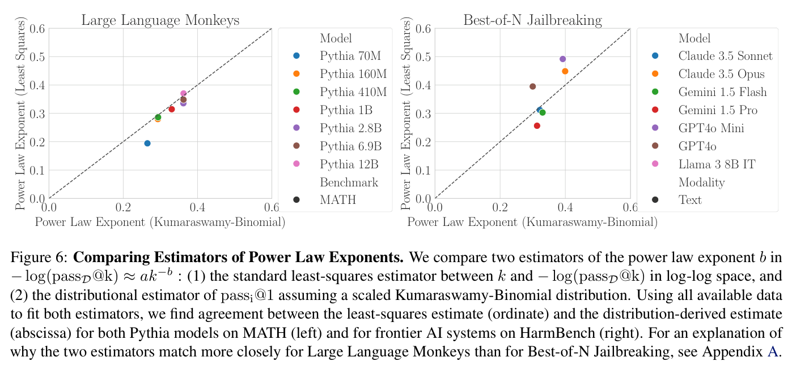
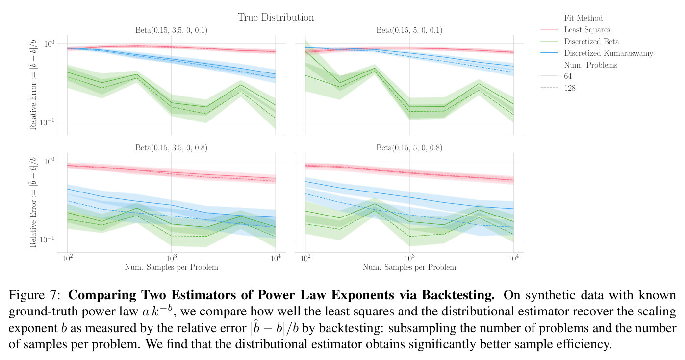

# How Do Large Language Monkeys Get Their Power (Laws)? — main body

Full text of Schaeffer et al. (2025), transcribed from the arXiv LaTeX source and reproduced under CC BY 4.0; copyright the authors. Figures are crops of the published PDF, each followed by a description written for this knowledge base (marked *Description*). Citations are resolved to author–year; the bibliography is omitted — follow the arXiv link for it. The appendices are not transcribed in this knowledge base; they are in the arXiv version linked above.

## Contents

| § | Heading | Figures | Tables |
|---|---|---|---|
| — | Abstract | | |
| 1 | Introduction | Figure 1, Figure 2 | |
| 2 | Should Power Law Scaling Be Expected? | Figure 3, Figure 4 | |
| 3 | Distribution of Per-Problem Single-Attempt Success Rates Creates Power Law Scaling | | |
| 4 | Lack of Distributional Structure Explains Deviations from Power Law Scaling | Figure 5, Figure 6, Figure 7 | |
| 5 | A New Distributional Estimator for Predicting Power Law Scaling | | |
| 6 | Related Work | | |
| 7 | Discussion and Future Directions | | |
| — | Acknowledgments | | |
| — | Impact Statement | | |

## Abstract

Recent research across mathematical problem solving, proof assistant programming and multimodal jailbreaking documents a striking finding: when (multimodal) language model tackle a suite of tasks with multiple attempts per task -- succeeding if any attempt is correct -- then the negative log of the average success rate scales a power law in the number of attempts. In this work, we identify an apparent puzzle: a simple mathematical calculation predicts that on each problem, the failure rate should fall exponentially with the number of attempts. We confirm this prediction empirically, raising a question: from where does aggregate polynomial scaling emerge? We then answer this question by demonstrating per-problem exponential scaling can be made consistent with aggregate polynomial scaling if the distribution of single-attempt success probabilities is heavy tailed such that a small fraction of tasks with extremely low success probabilities collectively warp the aggregate success trend into a power law - even as each problem scales exponentially on its own. We further demonstrate that this distributional perspective explains previously observed deviations from power law scaling, and provides a simple method for forecasting the power law exponent with an order of magnitude lower relative error, or equivalently, $\sim$2-4 orders of magnitude less inference compute. Overall, our work contributes to a better understanding of how neural language model performance improves with scaling inference compute and the development of scaling-predictable evaluations of (multimodal) language models.

## 1 Introduction

Scaling behaviors of large neural language models have surprised and fascinated engineers, scientists and society alike (Hestness et al., 2017; Kaplan et al., 2020; Brown et al., 2020a; Hoffmann et al., 2022; Ganguli et al., 2022; Sorscher et al., 2022; Wei et al., 2022b; Schaeffer et al., 2023; OpenAI et al., 2024), shaping engineering, economic and governmental interests in frontier AI systems (Bommasani et al., 2021; Eloundou et al., 2023; Anderljung et al., 2023; Wang et al., 2023; Reuel et al., 2024; Besiroglu et al., 2024a; Maslej et al., 2024). For a more thorough exposition of relevant literature, please see Related Work (Section 6).

**Figure 1.** **Power Law Scaling in Language Models from Repeat Sampling.** Top: Brown et al. (2024) found the negative log average pass rate $-\log(\operatorname{pass_{\mathcal{D}}@k})$ at solving mathematical problems scales polynomially (i.e., as a power law) with the number of independent attempts per problem $k$. Bottom: Hughes et al. (2024) similarly found the negative log average attack success rate $-\log(\operatorname{ASR_{\mathcal{D}}@k})$ when jailbreaking multimodal language models scales polynomially with the number of jailbreak attempts per prompt. Should such power law scaling be expected? From where do large language monkeys obtain their power (laws)?

*Description.* Two stacked log-log panels, each with its own legend of seven colored curves (solid measured curve plus a matching dashed fit). Top panel, "Large Language Monkeys": x-axis "Num. Attempts per Problem $k$", log scale $10^0$–$10^4$; y-axis "$-\log(\operatorname{pass_{\mathcal{D}}@k})$", log scale from about $10^{-1}$ up to roughly $4$. Seven series, one per Pythia model size, all clustered between about 2.5 and 4 at $k=1$ and fanning out as $k$ grows: Pythia 70M (blue) ends highest, around 1.3 at $k=10^4$; Pythia 160M (orange) ends around 0.55; Pythia 410M (green) ends around 0.45; Pythia 1B (red) ends around 0.3; Pythia 2.8B (purple) ends around 0.2; Pythia 6.9B (maroon) ends around 0.17; Pythia 12B (pink) ends lowest, around 0.13. A "Benchmark: MATH" legend entry labels the dataset rather than an additional curve. Bottom panel, "Best-of-N Jailbreaking": x-axis "Num. Attempts per Prompt $k$", log scale from about $10^0$ to a few thousand; y-axis "$-\log(\operatorname{ASR_{\mathcal{D}}@k})$", log scale $10^{-1}$–$10^0$ and above. Seven series, one per model: Claude 3.5 Sonnet (blue) from about 3 down to about 0.2; Claude 3.5 Opus (orange) from about 3 down to about 0.05; Gemini 1.5 Flash (green) from about 2.7 down to about 0.4; Gemini 1.5 Pro (red) from about 3.3 down to about 0.6, the shallowest decline; GPT4o Mini (purple) from about 2.2 down to about 0.04; GPT4o (brown) from about 2.5 down to about 0.1; Llama 3 8B IT (pink) starts lowest, around 1, and falls off the bottom of the plotted range by around $k\approx300$–$1000$, much faster than the other curves. All crops clean.

**Figure 2.** **Schematic: The Origin of Power Laws from Scaling Inference Compute via Repeat Sampling.** The $- \log (\operatorname{pass_{\mathcal{D}}@k})$ scales as a power law with the number of attempts per problem $k$ (left). This arises from a combination of two factors: (1) for each problem, $-\log(\operatorname{pass_i@k})$ scales exponentially with $k$ (center), and (2) the distribution (over problems in the dataset) of single-attempt success rates $\operatorname{pass_i@1}$ itself has a left power-law tail of small values (right).

*Description.* Three log-log panels side by side. Left, "Average Power Law Scaling": x-axis "Num. Attempts per Problem $k$", $10^0$–$10^4$; y-axis "$-\log(\operatorname{pass_{\mathcal{D}}@k})$", $10^{-1}$–$10^1$. One black straight line, annotated "$-\log(\operatorname{pass_{\mathcal{D}}@k}) \propto k^{-b}$", falling from about 1.3 at $k=1$ to about 0.1 at $k=10^4$. Center, "Per-Problem Exponential Scaling": same axis ranges; four curves colored on a cyan-to-magenta gradient, each concave and falling steeply to near zero at a different $k$ — the magenta curve drops earliest (by about $k\approx30$–$50$), then purple (around $k\approx200$–$300$), then blue (around $k\approx2000$), then cyan latest (still declining near $k=10^4$). Right, "Pass@1 Distribution Over Problems": x-axis "$\operatorname{pass_i@1}$", log scale $10^{-5}$–a little above $10^{-1}$; y-axis "$p_{\mathcal{D}}(\operatorname{pass_i@1})$", $10^{-1}$–$10^1$; one curve, colored with the same cyan-to-magenta gradient (annotated "$p_{\mathcal{D}}(\operatorname{pass_i@1}) \propto (\operatorname{pass_i@1})^{b-1}$"), rising from about 0.2 near $10^{-5}$ to a peak of roughly 3–4 near $\operatorname{pass_i@1}\approx0.05$–$0.1$, then dropping sharply; a vertical dashed black reference line marks the peak/cutoff location, and four small triangular markers below the curve (cyan, blue, purple, magenta) show the $\operatorname{pass_i@1}$ values of the four example problems plotted in the center panel.

One direction of renewed interest is inference-time compute scaling, whereby compute is controllably increased at inference to improve the performance of a model, e.g., Pachocki et al. (2024). In this direction, recent research discovered that language model success rates scale predictably with the number of independent attempts made at accomplishing a task. Specifically, in a paper titled, "Large Language Monkeys: Scaling Inference Compute with Repeated Sampling," Brown et al. (2024) studied how language model performance changes at mathematical problem solving and coding problems when $k$ independent attempts are sampled per problem. Performance on the $i$-th problem was measured using the expected (over attempts) success rate (Kulal et al., 2019; Chen et al., 2021), defined as:

$$
\operatorname{pass_i@k} \;\stackrel{\text{def}}{=}\; \mathop{\mathbb{E}}_{k \text{ Attempts}}\Big[ \mathbb{I}[\text{Any attempt on $i$-th problem succeeds}] \Big]. \tag{1}
$$

Using the unbiased and numerically stable estimator of Chen et al. (2021) (for details, see Appendix B), Brown et al. (2024) found that the negative log averaged-over-$P$-problems success rate falls as a power law with the number of independent attempts per problem $k$:

$$
-\log \Bigg( \frac{1}{P} \sum_{i=1}^P \operatorname{pass_i@k} \Bigg) \approx a k^{-b}, \tag{2}
$$

for model-specific and benchmark-specific constants $a, b > 0$ (Fig. 1 Top). Soon after, on a separate topic of jailbreaking multimodal language models via text, image and audio attacks, independent work by Hughes et al. (2024) studied jailbreaking success rates when $k$ independent attempts are made per harmful prompt. Performance was measured using Attack Success Rate (ASR) at $k$:

$$
\operatorname{ASR_i@k} \;\stackrel{\text{def}}{=}\; \mathop{\mathbb{E}}_{k \text{ Attempts}}\Big[ \mathbb{I}[\text{Any attack on $i$-th prompt succeeds}] \Big]. \tag{3}
$$

This "Best-of-N Jailbreaking" attack similarly discovered that the negative log averaged-over-$P$-prompts attack success rate fell as a power law with the number of jailbreak attempts per prompt $k$:

$$
-\log \Bigg( \frac{1}{P} \sum_{i=1}^P \operatorname{ASR_i@k} \Bigg) \approx a k^{-b}, \tag{4}
$$

for model-specific and modality-specific constants $a, b > 0$ (Fig. 1 Bottom). For the specific coefficients from both papers, see Appendix. C. As a minor matter of terminology, both papers frame their results in terms of "coverage" -- the fraction of problems that can be solved after $k$ attempts per problem -- but as Brown et al. (2024) pointed out, coverage is equivalent to the average success rate (Appendix D); we prefer this latter framing as it avoids the binary implication that each problem either is or is not solved after $k$ attempts.

## 2 Should Power Law Scaling Be Expected?

Should we expect large language monkeys to have such power (laws)? That is, should the negative log of the average success rate scale polynomially with the number of independent attempts $k$? As we now explain mathematically and demonstrate empirically, such polynomial scaling with $k$ is perhaps surprising because, for any single problem, the negative log success rate at $k$ should fall exponentially with $k$; the intuition is that $\operatorname{pass_i@k}$ is 1 unless *all* attempts fail, and since attempts are independent, the probability that all fail is exponentially unlikely with the number of attempts.

**Figure 3.** **Per-problem performance scales exponentially with the number of attempts per problem $k$.** Top: Pythia language models on 128 problems from MATH, with performance on the $i$-th problem measured as $-\log(\operatorname{pass_i@k})$. Bottom: Frontier AI models on jailbreaking prompts from HarmBench, with performance on the $i$-th problem measured as $-\log(\operatorname{ASR_i@k})$. In both settings, on each problem, the negative log *per-problem* success rate falls exponentially with the number of independent attempts $k$. However, the negative log *average* success rate falls as a power law with $k$ (black).

*Description.* A grid of 14 log-log panels (x-axis "Num. Attempts per Problem $k$" for the top group, "Num. Attempts per Prompt $k$" for the bottom group, both $10^0$–$10^4$; y-axis "$-\log(\operatorname{pass_i@k})$" top / "$-\log(\operatorname{ASR_i@k})$" bottom, roughly $10^{-2}$–$10^1$), arranged as a row of four plus a row of three under each group heading. Every panel shares the same two kinds of series: many thin colored curves, one per problem/prompt in that model's dataset (color = model, matching the legend), all starting between about 3 and 10 at $k=1$ and falling in a concave, roughly exponential shape, most plunging to near zero somewhere between $k\approx10$ and $k\approx10^3$; and one thick black line, the aggregate power-law fit, which declines much more gradually and sits above nearly all of the individual curves once they have collapsed. Top group ("Large Language Monkeys," 7 panels: Pythia 70M, 160M, 410M, 1B, 2.8B, 6.9B, 12B): the black trend line's right-hand endpoint drops from about 1.3 (70M) to about 0.13 (12B) across the panels, matching Figure 1 Top. Bottom group ("Best-of-N Jailbreaking," 7 panels: Claude 3.5 Sonnet, Claude 3.5 Opus, Gemini 1.5 Flash, Gemini 1.5 Pro, GPT4o Mini, GPT4o, Llama 3 8B IT): individual curves again fall exponentially, and in the Llama 3 8B IT panel essentially all curves and the black trend collapse to near zero well before $k=10^4$, consistent with that model lacking power-law scaling. All crops clean.

Mathematically, on any given attempt, the model has probability $\operatorname{pass_i@1}$ of solving the $i$-th problem. Recalling that $\operatorname{pass_i@k}$ is defined as $1$ if *any* of the $k$ attempts succeed, 0 otherwise, by linearity of expectation and by independence of the $k$ attempts, we can rewrite $\operatorname{pass_i@k}$ as:

$$
\begin{aligned}
\operatorname{pass_i@k} &= \mathop{\mathbb{E}}_{k \text{ Attempts}}\Big[1 - \mathbb{I}[\text{All $k$ Attempts Fail}] \Big] \tag{5}\\
&= 1 - \prod_{j=1}^k \mathop{\mathbb{E}}_{1 \text{ Attempt}}\Big[ \mathbb{I}[\text{$j$-th Attempt Fails}] \Big]. \tag{6}
\end{aligned}
$$

The probability that the $j$-th attempt fails is one minus the probability that the $j$-th attempt succeeds. Since each attempt is i.i.d. with success probability $\operatorname{pass_i@1}$, we find

$$
\operatorname{pass_i@k} = 1 - (1 - \operatorname{pass_i@1})^k. \tag{7}
$$

For large $k$, $(1 - \operatorname{pass_i@1})^k$ will be small. Recalling that the Taylor Series expansion of $\log (1 + x)$ for small $x$ is $\sum_{i=1}^{\infty} (-1)^{i-1} x^i / i \approx x$, we have:

$$
\begin{aligned}
-\log (\operatorname{pass_i@k} ) &= - \log \Big(1 - (1 - \operatorname{pass@1})^k \Big) \tag{8}\\
&\approx (1 - \operatorname{pass_i@1})^k. \tag{9}
\end{aligned}
$$

**Figure 4.** **Single-Attempt Success Rates Distributions Possess Power Law-Like Left Tails.** Pythia language models on 128 MATH problems (top) and frontier AI systems on 159 HarmBench prompts (bottom) exhibit distributions (over problems) of $\operatorname{pass_i@1}$ and $\operatorname{ASR_i@1}$ with power law-like tails that are well fit by scaled Beta-Binomial distributions (black dashed lines), which produce aggregate power law scaling. Note that Llama 3 8B Instruction Tuned (IT) does not possess a power law tail, explaining why the model did not exhibit aggregate power law scaling under Best-of-N jailbreaking (Sec. 4).

*Description.* A grid of 14 histogram panels (x-axis "$\operatorname{pass_i@1}$" or "$\operatorname{ASR_i@1}$", log scale from about $10^{-5}$–$10^{-4}$ up to $10^0$; y-axis "Count", linear $0$–$100$), in the same row-of-four-plus-row-of-three layout as Figure 3, one colored histogram per model plus a shared black dashed fitted-density curve overlaid on each. In most panels the tallest bar sits at the extreme left edge (near the sampling-resolution limit), with a broader, lower hump of bars spread across the middle of the log-scaled axis; the dashed Beta-Binomial fit tracks both the left spike and the middle hump reasonably closely. Top group (Pythia 70M through 12B on MATH): the left-edge spike shrinks and the middle hump grows and shifts rightward as model size increases (e.g., Pythia 70M's left bar reaches about 95 counts with little else; Pythia 12B's left bar is much smaller, around 15, with a broad hump peaking near 25 around $\operatorname{pass_i@1}\approx0.05$). Bottom group (Claude 3.5 Sonnet, Claude 3.5 Opus, Gemini 1.5 Flash, Gemini 1.5 Pro, GPT4o Mini, GPT4o, Llama 3 8B IT): the same pattern holds except for Llama 3 8B IT, whose panel has essentially no left-edge spike and instead a single hump peaking around $\operatorname{ASR_i@1}\approx0.03$–$0.3$ at a count of about 30–45 — the panel the caption calls out as lacking a power-law left tail. All crops clean.

Thus, *for any single problem*, we should expect the negative log expected (over attempts) success rate to fall *exponentially* with $k$, not polynomially with $k$.

To confirm this claim, we plotted the scaling of model performance on each problem -- measured either by $-\log(\operatorname{pass_i@k})$ or by $-\log(\operatorname{ASR_i@k})$ -- against the number of independent attempts $k$. We specifically used Brown et al. (2024)'s data of the Pythia language model family (Biderman et al., 2023) solving 128 mathematical problems from MATH Hendrycks et al. (2021) as well as Hughes et al. (2024)'s data from jailbreaking frontier AI systems -- Claude, GPT4 (OpenAI et al., 2024), Gemini (Team et al., 2024a;b) and Llama 3 8B Instruction Tuned (IT) (Grattafiori et al., 2024) -- on 159 prompts from HarmBench (Mazeika et al., 2024). For each individual mathematical problem and jailbreaking prompt, we found the negative log expected (over attempts) success rates fall exponentially with $k$ as expected (Fig. 3), including on Llama 3 8B IT which does not exhibit an aggregate power law (Fig. 1).

## 3 Distribution of Per-Problem Single-Attempt Success Rates Creates Power Law Scaling

How does polynomial scaling of the negative log *average* success rate emerge from exponential scaling of the negative log *per-problem* success rate? The answer to this question *must* lie in the distribution $\mathcal{D}$ over benchmark problems of single attempt (i.e., $k=1$) success rates because this distribution's density $p_{\mathcal{D}}(\operatorname{pass_i@1})$ links the per-problem scaling behavior to the aggregate scaling behavior via the definition of the aggregate success rate $\operatorname{pass_{\mathcal{D}}@k}$:

$$
\begin{aligned}
\operatorname{pass_{\mathcal{D}}@k} &\stackrel{\text{def}}{=} \mathop{\mathbb{E}}_{\operatorname{pass_i@1} \sim \mathcal{D}} \Big[\operatorname{pass_i@k}(\operatorname{pass_i@1}) \Big]\\
&= 1 - \int_0^1 (1 - \operatorname{pass_i@1})^k \, p_{\mathcal{D}}(\operatorname{pass_i@1}) \, d\!\operatorname{pass_i@1}.
\end{aligned} \tag{10}
$$

Based on a known result that power laws can originate from an appropriately weighted sum of exponential functions (Appendix E.1), we begin by considering simple distributions for the single-attempt success probabilities and asking which yield power law scaling between $-\log(\operatorname{pass_{\mathcal{D}}@k})$ and $k$, as well as what properties of the distributions set the scaling exponent. In Appendices E.3-E.8, we derive that several simple distributions yield power law scaling with different exponents whereas others do not:

$$
\begin{aligned}
-\log \Big(\operatorname{pass_{\mathrm{Uniform}(0,\, \beta \leq 1)}@k}\Big) &\propto k^{-1}.\\
-\log \Big(\operatorname{pass_{\operatorname{Beta}(\alpha, \beta)}@k}\Big) &\propto k^{-\alpha}.\\
-\log \Big(\operatorname{pass_{\operatorname{Kumaraswamy}(\alpha,\, \beta)}@k}\Big) &\propto k^{-\alpha}.\\
-\log \Big(\operatorname{pass_{\operatorname{ContinuousBernoulli}(\lambda < 1/2)}@k}\Big) &\propto k^{-1}.\\
-\log \Big(\operatorname{pass_{\operatorname{Reciprocal}(0 < \alpha < \beta < 1)}@k}\Big) &\propto \dfrac{(1-\alpha)^k}{k}.
\end{aligned}
$$

To test this understanding, we examined whether the data of Brown et al. (2024) and Hughes et al. (2024) had per-problem single-attempt success rate distributions that matched one of these simple distributions (Fig. 4). We found that the distributions could indeed be well fit by a 3-parameter $\operatorname{Kumaraswamy}(\alpha, \beta, a=0, c)$ distribution with scale parameter $c$ (Fig. 4, black dashed lines); we found the scale parameter was critical to obtain good fits because the standard 2-parameter Kumaraswamy distribution is supported on $(0, 1)$ whereas most single-attempt success distributions have a smaller maximum such as $0.01$ or $0.1$.

More generally, what are the distributional properties that create such power law scaling and that set the specific power law exponent? As we now show, the negative log average success rate will exhibit power law scaling in $k$ with exponent $b$ if and only if the distribution over problems of single-attempt success probabilities itself behaves like a power law near $0$ with exponent $b-1$:

**Theorem 3.1 (Sufficiency of Power-Law Left Tail in Distribution of Single-Attempt Success Rates).** Let $\mathcal{D}$ be a probability distribution on $[0,1]$ with PDF $p_{\mathcal{D}}(\operatorname{pass_i@1})$. Suppose there exist constants $b > 0$, $C > 0$, $\theta > 0$ and $\delta > 0$ such that, for all $0 < \operatorname{pass_i@1} < \delta$, we have

$$
p_{\mathcal{D}}(\operatorname{pass_i@1}) \;=\; C \cdot (\operatorname{pass_i@1})^{b-1} \;+\; O\bigl((\operatorname{pass_i@1})^{b-1+\theta}\bigr).
$$

Then, for large $k$,

$$
-\log\big(\operatorname{pass_{\mathcal{D}}@k}\big) \;\sim\; C\,\Gamma(b) \;k^{-b}.
$$

**Theorem 3.2 (Necessity of Power-Law Left Tail in Distribution of Single-Attempt Success Rates).** Let $\mathcal{D}$ be a distribution over $\operatorname{pass_i@1} \in [0,1]$ with PDF $p_{\mathcal{D}}(\operatorname{pass_i@1})$. Suppose there exist constants $b > 0$ and $A > 0$ such that for large $k$,

$$
-\log\big(\operatorname{pass_{\mathcal{D}}@k}\big) \sim A\,k^{-b}.
$$

Then, under mild regularity assumptions, the probability density must satisfy

$$
p_{\mathcal{D}}(\operatorname{pass_i@1}) \;\sim\; \frac{A}{\Gamma(b)} \, (\operatorname{pass_i@1})^{b - 1} \quad \text{as } \operatorname{pass_i@1} \to 0^+.
$$

In Fig. 2, we illustrate this connection schematically. For proofs, see Appendices E.8 and E.9. These results clarify that whenever $-\log (\operatorname{pass_{\mathcal{D}}@k} )$ exhibits power-law decay in $k$ with exponent $b$, the distribution over problems of single-attempt success rates *must* have "polynomial weight" near $\operatorname{pass_i@1}=0$, i.e. $p_{\mathcal{D}}(p) = \Theta(p^{\,b-1})$.

To offer intuition, we know that each problem is being solved by the model (or equivalently, each prompt is jailbreaking the model) exponentially quickly. If one looks across all problems in the benchmark, some have $\operatorname{pass_i@1}$ so small that they remain unsolved for many, many attempts. Whether these "tiny-$\operatorname{pass_i@1}$" problems still matter at large $k$ depends on how *many* such problems there are. Polynomial density near $0$ "piles up" enough hard problems in just the right way such that even though each of those problems is being solved exponentially quickly, the *aggregate* success rate over problems decreases at only a power-law rate in $k$. A more succinct mathematical summary is that, for a compound binomial distribution, the lower tail probability controls the upper tail of the marginal survivor function.

## 4 Lack of Distributional Structure Explains Deviations from Power Law Scaling

**Figure 5.** **Schematic: Two Estimators of Power Law Parameters for Scaling Inference Compute via Repeat Sampling.** (A) Both estimators begin by generating many samples per prompt, then computing the number of successes per prompt. In the standard least squares power law parameter estimator (top), (B) $\operatorname{pass_i@k}$ is estimated for each $i$-th problem at multiple $k$ values, then (C) averaged over problems and fit with linear regression in log-log space. In the distributional power law parameter estimator (bottom), (D) a distribution $\mathcal{D}$ is fit to estimates of $\operatorname{pass_i@1}$, then (E) the single-attempt success probability distribution is used to simulate $\operatorname{pass_{\mathcal{D}}@k}$ at arbitrary $k$ values for linear regression in log-log space.

*Description.* A five-panel flow diagram, labeled A-E, read left to right and top to bottom. Panel A ("Score Samples," far left): a two-column heatmap with rows labeled "Problem" 1 through 254; the "Samples" column is a uniform dark red (every problem receives about $10^4$ samples) and the "Successes" column is a per-row colored strip (log-scale colorbar from 1 to $10^4$) showing how many of those samples succeeded on each problem. From panel A, one arrow labeled "Least Squares Estimator" points right to the top row (B then C), and a second arrow labeled "Distributional Estimator" points right to the bottom row (D then E). Panel B ("Estimate $\operatorname{pass_i@k}$"): a heatmap with y-axis "Problem" (0-234) and x-axis "Number of Attempts $k$" (log scale 1-10000), colored cyan (low, about $10^{-3}$) to magenta (high, about $10^{-1}$ and above) — most rows turn magenta by large $k$. An arrow leads to Panel C ("Fit Estimated $\operatorname{pass_{\mathcal{D}}@k}$"): a log-log scatter plot (x "Number of Attempts $k$", y "$-\log(\operatorname{pass_{\mathcal{D}}@k})$") of one "Estimated" point per $k$ (brown-to-orange gradient) falling from near the top of the axis to near the bottom, overlaid with a black fitted line annotated "$\approx \hat a\,k^{-\hat b}$". Panel D ("Fit $\operatorname{pass_i@1}$ Distribution"): a density curve (x "$\operatorname{pass_i@1}$", log scale $10^{-5}$-$10^{-1}$; y "$p_{\mathcal{D}}(\operatorname{pass_i@1})$", 0-about 25), colored cyan to magenta, rising to a peak near 22-25 around $\operatorname{pass_i@1}\approx5\times10^{-3}$ then dropping sharply. An arrow leads to Panel E ("Fit Simulated $\operatorname{pass_{\mathcal{D}}@k}$"): the same style of log-log plot as C, but now with two marker types per the legend — circular "Estimated" points and cross-shaped "Simulated" points — both following the same black fitted line "$\approx \hat a\,k^{-\hat b}$". All crops clean.

Notably, previous papers observed that not every model exhibits power law scaling in every setting. To highlight one, Hughes et al. (2024) observed that when jailbreaking Meta's Llama 3 8B Instruction Tuned (IT) model (Grattafiori et al., 2024), the $-\log (\operatorname{ASR_{\mathcal{D}}@k})$ fell faster than any power law (Fig. 1), i.e., the $\operatorname{ASR_{\mathcal{D}}@k}$ rose much more quickly than the other frontier AI systems. Based on our mathematical insights and the empirical per-problem single-attempt attack success rates (Fig. 4), we can understand why: Llama 3 8B IT could be successfully jailbroken on every prompt within the permitted sampling budget and thus had no heavy left tail necessary to create the aggregate power law scaling.

**Figure 6.** **Comparing Estimators of Power Law Exponents.** We compare two estimators of the power law exponent $b$ in $-\log(\operatorname{pass_{\mathcal{D}}@k}) \approx a k^{-b}\;$: (1) the standard least-squares estimator between $k$ and $-\log(\operatorname{pass_{\mathcal{D}}@k})$ in log-log space, and (2) the distributional estimator of $\operatorname{pass_i@1}$ assuming a scaled Kumaraswamy-Binomial distribution. Using all available data to fit both estimators, we find agreement between the least-squares estimate (ordinate) and the distribution-derived estimate (abscissa) for both Pythia models on MATH (left) and for frontier AI systems on HarmBench (right). For an explanation of why the two estimators match more closely for Large Language Monkeys than for Best-of-N Jailbreaking, see Appendix A.

*Description.* Two scatter panels sharing axes "Power Law Exponent (Kumaraswamy-Binomial)" (x, 0-0.6) and "Power Law Exponent (Least Squares)" (y, 0-0.6), each with a dashed diagonal reference line $y=x$. Left, "Large Language Monkeys": seven points, one per Pythia model, all close to the diagonal — Pythia 70M (blue) is the outlier furthest below the line at about (0.27, 0.20); the rest cluster between about (0.29, 0.28) and (0.36, 0.37) (Pythia 160M, 410M, 1B, 2.8B, 6.9B, 12B). Right, "Best-of-N Jailbreaking": seven points, one per model — Gemini 1.5 Pro (red) sits below the line around (0.31, 0.26); Claude 3.5 Sonnet (blue) and Gemini 1.5 Flash (green) sit almost on the line around (0.32, 0.31) and (0.32, 0.30); GPT4o (brown) is above the line around (0.30, 0.40); Claude 3.5 Opus (orange) is above the line around (0.40, 0.45); GPT4o Mini (purple) is furthest above the line around (0.39, 0.49). Llama 3 8B IT appears in the legend but has no visible plotted point, consistent with it not exhibiting power-law scaling. All crops clean.

**Figure 7.** **Comparing Two Estimators of Power Law Parameters via Backtesting.** On synthetic data with known ground-truth power law $a \, k^{-b}$, we compare how well the least squares and the distributional estimator recover the scaling exponent $b$ as measured by the relative error $|\hat{b} - b| / b$ by backtesting: subsampling the number of problems and the number of samples per problem. We find that the distributional estimator obtains significantly better sample efficiency.

*Description.* A 2x2 grid of log-log panels under the shared heading "True Distribution," titled (top-left to bottom-right) "Beta(0.15, 3.5, 0, 0.1)," "Beta(0.15, 5, 0, 0.1)," "Beta(0.15, 3.5, 0, 0.8)," "Beta(0.15, 5, 0, 0.8)." Shared x-axis "Num. Samples per Problem," log scale $10^2$-$10^4$; shared y-axis "Relative Error $:= |\hat b - b|/b$," log scale about $10^{-1}$-$10^0$. Three series (by "Fit Method," each drawn with a shaded confidence band and both a solid line for 64 problems and a dashed line for 128 problems): Least Squares (pink/red) sits highest and roughly flat in every panel, around 0.8-0.9 at $10^2$ samples declining only slightly to about 0.6-0.8 at $10^4$; Discretized Beta (green) is lowest and noisiest, zig-zagging between about 0.1 and 0.5 across the four panels; Discretized Kumaraswamy (blue) tracks between the other two, from about 0.4-0.9 at $10^2$ samples down to about 0.1-0.4 at $10^4$ samples, and lies closer to the green series in the two right-hand ("...,5,...)") panels. All crops clean.

## 5 A New Distributional Estimator for Predicting Power Law Scaling

A natural consequence of this connection between the scaling of $-\log(\operatorname{pass_{\mathcal{D}}@k})$ and the left tail of the distribution $p_{\mathcal{D}}(\operatorname{pass_i@1})$ is that the distribution of single-attempt success rates can be used to predict whether power-law scaling will appear and if so, what the intercept and exponent of the power law will be. To do this, one can fit the distribution $\hat{p}_{\mathcal{D}}(\operatorname{pass_i@1})$ and then *simulate* how $\operatorname{pass_{\mathcal{D}}@k}$ will scale with $k$ (Fig. 5) using the relationship:

$$
\widehat{\operatorname{pass_{\mathcal{D}}@k}} \;\stackrel{\text{def}}{=}\; 1 - \int_0^1 (1 - \operatorname{pass_i@1})^k \, \hat{p}_{\mathcal{D}}(\operatorname{pass_i@1}) \, d\!\operatorname{pass_i@1}. \tag{11}
$$

To empirically test this claim, we compared the standard least squares regression estimator (in log-log space) (Hoffmann et al., 2022; Caballero et al., 2022; Besiroglu et al., 2024b) against a *distributional estimator*. To motivate our distributional estimator, we first need explain a key obstacle and how the distributional estimator overcomes it. The obstacle is that there are problems or prompts whose single-attempt success probabilities $\operatorname{pass_i@1}$ lie between $(0, 1/\text{Number of Samples})$ such that, due to finite sampling, we lack the resolution to measure. While we do not know the true single-attempt success probability for the problems that lie in this interval, we *do* know *how many* problems fall into this left tail bucket, and we can fit a distribution's parameters such that the distribution's probability mass in the interval $(0, 1 / \text{Number of Samples})$ matches the empirical fraction of problems in this tail bucket. Thus, our distributional estimator works by first selecting a distribution (e.g., a scaled 3-parameter Beta distribution), discretizing the distribution according to the sampling resolution $1 / \text{Number of Samples}$ and performing maximum likelihood estimation under the discretized distribution's probability mass function.

We tested this distributional estimator in two different ways. First, focusing on Large Language Monkeys, we used all available real data from all problems and all samples per problem to compare the standard least squares regression estimator against the distributional estimator. We found close agreement between the two estimators (Fig. 6), giving us a sense that the two estimators yield reasonably consistent estimates under large sampling budgets.

Second, the distributional estimator also comes with another benefit: it directly provides an estimate of the power law's exponent $b$ in $a \, k^{-b}$. Estimating the power law's exponent is especially valuable because the exponent dictates how success rates are improving with increasing inference compute. To test how the distributional estimator and least squares estimator compare at recovering the true asymptotic power law exponent, we generated synthetic data so that we would have ground-truth knowledge of the true power law exponent, then backtested how the two scaling estimators compare at recovering the true exponent (Alabdulmohsin et al., 2022a; Owen, 2024) by subsampling data with fewer problems and fewer samples per problem. We found that the distributional estimator obtains significantly better sample efficiency, with approximately an order of magnitude lower relative error $\stackrel{\text{def}}{=} |\hat{b} - b| / b$ compared with the least squares estimator (Fig. 7), or equivalently, $\sim$2-4 orders of magnitude less inference-compute. The distributional estimator performs well even under distributional mismatch.

## 6 Related Work

Research into scaling laws of deep neural networks has a rich history spanning theoretical foundations, empirical validations, and diverse applications. The earliest investigations discovered power law scaling in simple machine learning settings (Barkai et al., 1993; Mhaskar, 1996; Pinkus, 1999). However, the modern era of scaling laws began with breakthrough studies in neural language models (Hestness et al., 2017; Kaplan et al., 2020; Brown et al., 2020b), catalyzing extensive research across multiple directions. The theoretical understanding of scaling laws has advanced significantly (Spigler et al., 2020; Bousquet et al., 2020; Hutter, 2021; Sharma and Kaplan, 2022; Maloney et al., 2022; Roberts et al., 2022; Bahri et al., 2024; Michaud et al., 2024; Paquette et al., 2024; Atanasov et al., 2024; Bordelon et al., 2024a;b; Lin et al., 2024; Brill, 2024), complemented by comprehensive empirical studies (Rosenfeld et al., 2020; Henighan et al., 2020; Gordon et al., 2021; Tay et al., 2021; Ghorbani et al., 2021; Tay et al., 2022b; Zhai et al., 2022; Alabdulmohsin et al., 2022b; Dehghani et al., 2023; Bachmann et al., 2023). In the context of language models, researchers have explored scaling behaviors in various aspects: context length (Xiong et al., 2023), in-context learning (Chan et al., 2022; Agarwal et al., 2024; Arora et al., 2024), vocabulary size (Tao et al., 2024), and jailbreaking attempts (Anil et al., 2024; Hughes et al., 2024). Studies have also investigated scaling dynamics in fine-tuning (Kalajdzievski, 2024; Zhang et al., 2024), transfer learning (Hernandez et al., 2021), and the impact of repeated data (Hernandez et al., 2022; Muennighoff et al., 2023). Architectural considerations have been extensively studied, including network design (Tay et al., 2022a; Clark et al., 2022), nested models (Kudugunta et al., 2023), pruning strategies (Rosenfeld et al., 2021), and precision requirements (Dettmers and Zettlemoyer, 2023; Kumar et al., 2024; Sun et al., 2025). Research has also addressed multimodal extensions (Aghajanyan et al., 2023; Cherti et al., 2023) and inference optimization (Sardana et al., 2023; Brown et al., 2024; Snell et al., 2024a; Wu et al., 2024; Chen et al., 2024). The field has expanded to encompass diverse domains including reinforcement learning (both single-agent (Jones, 2021; Hilton et al., 2023; Neumann and Gros, 2024) and multi-agent (Neumann and Gros, 2022)), graph networks (Liu et al., 2024), diffusion models (Mei et al., 2024; Liang et al., 2024), and associative memory models (Romani et al., 2013; Cabannes et al., 2024; Schaeffer et al., 2024c). Recent work has explored emerging phenomena such as inverse scaling (McKenzie et al., 2024), unique functional forms (Caballero et al., 2022), scaling patterns across model families (Ruan et al., 2024; Polo et al., 2024), and downstream capabilities (Srivastava et al., 2023; Wei et al., 2022a; Hu et al., 2024; Schaeffer et al., 2024b; Snell et al., 2024b; Wu and Lo, 2024). Researchers have also investigated critical challenges including data contamination (Schaeffer, 2023; Jiang et al., 2024; Dominguez-Olmedo et al., 2024), model-data feedback loops (Dohmatob et al., 2024; Gerstgrasser et al., 2024; Kazdan et al., 2024), and overtraining effects (Gao et al., 2023; Gadre et al., 2024). Additional contributions include studies in sparse autoencoders (Gao et al., 2024), biologically-plausible backpropagation (Filipovich et al., 2022), and self-supervised learning for vision (Schaeffer et al., 2024a). Recent efforts have also focused on reconciling apparent contradictions in scaling behaviors (Besiroglu et al., 2024b; Porian et al., 2024).

## 7 Discussion and Future Directions

This work advances our mathematical understanding of how and why language model performance improves with additional inference compute through repeat sampling. By establishing rigorous theoretical foundations for these empirically-observed power laws, our work provides practitioners with principled ways to understand and predict model performance when scaling inference compute. The distributional perspective we develop explains previously puzzling deviations from power law scaling and enables more efficient estimation of scaling parameters.

Two related questions are *why* such distributional structure exists in the single-attempt success rates and whether one should expect such structure to appear in future benchmarks. We conjecture there are at least two reasons: (1) benchmark design, in that benchmarks are intentionally crafted that problems have a spread of difficulty without being too easy or too hard, and (2) selection bias, in that more interesting patterns such as power law scaling are more likely to garner more interest from the research community.

Despite focusing on scaling inference compute, our paper contributes is a new hypothesis for an open question in scaling pretraining compute: *why are neural scaling laws power laws?* Just as the scaling behavior of $-\log(\operatorname{pass_{\mathcal{D}}@k})$ only becomes clear for large $k$, so too might the scaling behavior of pretraining cross entropy with pretraining compute $C$. Specifically, suppose the pretraining cross entropy $\mathcal{L}$ as a function of pretraining compute $C$ is a sum of many functions which decay at different rates:

$$
\mathcal{L}(C) = \omega \Big(\frac{1}{C^{\alpha}} \Big) + \frac{A}{C^{\alpha}} + o \Big(\frac{1}{C^{\alpha}} \Big),
$$

where $\alpha$ is the smallest (positive) polynomial exponent and $\omega(1/C^{\alpha})$ represents functions that decay more slowly than any polynomial. Initially, for small $C$, the dominant term may be unclear, but as pretraining compute is scaled up across $8-10$ orders of magnitude, the leading order term dominates and an approximate power law emerges:

$$
\mathcal{L}(C) \approx \text{const} + \frac{A}{C^{\alpha}} + 0 \quad \text{ as } \quad C \rightarrow \infty.
$$

Thus, a power law relationship may only be reasonable for sufficiently large pretraining compute $C$, which in turn may require excluding the lowest pretraining compute models in order to obtain good predictions, justifying a widespread empirical practice (Kaplan et al., 2020). We designate possible functions hiding in $\omega(1/C^{\alpha})$ and $o(1/C^{\alpha})$ as *the dark matter of neural scaling laws*.

## Acknowledgments

Redacted for blind review.

## Impact Statement

Our findings have important practical implications for the deployment of large language models, as they can help organizations more accurately forecast compute requirements and make informed trade-offs between model size, inference costs, and performance targets. The mathematical framework we develop could also generalize beyond language models to other domains where similar scaling phenomena emerge. While our work is primarily theoretical, we acknowledge that advances in language model capabilities can have broad societal impacts. We hope that better understanding these fundamental scaling behaviors will help the research community develop more efficient and reliable AI systems.
