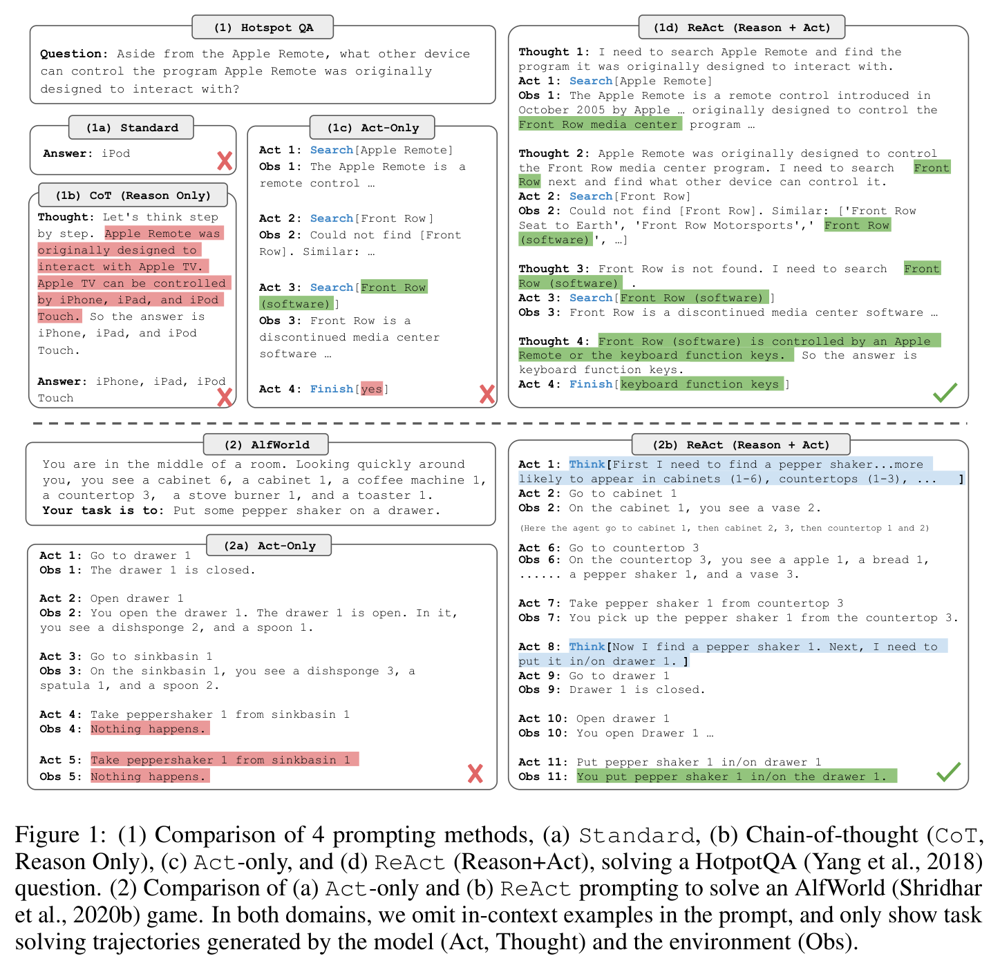
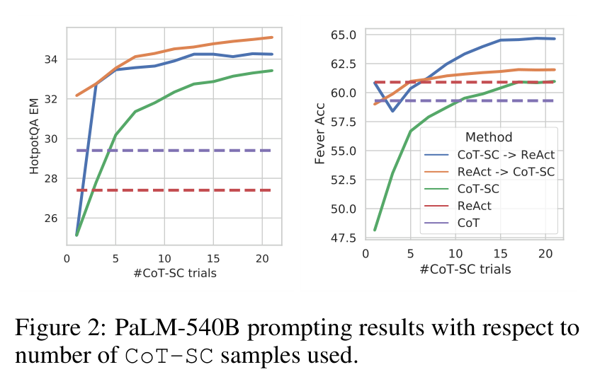
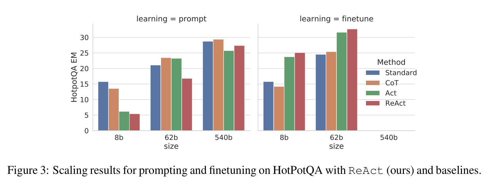

# ReAct: Synergizing Reasoning and Acting in Language Models — main body

Full text of Yao et al. (2023), transcribed from the arXiv LaTeX source and reproduced under CC BY 4.0; copyright the authors. Figures are crops of the published PDF, shown with the paper's own caption; this knowledge base adds no description of its own, so what a figure shows is what its caption and the paper's text say. Citations are resolved to author–year; the bibliography is omitted — follow the arXiv link for it. The appendices are not transcribed in this knowledge base; they are in the arXiv version linked above.

## Contents

| § | Heading | Figures | Tables |
|---|---|---|---|
| — | Abstract | | |
| 1 | Introduction | Figure 1 | |
| 2 | ReAct: Synergizing Reasoning + Acting | | |
| 3 | Knowledge-Intensive Reasoning Tasks | | |
| 3.1 | Setup | | |
| 3.2 | Methods | | |
| 3.3 | Results and Observations | Figure 2, Figure 3 | Table 1, Table 2 |
| 4 | Decision Making Tasks | | Table 3, Table 4 |
| 5 | Related Work | | |
| 6 | Conclusion | | |
| — | Acknowledgments | | |
| — | Reproducibility Statement | | |
| — | Ethics Statement | | |

## Abstract

While large language models (LLMs) have demonstrated impressive performance across tasks in language understanding and interactive decision making, their abilities for reasoning (e.g. chain-of-thought prompting) and acting (e.g. action plan generation) have primarily been studied as separate topics. In this paper, we explore the use of LLMs to generate both reasoning traces and task-specific actions in an interleaved manner, allowing for greater synergy between the two: reasoning traces help the model induce, track, and update action plans as well as handle exceptions, while actions allow it to interface with and gather additional information from external sources such as knowledge bases or environments. We apply our approach, named ReAct, to a diverse set of language and decision making tasks and demonstrate its effectiveness over state-of-the-art baselines in addition to improved human interpretability and trustworthiness. Concretely, on question answering (HotpotQA) and fact verification (Fever), ReAct overcomes prevalent issues of hallucination and error propagation in chain-of-thought reasoning by interacting with a simple Wikipedia API, and generating human-like task-solving trajectories that are more interpretable than baselines without reasoning traces. Furthermore, on two interactive decision making benchmarks (ALFWorld and WebShop), ReAct outperforms imitation and reinforcement learning methods by an absolute success rate of 34% and 10% respectively, while being prompted with only one or two in-context examples.

## 1 Introduction

A unique feature of human intelligence is the ability to seamlessly combine task-oriented actions with verbal reasoning (or inner speech, Alderson-Day and Fernyhough, 2015), which has been theorized to play an important role in human cognition for enabling self-regulation or strategization (Vygotsky, 1987; Luria, 1965; Fernyhough, 2010) and maintaining a working memory (Baddeley, 1992). Consider the example of cooking up a dish in the kitchen. Between any two specific actions, we may reason in language in order to track progress ("now that everything is cut, I should heat up the pot of water"), to handle exceptions or adjust the plan according to the situation ("I don't have salt, so let me use soy sauce and pepper instead"), and to realize when external information is needed ("how do I prepare dough? Let me search on the Internet"). We may also act (open a cookbook to read the recipe, open the fridge, check ingredients) to support the reasoning and to answer questions ("What dish can I make right now?"). This tight synergy between "acting" and "reasoning" allows humans to learn new tasks quickly and perform robust decision making or reasoning, even under previously unseen circumstances or facing information uncertainties.

Recent results have hinted at the possibility of combining verbal reasoning with interactive decision making in autonomous systems. On one hand, properly prompted large language models (LLMs) have demonstrated emergent capabilities to carry out several steps of reasoning traces to derive answers from questions in arithmetic, commonsense, and symbolic reasoning tasks (Wei et al., 2022). However, this "chain-of-thought" reasoning is a static black box, in that the model uses its own internal representations to generate thoughts and is not grounded in the external world, which limits its ability to reason reactively or update its knowledge. This can lead to issues like fact hallucination and error propagation over the reasoning process (Figure 1 (1b)). On the other hand, recent work has explored the use of pre-trained language models for planning and acting in interactive environments (Ahn et al., 2022; Nakano et al., 2021; Yao et al., 2020; Huang et al., 2022a), with a focus on predicting actions via language priors. These approaches usually convert multi-modal observations into text, use a language model to generate domain-specific actions or plans, and then use a controller to choose or execute them. However, they do not employ language models to reason abstractly about high-level goals or maintain a working memory to support acting, barring Huang et al. (2022b) who perform a limited form of verbal reasoning to reiterate spatial facts about the current state. Beyond such simple embodied tasks to interact with a few blocks, there have not been studies on how reasoning and acting can be combined in a synergistic manner for general task solving, and if such a combination can bring systematic benefits compared to reasoning or acting alone.

**Figure 1.** (1) Comparison of 4 prompting methods, (a) Standard, (b) Chain-of-thought (CoT, Reason Only), (c) Act-only, and (d) ReAct (Reason+Act), solving a HotpotQA (Yang et al., 2018) question. (2) Comparison of (a) Act-only and (b) ReAct prompting to solve an AlfWorld (Shridhar et al., 2020b) game. In both domains, we omit in-context examples in the prompt, and only show task solving trajectories generated by the model (Act, Thought) and the environment (Obs).

In this work, we present ReAct, a general paradigm to combine reasoning and acting with language models for solving diverse language reasoning and decision making tasks (Figure 1). ReAct prompts LLMs to generate both verbal reasoning traces and actions pertaining to a task in an interleaved manner, which allows the model to perform dynamic reasoning to create, maintain, and adjust high-level plans for acting (reason to act), while also interact with the external environments (e.g. Wikipedia) to incorporate additional information into reasoning (act to reason).

We conduct empirical evaluations of ReAct and state-of-the-art baselines on four diverse benchmarks: question answering (HotPotQA, Yang et al., 2018), fact verification (Fever, Thorne et al., 2018), text-based game (ALFWorld, Shridhar et al., 2020b), and webpage navigation (WebShop, Yao et al., 2022). For HotPotQA and Fever, with access to a Wikipedia API that the model can interact with, ReAct outperforms vanilla action generation models while being competitive with chain-of-thought reasoning (CoT) (Wei et al., 2022). The best approach overall is a combination of ReAct and CoT that allows for the use of both internal knowledge and externally obtained information during reasoning. On ALFWorld and WebShop, two or even one-shot ReAct prompting is able to outperform imitation or reinforcement learning methods trained with $10^3 \sim 10^5$ task instances, with an absolute improvement of 34% and 10% in success rates respectively. We also demonstrate the importance of sparse, versatile reasoning in decision making by showing consistent advantages over controlled baselines with actions only. Besides general applicability and performance boost, the combination of reasoning and acting also contributes to model interpretability, trustworthiness, and diagnosability across all domains, as humans can readily distinguish information from model's internal knowledge versus external environments, as well as inspect reasoning traces to understand the decision basis of model actions.

To summarize, our key contributions are the following: (1) we introduce ReAct, a novel prompt-based paradigm to synergize reasoning and acting in language models for general task solving; (2) we perform extensive experiments across diverse benchmarks to showcase the advantage of ReAct in a few-shot learning setup over prior approaches that perform either reasoning or action generation in isolation; (3) we present systematic ablations and analysis to understand the importance of acting in reasoning tasks, and reasoning in interactive tasks; (4) we analyze the limitations of ReAct under the prompting setup (i.e. limited support of reasoning and acting behaviors), and perform initial finetuning experiments showing the potential of ReAct to improve with additional training data. Scaling up ReAct to train and operate on more tasks and combining it with complementary paradigms like reinforcement learning could further unlock the potential of large language models.

## 2 ReAct: Synergizing Reasoning + Acting

Consider a general setup of an agent interacting with an environment for task solving. At time step $t$, an agent receives an observation $o_t \in \mathcal{O}$ from the environment and takes an action $a_t \in \mathcal{A}$ following some policy $\pi(a_t | c_t)$, where $c_t = (o_1, a_1, \cdots, o_{t-1}, a_{t-1}, o_t)$ is the *context* to the agent. Learning a policy is challenging when the mapping $c_t \mapsto a_t$ is highly implicit and requires extensive computation. For example, the agent shown in Figure 1(1c) is unable to generate the correct final action (Act 4) to finish the QA task as it requires complex reasoning over the trajectory context (Question, Act 1-3, Obs 1-3). Similarly, the agent shown in Figure 1(2a) fails to comprehend from the context that sinkbasin 1 does not contain peppershaker 1, thus keep producing hallucinating actions.

The idea of ReAct is simple: we augment the agent's action space to $\mathcal{\hat{A}} = \mathcal{A} \cup \mathcal{L}$, where $\mathcal{L}$ is the space of language. An action $\hat{a}_ t \in \mathcal{L}$ in the language space, which we will refer to as a *thought* or a *reasoning trace*, does not affect the external environment, thus leading to no observation feedback. Instead, a thought $\hat{a}_ t$ aims to compose useful information by reasoning over the current context $c_t$, and update the context $c_{t+1} = (c_t, \hat{a}_ t)$ to support future reasoning or acting. As shown in Figure 1, there could be various types of useful thoughts, e.g. decomposing task goals and create action plans (2b, Act 1; 1d, Thought 1), injecting commonsense knowledge relevant to task solving (2b, Act 1), extracting important parts from observations (1d, Thought2, 4), track progress and transit action plans (2b, Act 8), handle exceptions and adjust action plans (1d, Thought 3), and so on.

However, as the language space $\mathcal{L}$ is unlimited, learning in this augmented action space is difficult and requires strong language priors. In this paper, we mainly focus on the setup where a frozen large language model, PaLM-540B (Chowdhery et al., 2022),[^1] is prompted with few-shot in-context examples to generate both domain-specific actions and free-form language thoughts for task solving (Figure 1 (1d), (2b)). Each in-context example is a human trajectory of actions, thoughts, and environment observations to solve a task instance (see Appendix C). For the tasks where reasoning is of primary importance (Figure 1(1)), we alternate the generation of thoughts and actions so that the task-solving trajectory consists of multiple thought-action-observation steps. In contrast, for decision making tasks that potentially involve a large number of actions (Figure 1(2)), thoughts only need to appear sparsely in the most relevant positions of a trajectory, so we let the language model decide the asynchronous occurrence of thoughts and actions for itself.

Since decision making and reasoning capabilities are integrated into a large language model, ReAct enjoys several unique features: **A) Intuitive and easy to design**: Designing ReAct prompts is straightforward as human annotators just type down their thoughts in language on top of their actions taken. No ad-hoc format choice, thought design, or example selection is used in this paper. We detail prompt design for each task in Sections 3 and 4. **B) General and flexible**: Due to the flexible thought space and thought-action occurrence format, ReAct works for diverse tasks with distinct action spaces and reasoning needs, including but not limited to QA, fact verification, text game, and web navigation. **C) Performant and robust**: ReAct shows strong generalization to new task instances while learning solely from one to six in-context examples, consistently outperforming baselines with only reasoning or acting across different domains. We also show in Section 3 additional benefits when finetuning is enabled, and in Section 4 how ReAct performance is robust to prompt selections. **D) Human aligned and controllable**: ReAct promises an interpretable sequential decision making and reasoning process where humans can easily inspect reasoning and factual correctness. Moreover, humans can also control or correct the agent behavior on the go by thought editing, as shown in Figure 5 in Section 4.

[^1]: We show some GPT-3 (Brown et al., 2020) results in Appendix A.1, which outperforms PaLM-540B.

## 3 Knowledge-Intensive Reasoning Tasks

We begin with knowledge-intensive reasoning tasks like multi-hop question answering and fact verification. As shown in Figure 1(1d), by interacting with a Wikipedia API, ReAct is able to retrieve information to support reasoning, while also use reasoning to target what to retrieve next, demonstrating a synergy of reasoning and acting.

### 3.1 Setup

**Domains** We consider two datasets challenging knowledge retrieval and reasoning: (1) HotPotQA (Yang et al., 2018), a multi-hop question answering benchmark that requires reasoning over two or more Wikipedia passages, and (2) FEVER (Thorne et al., 2018), a fact verification benchmark where each claim is annotated SUPPORTS, REFUTES, or NOT ENOUGH INFO, based on if there exists a Wikipedia passage to verify the claim. In this work, we operate in a question-only setup for both tasks, where models only receive the question/claim as input without access to support paragraphs, and have to rely on their internal knowledge or retrieve knowledge via interacting with an external environment to support reasoning.

**Action Space** We design a simple Wikipedia web API with three types of actions to support interactive information retrieval: (1) `search[entity]`, which returns the first 5 sentences from the corresponding entity wiki page if it exists, or else suggests top-5 similar entities from the Wikipedia search engine, (2) `lookup[string]`, which would return the next sentence in the page containing string, simulating Ctrl+F functionality on the browser. (3) `finish[answer]`, which would finish the current task with answer. We note that this action space mostly can only retrieve a small part of a passage based on exact passage name, which is significantly weaker than state-of-the-art lexical or neural retrievers. The purpose is to simulate how humans would interact with Wikipedia, and force models to retrieve via explicit reasoning in language.

### 3.2 Methods

**ReAct Prompting** For HotpotQA and Fever, we randomly select 6 and 3 cases[^2] from the training set and manually compose ReAct-format trajectories to use as few-shot exemplars in the prompts. Similar to Figure 1(d), each trajectory consists of multiple thought-action-observation steps (i.e. dense thought), where free-form thoughts are used for various purposes. Specifically, we use a combination of thoughts that decompose questions ("I need to search x, find y, then find z"), extract information from Wikipedia observations ("x was started in 1844", "The paragraph does not tell x"), perform commonsense ("x is not y, so z must instead be...") or arithmetic reasoning ("1844 < 1989"), guide search reformulation ("maybe I can search/look up x instead"), and synthesize the final answer ("...so the answer is x"). See Appendix C for more details.

**Baselines** We systematically ablate ReAct trajectories to build prompts for multiple baselines (with formats as Figure 1(1a-1c)): (a) **Standard prompting** (Standard), which removes all thoughts, actions, observations in ReAct trajectories. (b) **Chain-of-thought prompting** (CoT) (Wei et al., 2022), which removes actions and observations and serve as a reasoning-only baseline. We also build a self-consistency baseline (CoT-SC) (Wang et al., 2022a; Wang et al., 2022b) by sampling 21 CoT trajectories with decoding temperature 0.7 during inference and adopting the majority answer, which is found to consistently boost performance over CoT. (c) **Acting-only prompt** (Act), which removes thoughts in ReAct trajectories, loosely resembling how WebGPT (Nakano et al., 2021) interacts with the Internet to answer questions, though it operates on a different task and action space, and uses imitation and reinforcement learning instead of prompting.

**Combining Internal and External Knowledge** As will be detail in Section 3.3, we observe that the problem solving process demonstrated by ReAct is more factual and grounded, whereas CoT is more accurate in formulating reasoning structure but can easily suffer from hallucinated facts or thoughts. We therefore propose to incorporate ReAct and CoT-SC, and let the model decide when to switch to the other method based on the following heuristics: A) **ReAct $\to$ CoT-SC**: when ReAct fails to return an answer within given steps, back off to CoT-SC. We set 7 and 5 steps for HotpotQA and FEVER respectively as we find more steps will not improve ReAct performance.[^3] B) **CoT-SC $\to$ ReAct**: when the majority answer among $n$ CoT-SC samples occurs less than $n/2$ times (i.e. internal knowledge might not support the task confidently), back off to ReAct.

**Finetuning** Due to the challenge of manually annotating reasoning traces and actions at scale, we consider a bootstraping approach similar to Zelikman et al. (2022), using 3,000 trajectories with correct answers generated by ReAct (also for other baselines) to finetune smaller language models (PaLM-8/62B) to decode trajectories (all thoughts, actions, observations) conditioned on input questions/claims. More details are in Appendix B.1.

[^2]: We find more examples do not improve performance.
[^3]: Of all trajectories with correct final answers, those with 7 steps on HotpotQA and 5 steps on FEVER only take up 0.84% and 1.33% respectively.

### 3.3 Results and Observations

**ReAct outperforms Act consistently** Table 1 shows HotpotQA and Fever results using PaLM-540B as the base model with different prompting methods. We note that ReAct is better than Act on both tasks, demonstrating the value of reasoning to guide acting, especially for synthesizing the final answer, as shown in Figure 1 (1c-d). Fine-tuning results (Figure 3) also confirm the benefit of reasoning traces for more informed acting.

**Table 1.** PaLM-540B prompting results on HotpotQA and Fever.

| Prompt Method[^4] | HotpotQA (EM) | Fever (Acc) |
|---|---|---|
| Standard | 28.7 | 57.1 |
| CoT (Wei et al., 2022) | 29.4 | 56.3 |
| CoT-SC (Wang et al., 2022a) | 33.4 | 60.4 |
| Act | 25.7 | 58.9 |
| ReAct | 27.4 | 60.9 |
| CoT-SC $\to$ ReAct | 34.2 | **64.6** |
| ReAct $\to$ CoT-SC | **35.1** | 62.0 |
| **Supervised SoTA**[^5] | 67.5 | 89.5 |

*The two-row column header in the source (with "HotpotQA"/"Fever" over "(EM)"/"(Acc)") is flattened onto one header row above.*

**Figure 2.** PaLM-540B prompting results with respect to number of CoT-SC samples used.

**Table 2.** Types of success and failure modes of ReAct and CoT on HotpotQA, as well as their percentages in randomly selected examples studied by human.

| | Type | Definition | ReAct | CoT |
|---|---|---|---|---|
| Success | True positive | Correct reasoning trace and facts | 94% | 86% |
| Success | False positive | Hallucinated reasoning trace or facts | 6% | 14% |
| Failure | Reasoning error | Wrong reasoning trace (including failing to recover from repetitive steps) | 47% | 16% |
| Failure | Search result error | Search return empty or does not contain useful information | 23% | - |
| Failure | Hallucination | Hallucinated reasoning trace or facts | 0% | 56% |
| Failure | Label ambiguity | Right prediction but did not match the label precisely | 29% | 28% |

*The "Success" and "Failure" row labels each span multiple rows via `\multirow` in the source; the spanning value is repeated in each row above.*

**ReAct vs. CoT** On the other hand, ReAct outperforms CoT on Fever (60.9 vs. 56.3) and slightly lags behind CoT on HotpotQA (27.4 vs. 29.4). Fever claims for SUPPORTS/REFUTES might only differ by a slight amount (see Appendix D.1), so acting to retrieve accurate and up-to-date knowledge is vital. To better understand the behavioral difference between ReAct and CoT on HotpotQA, we randomly sampled 50 trajectories with correct and incorrect answers (judged by EM) from ReAct and CoT respectively (thus 200 examples in total), and manually labeled their success and failure modes in Table 2. Some key observations are as follows:

A) **Hallucination is a serious problem for CoT**, resulting in much higher false positive rate than ReAct (14% vs. 6%) in success mode, and make up its major failure mode (56%). In contrast, the problem solving trajectory of ReAct is more grounded, fact-driven, and trustworthy, thanks to the access of an external knowledge base.

B) **While interleaving reasoning, action and observation steps improves ReAct's groundedness and trustworthiness, such a structural constraint also reduces its flexibility in formulating reasoning steps**, leading to more reasoning error rate than CoT. we note that there is one frequent error pattern specific to ReAct, in which the model repetitively generates the previous thoughts and actions, and we categorize it as part of "reasoning error" as the model fails to reason about what the proper next action to take and jump out of the loop.[^6]

C) **For ReAct, successfully retrieving informative knowledge via search is critical.** Non-informative search, which counts for 23% of the error cases, derails the model reasoning and gives it a hard time to recover and reformulate thoughts. This is perhaps an expected trade-off between factuality and flexibility, which motivates our proposed strategies of combining two methods.

We provide examples for each success and failure modes in Appendix E.1. We also find some HotpotQA questions may contain outdated answer labels, see Figure 4 for example.

**ReAct + CoT-SC perform best for prompting LLMs** Also shown in Table 1, the best prompting method on HotpotQA and Fever are ReAct $\to$ CoT-SC and CoT-SC $\to$ ReAct respectively. Furthermore, Figure 2 shows how different methods perform with respect to the number of CoT-SC samples used. While two ReAct + CoT-SC methods are advantageous at one task each, they both significantly and consistently outperform CoT-SC across different number of samples, reaching CoT-SC performance with 21 samples using merely 3-5 samples. These results indicate the value of properly combining model internal knowledge and external knowledge for reasoning tasks.

**Figure 3.** Scaling results for prompting and finetuning on HotPotQA with ReAct (ours) and baselines.

**ReAct performs best for fine-tuning** Figure 3 shows the scaling effect of prompting/finetuning four methods (Standard, CoT, Act, ReAct) on HotpotQA. With PaLM-8/62B, prompting ReAct performs worst among four methods due to the difficulty to learn both reasoning and acting from in-context examples. However, when finetuned with just 3,000 examples, ReAct becomes the best method among the four, with PaLM-8B finetuned ReAct outperforming all PaLM-62B prompting methods, and PaLM-62B finetuned ReAct outperforming all 540B prompting methods. In contrast, finetuning Standard or CoT is significantly worse than finetuning ReAct or Act for both PaLM-8/62B, as the former essentially teaches models to memorize (potentially halluincated) knowledge facts, and the latter teaches models how to (reason and) act to access information from Wikipedia, a more generalizable skill for knowledge reasoning. As all prompting methods are still significantly far from domain-specific state-of-the-art approaches (Table 1), we believe finetuning with more human-written data might be a better way to unleash the power of ReAct.

[^4]: HotpotQA EM is 27.1, 28.9, 33.8 for Standard, CoT, CoT-SC in Wang et al. (2022b).
[^5]: (Zhu et al., 2021; Lewis et al., 2020)
[^6]: We suspect that this could be due to the sub-optimal greedy decoding procedure, and future work using better decoding (e.g. beam search) might help address this issue.

## 4 Decision Making Tasks

We also test ReAct on two language-based interactive decision-making tasks, ALFWorld and WebShop, both of which feature complex environments that require agents to act over long horizons with sparse rewards, warranting the need for reasoning to act and explore effectively.

**ALFWorld** ALFWorld (Shridhar et al., 2020b) (Figure 1(2)) is a synthetic text-based game designed to align with the embodied ALFRED benchmark (Shridhar et al., 2020a). It includes 6 types of tasks in which an agent needs to achieve a high-level goal (e.g. examine paper under desklamp) by navigating and interacting with a simulated household via text actions (e.g. go to coffeetable 1, take paper 2, use desklamp 1). A task instance can have more than 50 locations and take an expert policy more than 50 steps to solve, thus challenging an agent to plan and track subgoals, as well as explore systematically (e.g. check all desks one by one for desklamp). In particular, one challenge built into ALFWorld is the need to determine likely locations for common household items (e.g. desklamps will likely be on desks, shelfs, or dressers), making this environment a good fit for LLMs to exploit their pretrained commonsense knowledge. To prompt ReAct, we randomly annotate three trajectories from the training set for each task type, where each trajectory includes sparse thoughts that (1) decompose the goal, (2) track subgoal completion, (3) determine the next subgoal, and (4) reason via commonsense where to find an object and what to do with it. We show prompts used for ALFWorld in Appendix C.4. Following Shridhar et al. (2020b), we evaluate on 134 unseen evaluation games in a task-specific setup. For robustness, we construct 6 prompts for each task type through each permutation of 2 annotated trajectories from the 3 we annotate. Act prompts are constructed using the same trajectories, but without thoughts — since task instances are randomly chosen from the training set, it favors neither ReAct nor Act and provides a fair and controlled comparison to test the importance of sparse thoughts. For baselines, we use BUTLER (Shridhar et al., 2020b), an imitation learning agent trained on $10^5$ expert trajectories for each task type.[^7]

**WebShop** Can ReAct also interact with noisy real-world language environments for practical applications? We investigate WebShop (Yao et al., 2022), a recently proposed online shopping website environment with 1.18M real-world products and 12k human instructions. Unlike ALFWorld, Webshop contains a high variety of structured and unstructured texts (e.g. product titles, descriptions, and options crawled from Amazon), and requires an agent to purchase a product based on a user instruction (e.g. "I am looking for a nightstand with drawers. It should have a nickel finish, and priced lower than \$140") through web interactions (e.g. search "nightstand drawers", choose buttons such as "color: modern-nickel-white" or "back to search"). This task is evaluated by average score (percentage of desired attributes covered by the chosen product averaged across all episodes) and success rate (percentage of episodes where the chosen product satisfies all requirements) on 500 test instructions. We formulate Act prompts with actions to search, choose product, choose options, and buy, with ReAct prompts additionally reasoning to determine what to explore, when to buy, and what products options are relevant to the instruction. See Table 6 for an example prompt, and Table 10 for model predictions in the Appendix. We compare to an imitation learning (IL) method trained with 1,012 human annotated trajectories, and a imitation + reinforcement learning (IL + RL) method additionally trained with 10,587 training instructions.

**Results**

ReAct outperforms Act on both ALFWorld (Table 3) and Webshop (Table 4). On ALFWorld, the best ReAct trial achieves an average success rate of 71%, significantly outperforming the best Act (45%) and BUTLER (37%) trials. In fact, even the worse ReAct trial (48%) beats the best trial of both methods. Moreover, the advantage of ReAct over Act is consistent across six controlled trials, with relative performance gain ranging from 33% to 90% and averaging 62%. Qualitatively, we saw that, without any thoughts at all, Act fails to correctly decompose goals into smaller subgoals, or loses track of the current state of the environment. Example trajectories comparing ReAct and Act can be found in Appendix D.2.1 and Appendix D.2.2.

**Table 3.** AlfWorld task-specific success rates (%). BUTLER and $\text{BUTLER}_ g$ results are from Table 4 of Shridhar et al. (2020b). All methods use greedy decoding, except that BUTLER uses beam search.

| Method | Pick | Clean | Heat | Cool | Look | Pick 2 | All |
|---|---|---|---|---|---|---|---|
| Act (best of 6) | 88 | 42 | 74 | 67 | 72 | **41** | 45 |
| ReAct (avg) | 65 | 39 | 83 | 76 | 55 | 24 | 57 |
| ReAct (best of 6) | **92** | 58 | **96** | 86 | **78** | **41** | **71** |
| ReAct-IM (avg) | 55 | 59 | 60 | 55 | 23 | 24 | 48 |
| ReAct-IM (best of 6) | 62 | **68** | 87 | 57 | 39 | 33 | 53 |
| $\text{BUTLER}_ g$ (best of 8) | 33 | 26 | 70 | 76 | 17 | 12 | 22 |
| BUTLER (best of 8) | 46 | 39 | 74 | **100** | 22 | 24 | 37 |

**Table 4.** Score and success rate (SR) on Webshop. IL/IL+RL taken from Yao et al. (2022).

| Method | Score | SR |
|---|---|---|
| Act | 62.3 | 30.1 |
| ReAct | **66.6** | **40.0** |
| IL | 59.9 | 29.1 |
| IL+RL | 62.4 | 28.7 |
| Human Expert | 82.1 | 59.6 |

*In the source, the "Human Expert" row label and its two score values are each split across two lines joined by `\multirow`; the row is flattened to one line above.*

On Webshop, one-shot Act prompting already performs on par with IL and IL+RL methods. With additional sparse reasoning, ReAct achieves significantly better performance, with an absolute 10% improvement over the previous best success rate. By checking examples, we find that ReAct is more likely to identify instruction-relevant products and options by reasoning to bridge the gap between noisy observations and actions (e.g. "For 'space-saving ottoman bench for living room', the item has options '39x18x18inch' and 'blue' and seems good to buy."). However, existing methods are still far from the performance of expert humans (Table 4), who perform significantly more product explorations and query re-formulations that are still challenging for prompting-based methods.

**On the value of internal reasoning vs. external feedback**

To our knowledge, ReAct is the first demonstration of combined reasoning and action using an LLM applied to an interactive environment within a closed-loop system. Perhaps the closest prior work is Inner Monologue (IM), from Huang et al. (2022b), in which actions from an embodied agent are motivated by an eponymous "inner monologue". **However, IM's "inner monologue" is limited to observations of the environment state and what needs to be completed by the agent for the goal to be satisfied.** In contrast, the reasoning traces in ReAct for decision making is flexible and sparse, allowing diverse reasoning types (see Section 2) to be induced for different tasks.

To demonstrate the differences between ReAct and IM, and to highlight the importance of internal reasoning vs. simple reactions to external feedback, we ran an ablation experiment using a thought pattern composed of IM-like dense external feedback. As can be seen in Table 3, ReAct substantially outperforms IM-style prompting (ReAct-IM) (71 vs. 53 overall success rate), with consistent advantages on five out of six tasks. Qualitatively, we observed that ReAct-IM often made mistakes in identifying when subgoals were finished, or what the next subgoal should be, due to a lack of high-level goal decomposition. Additionally, many ReAct-IM trajectories struggled to determine where an item would likely be within the ALFWorld environment, due to a lack of commonsense reasoning. Both shortcomings can be addressed in the ReAct paradigm. More details about ReAct-IM is in Appendix B.2. An example prompt for ReAct-IM can be found in Appendix C.4, and an example trajectory in Appendix D.2.3.

[^7]: Micheli and Fleuret (2021) finetuned a GPT-2 model on 3553 task instances and achieved a much improved performance than BUTLER, but it is trained on all task types, thus not included as a baseline.

## 5 Related Work

**Language model for reasoning** Perhaps the most well-known work of using LLMs for reasoning is Chain-of-Thought (CoT) (Wei et al., 2022), which reveals the ability of LLMs to formulate their own "thinking procedure" for problem solving. Several follow-up works have since been performed, including least-to-most prompting for solving complicated tasks (Zhou et al., 2022), zero-shot-CoT (Kojima et al., 2022), and reasoning with self-consistency (Wang et al., 2022a). Recently, (Madaan and Yazdanbakhsh, 2022) systematically studied the formulation and structure of CoT, and observed that the presence of symbols, patterns and texts is crucial to the effectiveness of CoT. Other work has also been extended to more sophisticated reasoning architecture beyond simple prompting. For example Selection-Inference (Creswell et al., 2022) divides the reasoning process into two steps of "selection" and "inference". STaR (Zelikman et al., 2022) bootstraps the reasoning process by finetuning the model on correct rationales generated by the model itself. Faithful reasoning (Creswell and Shanahan, 2022) decomposes multi-step reasoning into three steps, each performed by a dedicated LM respectively. Similar approaches like Scratchpad (Nye et al., 2021), which finetunes a LM on intermediate computation steps, also demonstrate improvement on multi-step computation problems. In contrast to these methods, ReAct performs more than just isolated, fixed reasoning, and integrates model actions and their corresponding observations into a coherent stream of inputs for the model to reason more accurately and tackle tasks beyond reasoning (e.g. interactive decision making).

**Language model for decision making** The strong capability of LLMs has enabled them to perform tasks beyond language generation, and it is becoming more popular to take advantage of LLMs as a policy model for decision making, especially in interactive environments. WebGPT (Nakano et al., 2021) uses an LM to interact with web browsers, navigate through web pages, and infer answers to complicated questions from ELI5 (Fan et al., 2019). In comparison to ReAct, WebGPT does not explicitly model the thinking and reasoning procedure, instead rely on expensive human feedback for reinforcement learning. In conversation modeling, chatbots like BlenderBot (Shuster et al., 2022b) and Sparrow (Glaese et al., 2022) and task-oriented dialogue systems like SimpleTOD (Hosseini-Asl et al., 2020) also train LMs to make decision about API calls. Unlike ReAct, they do not explicitly consider the reasoning procedure either, and also relies on expensive datasets and human feedback collections for policy learning. In contrast, ReAct learns a policy in a much cheaper way, since the decision making process only requires language description of the reasoning procedure.[^8]

LLMS have also been increasingly employed in interactive and embodied environments for planning and decision making. Perhaps most relevant to ReAct in this respect are SayCan (Ahn et al., 2022) and Inner Monologue (Huang et al., 2022b), which use LLMs for robotic action planning and decision making. In SayCan, LLMs were prompted to directly predict possible actions a robot can take, which is then reranked by an affordance model grounded on the visual environments for final prediction. Inner Monologue made further improvements by adding the eponymous "inner monologue", which is implemented as injected feedback from the environment. To our knowledge, Inner Monologue is the first work that demonstrates such a closed-loop system, which ReAct builds on. However, we argue that Inner Monologue does not truly comprise of inner thoughts — this is elaborated in Section 4. We also note that leveraging language as semantically-rich inputs in the process of interactive decision making has been shown to be successful under other settings (Abramson et al., 2020; Karamcheti et al., 2021; Huang et al., 2022a; Li et al., 2022). It is becoming more evident that with the help of LLMs, language as a fundamental cognitive mechanism will play a critical role in interaction and decision making. What is more, progress in LLMs has also inspired the development of versatile and generalist agents like Reed et al. (2022).

[^8]: Human feedback can also be incorporated in a complementary manner but we leave it for future work.

## 6 Conclusion

We have proposed ReAct – a simple yet effective method for synergizing reasoning and acting in large language models. Through a diverse set of experiments on multi-hop question-answering, fact checking, and interactive decision-making tasks, we show that ReAct leads to superior performance with interpretable decision traces. Despite the simplicity of our method, complex tasks with large action spaces require more demonstrations to learn well, which unfortunately can easily go beyond the input length limit of in-context learning. We explore the fine-tuning approach on HotpotQA with initial promising results, but learning from more high-quality human annotations will be the desiderata to further improve the performance. Scaling up ReAct with multi-task training and combining it with complementary paradigms like reinforcement learning could result in stronger agents that further unlock the potential of LLMs for more applications.

### Acknowledgments

We thank the support and feedback of many people from Google Brain team and Princeton NLP Group. This work was supported in part by the National Science Foundation under Grant No. 2107048. Any opinions, findings, and conclusions or recommendations expressed in this material are those of the author(s) and do not necessarily reflect the views of the National Science Foundation.

### Reproducibility Statement

Our main experiments are done on PaLM (Chowdhery et al., 2022), which is not an openly accessible model yet. To increase reproducibility, we have included all used prompts in Appendix C, additional experiments using GPT-3 (Brown et al., 2020) in Appendix A.1, and associated GPT-3 ReAct prompting code at https://anonymous.4open.science/r/ReAct-2268/.

### Ethics Statement

ReAct prompts large language models to generate more human interpretable, diagnosable, and controllable task-solving trajectories than previous methods. However, hooking up a large language model with an action space to interact with external environments (e.g. the web, physical environments) has potential dangers, e.g. looking up inappropriate or private information, or taking harmful actions in an environment. Our experiments minimize such risks by limiting the interactions to specific websites (Wikipedia or WebShop) that are free of private information, without any dangerous actions in the action space design (i.e. models cannot really buy products on WebShop the research benchmark, or edit Wikipedia). We believe researchers should be aware of such risks before designing more extensive experiments in the future.
