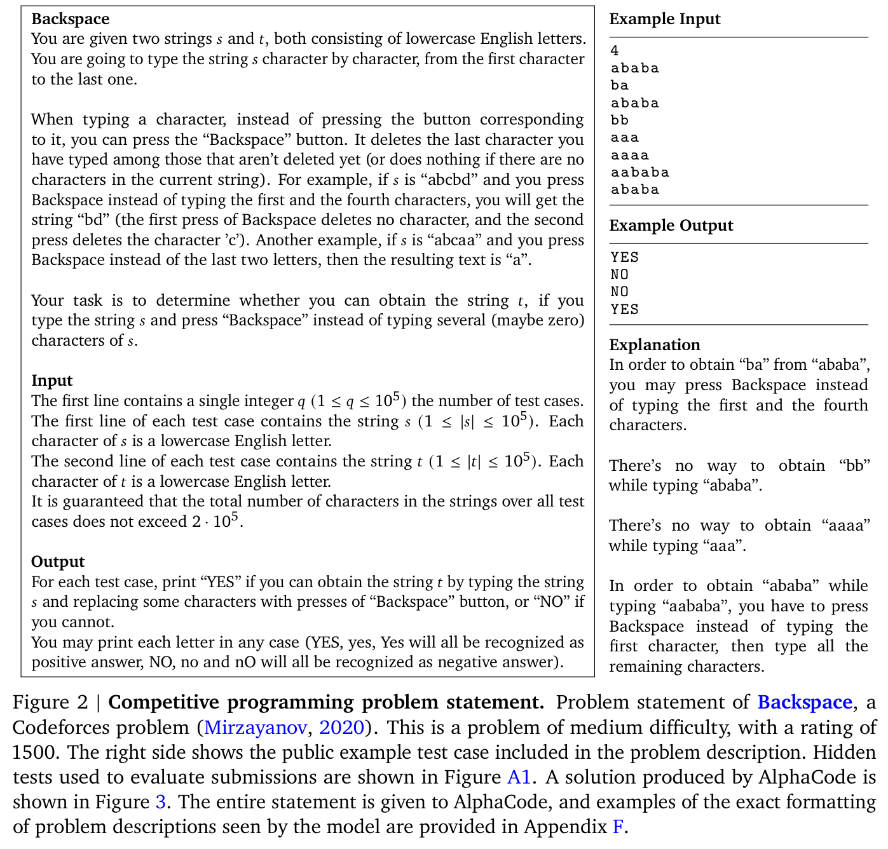
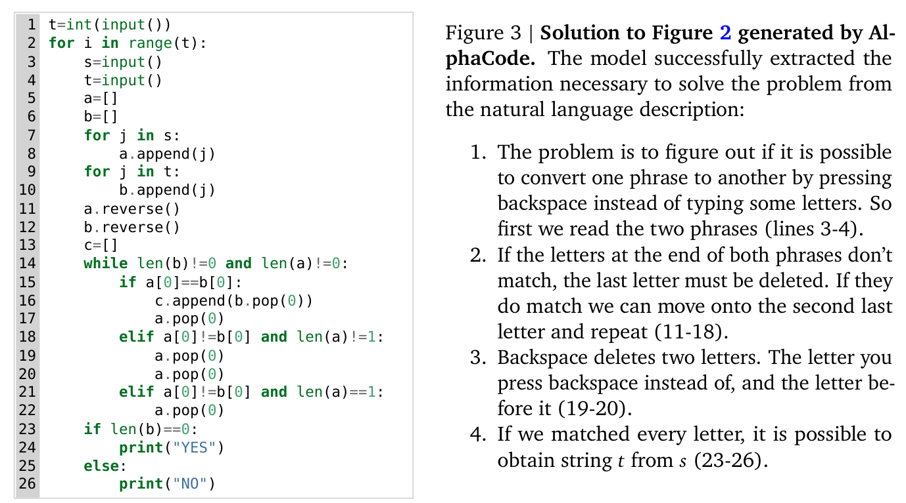
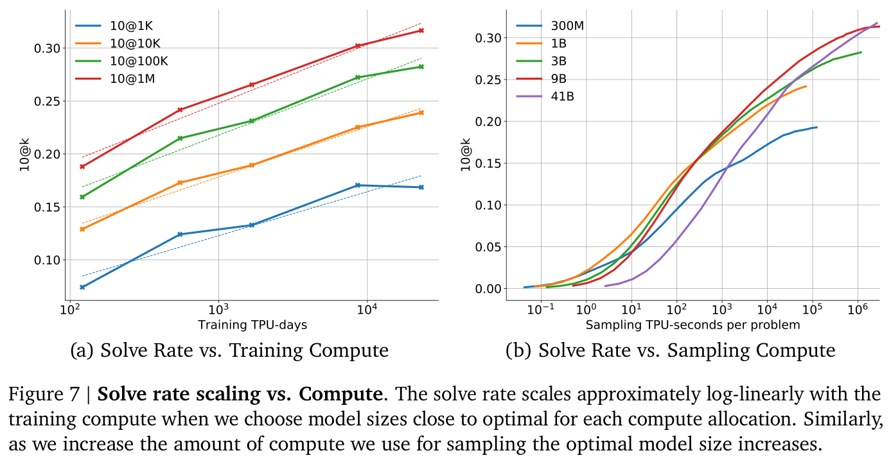
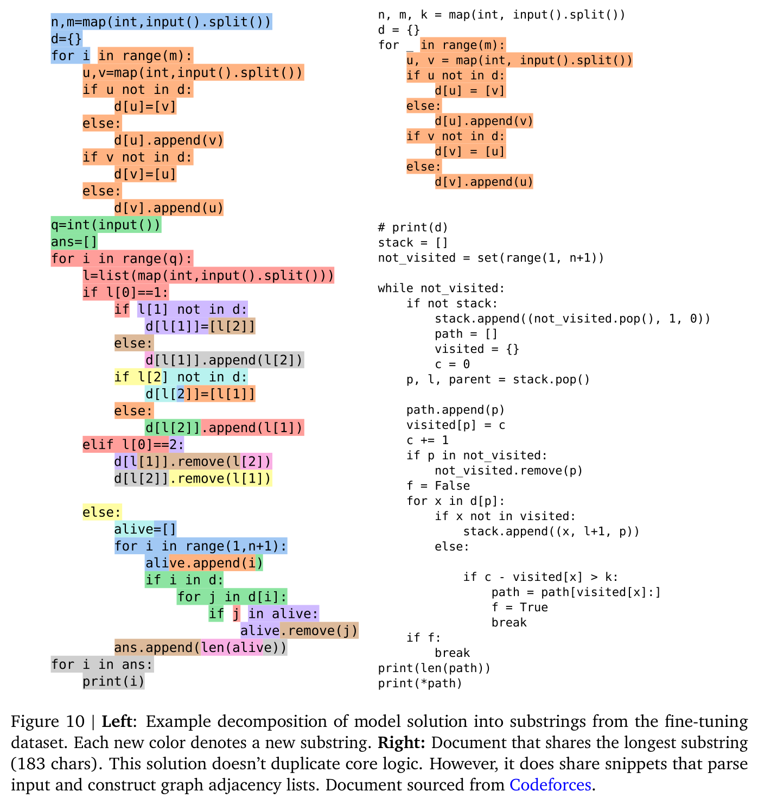
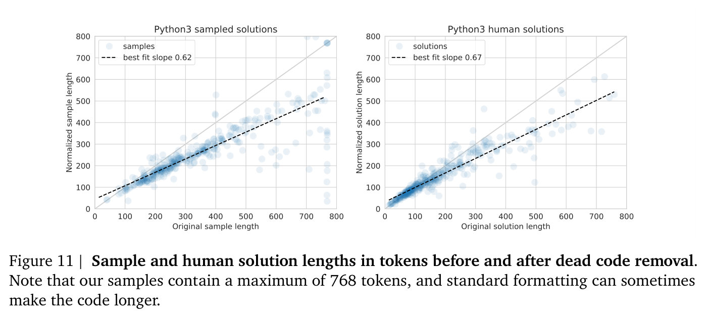
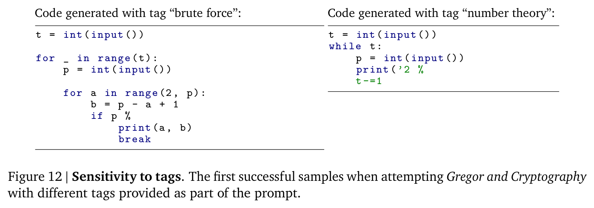

# Competition-Level Code Generation with AlphaCode — main body

Full text of Li et al. (2022), transcribed from the arXiv LaTeX source and reproduced under CC BY 4.0; copyright the authors. Figures are crops of the published PDF, shown with the paper's own caption; this knowledge base adds no description of its own, so what a figure shows is what its caption and the paper's text say. Citations are resolved to author–year; the bibliography is omitted — follow the arXiv link for it. The appendices are not transcribed in this knowledge base, nor are the Acknowledgements, Author Contributions, and Data availability sections that follow the main text; they are in the arXiv version linked above.

## Contents

| § | Heading | Figures | Tables |
|---|---|---|---|
| — | Abstract | | |
| 1 | Introduction | Figure 1 | |
| 2 | Problem setup | | |
| 2.1 | Competitive programming | Figure 2, Figure 3 | |
| 2.2 | Evaluation | | |
| 3 | Datasets | | |
| 3.1 | Pre-training dataset | | |
| 3.2 | CodeContests fine-tuning dataset | | Table 1 |
| 3.2.1 | False positives and additional generated tests | | Table 2 |
| 4 | Approach | Figure 4 | |
| 4.1 | Model architecture | | Table 3 |
| 4.2 | Pre-training | | |
| 4.3 | Fine-tuning | Figure 5 | |
| 4.4 | Large scale sampling | | |
| 4.5 | Filtering | | |
| 4.6 | Clustering | | |
| 5 | Results | | |
| 5.1 | Codeforces competitions evaluation | | Table 4 |
| 5.2 | CodeContests evaluation | | Table 5 |
| 5.3 | CodeContests ablations & results | | |
| 5.3.1 | Solve rates scale with respect to parameter count, compute, number of samples, and dataset size | Figure 6, Figure 7 | |
| 5.3.2 | Architecture changes to improve sampling speed | | Table 6 |
| 5.3.3 | Choice of the pre-training dataset | | Table 7 |
| 5.3.4 | Model enhancements | | Table 8 |
| 5.3.5 | Filtering & clustering | Figure 8 | Table 9 |
| 5.4 | Results on APPS | | Table 10 |
| 6 | AlphaCode's capabilities & limitations | | |
| 6.1 | Copying from training data | Figure 9, Figure 10 | |
| 6.2 | Model solution characteristics | Figure 11 | Table 11 |
| 6.3 | Sensitivity to problem descriptions | | Table 12 |
| 6.4 | Sensitivity to provided metadata | Figure 12 | Table 13 |
| 6.5 | Loss is a poor proxy for solve rate | Figure 13 | |
| 7 | Related work | | |
| 7.1 | Program synthesis | | |
| 7.2 | Transformers for program synthesis | | |
| 7.3 | Scaling sampling | | |
| 7.4 | Evaluation metrics | | |
| 7.5 | Competitive programming | | |
| 8 | Broader impact | | |
| 8.1 | Applications | | |
| 8.2 | Potential risks and benefits | | |
| 9 | Conclusion | | |

## Abstract

Programming is a powerful and ubiquitous problem-solving tool. Developing systems that can assist programmers or even generate programs independently could make programming more productive and accessible, yet so far incorporating innovations in AI has proven challenging. Recent large-scale language models have demonstrated an impressive ability to generate code, and are now able to complete simple programming tasks. However, these models still perform poorly when evaluated on more complex, unseen problems that require problem-solving skills beyond simply translating instructions into code. For example, competitive programming problems which require an understanding of algorithms and complex natural language remain extremely challenging. To address this gap, we introduce AlphaCode, a system for code generation that can create novel solutions to these problems that require deeper reasoning. In simulated evaluations on recent programming competitions on the Codeforces platform, AlphaCode achieved on average a ranking of top 54.3% in competitions with more than 5,000 participants. We found that three key components were critical to achieve good and reliable performance: (1) an extensive and clean competitive programming dataset for training and evaluation, (2) large and efficient-to-sample transformer-based architectures, and (3) large-scale model sampling to explore the search space, followed by filtering based on program behavior to a small set of submissions.

## 1 Introduction

Computer programming has emerged as a general-purpose problem-solving tool throughout science, industry, and daily life. As part of this growth, there has been continuously increasing demand for tools that can make programmers more productive (Matsakis and Klock, 2014), or make programming and programming education more accessible (Resnick et al., 2009). Developing AI systems that can effectively model and understand code can transform these tools and the way we interact with them. Systems that can generate code are not only useful, but also stepping stones that can lead to greater understanding of AI and how it relates to programming.

Generating code that solves a specified task requires searching in the huge structured space of possible programs, with a very sparse reward signal. Single character edits can completely change program behaviour even if they don't cause crashes, solutions can look dramatically different even for the same problem, and judging if a partial or incorrect program is useful is a difficult challenge. Therefore, most prior work has been limited to either restricted domain-specific programming languages (Gulwani, 2011) or short code snippets (Raychev et al., 2014; Bruch et al., 2009).

Recent large-scale transformer-based (Vaswani et al., 2017) language models, used to achieve impressive performance generating text (Brown et al., 2020), have successfully generated code that solves simple programming problems in Python (Chen et al., 2021; Austin et al., 2021). A stripped-down version of our model, without the modifications described in Section 4, performs similarly to Codex (Appendix Table A3). However, problems used in the Codex paper and similar work consist of mostly simple task descriptions with short solutions -- far from the full complexity of real-world programming. Generating an entire program in a general-purpose programming language such as *C++* or Python, starting from a long natural language task description, has remained an open problem. The difference in difficulty between generating short code snippets and entire programs can be analogous to that of imperative versus declarative problem solving. Generating short code snippets typically amounts to translating the task specification directly into code, and sometimes reduces to invoking the correct API calls. In contrast, generating entire programs often relies on understanding the task and figuring out how to accomplish it, which requires deeper algorithmic reasoning.

Competitive programming problems represent a significant step forward in all these aspects. Solving such problems requires understanding complex natural language descriptions, reasoning about previously unseen problems, mastering a wide range of algorithms and data structures, and precisely implementing solutions that can span hundreds of lines. Solutions are evaluated by executing them on an exhaustive suite of unknown tests, checking for correct behaviour on edge cases as well as execution speed. The fact that the test cases used for evaluation are hidden is an important part of the challenge. These complex problems are newly created for each competition, with the understanding that competitors can draw on solutions to previous contests (either implicitly, by remembering old problems, or explicitly, by searching for them). Moreover, competitive programming is very popular; events like the International Collegiate Programming Competition (ICPC, 2021) and the International Olympiad in Informatics (IOI, 2021) are widely recognized as some of the most prestigious competitions in computer science, drawing hundreds of thousands of participants from around the world. Using problems that humans find challenging from such battle-tested competitions ensures robustness against shortcuts and provides a meaningful benchmark for many aspects of intelligence.

Early work using program synthesis for competitive programming has shown that large transformer models can achieve low single-digit solve rates (Hendrycks et al., 2021; Chen et al., 2021), but could not yet reliably generate solutions for the vast majority of problems. Furthermore, as we show in Section 3.2.1, the lack of sufficient test cases in existing competitive programming datasets makes the metrics defined on them prone to high false positive rates (with 30% or more programs which pass all tests but are not actually correct), and therefore unreliable for measuring research progress.

In this paper we present AlphaCode, a code generation system applied to solving competitive programming problems. We use large transformer language models to generate code, pre-training them on selected GitHub code and fine-tuning on our curated set of competitive programming problems. For each unseen problem we generate a large set of program samples, filter them based on execution results on example tests from the problem description, then cluster the remaining samples to obtain a small set of candidates to be submitted for evaluation. We describe AlphaCode in detail in Section 4.

A core part of developing our system was ensuring that submissions are rigorously evaluated and that evaluation problems are truly unseen during training, so difficult problems cannot be solved by copying from the training set. Towards this goal, we release a new training and evaluation competitive programming dataset, CodeContests[^1] (Section 3). This dataset combines data from various sources, splits temporally so all training data predates all evaluation problems, adds additional generated tests to ensure correctness, and evaluates submissions in a setting that mirrors that of competitive programming. In our evaluation (Section 3.2.1), CodeContests reduces the false positive rate from 30-60% in existing datasets to just 4%. Our best model solves 34.2% of held-out competitive programming problems in this dataset, using at most 10 submissions per problem (comparable to humans), as opposed to previously reported solve rates of around 1-5% on existing datasets (see Section 5.4).

**Figure 1.** **AlphaCode's ranking on 10 simulated Codeforces contests and estimated rating (right is better)**. AlphaCode ranked in the top 54.3% among contest participants averaged over 10 contests, and achieved an estimated average rating of 1238. (a) shows the rating of participants (y-axis) and their rankings in each contest (x-axis), as well as AlphaCode's ranking for each of the 10 contests. (b) shows the estimated rating of AlphaCode among users who have participated in at least 1 contest in the last 6 months. AlphaCode's estimated rating of 1238 is greater than 72% of these users.


To further validate our results, we evaluated AlphaCode on simulated programming competitions hosted on the popular Codeforces platform[^2] (Section 5.1). In the evaluation of 10 recent contests with over 5,000 participants each, AlphaCode achieved an average ranking within the top 54.3%. Based on these results, we estimate that our system has achieved a Codeforces rating[^3] of 1238 which is within the top 28%[^4] of users who have participated in a contest in the last 6 months (Figure 1) (Ebtekar, 2021). These evaluations only include users who have tried such competitions, which is a self-selected subset of all programmers. This is the first time that a computer system has achieved such a competitive level in programming competitions.

We also performed a detailed analysis of our system (Section 6), showing that AlphaCode does not duplicate sections of code from the training dataset to solve problems, but instead relies heavily on the natural language problem descriptions to create original solutions. We further examine the types of problems the model can and cannot solve, and discuss how the validation loss is a poor proxy for the solve rate.

[^1]: The dataset is located at [https://github.com/deepmind/code_contests](https://github.com/deepmind/code_contests).
[^2]: [https://codeforces.com/](https://codeforces.com/)
[^3]: The rating system is similar to the classic Elo score and is primarily explained in three blog posts: [1](https://codeforces.com/blog/entry/102), [2](https://codeforces.com/blog/entry/20762), and [3](https://codeforces.com/blog/entry/77890).
[^4]: AlphaCode's overall rating percentile is better than its per-contest percentile. We hypothesise that higher rated competitors compete more regularly than lower rated competitors, and therefore the group ranking above AlphaCode in contests is relatively more stable than the group ranking below.

## 2 Problem setup

### 2.1 Competitive programming

Programming competitions first began in the 1970s and have since grown in popularity to include hundreds of thousands of participants worldwide. The annual International Collegiate Programming Contest attracts almost 60,000 students from over 3,000 universities (ICPC Factsheet, 2020), and companies including Google (Google Code Jam, 2021) and Facebook (Facebook Hacker Cup, 2021) hold regular competitions. The popular Codeforces platform, used throughout this paper, has more than 500,000 active users and holds weekly competitions with tens of thousands of participants (Mirzayanov, 2020).

The exact format of a programming competition varies between contests, but in general individuals or teams of competitors are given between 5 and 10 problem descriptions (Figure 2), and approximately 3 hours to write programs (Figure 3) to correctly solve as many problems as possible. The program submissions are sent to a server which automatically evaluates them on an exhaustive set of hidden tests (Appendix Figure A1). Competitors are told whether or not their submission passed all tests, though not necessarily the exact cause of a failure. There are penalties based on the number of incorrect submissions per problem and the amount of time it took to solve each problem (ICPC Rules, 2021). Submissions can be written in a variety of programming languages, among which C++ and Python are currently the most popular. Problems are often given ratings to indicate difficulty, and more difficult problems are worth more points.

**Figure 2.** **Competitive programming problem statement.** Problem statement of [Backspace](https://codeforces.com/problemset/problem/1553/D), a Codeforces problem (Mirzayanov, 2020). This is a problem of medium difficulty, with a rating of 1500. The right side shows the public example test case included in the problem description. Hidden tests used to evaluate submissions are shown in Appendix Figure A1. A solution produced by AlphaCode is shown in Figure 3. The entire statement is given to AlphaCode, and examples of the exact formatting of problem descriptions seen by the model are provided in Appendix F.



There are three steps involved in solving a problem. First, participants must read and understand a natural language description spanning multiple paragraphs that contains: narrative background typically unrelated to the problem, a description of the desired solution that the competitors need to understand and parse carefully, a specification of the input and output format, and one or more example input/output pairs (that we call "example tests").

The next step is to create an efficient algorithm that solves the problem. Going from "what the problem is" to "how to solve the problem" is a great leap that requires understanding and reasoning about the problem, as well as a deep comprehension of a wide range of algorithms and data structures. This leap is a significant difference from previous works, which tend to explicitly specify what to implement. The algorithm must also be efficient enough to execute in time for the input sizes and time limits specified by the problem,[^5] which often eliminates easier, naive attempts.

Finally, the algorithm must be implemented. Implementation efficiency matters given execution time constraints (harder problems can sometimes only be solved in faster languages such as C++), subtle edge cases can be difficult to account for, and the solution itself can be over a hundred lines of precise code. Participants are given small example test cases to run against, and often debug, fix, and rerun their candidate submission many times before attempting an official submission against the hidden tests cases. An example correct solution generated by AlphaCode for the problem in Figure 2 is given in Figure 3, and extensive results and analysis can be found in Section 5 and Section 6.

**Figure 3.** **Solution to Figure 2 generated by AlphaCode.** The model successfully extracted the information necessary to solve the problem from the natural language description:

1. The problem is to figure out if it is possible to convert one phrase to another by pressing backspace instead of typing some letters. So first we read the two phrases (lines 3-4).
2. If the letters at the end of both phrases don't match, the last letter must be deleted. If they do match we can move onto the second last letter and repeat (11-18).
3. Backspace deletes two letters. The letter you press backspace instead of, and the letter before it (19-20).
4. If we matched every letter, it is possible to obtain string $t$ from $s$ (23-26).



### 2.2 Evaluation

Though running a system against a live programming competition is an unbiased evaluation, it adds a large degree of complexity and is not a stable benchmark. To alleviate this issue, we developed a proxy measure suitable for research iteration similar to the development sets present in most supervised learning datasets. Our measure mirrors the fundamental structure of competitions while simplifying incidental details. The metric we use is "percentage of problems solved using $n$ submissions from $k$ samples per problem", denoted as $n\text{@}k$.

This metric indicates the percentage of problems a model can solve if for each problem it is allowed first to create $k$ samples, and then to evaluate $n \leq k$ of these samples against the hidden tests. The problem is considered solved if any of these $n$ evaluations passes all tests. The filtering method is up to the system itself, but should only be based on information available to competitors (e.g. the example tests given as part of the problem description, but not the hidden tests). To decrease variance between runs, assuming both $n$ and $k$ are finite, the metrics we report are expectations computed using bootstrapping on a set of samples typically much larger than $k$ (Appendix A). Decreasing variance through expectations makes comparisons of improvements more meaningful, as our validation and test sets are relatively small, and there is significant variance when sampling from a single model.

Limiting the amount of submissions to $n$ emulates the penalty for incorrect submissions and prevents systems from exploiting the evaluation metric by evaluating against the hidden tests an unreasonable number of times. Fixing $k$ is important for comparing different evaluations, as we found that performance increases with the number of samples (Section 5). Our use of bootstrapping ensures that we can still benefit from the variance reduction obtained from generating a much larger set of $K \gg k$ samples to estimate the $n\text{@}k$ metric.

The setting we use to model programming competitions is $10\text{@}k$ -- 10 submissions per problem from $k$ samples. We also use $\text{pass@}k$ (solve rate with $k$ samples), to be consistent with (Chen et al., 2021), which assumes all samples can be submitted for evaluation. $\text{pass@}k = k\text{@}k$, and is an upper bound metric for using $k$ samples. We show solve rate with respect to different $k$ values as good results at low sample budgets do not necessarily correlate with good performance at high sample budgets.

[^5]: The time limit for the problem in Figure 2 is 2 seconds, using at most 256 MB of memory.

## 3 Datasets

All our models were first pre-trained on a collection of open-source code from GitHub, and subsequently fine-tuned on a dataset we created (CodeContests, released [here](https://github.com/deepmind/code_contests)) of programming competition data. The pre-training stage helps the model learn good representations of code and generate code fluently, while the fine-tuning stage helps the model adapt to the target competitive programming domain.

### 3.1 Pre-training dataset

Our pre-training dataset is based on a snapshot of selected public GitHub repositories taken on 2021/07/14. We included all code files from several popular languages: C++, C#, Go, Java, JavaScript, Lua, PHP, Python, Ruby, Rust, Scala, and TypeScript. Following previous work (Chen et al., 2021), we filtered out all files larger than 1MB or with lines longer than 1000 characters, to exclude automatically generated code. We also removed duplicates of the same file, ignoring whitespace in comparisons. After filtering, our final pre-training dataset contains a total of 715.1 GB of code. The dataset composition across languages can be found in the appendix (Appendix Table A1).

### 3.2 CodeContests fine-tuning dataset

Models pre-trained on GitHub can generate good code and solve simple programming problems, but as shown in Appendix A they can solve very few competitive programming problems. Fine-tuning the model on a dedicated competitive programming dataset is critical for performance.

To facilitate fine-tuning and evaluation, we curated a new dataset of competitive programming problems, named CodeContests.[^6] The dataset includes problems, solutions and test cases we scraped from the Codeforces platform, along with existing public competitive programming datasets mixed into our training set. More concretely, the training dataset combines newly scraped data from Codeforces (Mirzayanov, 2020) with existing data from Description2Code (Caballero et al., 2016), and CodeNet (Puri et al., 2021). The validation and test splits of the dataset consist entirely of newly scraped Codeforces problems. To guard against data leakage, we adopted a strict temporal split: all pre-training and fine-tuning training data appeared online before any validation problems, and all validation problems before test ones. Following our GitHub pre-training dataset snapshot date, all training data in CodeContests was publicly released on or before 2021/07/14. Validation problems appeared between 2021/07/15 and 2021/09/20, and the test set contains problems published after 2021/09/21. This temporal split means that only information humans could have seen is available for training the model (see Appendix B for more details and analysis). Some basic statistics of this dataset are shown in Table 1.

Our scraped data from Codeforces includes full problem descriptions like that shown in Figure 2, along with metadata for each problem. The metadata includes *difficulty ratings* and *tags* that indicate which approaches might be required to solve the problem (e.g. "greedy" or "dp"). Neither the difficulty rating nor the tags are visible at competition time (and so should not be used at test time). Our dataset also contains both correct and incorrect human submissions written in the most popular submission languages: C++, Python, and Java. Each problem includes all the test cases that are accessible from the platform: example tests in the problem statements and hidden test cases that are made available at the evaluation result pages once a contest is finished. To improve data quality and consistency, and to avoid duplication issues involved in merging datasets, we cleaned this data using the procedure outlined in Appendix B.

The correctness of a program is checked by executing it on the test cases and comparing the program output with the expected correct output. More details about this correctness checking process are documented in Appendix A.

**Table 1.** **Statistics of our CodeContests dataset**. The number of problems in each split, and the per-problem averages for the number of test cases, number of solutions, and percentage of solutions which are correct.

| Split | Problems | Example (tests/problem) | Hidden (tests/problem) | Generated (tests/problem) | C++ solutions/problem | C++ % correct | Python solutions/problem | Python % correct | Java solutions/problem | Java % correct |
|---|---|---|---|---|---|---|---|---|---|---|
| Train | 13328 | 2.0 | 14.8 | 79.1 | 493.4 | 27% | 281.1 | 47% | 147.9 | 46% |
| Valid | 117 | 1.5 | 12.9 | 190.0 | 231.6 | 47% | 137.2 | 55% | 131.1 | 54% |
| Test | 165 | 1.7 | 9.4 | 192.7 | 196.0 | 45% | 97.3 | 54% | 105.2 | 51% |

*The LaTeX header spans "Tests per problem" over the Example/Hidden/Generated columns and "Solutions per problem (% correct)" over the three language columns, each language itself spanning a count and a percentage sub-column; these multicolumn headers are flattened into the single header row above.*

#### 3.2.1 False positives and additional generated tests

We want the test cases to be as exhaustive as possible, so that submissions cannot be marked as correct by exploiting a lack of test coverage. Unfortunately, high-quality test cases are not readily available. For example, the Codeforces platform does not display full test cases when they are longer than approximately 400 characters. Lack of test coverage leads to "false positives" where incorrect submissions are marked as correct, and "slow positives" where correct but algorithmically inefficient solutions that do not fulfill time and memory constraints are marked correct (e.g. a solution that is of the wrong complexity class). These false positives do not effect the evaluation on Codeforces described Section 5.1.

Notably, both issues are common in prior datasets and the program synthesis literature, as input/output examples are an under-specification of program behavior (Gulwani et al., 2017). Table 2 shows the estimated false positive rate of our dataset compared to APPS (Hendrycks et al., 2021) and HumanEval (Chen et al., 2021), which both have many false positives. A high average number of tests per problem does not necessarily indicate exhaustive tests, because some problems may have far fewer tests per problem than average, and some tests may examine similar cases.

**Table 2.** **Dataset false positive rates**. The bottom row is the dataset we used, while "CodeContests raw" does not use generated tests and does not filter out problems with insufficient tests. Validation splits were used for CodeContests and APPS. We randomly selected 50 problems our 1B parameter model solved (from 10,000 samples per problem for APPS, 200 for HumanEval, and 1,000,000 for CodeContests), and manually examined one solution for each problem to check whether they are false positives or slow solutions. HumanEval does not have timing constraints for most problems, so there is no slow rate.

| Dataset | Tests / problem | False Positive (FP) Rate | FP or Slow Rate |
|---|---|---|---|
| APPS | 20.99 | 60% | 70% |
| HumanEval | 7.77 | 30% | N/A |
| CodeContests raw | 12.4 | 62% | 88% |
| CodeContests | **203.7** | **4%** | **46%** |

We reduced the false positive rates of our dataset by generating additional test cases, created by mutating existing test inputs. Possible mutations are applying bit flips to binary inputs, randomly incrementing or decrementing integers, and swapping and changing characters in strings. Mutated inputs are verified by running 30 correct solutions on them, and checking that all solutions produce the same output. This process was run on each problem for a maximum of 10 CPU hours or 200 generated tests. Because of complex input formats, we failed to generate the full set of 200 tests for 6.3% of problems.

Lastly, we filtered out problems in the validation and test splits with insufficient test coverage, keeping only problems with at least 5 hidden or generated test cases that result in at least 2 different outputs. This ensures a model cannot trivially solve problems by always outputting a constant, such as *YES* or *NO*. As seen in Table 2, generated tests and filtering reduced our false positive rates from 62% to 4%. CodeContests has significantly better false positive rates than prior work even though we drew fewer samples for both APPS and HumanEval, and the problems in those datasets are relatively less complex (both of which tend to lower the false positive rates). However, there is still a significant number of problems where slow but semantically correct solutions are accepted by the tests.

[^6]: The dataset can be found on [GitHub](https://github.com/deepmind/code_contests).

## 4 Approach

**Figure 4.** **Overview of AlphaCode.**


Generating code that solves a specific task requires searching in a huge structured space of programs with a very sparse reward signal. To make matters worse, for many domains including competitive programming, there is a limited number of examples of such tasks and solutions to learn from. Finally, as we restrict the amount of submissions per problem our model can do, each submission must be used wisely.

Our system, AlphaCode, is meant to address all these challenges. A high-level view of our approach can be seen in Figure 4. The main process is to:

1. Pre-train a transformer-based language model on GitHub code with standard language modelling objectives. This model can reasonably represent the space of human coding, which greatly reduces the problem search space.
2. Fine-tune the model on our dataset of competitive programming data, using GOLD (Pang and He, 2020) with tempering (Dabre and Fujita, 2020) as the training objective. This further reduces the search space, and compensates for the small amount of competitive programming data by leveraging pre-training.
3. Generate a very large number of samples from our models for each problem.
4. Filter the samples to obtain a small set of candidate submissions (at most 10), to be evaluated on the hidden test cases, by using the example tests and clustering to pick samples based on program behaviour.

Among these, the large-scale sampling followed by filtering is unique to our setup, and we found that this process greatly improves problem solve rate. Therefore many of our design decisions were made to facilitate efficient and effective sampling.

### 4.1 Model architecture

The competitive programming code generation problem can be viewed as a sequence-to-sequence (Sutskever et al., 2014) translation task: given a problem description $X$ in natural language (e.g. Figure 2), produce a corresponding solution $Y$ in a programming language (e.g. Figure 3). This naturally motivates the choice of an encoder-decoder transformer architecture (Vaswani et al., 2017) for AlphaCode, which models $p(Y|X)$. The architecture takes as input to the encoder the problem description $X$ as a flat sequence of characters (including metadata, tokenized), and samples $Y$ autoregressively from the decoder one token at a time until an end of code token is produced, at which point the code can be compiled and run (see Appendix F for example $X,Y$ pairs, and [https://alphacode.deepmind.com/](https://alphacode.deepmind.com/) for an interactive model visualisation).

Compared to decoder-only architectures commonly used for language modeling and generation, an encoder-decoder architecture allows a bidirectional description representation (tokens at the beginning of the description can attend to tokens at the end) and the extra flexibility to untie the encoder structure from the decoder. Because problem descriptions are on average twice as long as their corresponding human solutions, we use an asymmetric architecture with 1536 tokens for the encoder but only 768 tokens for the decoder. We further found that using a shallow encoder and a deep decoder significantly improves the efficiency of training without hurting problem solve rate. The exact architectures for our models are listed in Table 3. The 9B and 41B models were trained using model parallelism, with 1 key and value head per shard. We built our model using JAX (Bradbury et al., 2018) and Haiku (Hennigan et al., 2020), and trained them on TPUv4 accelerators using bfloat16 precision.

**Table 3.** **Architecture configuration of our models at different parameter scales**. This table lists the total number of parameters in the model $n_{params}$, the hidden dimension of the transformer blocks $d_{model}$, the number of query and key-value heads, the number of transformer blocks in the encoder and decoder, the training batch size, the number of gradient update steps, and the number of total training tokens. The head size is always 128, with a feed-forward fan-out ratio of 6.

| Name | $n_{params}$ | $d_{model}$ | Query heads | KV heads | Enc. blocks | Dec. blocks | Batch | Steps | Tokens |
|---|---|---|---|---|---|---|---|---|---|
| AlphaCode 300M | 284M | 768 | 6 | 1 | 4 | 24 | 256 | 600k | 354B |
| AlphaCode 1B | 1.1B | 1408 | 11 | 1 | 5 | 30 | 256 | 1000k | 590B |
| AlphaCode 3B | 2.8B | 2048 | 16 | 1 | 6 | 36 | 512 | 700k | 826B |
| AlphaCode 9B | 8.7B | 3072 | 24 | 4 | 8 | 48 | 1024 | 530k | 1250B |
| AlphaCode 41B | 41.1B | 6144 | 48 | 16 | 8 | 56 | 2048 | 205k | 967B |

To reduce the cost of sampling from our models, we take advantage of multi-query attention (Shazeer, 2019). Using a full set of query heads but sharing key and value heads per attention block significantly reduces memory usage and cache update costs, which are the main bottleneck during sampling. This memory reduction also allows larger batch sizes for sampling, further increasing efficiency.

For tokenization we used a SentencePiece tokenizer (Kudo and Richardson, 2018) with a vocabulary size of 8,000 tokens trained on a mix of GitHub and CodeContests data. The training mix ensures it can effectively tokenize programs from a range of languages, as well as the natural language descriptions of problems. The encoder and decoder in our models use the same tokenizer.

### 4.2 Pre-training

We pre-trained our models on the GitHub dataset described in Section 3, with a standard cross-entropy next-token prediction loss for the decoder and a masked language modeling loss (Devlin et al., 2018) for the encoder. The masked language modeling loss was essential for improving the representation learning of the encoder. We split GitHub files by uniformly sampling pivot locations, using content before the pivot as input to the encoder, and content after for the decoder.

Our base 1B parameter model was trained for $10^6$ steps with a batch size of 256. Following Kaplan et al. (2020), we adjusted the amount of training for other model sizes such that larger models are trained more and smaller models are trained less to optimize the use of compute. However, due to resource limitations and to make optimal use of compute, the training of our largest 41B model was stopped early, and therefore this model was relatively undertrained compared to models at other scales (Table 3).

We trained all models using the AdamW variant (Loshchilov and Hutter, 2017) of the Adam optimiser (Kingma and Ba, 2014) with $\beta_1=0.9$, $\beta_2=0.999$ for {300M, 1B, 3B} models, and $\beta_2=0.95$ for {9B, 41B} models. We used a weight decay of $0.1$ to enhance regularization. We trained the models with an initial learning rate of $10^{-4}$, which was then cosine decayed to $10^{-5}$ at the end of pre-training. We linearly warmed-up the learning rate from $10^{-9}$ to $10^{-4}$ over the first $1{,}000$ training steps, and clipped the global gradient norm to stay below $1.0$.

### 4.3 Fine-tuning

We fine-tuned our model on our CodeContests dataset. During fine-tuning, we used the natural language problem description for the encoder and the program solution for the decoder. Similar to pre-training, we used both the standard next-token prediction and masked language modeling losses. We also adopted additional conditioning and modifications that we found improved the overall solve rate: tempering, value conditioning and prediction, and GOLD described below, as well as metadata conditioning described in Appendix C. We set the initial learning rate as $10^{-5}$, and cosine decayed it to $10^{-6}$ at the end of fine-tuning. We used the same linear warm-up stage for the learning rate over the first $1{,}000$ training steps.

**Tempering.** Tempering, introduced by Dabre and Fujita (2020), is a regularization technique that makes the token probability distribution artificially smoother or sharper at training time by dividing the output logits of a model by a scalar temperature $T$ before the softmax layer. We observed that when using $T=0.2 \lt 1$, tempering helps avoid overfitting to our fine-tuning dataset by making the training distribution sharper, and consequently the inference distribution smoother. Notably, this is the opposite of the suggestion of Dabre and Fujita (2020) to use $T \gt 1$ to make a sharper inference distribution. At sampling time, we divided the logits by another temperature $T'$ tuned on the validation set ($T' = 0.12$ for models trained with tempering only; $T'=0.25$ for models trained with tempering and GOLD).

**Figure 5.** **Example format of the additional metadata information**. This is added to the top of problem descriptions. Metadata and problem descriptions are handled identically. See Appendix F for a full example of what is used in the decoder. The problem in this example can be found [here](https://codeforces.com/problemset/problem/1551/A).

```
RATING: 1200
TAGS: dp,implementation
LANGUAGE IS python3
CORRECT SOLUTION
Polycarp must pay exactly n burles at the checkout ... (rest of the description)
```

**Value conditioning & prediction.** CodeContests contains both correct and incorrect problem submissions. We used value conditioning and prediction to discriminate between these two types of submissions, providing an additional training signal and allowing use of data which could otherwise mislead the model. Similar approaches were used in, e.g., Vinyals et al. (2019). In value conditioning, we inserted whether or not a submission was correct into the problem description so that the model can condition on this information, as shown in Figure 5. At sampling time, the model was always conditioned on the sample being correct. In value prediction, we added an auxiliary value prediction task during training such that the last layer token representations before projecting to logits are also used in a small Transformer to classify whether the submission is correct. Value prediction was not used during sampling.

**GOLD (Pang and He, 2020).** Solving competitive programming problems from descriptions is inherently a one-of-many task (Nandwani et al., 2021): each unique problem allows many distinct solutions that depend on algorithm choice, implementation, etc. CodeContests contains several orders of magnitude more solutions than descriptions (Table 1). Standard maximum likelihood objectives minimise loss by putting some weight on each solution in the training set (like recall), whereas our metric measures whether a model can find a single correct solution in the submission attempt budget (like precision). To resolve this discrepancy, we adopted a variation of GOLD (Pang and He, 2020), an offline RL algorithm which allows the model to both learn from tokens it already assigns high likelihood to, and to ignore tokens that are not in its distribution (allowing it to concentrate on precision). To combine GOLD and tempering, we introduce a short training phase between pretraining and finetuning. Full details of GOLD and this combination are in Appendix C.

### 4.4 Large scale sampling

Sampling from transformer models can be easily parallelized, which allowed us to scale to millions of samples per problem -- a critical driving force for performance improvement. To ensure sufficient diversity in such a large number of samples, we take a single trained model and: (i) generate half of the samples in Python and half in C++, (ii) randomize the problem tags and ratings in the natural language prompt (see Figure 5 for an example and Appendix C for more details), and (iii) use a relatively high sampling temperature. The single model, via the additional metadata we condition upon, can generate solutions with different languages, tags, and ratings. To make the most effective use of our samples we then apply filtering (Section 4.5) and clustering (Section 4.6) to obtain a small number of candidate submissions.

For problem tags and ratings conditioning, we picked random tags from the most popular 50 for the model to condition on, and sampled ratings uniformly in the range of 800 to 3500 as these metadata are not visible for new unseen problems in a competition. We found that conditioning on random tags and ratings can improve performance, potentially by increasing diversity of the samples.

The optimal sampling temperature depends on the total number of samples (in general the more samples, the higher the optimal temperature). However different temperatures in a wide range do not significantly change the solve rates (Appendix Figure A5). We therefore use a fixed sampling temperature $T'=0.25$ in all experiments that use tempering and GOLD, $T'=0.12$ when using tempering only, and tune the sampling temperature separately otherwise.

We also experimented with $\text{top-}k$ (Fan et al., 2018) and nucleus sampling (Holtzman et al., 2019). As seen in Appendix Figure A5, despite running exhaustive hyperparameter sweeps we did not observe significant performance improvements with these methods. We therefore use regular sampling with temperature in our experiments. A few complete examples of model prompts and samples are provided in Appendix F.

### 4.5 Filtering

To accurately represent competitive programming contests and penalties, our formulation limits us to just 10 submissions per problem no matter how many samples we draw. One powerful tool for selecting these submissions is filtering samples to only those that pass the example tests given in the problem statement. Filtering removes approximately 99% of model samples, although the exact amount depends on the problem and model, and filtering can still leave tens of thousands of candidate samples for many problems. Finding solutions that pass example tests is itself a difficult problem, and on approximately 10% of problems our models cannot find a single such program. Indeed this easier version of our setting is a classic program synthesis formulation, where the task is specified by a list of given input/output pairs (Gulwani et al., 2017).

### 4.6 Clustering

Filtering using example tests can still leave thousands of candidate programs per problem. Randomly picking from this pool wastes the limited submission budget on programs that are syntactically different but semantically equivalent. Semantically equivalent programs could be detected if we had additional test inputs, by executing all remaining programs on these inputs and grouping programs that produce the same outputs together into clusters. We could then avoid repeatedly picking from the same clusters.

We trained a separate test input generation model, using the same architecture as our main models, and initialised from the same GitHub pre-trained checkpoint. This model was trained to predict test inputs from problem descriptions, using example, hidden, and generated test inputs as training data. After training, this model was used to create new test inputs for unseen problems. Note that although these created test inputs are not guaranteed to be valid, especially when problems have complex constraints, imperfect and even invalid test inputs can still be useful for grouping sampled programs.

This learned test input generation model is different from the mutation-based test generation process used in Section 3.2.1 to augment our dataset. The latter requires correct solutions (which are not available at test time) to filter out bad test cases.

After clustering on program behaviour we found that selecting one solution from each cluster from largest to smallest performed best, perhaps because there are many ways solutions can be incorrect while correct solutions tend to behave the same and therefore are grouped into larger clusters. If the candidate solutions for a problem form less than 10 clusters (or more in the case of more than 10 submissions), after reaching the smallest cluster, we repeat from the first cluster skipping samples that have already been submitted.

## 5 Results

In this section we present experimental results that give insights into our model performance, and evidence that guided our design decisions. We highlight the results obtained by evaluating on the Codeforces platform (Section 5.1) and on CodeContests (Section 5.2), present a detailed study of model performance on our dataset in Section 5.3, and conclude by comparing to published models in the literature on the public APPS (Hendrycks et al., 2021) benchmark of programming problems in Section 5.4. To ensure that our baseline models are comparable to past work we also compare our decoder-only baseline directly to Chen et al. (2021) on the HumanEval benchmark in Appendix C.

### 5.1 Codeforces competitions evaluation

Evaluating on programming competitions checks program correctness more thoroughly, compared to evaluating on our dataset which has known weaknesses including false positives, accepting algorithmically inefficient solutions, and handling problems with multiple acceptable outputs. Additionally, evaluating in the real setting allows us to benchmark against the best performers on this task: human competitors.

We evaluated our best system on all Codeforces competitions from 2021/12/01 to 2021/12/28 with more than 5,000 participants per contest, a total of 10 competitions. The system was an ensemble of 41B and 9B models with clustering, which performed best on our validation set but turned out to be slightly worse than using the 41B model alone with clustering (see Appendix C for more on ensembling). For each contest, we simulated running AlphaCode live, generating samples for each problem, filtering with example tests,[^7] and then clustering to get candidate submissions. We submitted these selected candidates to the Codeforces platform,[^8] and computed AlphaCode's placement in each contest. After the first run, we repeated this procedure two more times to measure variance and performance with more than 10 submissions. Sources of variance include problem distribution, model training, sampling, filtering, and clustering. See Appendix D for the exact evaluation procedure, and Appendix Table A5 and Appendix Table A6 for full results.

**Table 4.** **Estimated percent ranking of our system in 10 Codeforces competitions (lower is better)**. For each contest, we show ranking using simulated time and incorrect submission penalties (Estimated), as well as the best and worst possible rankings using minimum and maximum possible time penalties as estimates, averaged over 3 evaluations. Percents are how many users performed better than AlphaCode. Our system achieved an overall ranking of top 54.3% averaged across the 10 contests.

| Contest ID | 1591 | 1608 | 1613 | 1615 | 1617 | 1618 | 1619 | 1620 | 1622 | 1623 | Average |
|---|---|---|---|---|---|---|---|---|---|---|---|
| Best | 43.5% | 43.6% | 59.8% | 60.5% | 65.1% | 32.2% | 47.1% | 54.0% | 57.5% | 20.6% | **48.4%** |
| Estimated | 44.3% | 46.3% | 66.1% | 62.4% | 73.9% | 52.2% | 47.3% | 63.3% | 66.2% | 20.9% | **54.3%** |
| Worst | 74.5% | 95.7% | 75.0% | 90.4% | 82.3% | 53.5% | 88.1% | 75.1% | 81.6% | 55.3% | **77.2%** |

Table 4 shows evaluation results across the 10 competitions. For each competition, we show the estimated percentile ranking using a simulated penalty, and upper and lower bounds assuming zero and maximum submission time penalties. The bounds represent how ranking depends on the number of accelerators used to draw samples during competition. For the second and third runs, Appendix Table A6 shows the estimated percentile when not limiting to 10 submissions per problem (still taking into account penalties for incorrect submission), which although not human-like does follow competition rules. We found that the model still continued to solve problems when given more attempts, though at a decreased rate. The model tends to solve the easier problems in competitions, but it does manage to solve harder problems including one rated 1800.

Overall our system achieved an average ranking of top 54.3% limiting to 10 submissions per problem, with an actual average of 2.4 submissions for each problem solved.[^9] When allowed more than 10 submissions per problem (the second and third evaluation), AlphaCode achieved a ranking of top 48.8%, with an actual average of 28.8 submissions for each problem solved. Our 10 submissions per problem result corresponds to an estimated Codeforces rating of 1238, which is within the top 28% of users who have participated in a contest in the last 6 months (a small and selected subset of all programmers). To the best of our knowledge, this is the first time that a computer system has been competitive with human participants in programming competitions.

### 5.2 CodeContests evaluation

As well as the Codeforces evaluation, we evaluated our model on the validation and test sets of CodeContests. The test set is a superset of the competitions used in Section 5.1.[^10] The metrics on our dataset are lower variance and easier to measure, since they do not involve submitting to an external site. For CodeContests (both here and in Section 5.3), we focus on the two main metrics discussed in Section 2.2:

- $\text{pass@}k$: The percentage of problems solved when we take $k$ samples from the model for each problem and submit all of them for evaluation on the hidden tests. If any solution in the specified sample budget solves a problem, the problem is counted as solved. Therefore this metric measures mostly the search aspect of the sampling process, and is used in Section 5.3.
- $10\text{@}k$: The percentage of problems solved when we take $k$ samples from the model for each problem but can only submit $10$ of them for evaluation on the hidden tests. This measures factors including the filtering process and how models behave at a very large number of samples.

**Table 5.** **Solve rates of our best systems on the validation set and test set**.

| Approach | 10@1k (Val) | 10@10k (Val) | 10@100k (Val) | 10@1M (Val) | 10@1k (Test) | 10@10k (Test) | 10@100k (Test) |
|---|---|---|---|---|---|---|---|
| 9B | 16.9% | 22.6% | 27.1% | 30.1% | 14.3% | 21.5% | 25.8% |
| 41B | 16.9% | 23.9% | 28.2% | 31.8% | 15.6% | 23.2% | 27.7% |
| 41B + clustering | 21.0% | 26.2% | 31.8% | 34.2% | 16.4% | 25.4% | 29.6% |

*The LaTeX header spans "Validation Set" over the first four columns and "Test Set" over the last three; that multicolumn header is flattened into the "(Val)"/"(Test)" suffixes above.*

The results are shown in Table 5. With up to a million samples per problem, we can solve 34.2% of problems in our validation set; and with one hundred thousand samples, we solve 31.8% of problems in our validation set, and 29.6% of problems in our test set. Because of the temporal split, no problem in either set was seen by our model during training. Given the difficulty of these problems (since they are problems given to the self-selected group of those who try competitive programming), this is a substantial proportion of the dataset.

Differences in solve rates between the validation and test sets are caused by variation in problem distributions (as the test set and validation set were collected in temporally disjoint periods), as well as some overfitting. However, the difference in performance between the two sets remains limited. The 41B consistently outperforms the 9B model, and clustering consistently provides an improvement.

[^7]: For problems permitting multiple correct outputs, we change the example test outputs to be the most canonical, which gives our approach a slight advantage in the evaluation. See Appendix D for more details.
[^8]: Submitted programs can be found on our 3 accounts on Codeforces: [SelectorUnlimited](https://codeforces.com/submissions/SelectorUnlimited), [WaggleCollide](https://codeforces.com/submissions/WaggleCollide), and [AngularNumeric](https://codeforces.com/submissions/AngularNumeric). Attention visualizations for these problems can be found [here](https://alphacode.deepmind.com/).
[^9]: Our estimated performance is closer to its upper bound than its lower bound, because human solutions (and our solutions) are typically submitted early in the contest, especially for easier problems.
[^10]: Except one problem that does not have 5 test cases and is therefore not included in our test set.

### 5.3 CodeContests ablations & results

This section contains results that support our design decisions described in Section 4. All results are on the CodeContests validation set, with models fine-tuned on the CodeContests training set and not using clustering unless otherwise noted.

#### 5.3.1 Solve rates scale with respect to parameter count, compute, number of samples, and dataset size

As would be expected, scaling up the number of model parameters or the size of the dataset greatly improves model performance (see Appendix Figure A6 for scaling with dataset size). However, even when only $10$ samples can be submitted, scaling up the total number of samples leads to massive improvements in model solve rate.

**Figure 6.** **Solve rate scaling vs. number of samples**. The solve rate scales approximately log-linearly with the number of samples, although this tapers off slightly in the $10\text{@}k$ setting. The better, larger-parameter models have higher scaling slopes in this log-linear plot.


**Figure 7.** **Solve rate scaling vs. Compute**. The solve rate scales approximately log-linearly with the training compute when we choose model sizes close to optimal for each compute allocation. Similarly, as we increase the amount of compute we use for sampling the optimal model size increases.



Figure 6 shows how the model performance scales on the $10\text{@}k$ and $\text{pass@}k$ metrics with more samples, i.e. as we increase $k$. The difference between the two metrics highlights the importance of selecting which samples to submit. Figure 7 shows how performance scales with the amount of compute used for training and for sampling. These scaling curves highlight a few interesting facts about this problem domain and our models:

**Solve rates scale log-linearly with more samples.** Both the 10@k and pass@k solve rates scale approximately log-linearly with $k$, with the 10@k curve bending down slightly at high sample budgets. The fact that sampling significantly more than 10 still improves the 10@k solve rate shows how important it is to sufficiently explore the search space before committing to the final 10 submissions per problem. However, improving solve rate requires exponentially increasing amounts of samples and the costs quickly become prohibitive.

**Better models have higher slopes in the scaling curve.** Another observation from Figure 6 is that larger models tend to have better model quality, reflected as better solve rate with the same number of samples and higher slope in this log-linear scaling curve. Because of log-linear scaling, a better model with a higher slope can reach the same solve rate with exponentially fewer samples than worse models. This points to improving model quality as an effective way to counter the exponential explosion of sample budget required to reach a higher solve rate.

**Solve rates scale log-linearly with more compute.** As shown in Figure 7(a), the solve rate also scales approximately log-linearly with more training compute. Each point on the curves corresponds to one model size. Figure 7(b) shows how solve rate scales with sampling compute, and highlights that larger models take more compute to draw each sample, but they eventually outperform smaller models even with the same sampling compute as the better quality of samples from the larger models become the dominant factor for performance. These results present an interesting trade-off between how much of the available compute should be used to train a model compared to sampling from it. Both ways of leveraging more compute demonstrate log-linear scaling.

#### 5.3.2 Architecture changes to improve sampling speed

Because drawing more samples is important for improving performance, architecture changes that increase sampling speed would also increase the overall solve rate within a certain compute budget. Therefore, we made two architecture decisions: using (1) an encoder-decoder architecture with asymmetric encoder and decoder structures and (2) the multi-query attention setup from Shazeer (2019) which uses one shared attention head for keys and one for values each block.

**Table 6.** **Architecture comparison**. Architecture changes increase sampling speed without significantly impacting the solve rate.

| Model | Enc. blocks | Dec. blocks | Enc. seq. length | Dec. seq. length | Hidden size | Fan-out ratio | Params | Samples / TPU sec | 10@10K |
|---|---|---|---|---|---|---|---|---|---|
| AlphaCode model | 5 | 30 | 1536 | 768 | 1408 | 6 | 1.15B | 4.74 | 17.3% |
| Decoder-only | - | 40 | - | 2304 | 1408 | 6 | 1.17B | 1.23 | 18.5% |
| Std MH attention | 5 | 30 | 1536 | 768 | 1408 | 4.3 | 1.16B | 0.37 | 17.0% |

*The LaTeX header spans "Blocks" over the Enc./Dec. block-count columns and "Seq. length" over the Enc./Dec. sequence-length columns; that multicolumn header is flattened into the column names above.*

To investigate the effects of these decisions, we compared our base 1B parameter model against the two alternatives that remove each of the changes. We pre-trained and fine-tuned the standard multi-head attention model in exactly the same way as our base 1B model. The decoder-only model was trained with the same amount of compute. However, due to the significantly longer decoder sequence length (2304 tokens), with the same amount of training compute it consumes 50% more loss tokens than training the encoder-decoder models.

Table 6 shows that our encoder-decoder model with multi-query attention significantly improves the sampling speed while keeping the sample quality at the same level as the more expensive alternatives.

#### 5.3.3 Choice of the pre-training dataset

Table 7 compares our base 1B model trained on our full GitHub dataset with equivalent models that are pretrained on (1) the Python-only portion of GitHub, (2) the MassiveText generic text dataset (Rae et al., 2021) which also includes a portion of GitHub or (3) not pre-trained at all. The pre-trained models are then fine-tuned and sampled in exactly the same way, except that the model pre-trained on Python-only data is also fine-tuned on Python-only data and only samples Python solutions.

As Table 7 shows, pre-training on the full GitHub dataset with all languages leads to significantly better results than pre-training either on Python alone, or on the MassiveText dataset that mostly consists of natural language text. Any pre-training significantly improves the results over training from scratch on CodeContests.

**Table 7.** **Model solve rate with different pre-training settings and datasets**.

| Pre-training dataset | 10@1K | 10@10K | 10@100K |
|---|---|---|---|
| No pre-training | 4.5% | 7.0% | 10.5% |
| GitHub (Python only) | 5.8% | 11.1% | 15.5% |
| MassiveText | 9.7% | 16.1% | 21.2% |
| GitHub (all languages) | 12.4% | 17.3% | 21.5% |

*The LaTeX header spans "Solve rate" over the three 10@k columns; that multicolumn header is folded into this single header row.*

#### 5.3.4 Model enhancements

As discussed in Section 4, we adopted training and model enhancements which significantly improved the solve rate relative to the standard encoder-decoder transformer setup. Table 8 presents the results of a build-up ablation of the enhancements we added to AlphaCode, starting from the base setting with no enhancements (beyond the multi-query attention change discussed in Section 5.3.2). We added one new setting at a time, with the final setting that corresponds to AlphaCode reported at the bottom of the table. Each additional setting improves performance and combining the 5 enhancements together increases the 10@100k solve rate from 15.2% to 24.1%, although the contribution depends on the number of samples.

**Table 8.** **Build-up ablation for model enhancements**. Effect of each additional model enhancement building up from *No enhancements* which is a plain fine-tuned 1B encoder-decoder model trained with the standard next token prediction loss. Numbers in parentheses represent 95% confidence intervals. For each setting we fine-tuned and sampled from at least 3 different models from the same pre-trained checkpoint, and computed means and confidence intervals using a combination of subsampling and bootstrapping as discussed in Appendix A.

| Fine-tuning setting | 10@1K | 10@10K | 10@100K | 10@1M |
|---|---|---|---|---|
| No Enhancements | 6.7% (6.5-6.8) | 10.4% (9.6-11.0) | 15.2% (14.3-15.9) | 19.6% (18.2-20.4) |
| + MLM | 6.6% (6.2-7.0) | 12.5% (12.1-12.7) | 17.0% (16.5-17.2) | 20.7% (19.1-21.3) |
| + Tempering | 7.7% (7.2-8.5) | 13.3% (12.5-13.8) | 18.7% (18.0-19.2) | 21.9% (20.7-22.6) |
| + Tags and Ratings | 6.8% (6.4-7.0) | 13.7% (12.8-14.9) | 19.3% (18.1-20.0) | 22.4% (21.3-23.0) |
| + Value | 10.6% (9.8-11.1) | 16.6% (16.4-16.9) | 20.2% (19.6-20.7) | 23.2% (21.7-23.9) |
| + GOLD | 12.4% (12.0-13.0) | 17.3% (16.9-17.6) | 21.5% (20.5-22.2) | 24.2% (23.1-24.4) |
| + Clustering | 12.2% (10.8-13.4) | 18.0% (17.3-18.8) | 24.1% (23.2-25.0) | 28.4% (27.5-29.3) |

*The LaTeX header spans "Solve rate" over all four 10@k columns; that multicolumn header is folded into this single header row.*

#### 5.3.5 Filtering & clustering

To solve problems within a realistic evaluation budget, we rely on filtering and clustering to select a small number of samples to evaluate from the large amount of model samples we generate.

**Filtering using example tests.** Table 9 shows the percentage of model samples that pass example tests and the percentage of problems where at least one sample passes example tests. Note that these percentages are calculated based on the full set of samples, without first filtering out programs that have syntax errors (see Section 6.2 for more on syntactic correctness of the samples). Overall less than 1% of samples from our models pass example tests, though the percentage varies greatly across problems, which means that filtering using example tests removes more than 99% of the model samples. On problems where our models do find a correct solution, the fraction of samples that pass example tests roughly doubles but still remains at a low level. The non-uniform distribution of $p_\text{pass example tests}$ across problems is highlighted more in Appendix C.

Another observation from Table 9 is that larger and better quality models produce samples more likely to pass example tests, and pass example tests for significantly more problems. With $10^6$ samples, our largest 41B models can generate solutions that pass example tests for over 90% of problems, a remarkable success as finding programs that satisfy I/O example constraints remains a very challenging problem.

**Table 9.** **Example test statistics**. Example tests help us filter out more than 99% of model samples, and as models get better with larger scales, they are more likely to find samples that pass example tests for more problems. One million samples were drawn per problem from each model.

| Model | % Problems with $\geq 1$ samples pass example tests | Average $p_\text{pass example tests}$ on all problems | Average $p_\text{pass example tests}$ on solved problems |
|---|---|---|---|
| 300M | 82.05% | 0.39% | 1.18% |
| 1B | 87.18% | 0.59% | 1.40% |
| 3B | 87.18% | 0.49% | 0.98% |
| 9B | 89.74% | 0.76% | 1.52% |
| 41B | 92.31% | 0.73% | 1.47% |

**Clustering.** A solution has to pass hidden tests in addition to example tests, so we must further select correct samples from those that pass all public tests. Filtering 99% of a million samples still leaves thousands of samples per problem to select from. We cluster the remaining samples based on their behaviour on generated test inputs, to make the most of the evaluation budget.

**Figure 8.** **Comparison of different sample selection methods**. We show random selection ("10@k no filtering"), filtering using example tests ("10@k with filtering"), clustering after filtering ("10@k with filtering + clustering"), and perfect sample selection ("pass@k").


Figure 8 shows a comparison between (i) randomly picking model samples without filtering, (ii) filtering and then randomly selecting from the filtered samples, (iii) filtering and then using clustering to select samples, and (iv) allowing unlimited evaluation attempts, which gives us the upper bound performance attainable with a perfect sample selection method. Filtering and clustering clearly enable scaling, as otherwise the solve rate remains flat. However there is still a large gap between them and the theoretical upper bound.

### 5.4 Results on APPS

In addition to evaluating on Codeforces competitions and CodeContests, we performed evaluations on the previously published APPS benchmark to directly compare to previous work. The APPS dataset (Hendrycks et al., 2021) contains a total of 10,000 programming problems divided equally between training and test sets. Because of missing information in the dataset, we could not apply our full method. We therefore followed the settings we used for pre-training on GitHub, and fine-tuned our pre-trained models on the APPS training set without using clustering, tags, ratings, value conditioning, or prediction, and with sampling temperature 0.25 and nucleus sampling. Other settings were the same as our main models.

Table 10 compares our model with existing large language models fine-tuned on this dataset as reported by Hendrycks et al. (2021), as well as the 1-shot performance of the Codex model reported by Chen et al. (2021). A small 1B parameter model already outperforms the GPT-NEO baseline on all difficulty levels, and outperforms Codex 12B on the interview and competition difficulty levels. We highlight that AlphaCode still improves when increasing the number of samples per problem, showing support for our claim of the importance of large scale sampling. Differences in performance between APPS results and CodeContests could be attributed to dataset quality (e.g. the high APPS false positive rate shown in Section 3.2.1), dataset size, missing components of AlphaCode, and tuning for the problem distribution.

**Table 10.** **$n\text{@}k$ results on APPS**. If there is no filtering, then $n=k$ and the metric is $\text{pass@}k$. Finetuned GPT-Neo numbers reported from Hendrycks et al. (2021), Codex numbers from Chen et al. (2021). We used a time limit of 3 seconds per test to match Codex 12B, and report average numbers over 3 different fine-tuning runs for AlphaCode. Note that this does not include all components described in Section 4, and does not use the CodeContests dataset.

| Model | Filtered From ($k$) | Attempts ($n$) | Introductory $n\text{@}k$ | Interview $n\text{@}k$ | Competition $n\text{@}k$ |
|---|---|---|---|---|---|
| GPT-Neo 2.7B | N/A | 1 | 3.90% | 0.57% | 0.00% |
| GPT-Neo 2.7B | N/A | 5 | 5.50% | 0.80% | 0.00% |
| Codex 12B | N/A | 1 | 4.14% | 0.14% | 0.02% |
| Codex 12B | N/A | 5 | 9.65% | 0.51% | 0.09% |
| Codex 12B | N/A | 1000 | 25.02% | 3.70% | 3.23% |
| Codex 12B | 1000 | 1 | 22.78% | 2.64% | 3.04% |
| Codex 12B | 1000 | 5 | 24.52% | 3.23% | 3.08% |
| AlphaCode 1B | N/A | 1000 | 17.67% | 5.24% | 7.06% |
| AlphaCode 1B | 1000 | 5 | 14.36% | 5.63% | 4.58% |
| AlphaCode 1B | 10000 | 5 | 18.18% | 8.21% | 6.65% |
| AlphaCode 1B | 50000 | 5 | 20.36% | 9.66% | 7.75% |

## 6 AlphaCode's capabilities & limitations

We performed a detailed analysis of the capabilities and limitations of our models. In particular, we find that our models are not simply copying from the training set (Section 6.1) and our models are sensitive to various changes in the problem descriptions and metadata used for conditioning (Section 6.3 and Section 6.4), both of which indicate that we are not solving problems by exploiting obvious weaknesses in the task structure.

We also analyze the characteristics of the solutions the model finds, for syntactic correctness, dead code, and the types of problems it can solve (Section 6.2). We further show that using validation loss as a proxy for model performance has several issues (Section 6.5). More analysis of our model and approach are included in Appendix E, and an attention visualization as well as example problems and solutions generated by the model can be found at [https://alphacode.deepmind.com/](https://alphacode.deepmind.com/). All analysis results are reported without clustering unless otherwise noted.

### 6.1 Copying from training data

A commonly raised concern for large language models trained on large amounts of data is that they may solve downstream problems by simply memorising the training set (e.g. Ziegler, 2021; Carlini et al., 2021). For competitive programming to be a good test of problem-solving ability we expect that models need to come up with novel solutions to solve new problems.

Based on the results in Appendix B, simply copying full solutions from the training set is not sufficient to solve any problems in the unseen validation set. However, it might be possible to solve problems by duplicating large or critical parts of previous solutions, if problems are sufficiently similar to previous ones. To investigate this, we found the longest common substrings between correct validation problem solutions generated by the model and the entire training dataset (GitHub + CodeContests, ignoring whitespace), and compared the distribution of the lengths of these matches to human solutions. Figure 9 contains these results, using 50 C++ and 50 Python solutions from a selection of 16 validation problems that had that many solutions.

**Figure 9.** **Length of longest common substrings between solutions and training data.** The human solution distribution is in blue and the model is in orange, and the results are compared against the GitHub and CodeContests datasets. Model and human solutions have similar distributions. On CodeContests, approximately 3% of human solutions and less than 1% of model solutions had a common substring of length greater than 600.


The figure shows that model and human solutions share substrings with the training data at similar rates, although the average longest common substring is slightly higher for model solutions, and human solutions have a heavier tail. The common substrings between model solutions and training data mostly contained boilerplate code for reading and parsing the input data format, rather than key logic for solving problems (for example, a FastIO Python class has length 805 and appears in 1.66% of all human Python solutions). AlphaCode thus does not seem to solve problems by copying long blocks of code.

**Figure 10.** **Left**: Example decomposition of model solution into substrings from the fine-tuning dataset. Each new color denotes a new substring. **Right:** Document that shares the longest substring (183 chars). This solution doesn't duplicate core logic. However, it does share snippets that parse input and construct graph adjacency lists. Document sourced from [Codeforces](https://codeforces.com/).



To investigate beyond just the longest common substrings between the solution and the training data, we performed a more detailed qualitative analysis of 50 model-generated solutions. We took each solution and iteratively removed the longest common substring from it, creating a partitioning of each solution consisting of substrings from the finetuning training data. Figure 10 shows an example. We found no evidence that our model copies core logic from the training data. Further examples are provided in Appendix F.

### 6.2 Model solution characteristics

We measured the proportion of samples from the model that are syntactically correct (i.e. compile for C++, and do not generate a SyntaxError for Python) for each language and model size. As shown in Appendix Table A7, our models tend to produce mostly syntactically correct programs for Python, and C++ syntax is harder to master than Python.

We further analysed the amount of dead code (i.e. lines of code that have no impact on program behaviour) in our solutions. Such code is present in our training data; for example competitors will sometimes copy-paste unused imports or functions. High amounts of dead code could indicate the model has a poor understanding of what it is generating. Figure 11 shows the results of applying a standard code formatter and Python's Abstract Syntax Tree (ast) module on correct Python human and model solutions to remove unused imports, functions and classes. AlphaCode generates approximately the same amount of dead code as humans.

**Figure 11.** **Sample and human solution lengths in tokens before and after dead code removal.** Note that our samples contain a maximum of 768 tokens, and standard formatting can sometimes make the code longer.



**Table 11.** **Solve rate ($10\text{@}10k$) for the 10 most common problem types at different model sizes.** The tags are ordered by popularity, with "Greedy" as the most popular.

| Model | Greedy | Math | DP | Constructive Algorithms | Brute Force | Data Structures | Implementation | Graphs | Bitmasks | Sortings |
|---|---|---|---|---|---|---|---|---|---|---|
| 300M | 13.1% | 19.3% | 4.5% | 7.5% | 9.8% | 8.8% | 5.0% | 0.2% | 22.2% | 16.9% |
| 1B | 19.7% | 22.7% | 4.5% | 9.1% | 12.0% | 10.5% | 14.1% | 5.9% | 26.8% | 21.5% |
| 3B | 19.9% | 22.7% | 4.9% | 11.2% | 13.2% | 11.9% | 13.4% | 8.8% | 25.4% | 23.8% |
| 9B | 23.7% | 29.4% | 7.1% | 13.8% | 19.5% | 16.9% | 16.4% | 16.6% | 27.4% | 27.8% |
| 41B | 25.0% | 28.2% | 8.8% | 14.9% | 20.4% | 15.7% | 16.5% | 13.6% | 33.8% | 25.5% |

*The LaTeX header spans "Greedy", "Math", "DP", "Graphs", "Bitmasks", and "Sortings" each over two header rows via `\multirow`; the split "Constructive/Algorithms", "Brute/Force", "Data/Structures", and "Implem-/entation" column heads are joined into single names above.*

Table 11 shows our models' solve rates across different problem types specified using tags for each problem. Notably the solve rates across all tags overall go up as models improve with larger scales. Our models are relatively better at problems that deal with bitmasks, sorting, maths, and greedy algorithms, but notably worse at dynamic programming (DP) and constructive algorithms.

Appendix E contains the solve rate of our models in different problem difficulty rating buckets. Unsurprisingly our models have significantly higher overall solve rates for easier problems, and lower solve rates for harder problems.

### 6.3 Sensitivity to problem descriptions

We performed a detailed analysis of our models' sensitivity to the problem description in order to measure the importance of the description to the model performance. Overall, AlphaCode seems to respond appropriately to important changes in the problem description and makes use of extra information available in it. This indicates that, for example, the system does not ignore most of the description and brute force every possible solution that fits the category of problem (e.g. algorithms related to prime numbers if the word "prime" is mentioned in the description).

**Table 12.** **Summary of solve rates in response to description changes.** Solve rate deteriorates consistently when removing or obscuring information in the description, demonstrating that the model relies on this information. All solve rates are for the 1B model; the model was not retrained for description changes. Some of the studies were done on the full validation set, while others were done on selected subsets. **(a)** and **(b)** use the percentage of correct samples on selected problems, and **(c-h)** use $10\text{@}1024$ solve rates.

| Study | Reference | Variant | Metric | Result |
|---|---|---|---|---|
| **(a)** Description simplification | Appendix Table A9 | Original | % correct | 3.0% |
| **(a)** Description simplification | Appendix Table A9 | Simplified | % correct | 15.7% |
| **(b)** Description rewording | Appendix Table A10 | Original | % correct | 17.1% |
| **(b)** Description rewording | Appendix Table A10 | Opposite | % correct | 0.1% |
| **(b)** Description rewording | Appendix Table A10 | Related | % correct | 3.2% |
| **(b)** Description rewording | Appendix Table A10 | Underspecified | % correct | 0.03% |
| **(b)** Description rewording | Appendix Table A10 | Verbose | % correct | 19.4% |
| **(b)** Description rewording | Appendix Table A10 | Algorithm described in words only | % correct | 19.7% |
| — | — | Original | $10\text{@}1024$ | 13.5% |
| **(c)** Variable renaming | Appendix Figure A9 | $\leq 6$ variables consistently renamed | $10\text{@}1024$ | 12.1% |
| **(c)** Variable renaming | Appendix Figure A9 | $\leq 6$ variables inconsistently renamed | $10\text{@}1024$ | 10.1% |
| **(d)** Type information | Appendix Table A11 | No type information | $10\text{@}1024$ | 13.3% |
| **(e)** Typos | Appendix Figure A10 | 30 typos | $10\text{@}1024$ | 11.3% |
| **(f)** Missing description sections | Appendix Table A12 | Description + Specification | $10\text{@}1024$ | 10.4% |
| **(f)** Missing description sections | Appendix Table A12 | Description + IO | $10\text{@}1024$ | 4.8% |
| **(f)** Missing description sections | Appendix Table A12 | Specification + IO | $10\text{@}1024$ | 6.9% |
| **(g)** Synonym substitution | Appendix Figure A10 | 7 synonyms substituted | $10\text{@}1024$ | 12.5% |
| **(h)** Word permutation and deletion | Appendix Figure A10 | Distance 7 permuted words | $10\text{@}1024$ | 8.0% |
| **(h)** Word permutation and deletion | Appendix Figure A10 | 0.40 probability of deletion | $10\text{@}1024$ | 6.7% |

*The LaTeX table uses `\multirow` to merge the Study and Reference cells down each group of Variant rows; those merged cells are repeated on every row above.*

Full details of this study are in Appendix E, and a summary of results is shown in Table 12. **(a)** shows that when given a simplified description of the problem (not available in real evaluations), the model solves it at a much higher rate. **(b)** shows that the solve rate goes down dramatically when given related but different problems, and is not very affected by different ways of describing the same the problem. **(c, d, e, g, h)** show that the model is largely unaffected by changes that do not seem significant (like replacing words with synonyms or removing some type details), but responds more to larger changes (like deleting words or making the problem ill-posed). Notably, in Appendix E, we see that the model deteriorates relatively more in response to lower quality descriptions as model quality increases, indicating that better models are more capable of paying attention to subtle but important description changes. Finally, **(f)** shows that the model relies on different sections of the description, and particularly on the specification. This makes sense because the specification describes how to read the input, and otherwise the model would have to guess the input format.

### 6.4 Sensitivity to provided metadata

As described in Section 4.4, at sampling time we provide randomised metadata to AlphaCode to increase sample diversity. This includes tags (e.g. whether the problem is of type "binary search" or "brute force"), ratings (how difficult the problem is), programming language, and whether or not the solution being generated is correct.

There are two natural questions to explore: does the model respond appropriately to variations in this conditioning metadata, and what are the best settings to generate this metadata with at test time when they are not available. We find that the model is indeed conditioned on this metadata; providing different tags changes what algorithms the model generates. We also find that we should sample randomly for tags and ratings, and condition on the solution being `CORRECT`. Here we present an analysis of tag conditioning, and additional results on ratings and correctness conditioning are included in Appendix E.

We examined the model's tag conditioning behaviour on an example problem in our validation set: Codeforces problem 1549A, *Gregor and Cryptography* (Figure 12). In this problem, we are given a prime number, $P$, and need to find two integers, $a$ and $b$, such that $P \mathrm{mod} a = P \mathrm{mod} b$ and $2 \leq a \lt b \leq P$. It's tempting to solve this via brute-force, but there is a simple number theory solution: $P$ must be odd, so $P \mathrm{mod} 2$ and $P \mathrm{mod} (P-1)$ both equal 1.

**Figure 12.** **Sensitivity to tags.** The first successful samples when attempting *Gregor and Cryptography* with different tags provided as part of the prompt.



We sampled from our model, first with the tag "brute force", and then with the tag "number theory". These tags changed the sample distribution as demonstrated by the first successful samples in the two sampling runs, shown in Figure 12. The "brute force" approach is just that -- although in reality it is guaranteed to break out of its loop on the first iteration -- whereas the "number theory" approach simply outputs the answer with no loop structure. This pattern continued in the following 2048 samples. The model solved the problem three times more often with the "number theory" tag (29 instead of 9 solutions), and output a perfect loop-free solution (other than reading the input) four times more often (12 instead of 3 solutions).

**Table 13.** **Solve rate ($10\text{@}1024$) according to different methods of sampling tags at test time.**

| Tag sampling scheme | 300M | 1B | 3B |
|---|---|---|---|
| Random per sample (default) | 8.2% | 13.5% | 14.9% |
| True problem tags | 8.1% | 13.3% | 13.9% |
| Random per problem | 6.0% | 11.9% | 13.3% |

There are two possible ways that tag conditioning can improve the model solve rate: random tags may increases sample diversity or sampling correct tags may provides a useful hint. To distinguish between them, we compared solve rates when sampling a set of random tags for each sample (default), when providing the true problem tags, and when sampling a set of random tags for each problem (and reusing it for all samples for the same problem). The results are shown in Table 13. Providing the true tags for a problem is impossible at test time, but is better than providing a fixed set of random tags. However, the best results come from sampling with random tags per sample, showing that the extra diversity of samples is important to increasing the solve rate.

### 6.5 Loss is a poor proxy for solve rate

When finetuning AlphaCode models we observed that the validation language modelling loss starts increasing after around 50k steps for an early training run of the 1B model, while the training loss still decreases. This normally indicates overfitting. However, contrary to the validation loss, our target metric solve rate continues to improve well past 50k steps as shown in Figure 13.

As discussed in Section 4.3, solving a problem is a one-of-many task, i.e. as long as one of many samples solves a problem, the problem is considered solved. Our finetuning dataset CodeContests contains many solutions per problem. Our main solve rate metric, $10\text{@}k$, also uses $k$ samples rather than a single sample. We hypothesize that the model reallocates probability mass from some atypical solutions towards more typical solutions, leading to a worse validation loss overall, but a higher probability of producing more typical solutions and therefore a better solve rate.

Although solve rate is the ultimate metric, its high variance and computational cost make it difficult to use for decisions like the number of training steps. Improving validation loss to better correlate with performance could guide the decision making process better. We leave a full investigation of the relationship between validation loss and solve rate to future work.

**Figure 13.** **Validation loss and solve rate ($10\text{@}1024$) by finetuning steps.** The validation loss starts to increase early in finetuning, indicating overfitting, while the solve rate keeps improving.


## 7 Related work

### 7.1 Program synthesis

Program synthesis consists of automatically generating a program that satisfies a task specification. Possible ways of expressing the task include natural language descriptions, a set of input/output examples, or a series of constraints. As a research topic, program synthesis has a long history. Most classic approaches formulate the problem as searching for programs in a search space defined by the underlying programming language, where the programs must satisfy all the constraints which define the task. A notable example is the deductive synthesis approach (Green, 1969; Manna and Waldinger, 1971), that transforms the task specification into constraints, uses a theorem prover to find a proof that satisfies all the constraints, and extracts the program from the proof. Later on, input/output-based task specifications became more popular, with notable examples like FlashFill (Gulwani, 2011). Finally, sketch-based approaches (Solar-Lezama, 2008) that synthesize programs from a provided skeleton of the target program greatly reduce the search space. Gulwani et al. (2017) provides an excellent survey of these program synthesis approaches.

In recent years, deep learning has emerged as a useful tool for program synthesis. Yin and Neubig (2017) used recurrent networks with attention to map text to abstract syntax trees and then code. Ling et al. (2016) used similar models, with pointer networks, to generate complex class structures from mixed natural language and structured specifications of Hearthstone cards. Learned models can now be used to guide program search (Balog et al., 2016), generate program sketches (Murali et al., 2017; Guo et al., 2021), convert pseudocode to code (Kulal et al., 2019), directly generate a target program (Devlin et al., 2017), or even generate programmatic policies in reinforcement learning settings (Trivedi et al., 2021).

Automatic code completion is also relevant to our work and has become an integral part of most code editors and integrated development environments (IDEs). While typing, these tools suggest possible continuations, greatly improving programming productivity. The earliest code completion systems were purely syntax-based. Hindle et al. (2012) provided empirical evidence that code can be modeled by statistical $n$-gram language models, and capitalised on this to develop a simple code completion engine for Java. More recent intelligent code completion systems can learn from history (Robbes and Lanza, 2008) and large amounts of existing code data (Svyatkovskiy et al., 2020; Aye et al., 2021).

However, until very recently most code completion systems only generated suggestions for at most a single line. Similar trends are present throughout program synthesis: either restricting to short programs in narrowly defined domain-specific languages, or short code snippets of general-purpose programming languages. Scaling up, which increases both the depth and width of the search problem, has proven to be a difficult challenge.

### 7.2 Transformers for program synthesis

Recently, the successes of large transformers in natural language modelling (Brown et al., 2020) have created a surge of interest in using transformer models for code retrieval, translation and generation (Feng et al., 2020; Clement et al., 2020; Chen et al., 2021), making significant progress on program synthesis challenges. Trained on huge datasets covering a wide spectrum of text on the Internet, these models are capable of generating text with unprecedented fluency. The most relevant work to ours is the recent Codex system (Chen et al., 2021), a GPT language model (Radford et al., 2019) trained on public code from GitHub. This model demonstrated impressive performance, achieving a high success rate at correctly completing hand-specified Python functions given the function signature and docstring, especially after fine-tuning on a similar dataset. Codex was used to build interactive program synthesis systems that are capable of solving university-level linear algebra and probability and statistics questions in (Tang et al., 2021; Drori and Verma, 2021), and further used to create an advanced autocomplete system in [GitHub Copilot](https://copilot.github.com/). A similar model to Codex was trained by Austin et al. (2021), who also show that fine-tuning on a portion of a programming task dataset can improve the success rate on similar tasks.

However, the programming tasks these works address are simple compared to the full scope of competitive programming problems, where both the task specification and the solutions are more involved. For example, in our dataset the median problem description length is 1,628 characters and the median solution length is 606 characters, while the HumanEval benchmark (Chen et al., 2021) has a median description length of 396 characters and solution length of 148.5 characters, about 4 times shorter for both. HumanEval problems also tend to include instructions about exactly what to implement, as opposed to competitive programming problems which pose a problem with no suggested implementation. Finally, it is not clear how unseen tasks are. Though they are hand-written instead of copied from an existing source, tasks like sorting arrays or checking if a number is prime have solutions that can be copied from the training dataset. Our work uses transformers but pushes model performance a significant step forward, from generating function completions to creating full solutions to held-out competitive programming problems.

### 7.3 Scaling sampling

Similar to our sampling and filtering, though on a much smaller scale, Chen et al. (2021), Austin et al. (2021), and Cobbe et al. (2021) found that repeated sampling on the same problem significantly increases the probability of finding a correct solution. Cobbe et al. (2021) further introduced a way of selecting a small number of final submissions from multiple samples by majority voting. They also demonstrate verifiers (value functions) used to judge the correctness of model samples as a way of reranking samples.

### 7.4 Evaluation metrics

Evaluation metrics have evolved as models themselves have improved. Early work evaluated performance by measuring how well the generated code matched the ground truth reference code at the token level, syntax tree level, or full program level (Ren et al., 2020). These metrics determine whether code matches rather than whether a program is correct (syntactically different programs can be functionally identical), so as models have improved to be capable of fully solving programming problems, evaluation processes that execute programs and measure functional correctness (Kulal et al., 2019; Chen et al., 2021; Hendrycks et al., 2021) have become more popular. However both Chen et al. (2021) and Hendrycks et al. (2021) are somewhat limited as benchmarks because we have found that it is common for incorrect programs to be marked correct due to limited test coverage (Table 2).

### 7.5 Competitive programming

Lastly, progress in developing models that can solve competitive programming problems would not be possible without competitive programming datasets for training and evaluation. Caballero et al. (2016) released a dataset of a few thousand competitive programming problems, and corresponding Python and C++ solutions gathered from popular competitive programming platforms. Zavershynskyi et al. (2018) introduced another dataset of competitive programming problems and solutions, though they converted solutions into an intermediate programming language which makes using pre-trained models difficult. Puri et al. (2021) released a dataset of a large number of solutions in a wide variety of programming languages, with correct and incorrect solutions, and rich meta-data. Finally Hendrycks et al. (2021) introduced the APPS dataset, a collection of 10,000 coding competition problems, and were the first to evaluate large transformer language models on competitive programming. The authors found that the overall solve rate on interview or competition level problems using large language models remained close to 0%. However, their evaluation format is not representative of competitive programming and, as noted above, this solve rate is an upper bound because of false positives due to a lack of test coverage (Table 2). Our dataset is built upon Caballero et al. (2016) and Puri et al. (2021), with our own additional scraping from the Codeforces platform.

## 8 Broader impact

Good code generation models have the potential to have a positive, transformative impact on society, with a wide range of applications including computer science education, developer tooling, and making programming more accessible. However, like most technologies, these models might enable applications with societal harms which we need to guard against, and desire to have a positive impact is not itself a mitigation against harm.

### 8.1 Applications

Although there are few direct applications of this work outside of competitive programming, improving human readable code generation opens the door to many future applications with large real-world impact. All these applications require varying amounts of future work.

Automating code generation could make existing programmers more productive, with potential applications ranging from suggesting extended code completions to optimizing blocks of code. Further in the future, advanced code generation models could let developers operate at a higher level of abstraction that elides details, much in the same way that modern software engineers typically no longer write in assembly.

Derived tools could make programming more accessible or help educate new programmers. Models could suggest alternative, more efficient or idiomatic, ways of implementing programs, which would allow one to improve their coding style. A code-to-documentation tool (Feng et al., 2020), would make it easier to understand what a complex section of code does. More extreme systems that operate entirely in natural language, like that proposed in Codex (Chen et al., 2021), could make it so that no knowledge of coding is required to create software.

However, code generation tools could also be used by bad actors. Better tools may make it easier to create new versions of malware, thus helping them avoid detection by security software (which often rely on databases of file fingerprints). Tools that improve the productivity of developers would also improve the productivity of developers writing malicious code (Weidinger et al., 2021; Chen et al., 2021). Alternatively, competitive programming code generation models in particular could give users unfair advantages in programming competitions or technical interviews.

### 8.2 Potential risks and benefits

**Interpretability.** One major advantage of code generation models is that code itself is relatively interpretable. Understanding the behavior of neural networks is challenging, but the code that code generation models output is human-readable and can be analysed by traditional methods (and is therefore easier to trust). Proving a sorting algorithm is correct is usually easier than proving a network will sort numbers correctly in all cases.

Interpretability makes code generation safer for real-world environments and for fairer machine learning. We can examine code written by a human-readable code generation system for bias, and understand the decisions it makes.

**Generalisation.** Code generated by code generation models tends to generalise; passing a sufficient number of tests makes code more likely to also pass even out-of-distribution tests. This level of generalisation over the full domain of inputs and outputs is often hard to obtain with neural networks, and could make code generation models more reliable in real-world out-of-distribution applications.

**Bias, fairness, and representation.** Similar to natural language models (Brown et al., 2020), code generation models are prone to reproducing the deficiencies and biases of their training data. When trained on diverse corpora of human data, these models can reinforce and perpetuate societal stereotypes, leading to disproportionate impact on marginalized communities. For example, programs can contain culture and location-specific assumptions about names (McKenzie, 2010), addresses (Tandy, 2013), or time (Sussman, 2017), excluding underrepresented users.

Bias can also lead to low quality code that perpetuates bugs or the use of outdated APIs,[^11] resulting in performance and security issues. This could decrease uptake of new libraries or programming languages.

**Security.** As mentioned above, code generation can have security risks and benefits. Models can generate code with exploitable weaknesses, either unintentional vulnerabilities from outdated code or intentional ones injected by malicious actors into the training set (Pearce et al., 2021). Further, code generation could enable both threat actors and threat defenders, increasing productivity and enabling new techniques. For example, polymorphic malware changes its implementation to hide from detection (Chen et al., 2021).

**Environmental impact.** Like large-scale language models, training transformer-based code generation models takes a significant amount of compute. Further, because we found that large-scale sampling is critical to improving performance, relatively more compute is spent executing our model compared to traditional language models. Both sampling and training from our model required hundreds of petaFLOPS days.[^12]

However, one comparative advantage of code generation models is that once a program is synthesized it can generally be executed cheaply by any computer, unlike neural network models that typically need to be run on accelerators. Therefore code generation models can potentially be scaled to many applications more easily.

**Intellectual property.** There are intellectual property concerns with large training corpora used to train code generation models. Whether training on publicly available data is fair use is an open question for some systems (Gershgorn, 2021), although this is less relevant to AlphaCode which filters its dataset based on licenses. There still remains the decision of how to credit and use people's code, even with permissive licenses.

**Automation.** As programming becomes more accessible and productive, and code generation can automate some simple tasks, it's possible that there could be increased supply and decreased demand for programmers. This is partially mitigated because writing code is only one portion of the job, and previous instances of partially automating programming (e.g. compilers and IDEs) have only moved programmers to higher levels of abstraction and opened up the field to more people.

**Advanced AI risks.** Longer term, code generation could lead to advanced AI risks. Coding capabilities could lead to systems that can recursively write and improve themselves, rapidly leading to more and more advanced systems.

[^11]: This issue also exists for human programmers who copy old code.
[^12]: Experiments were run in Google datacenters, which purchase renewable energy equal to the amount consumed (Hölzle, 2018).

## 9 Conclusion

In this work, we present AlphaCode, a system applied to code generation for competitive programming that can generate novel solutions to unseen programming problems. Evaluated on Codeforces, AlphaCode performs roughly at the level of the median competitor. We find that massively scaling up sampling and then filtering and clustering samples to a small set, together with new sampling-efficient transformer architectures to support large-scale sampling, are essential to achieving good performance. Our clean dataset and robust evaluation procedure also contributed significantly to guiding our research progress. We also show through detailed analysis that there is no evidence that AlphaCode copies important parts of previous solutions or exploits weaknesses in the problem structure. This indicates that our model indeed is able to solve problems it has never seen before, even though those problems require significant reasoning. Finally, we present the results of various model probings, and discuss broader impact and hazards of such code generation models.
