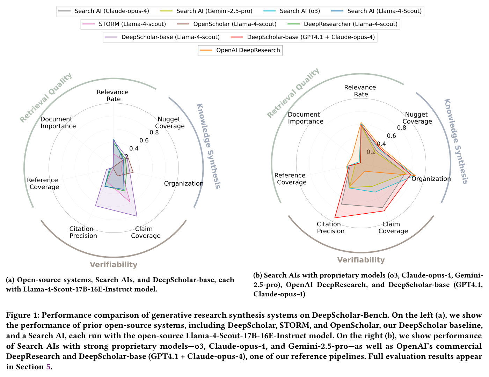
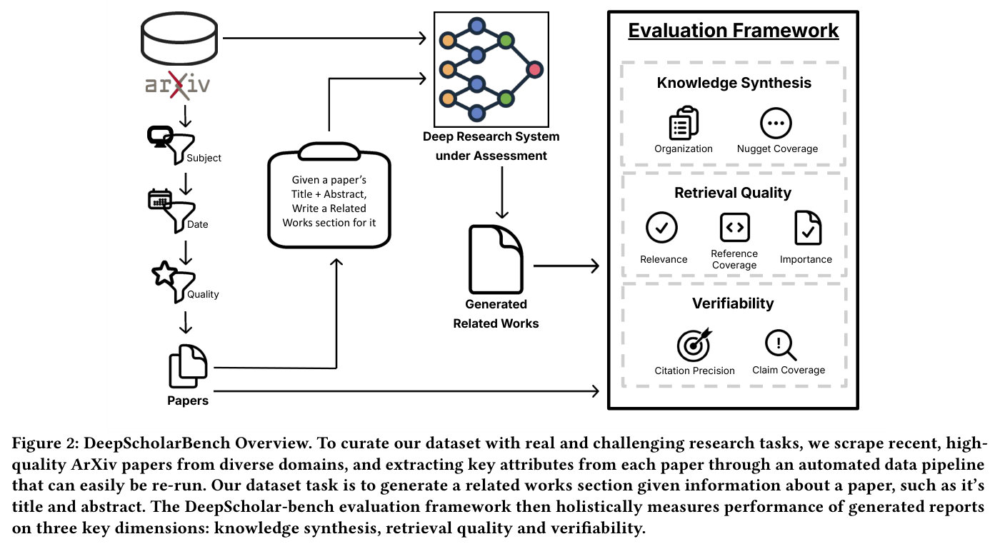
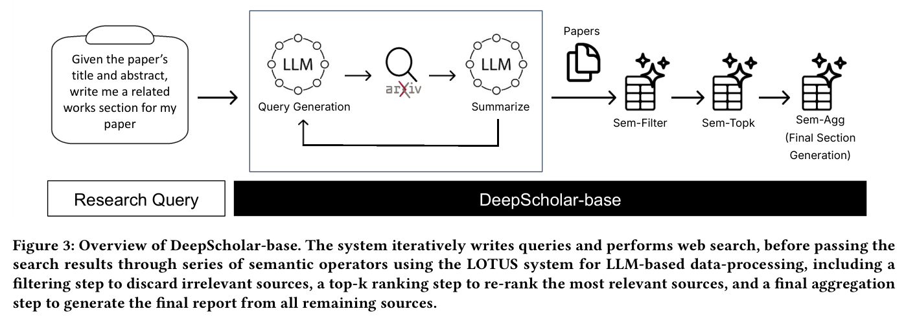

# DeepScholar-Bench: A Live Benchmark and Automated Evaluation for Generative Research Synthesis — main body

Full text of Patel et al. (2025), transcribed from the arXiv LaTeX source and reproduced under CC BY 4.0; copyright the authors. This is the **v1** text (27 August 2025), the version current on the lecture date (17 November 2025) and the version the lecture quotes; the later v2 (February 2026) renames DeepScholar-base to DeepScholar-ref and reports different results. Figures are crops of the published PDF, shown with the paper's own caption; this knowledge base adds no description of its own, so what a figure shows is what its caption and the paper's text say. Citations are resolved to author–year (the paper prints them as bracketed reference numbers), and the bibliography is omitted — follow the arXiv link for it; the paper's few no-author citations (product, model and dataset pages — OpenAI, Gemini, Claude, Grok, Perplexity, arXiv, OpenAlex, the LOTUS API, Llama-4 and the OpenAI model pages) are left as the names the prose already gives them. The appendix is not transcribed in this knowledge base; it is at the arXiv link above.

## Contents

| § | Heading | Figures | Tables |
|---|---|---|---|
| — | Abstract | | |
| 1 | Introduction | Figure 1 | Table 1 |
| 2 | The DeepScholar Dataset | Figure 2 | |
| 2.1 | Automated Data Collection Framework | | |
| 2.2 | Dataset Description and Statistics | | |
| 3 | The DeepScholar Evaluation Framework | Figure 3 | |
| 3.1 | Knowledge Synthesis | | |
| 3.2 | Retrieval Quality | | |
| 3.3 | Verifiability | | |
| 4 | DeepScholar-base | | |
| 5 | Experimental Results | | Tables 2, 3, 4, 5, 6 |
| 5.1 | Baselines | | |
| 5.2 | Main Results | | Tables 2, 3 |
| 5.3 | Understanding Opportunities for Improvement | | Tables 5, 6 |
| 5.4 | Human Agreement Study | | Table 4 |
| 6 | Related Work | | |
| 7 | Conclusion | | |

## Abstract

The ability to research and synthesize knowledge is central to human expertise and progress. An emerging class of systems promises these exciting capabilities through *generative research synthesis*, performing retrieval over the live web and synthesizing many discovered sources into long-form, cited summaries. However, evaluating such systems remains an open challenge: existing question-answering benchmarks focus on short-form factual responses, while expert-curated datasets risk staleness and data contamination. Both fail to capture the complexity and evolving nature of real research synthesis tasks.

In this work, we introduce DeepScholar-bench, a live benchmark and holistic, automated evaluation framework designed to evaluate generative research synthesis. DeepScholar-bench draws queries from recent, high-quality ArXiv papers and focuses on a real research synthesis task: generating the related work sections of a paper by retrieving, synthesizing, and citing prior research. We develop an automated evaluation framework that holistically assesses performance across three key dimensions, *knowledge synthesis*, *retrieval quality*, and *verifiability*, using metrics that show strong agreement with expert human judgments. We also develop DeepScholar-base, a reference pipeline for generative research synthesis, implemented efficiently using the LOTUS API. Using the DeepScholar-bench framework, we perform a systematic evaluation of prior open-source systems, search AI's with open-source and strong proprietary models, OpenAI's DeepResearch, and DeepScholar-base. We find that DeepScholar-base establishes a strong baseline, attaining competitive or higher performance than prior open-source systems, search AI's and OpenAI's DeepResearch. We also find that DeepScholar-bench remains far from saturated, with no system exceeding a score of $19$% across all metrics. These results underscore both the difficulty and the importance of DeepScholar-bench as a foundation for progress toward AI systems capable of generative research synthesis.

We make our benchmark code and data available at <https://github.com/guestrin-lab/deepscholar-bench>.

**Figure 1.** Performance comparison of generative research synthesis systems on DeepScholar-Bench. On the left (a), we show the performance of prior open-source systems, including DeepScholar, STORM, and OpenScholar, our DeepScholar baseline, and a Search AI, each run with the open-source Llama-4-Scout-17B-16E-Instruct model. On the right (b), we show performance of Search AIs with strong proprietary models—o3, Claude-opus-4, and Gemini-2.5-pro—as well as OpenAI's commercial DeepResearch and DeepScholar-base (GPT4.1 + Claude-opus-4), one of our reference pipelines. Full evaluation results appear in Section 5. (a) Open-source systems, Search AIs, and DeepScholar-base, each with Llama-4-Scout-17B-16E-Instruct model. (b) Search AIs with proprietary models (o3, Claude-opus-4, Gemini-2.5-pro), OpenAI DeepResearch, and DeepScholar-base (GPT4.1, Claude-opus-4)

## 1 Introduction

A crucial underpinning of human knowledge and innovation is the ability of human experts to *research and synthesize* known facts and new findings to support others in comprehending, verifying and building upon existing work. Recently, new systems designed for *generative research synthesis* offer exciting capabilities and promises to automate challenging research synthesis tasks, which often require laborious hours of literature search, reading, and writing from human experts. These systems include a wide array of both commercial DeepResearch offerings, including ones from OpenAI, Gemini, Anthropic, Grok, and Perplexity, as well as open-source methods, such as STORM (Shao et al., 2024), DeepResearcher (Zheng et al., 2025), and OpenScholar (Asai et al., 2024). These systems push the frontier of AI capabilities, demonstrating promising performance on existing factuality and question-answering benchmarks (Wei et al., 2024; Krishna et al., 2025; Mialon et al., 2023; Wei et al., 2025).

Yet, as this new class of systems emerges, a key question remains: *how should we benchmark and evaluate generative research synthesis?* The progress of these systems requires benchmarks that carefully evaluate their critical capabilities. Specifically, these systems provide three core functions: (1) *retrieval*, typically from a large, complex, and constantly-evolving corpus, such as the live web, to collect key information (2) *knowledge synthesis*, to generate coherent long-form answers that surface key facts, integrating general knowledge and findings from many retrieved sources, and (3) *verifiability*, providing citations that allow readers to trace each stated claim in the synthesized answer to a reputable source from the retrieved set. The ideal benchmark must holistically evaluate across all three of these dimensions, while providing a realistic and challenging research synthesis task, which the community can reliably and repeatedly benchmark on over time.

Unfortunately, existing benchmarks fall-short of these goals. Many prior works evaluate generative research synthesis systems using existing question answering benchmarks (Wei et al., 2025; Wei et al., 2024; Mialon et al., 2023; Krishna et al., 2025; Wu et al., 2025; Wadden et al., 2020; Jin et al., 2019; Yang et al., 2018; Joshi et al., 2017; Kwiatkowski et al., 2019; Ho et al., 2020; Trivedi et al., 2022; Lee et al., 2023), which do not reflect realistic research synthesis tasks and instead focus on questions with short-form, easily-verifiable answers, making them severely limited for this setting. These question-answering benchmarks do not capture the complexity of long-form answers synthesized from many sources, a key component of research synthesis. To address this limitation, several recent works (Asai et al., 2024; Zheng et al., 2024; DeepConsult, n.d.) instead leverage expert-curated datasets with open-ended research questions and exemplar answers. Unfortunately, these benchmarks quickly become stale and outdated as new information emerges. Furthermore, these datasets risk data contamination as new models are trained on snapshots of the web, including public datasets. The prohibitive expense of curating, maintaining, and updating expert-curated benchmarks further limits their utility towards realistic, scalable evaluation.

To address this gap, we introduce DeepScholar-Bench, a live benchmark dataset and holistic evaluation framework tailored to tracking progress on generative research synthesis, as well as DeepScholar-Base, a reference method, which we hope will further future research. Our benchmark provides a live dataset with *real* research synthesis tasks, as well as a holistic, automated evaluation strategy. We design our benchmark dataset based on a fundamental research synthesis task reflected in thousands of research papers each year, where peer-reviewed manuscripts must concisely summarize existing work within a subfield, detailing and citing key prior works, before discussing new contributions.

Specifically, the DeepScholar-bench task requires a system to generate a related work section for a given academic paper by retrieving sources from the Web and summarizing key prior work within a field of study. This task allows us to assess the key capabilities of research synthesis while ensuring that our evaluation reflects real, high-quality research. To source realistic and challenging queries, we develop an automated data pipeline that curates high-quality, recent ArXiv papers across diverse scientific domains. We plan to continuously re-run our data pipeline to provide an evolving dataset of live queries.

To assess performance on DeepScholar-bench, we develop an automated evaluation framework, which holistically measures the performance of system answers across the three key dimensions: knowledge synthesis, retrieval quality and verifiability. Evaluating the accuracy of our long-form synthesis task is inherently difficult since each query admits many possible answers, lacking a straightforward notion of correctness. Moreover, developing an automated evaluation requires reliable metrics that exhibit high agreement with expert human annotators, another significant challenge. To address these challenges, our holistic evaluation assesses each system response across seven key metrics (Table 1), which permit many possible correct answers, often leveraging human-written exemplars from our dataset.

Specifically, on the knowledge synthesis dimension, we evaluate a generated answer's Organization, using pairwise comparisons to human exemplars, and Nugget Coverage, assessing the efficiency of the generated response in capturing key information and facts. To assess retrieval quality, we measure the Relevance Rate of retrieved sources, the Document Importance of sources, according to citation counts of each reference, and Reference Coverage, by assessing the generated report's coverage of notable important references recovered from the human-written exemplar. To assess the Verifiability of each report, we measure its Citation Precision, whether each citation supports the given claim, and Citation Coverage, measuring whether each claim is fully supported by the cited sources.

Our human agreement study validates that these automated metrics are effective, demonstrating strong agreement between our model-based judges and expert human annotators.

**Table 1.** Summary of Evaluation Metrics.

| Metric | Description |
|---|---|
| *Knowledge Synthesis* | |
| Organization | assesses organization and coherence of system answer |
| Nugget Coverage | assesses the answer's coverage of essential facts |
| *Retrieval Quality* | |
| Relevance Rate | measures avg. relevance among all referenced sources |
| Document Importance | measures how notable referenced sources are, using citation counts |
| Reference Coverage | assesses the referenced set's coverage of key, important references |
| *Verifiability* | |
| Citation Precision | measures percent of cited sources that support their accompanying claim |
| Claim Coverage | measures percent of claims that are fully supported by cited sources |

*The italic rows are dimension labels spanning both columns in the original.*

Using the DeepScholar-bench framework, we systematically evaluate the performance of existing systems, including open-source research synthesis systems, search AI's with strong proprietary models, OpenAI DeepResearch, and DeepScholar-base. Figure 1 demonstrates that all of these existing methods exhibit significant opportunity for improvement, with no baseline exceeding a score of $.19$ across all metrics. Furthermore, on several key metrics, including Nugget Coverage, Reference Coverage and Document Importance, each evaluated method's performance remains well below $.45$, reflecting the inherent difficulty of the DeepScholar-bench task, which requires systems to navigate the live web, reasoning about the relevance and importance of documents as well as surfacing key facts into a concise final answer. Notably, OpenAI's DeepResearch offers strong performance relative to other baselines, outperforming many prior methods on knowledge synthesis and retrieval quality, with scores of $.392$ on Nugget Coverage, $.187$ on Reference Coverage and $.124$ on Document Importance; however, it struggles to provide strong verifiability relative to many other methods. We also find that DeepScholar-base, a relatively simple reference pipeline implemented efficiently using the LOTUS API (Patel et al., 2025), consistently improves upon performance of prior open-source systems and search AI's, as shown in Figure 1a, as well as achieving competitive performance and up to $6.3\times$ higher verifiability compared to OpenAI's DeepResearch, as shown in Figure 1b. Nevertheless, DeepScholar-bench remains far from saturated, representing exciting opportunities for further work. We hope that our benchmark framework and reference pipeline support the progress of new systems, and we believe that resolving DeepScholar-bench represents a critical milestone towards more capable AI systems.

Overall, our main contributions are the following:

- We propose DeepScholar-bench, a live benchmark dataset with real research synthesis tasks and an automated evaluation that holistically assesses performance across three key dimensions: knowledge synthesis, retrieval quality, and verifiability. Our analysis demonstrates that our DeepScholar-bench evaluation metrics are robust, exhibiting strong human agreement scores.
- We develop DeepScholar-base, a reference pipeline for generative research synthesis, providing a strong baseline with competitive or higher performance compared to prior open-source systems, search AI's, and OpenAI's DeepResearch.
- We perform a systematic evaluation of existing baselines on DeepScholar-bench, including open-source systems, search AI's, OpenAI's DeepResearch, and DeepScholar-base. We find that DeepScholar-bench is far from saturated, demonstrating significant opportunity for improvement, with no baseline achieving a score greater than $.19$ across all metrics.

## 2 The DeepScholar Dataset

**Figure 2.** DeepScholarBench Overview. To curate our dataset with real and challenging research tasks, we scrape recent, high-quality ArXiv papers from diverse domains, and extracting key attributes from each paper through an automated data pipeline that can easily be re-run. Our dataset task is to generate a related works section given information about a paper, such as it's title and abstract. The DeepScholar-bench evaluation framework then holistically measures performance of generated reports on three key dimensions: knowledge synthesis, retrieval quality and verifiability.

We study the task of generating a related works section of an academic paper, a fundamental research synthesis task. We choose this task for two key reasons. First, this task is a *real* research task performed by academic experts, allowing our benchmark to reflect realistic, difficult and useful queries. Second, the online availability of diverse, high-quality academic papers allows us to develop an *automated* dataset construction pipeline that we can continuously run to obtain new queries over time.

We construct our dataset by scraping papers from ArXiv, which continuously posts thousands of new pre-print papers across a wide array of scientific domains each week. We formalize our dataset task as follows: given a description, $d$ of a paper, the goal is to retrieve a set of relevant sources, $S$, and generate a related works sections, $W$, for the paper by synthesizing and citing the retrieved documents. We briefly overview our automated data collection framework (Section 2.1) and describe the dataset instantiation (Section 2.2) used in our evaluation (Section 5).

### 2.1 Automated Data Collection Framework

Our automated data collection framework aims to achieve the following design goals:

1. Inclusion of *diverse* paper topics across a wide variety of research domains.
2. Focus on *recent* research papers, both to provide realistic, timely benchmark queries and to control data contamination when benchmarking models trained on snapshots of the web.
3. Control for *quality* of the scraped ArXiv papers and extracted data

Figure 2 provides an overview of our dataset pipeline, which collects and extracts metadata about each paper (e.g., the title, abstract, and ArXiv link), the paper's related works section, and information on each citation from the paper's related works section. Our data collection pipeline extracts this information by scraping and selectively filtering ArXiv papers according to a number of configured settings.

Specifically, the pipeline loads papers from a list of configured ArXiv domain categories (e.g., cs.ML) and filters paper according to the configured publication-date range. To avoid possible data contamination arising from multiple ArXiv versions, some of which may have been released prior to the configured publication-date range, we exclusively include v1 ArXiv papers. To control for paper quality, our pipeline optionally provides a configuration setting which filter's out papers which are not listed as "accepted" or "published" at a conference within the paper's comment metadata, which often lists updates to the paper's status. We also disclude papers that do not have an explicit "Related Works" section and .bib file, containing well-formatted bibliography entries. For each paper, we then extract the Related Works section, from both the LaTex files, and PDF file, if available. We clean the extracted LaTex section to remove figures, sub-figures, labels and comments. We also extract all citations found in the related work section from the LaTex .bib file. For each citation we use the ArXiv API and the OpenAlex API to recover more detailed information, such as abstracts, authors, and links for ArXiv and non-ArXiv references respectively.

### 2.2 Dataset Description and Statistics

We now briefly summarize the dataset we use in our evaluation in Section 5 which represents an instantiation of our automated data collection pipeline. Our datasets take ArXiv papers with a publication date between April and June, following the April 5th, 2025 release date of the Llama-4 models, the main open-source model we benchmark in our evaluation. Our dataset consist of papers scraped from a diverse set of 18 disticnt ArXiv domains, including, cs.AI, cs.CV, cs.DB, cs.LG, cs.AR, cs.CG, cs.DC, cs.DS, cs.IR. To control for quality, we filter out papers not accepted at a conference, and we additionally exclude papers with related works sections longer than 1,000 words.

Our final dataset instantiation includes 63 ArXiv papers, each providing a single query and expert-written exemplar for our benchmark. We make our scripts available to allow others to configure different datasets, and we plan to update our dataset to provide a continual evaluation with recent queries. Our experiments leverage the abstract of each paper as the paper's description $d$, provided to each baseline system as context within the query.

We analyze the human-written exemplars from our dataset, and we find that, on average, each related work section contains $23$ unique references, and we find over $63$% of all cited references on ArXiv.

## 3 The DeepScholar Evaluation Framework

Evaluating research synthesis systems is challenging due to the complexity of the task and the variability of possible correct answers. Research synthesis systems generate complex, long-form reports, which are difficult to evaluate and lack a notion of "ground truth" correctness. The task we consider departs significantly from traditional question answering and RAG-based evaluations (Joshi et al., 2017; Lee et al., 2023; Jin et al., 2019; Kwiatkowski et al., 2019; Trivedi et al., 2022; Yang et al., 2018; Ho et al., 2020), requiring a carefully designed and holistic evaluation framework. An exemplar research report must retrieve important relevant sources, synthesize an informative and well-organized answer, and provide appropriate references allowing readers to verify and re-trace facts. Our holistic evaluation framework thus analyzes three key dimensions, providing an automated, scalable approach for each: *knowledge synthesis* (Section 3.1), *retrieval quality* (Section 3.2), and *verifiability* (Section 3.3). While our experiments in Section 5 evaluate one specific task, our evaluation framework may extend to a wide range of research synthesis tasks (Shao et al., 2024; DeepConsult, n.d.; Zheng et al., 2024; Asai et al., 2024), which exhibit similar properties and challenges. We provide an overview of our evaluation framework in this section and further details and analysis in Appendix Section 8.4.

### 3.1 Knowledge Synthesis

We evaluate both the information content surfaced in each synthesized report and the overall organization and coherence of the report.

***Organization and Coherency.*** Our automatic evaluation adopts an LLM-as-a-judge approach to assess the organization and coherence of each system answer. We use preference-based pairwise comparisons, where the LLM-judge is presented with the details of the criteria to judge, the human-written exemplar, and a generated report and is asked to mark which is better. To avoid position bias (Li et al., 2025), we evaluate each pair twice, permuting their positions. This model-based evaluation provides scalability while also serving as a strong surrogate for human preferences (Rahmani et al., 2024; Li et al., 2024; Li et al., 2025; Arabzadeh and Clarke, 2025), which we validate in our experiments in Section 5. We report the win-rate of each system using the prompt shown in Box 7 in the Appendix.

***Nugget Coverage.*** To assess the quality of the information content presented by a generated report, we use a nugget-based evaluation. An *information nugget* (Pradeep et al., 2025; Upadhyay et al., 2024b; Faggioli et al., 2023; Rahmani et al., 2024b; Upadhyay et al., 2024a) is an essential fact or components relevant for an answer. The process of *nuggetization* involves decomposing information-dense text into essential components, which aid in evaluation. For our task, we generate nuggets from the human-written exemplar related-work section for each query, following the automated, LLM-based methodology of Pradeep et al. (2025). In section 5 we validate that the model-based approach has strong agreement with expert annotations when labeling nuggets. For, each report, we compute the nugget coverage score, the fraction of nuggets that are present in each system answer.

**Figure 3.** Overview of DeepScholar-base. The system iteratively writes queries and performs web search, before passing the search results through series of semantic operators using the LOTUS system for LLM-based data-processing, including a filtering step to discard irrelevant sources, a top-k ranking step to re-rank the most relevant sources, and a final aggregation step to generate the final report from all remaining sources.

### 3.2 Retrieval Quality

While traditional information retrieval (IR) evaluations typically leverage gold labels for document relevance scores and a controlled corpus (Thakur et al., 2021; TREC, n.d.; Nanni et al., 2017), the research synthesis task we study in this work differs substantially. An expert-written report section and its sources provide *one* reasonable retrieved set, but there may be many possible alternative sets that are likewise high-quality. Moreover, live web search is a key component of research synthesis tasks and obtaining gold relevance labels over this corpus is prohibitively expensive. To address these challenges, our evaluation measures three components of the retrieved set: the relevance rate, reference coverage of key sources, and document importance.

***Relevance Rate.*** We asses the relevance of each retrieved document, following the Cranfield model (Voorhees, 2009), which is standard in IR evaluations and considers relevance of individual documents given a query, independent of other documents. Due to the significant cost of obtaining human-annotated relevance judgments, recent works (Upadhyay et al., 2024b; Faggioli et al., 2023; Rahmani et al., 2024; Thomas et al., 2024; Asai et al., 2024) study leveraging an LLM-as-a-judge for relevance judgment task, demonstrating their effectiveness on traditional IR datasets. Building on these works, we adopt an LLM-based approach for assigning graded relevance scores from 0 to 2 to each generated research report using the prompt in Box 8 in Appendix. For each retrieved set, $S$, for a given query, we compute the average document relevance over the set, following the below formula:

$$RR(S) = \frac{1}{2|S|}\sum_{s\in S} Rel(s)$$

where $Rel(s)$ is the graded relevance score of source $s$. We validate the agreement between LLMs and human annotators for this task in our experiments in Section 5.

***Reference Coverage.*** We introduce a metric to measure the *reference coverage* of the retrieved set for each report. A key challenge in measuring this value is in defining a set of important references for each generated report, that a good research report should cite. To build this set, we take all references from the high-quality, human-written exemplar and label each as either "important" or "not-important", considering a "not-important" reference as one that could be omitted or substituted by a different reference. We find that a LLM-based judge is effective in assigning these labels. For a given report, we then compute its reference coverage by taking the ratio of the number of important references in the system-generated report to the number of important references in the human-written exemplar, following the below formula, where $E$ is the set of "important" references from the human-written exemplar:

$$RC(S, E) = \frac{1}{|E|} \sum_{s\in S} I[s \in E].$$

***Document Importance.*** While the above relevance and coverage metrics assess *topical* matches between the retrieved set and the user query, an ideal research synthesis system must also retrieve *notable and important* sources. Exemplar human-written reports typically contain ample references of primary-sources and highly-cited academic publications. While the ideal notion of *document importance* depends on the particular task and user, in our task, we adopt the following metric by considering the number of citations that each reference retrieved by the system has. We consider the median number of citations per reference over the set of all retrieved sources, $S$, provided by a given baseline. We compute document importance as the ratio of this value for the given baseline compared to the median citations per reference over the set of sources, $S^\ast$ provided by the human-written exemplars, following the formula below:

$$DI(S, S^\ast) = \min\Biggl(\mskip{5mu}\frac{\operatorname{median} \bigl\lbrace \operatorname{num-cites}(x) \mid x\in S\bigr\rbrace}{\operatorname{median} \bigl\lbrace \operatorname{num-cites}(x^\ast) \mid x^\ast\in S^\ast\bigr\rbrace},\mskip{5mu}1\mskip{5mu}\Biggr),$$

where $\operatorname{num-cites}(x)$ is the number of citations for source $x$. We set an upper-bound of one, although in practice, we find this ratio to remains far below one for all measured generative research synthesis systems.

### 3.3 Verifiability

To evaluate the verifiability of the generated report given the retrieved set, we calculate the citation precision and claim coverage based on the definitions provided by prior work (Gao et al., 2023; Worledge et al., 2024; Liu et al., 2023).

***Citation Precision.*** Specifically, we measure sentence-level precision, where a citation is considered precise if the referenced source supports at least one claim made in the accompanying sentence. For a full report, citation precision is computed by averaging the precision of each citation in the report.

***Claim Coverage.*** Claim coverage assigns a sentence-level score, assigning a value of one if the cited sources accompanying the sentence supports all claims made in the sentence. We make two adaptations to the original claim coverage definition posed in prior work (Gao et al., 2023; Worledge et al., 2024; Liu et al., 2023) for our long-form synthesis task. First, we relax the original claim coverage definition to consider a sliding window of sentences with supporting references, assigning a coverage value of 1 to each sentence that is either fully supported by the sources cited within the sentence or any cited source that is in a window of $w$ preceding or following sentences. Additionally, since our task query provides context describing a paper, we consider this context as an implicitly cited reference for each sentence and compute claim coverage for each sentence by considering the explicitly cited sources, and the context provided by the query. We compute the citation coverage for the full report by averaging the value computed for each sentence. Our model-based evaluation uses an LLM judge to assess each entailment relation, following prior work (Gao et al., 2023; Liu et al., 2023). We provide further details and the prompt in the Appendix Section 8.4 and Box 9 respectively.

## 4 DeepScholar-base

We introduce DeepScholar-base, an open-source reference pipeline designed to perform generative research synthesis. Figure 3 provides an overview of our method. Given a user's query, DeepScholar-base iteratively generates web-search queries, summarizes the search results in each round before generating a new query. The system then post-processes the search results leveraging a series of semantic operators (Patel et al., 2025), which we implement efficiently using the LOTUS API. This includes a semantic filtering step, which leverages an LLM to filter out irrelevant source documents, followed by a semantic top-k which performs an LLM-based ranking over the documents based on their relevance to the user query. Finally, we perform a semantic aggregation over the final source documents to generate the final report. We provide further details of each step of our reference pipeline in Appendix Section 8.3.

## 5 Experimental Results

In this section, we evaluate recent state-of-the-art generative research systems as well as DeepScholar-base on DeepScholar-bench. Overall, we find the following:

- Existing baselines for generative research synthesis, including strong open-source LLM systems, search AI's, and commercial systems, demonstrate significant room for improvement across all three key dimensions: knowledge synthesis, retrieval quality and verifiability, with no method exceeding a score of $19$% across all metrics.
- DeepScholar-base provides a strong baseline for generative research synthesis, consistently improving upon the performance of prior open-source systems and search AI's, as well as achieving competitive performance and up to $6.3\times$ higher verifiability compared to OpenAI's DeepResearch.
- Our automated evaluation approach is effective, demonstrating high agreement with over 200 human annotations.

***Experimental Setup.*** For each benchmarked method, we control the retrieval corpus by allowing each system to access the Web only through the ArXiv API. We additionally avoid possible information leakage during search by filtering out any search results that were published after the query paper's publication date. We report results using GPT-4.1-2025-04-14 as the judge for Nugget Coverage, and a GPT-4o-2024-08-06 judge for Organization, Relevance Rate, Reference Coverage, Citation Precision and Claim Coverage. We report the Organization score as a win rate including ties, we report the strict all score for Nugget Coverage, and we report Claim Coverage with a window size of $w=1$. For all Retrieval Quality metrics, we consider the retrieved set of each given report as the set of any valid ArXiv links found within the report. To measure Document Importance, we use the OpenAlex API to recover citation information. For each metric, we report an average over all reports.

### 5.1 Baselines

We briefly overview all of the baseline systems we evaluate, and we provide further details in the Appendix Section 8.2.

#### 5.1.1 Open-source Research Systems

We evaluate three state-of-the-art open-source systems, DeepResearcher (Zheng et al., 2025), STORM (Shao et al., 2024) and OpenScholar (Asai et al., 2024). For each, we run these systems using the Llama-4-Scout-17B-16E-Instruct model, which we serve with 4 A100 GPUs using vLLM (Kwon et al., 2023).

**DeepResearcher** (Zheng et al., 2025) leverages trained agents to navigate, browse and synthesize information from the web. To train an agent, this work uses end-to-end reinforcement learning and trains Qwen2.5-7B-Instruct (Qwen et al., 2025). In our benchmarks, we evaluate DeepResearcher using both the released, trained model from the authors, and using Llama-4-Scout-17B-16E-Instruct model as the core LLM. We report the better performing baseline of these two, which we find in our experiments to be the Llama-4-Scout-17B-16E-Instruct backbone.

**STORM** (Shao et al., 2024) studies the problem of how to apply LLMs to write grounded, organized long-form articles (e.g., Wikipedia articles) from scratch. The system involves a pre-writing stage that discovers diverse research perspectives on a topic by stimulating conversations between multiple agents and leveraging web documents.

**OpenScholar** (Asai et al., 2024) builds a specialized retrieval-augmented LLM system for literature synthesis and scientific queries. This method includes a trained retriever from the pre-indexed peS2o (Soldaini et al., 2024) corpus, consisting of 45 million open-access academic papers up until October 2024, as an initial retrieval source before using web search. In our experiments, we benchmark the system using this pre-indexed corpus and limit web search to the ArXiv API.

#### 5.1.2 Search AI's

We evaluate the following models: Llama-4-Scout-17B-16E-Instruct, GPT-4.1-2025-04-14, o3-2025-04-16, Claude-opus-4-20250514, and Gemini-2.5-pro. We augment each with search capabilities to ArXiv, and use the popular ODS framework (Alzubi et al., 2025) to allow the LLM to make tool calls to the search API.

#### 5.1.3 Commercial Systems.

We focus our evalution of commercial generative research synthesis systems on OpenAI's o3-deep-research, which provides a public API allowing for our evaluation.

#### 5.1.4 DeepScholar-base

Similar to our evaluation of search AI's we evaluate DeepScholar-base with the following models: Llama-4-Scout-17B-16E-Instruct, GPT-4.1-2025-04-14, o3-2025-04-16, Claude-opus-4-20250514, and Gemini-2.5-pro. For each of these baselines, we also use the same or a weaker model, either Llama-4 or GPT-4.1, to perform semantic filtering and top-k operators. We limit the method to two round of search, each with at most 2 queries.

### 5.2 Main Results

Table 2 provides detailed summary of each method's performance scores on all metrics across three key dimensions, knowledge synthesis, retrieval quality and verifiability. We also provide metadata statistics characterizing the generated reports of each benchmarked method in Table 5, as well as statistics related to our evaluation metrics in Table 6. Overall, our evaluation demonstrates two key findings, which we discuss in detail below: first, existing generative research synthesis systems demonstrate significant headway for improvement, and second, DeepScholar-base provides a strong baseline for generative research synthesis.

**Table 2.** Main Results.

| System | Org. | Nug. Cov. | Rel. Rate | Ref Cov. | Doc Imp. | Cite-P | Claim Cov ($w=1$) |
|---|---|---|---|---|---|---|---|
| *Human-written Exemplars* | | | | | | | |
| Human-written Exemplars | .500 | 1.000 | .585 | 1.000 | 1.000 | .278[^1] | .205[^1] |
| *Open Source Research Systems* | | | | | | | |
| DeepResearcher (Llama-4) | .206 | .230 | .385 | .047 | .008 | .312 | .396 |
| STORM (Llama-4) | .119 | .183 | .218 | .003 | .006 | .238 | .586 |
| OpenScholar (Llama-4) | .309 | .278 | .017 | .008 | .013 | .010 | .138 |
| *Search AI's* | | | | | | | |
| Search AI (Llama-4-Scout) | .151 | .193 | .445 | .060 | .009 | .316 | .368 |
| Search AI (GPT-4.1) | .556 | .265 | .490 | .050 | .009 | .498 | .470 |
| Search AI (o3) | .849 | .348 | .610 | .165 | .026 | .425 | .495 |
| Search AI (Claude) | .698 | .307 | .583 | .131 | .008 | .701 | .760 |
| Search AI (Gemini) | .706 | .277 | .583 | .061 | .010 | .415 | .398 |
| *Commercial Systems* | | | | | | | |
| OpenAI DeepResearch | .857 | .392 | .629 | .187 | .124 | .399 | .138 |
| *DeepScholar Baseline* | | | | | | | |
| DeepScholar-base (Llama-4) | .254 | .262 | .421 | .103 | .008 | .648 | .826 |
| DeepScholar-base (GPT-4.1) | .825 | .407 | .608 | .162 | .007 | .652 | .636 |
| DeepScholar-base (GPT-4.1, o3) | .857 | .405 | .659 | .162 | .008 | .617 | .614 |
| DeepScholar-base (GPT-4.1, Claude) | .786 | .370 | .586 | .167 | .007 | .936 | .817 |
| DeepScholar-base (GPT-4.1, Gemini) | .762 | .332 | .602 | .181 | .006 | .851 | .865 |

*Group-label rows span all columns in the original, and the metric columns are grouped under Knowledge Synthesis (Org., Nug. Cov.), Retrieval Quality (Rel. Rate, Ref Cov., Doc Imp.) and Verifiability (Cite-P, Claim Cov).*

[^1]: The verifiability metrics we use in our evaluation likely significantly under-estimate the actual verifiability of human writing. This is because the metrics we measure, Citation Precision and Claim Coverage, require us to verify entailment relations between claims, within the report, and snippets from the cited reference. For each LLM-based system, we are able to track the precise snippet and context from each cited source, which are directly fed as context to the LLM as it generates the report with citations. On the other hand, for the human-written exemplars, we lack gold labels pointing to the precise snippet of text that each reference refers to. Our measurements for the human-written exemplars instead rely on the title and abstract of each cited source when testing for entailment relations.

#### 5.2.1 Generative Research Synthesis Systems Demonstrate Large Room for Improvement.

From Table 2, we see that no method is able to achieve a score greater than $.19$ across all metrics. Moreover, on several key metrics, including nugget coverage, reference coverage and document importance, each evaluated method's performance remains well below $.45$. This reflects the inherent difficulty of the generative research task provided by DeepScholar-bench, which requires systems to navigate the live web, reasoning about relevance and importance of documents to perform retrieve sources and then surface key information into a coherent report that answers the query.

We now analyze each evaluated dimension, comparing performance of the open-source research systems, search AI's and commercial systems to the human-written exemplars. On knowledge synthesis, we see that OpenAI DeepResearch offers the best performance compared to all other prior methods on both Organization, with a score of $.857$, and Nugget Coverage, with a score of $.392$. OpenAI DeepResearch, as well as the o3, Claude and Gemini search AI's achieve relatively high Organization scores compared to human-written exemplars. However, on Nugget Coverage all prior methods scores below $.40$. This demonstrates that while existing systems, especially those using state-of-the-art models, can generate well-organized and coherent summaries, they still struggle to extract and surface key facts, a crucial capability for synthesis tasks.

Turning our attention to the retrieval quality performance of prior methods, we once again find significant room for improvement. Once again, OpenAI DeepResearch offers the strongest performance among the other benchmarked prior methods on Relevance Rate, Reference Coverage and Document Importance, but still far from saturates performance. While it's Relevance Rate shows strong performance, exceeding that of the human exemplars with a score of $.629$, it's Reference Coverage and Document Importance scores remain exceedingly low: $.187$ and $.124$ respectively. This demonstrates that while state-of-the-art generative research synthesis systems are capable of retrieving relevant sources, they still struggle to find a comprehensive set of notable sources and fall short compared to the ability of human experts.

Lastly, we analyze the verifiability performance of prior methods, we see that OpenAI DeepResearch is outperformed on both Citation Precision and Claim Coverage by the search AI's with GPT4.1, o3, Claude and Gemini models. The Claude search AI offers the highest Citation Precision, a score of $.701$ and Claim Coverage, a score of $.760$. Meanwhile, OpenAI's DeepResearch as well as the all other prior methods are unable to achieve a Citation Precision score beyond $.5$ and a Claim Coverage score beyond $.6$. We also note that the human-written exemplars appear to exhibit rather low Citation Precision and Claim Coverage scores, however these scores are not comparable to the metric measured for the LLM-based systems since our method for measuring verifiability metrics likely under-estimate the actual verifiability of human writing[^1]. Overall, we see that prior LLM-based systems exhibit significant headroom for improvement.

**Table 3.** Ablation Study Comparing The Effect of Different Retrieval APIs.

| System | Org | Nug. Cov. | Rel. Rate | Ref Cov. | Doc Imp. | Cite-P | Claim Cov ($w=1$) |
|---|---|---|---|---|---|---|---|
| *DeepScholar-base (GPT-4.1, Claude)* | | | | | | | |
| arxiv.org Retrieval | .786 | .370 | .586 | .167 | .007 | .936 | .817 |
| parallel.ai Retrieval | .865 | .444 | .675 | .160 | .017 | .846 | .781 |
| taviliy.com Retrieval | .929 | .327 | .550 | .070 | .015 | .711 | .578 |
| Oracle Retrieval (arxiv.org) | .782 | .487 | .686 | 1.000 | 1.000 | .955 | .899 |
| Oracle Retrieval (All) | .778 | .528 | .680 | 1.000 | .822 | .941 | .828 |
| *DeepScholar-base (Llama-4)* | | | | | | | |
| arxiv.org Retrieval | .254 | .262 | .421 | .103 | .008 | .648 | .826 |
| parallel.ai Retrieval | .246 | .265 | .559 | .114 | .015 | .223 | .543 |
| taviliy.com Retrieval | .111 | .229 | .532 | .030 | .016 | .442 | .676 |
| Oracle Retrieval (arxiv.org) | .202 | .316 | .681 | 1.000 | 1.000 | .658 | .868 |
| Oracle Retrieval (All) | .198 | .350 | .693 | 1.000 | .822 | .796 | .890 |

*The first column's group labels span all columns in the original.*

**Table 4.** Human Agreement Evaluation.

| Evaluation Metric | LLM-Classified Labels | Human-Agreement Score with LLM |
|---|---|---|
| Organization | Pairwise Comparison (Lose / Tie / Win) | 78% |
| Nugget Coverage | Nugget Importance (Vital / Non-vital) | 72% |
| Retrieval Relevance Score | Graded Relevance (0/1/2) | 70% |
| Reference Coverage | Reference Importance (Not Imp./ Imp.) | 82% |

#### 5.2.2 DeepScholar-base Provides a Strong Baseline for Generative Research Synthesis.

We compare the performance of DeepScholar-base to the commercial OpenAI DeepResearch system, search AI's and open-source research systems, finding that DeepScholar-base provides competitive performance against each group of prior methods, offering a strong baseline for generative research synthesis.

First, we see that DeepScholar-base (GPT-4.1, o3) is competitive with OpenAI DeepResearch, achieving a similar or higher Organization, Nugget Coverage, Relevance Rate, Reference Coverage, Citation Precision and Claim Coverage scores. Notably, DeepScholar-base offers significantly higher verifiability than OpenAI DeepResearch, with $1.5 - 2.3\times$ higher Citation Precision and $4.4 - 6.3\times$ higher Claim Coverage. However, DeepScholar-base's document importance scores still remain especially low compared to OpenAI DeepResearch, representing significant room for improvement.

Next, we compare the performance of DeepScholar-base to the search-AI's, finding that for each evaluated model, DeepScholar-base consistently offers improved performance compared to the corresponding search AI. Specifically, averaged across all 5 baselines with different models for the Search AI's and DeepScholar-base method, DeepScholar-base offers $1.28\times$ higher Organization, $1.29\times$ higher Nugget Coverage, $1.06\times$ higher Relevance Rate, $2.03\times$ higher Reference Coverage $1.64\times$ higher Citation Precision, $1.62\times$ higher Citation Recall.

Lastly, we compare DeepScholar-base (Llama-4) to the open-source research systems, all run with the Llama-4 model as well. We see that the prior open-source research systems exhibit trade-offs among the Knowledge Synthesis, Retrieval Quality and Verifiability dimensions. Specifically, OpenScholar achieves the highest Knowledge Synthesis scores, on both Organization and Nugget Coverage, DeepResearcher achieves the highest Relevance Rate and Reference Coverage on Retrieval Quality, with all systems attaining only very low Document Importance scores, and on Verifiability, DeepResearcher offers the highest Citation-Precision while STORM offers the highest Claim Coverage. In comparison, DeepScholar-base offers strong performance across each dimension. Specifically, Compared to the best-performing prior open-source methods for each metric, DeepScholar-base offers competitive Knowledge Synthesis performance, $1.09\times$ higher Relevance Rates and $2.18\times$ higher Reference Coverage for retrieval, and $2.08\times$ higher Citation Precision and $1.41\times$ higher Claim Coverage scores for verifiability.

Overall, the strong *relative* performance of DeepScholar-base likely reflects the efficiency of the data-processing semantic operators (Patel et al., 2025) that DeepScholar-base uses to perform LLM-based filtering, ranking and summarization of sources to generate its report. Notably, DeepScholar-base still demonstrates significant room for improvement and far from saturates DeepScholar-Bench, especially on key Knowledge Synthesis and Retrieval Quality metrics, including Nugget Coverage, Reference Coverage, Document Importance, which represent opportunities for future work.

### 5.3 Understanding Opportunities for Improvement.

In order to further analyze performance and existing opportunities for improvement, we conduct an ablation study, where we consider different retrievers as well as two oracle retriever settings. Table 3 shows these results for two evaluated DeepScholar-base methods, DeepScholar-base (GPT-4.1, Claude) and DeepScholar-base (Llama-4). The table show the performance of either using three different retrieval APIs, including arxiv.org, the default used in our main results, parallel.ai and tavily.com. In addition the table shows to oracle settings for either DeepScholar-base method: the Oracle Retrieval (arxiv.org) setting, provides the system with the ArXiv references from the human-written exemplars labeled as "Important" following our methodology for evaluating Reference Coverage. The Oracle Retrieval (All) setting, provides the system with *any* from the human-written exemplars labeled as "Important" following the same methodology, including both references form ArXiv and once that are found elsewhere.

**Table 5.** Report Statistics.

| System | Chars | Words | Sentences | # Unique Refs | # Inline Citations |
|---|---|---|---|---|---|
| *Human-written Exemplars* | | | | | |
| Human-written Exemplars | 4381 | 497 | 28 | 23 | 27 |
| *Open Source Research Systems* | | | | | |
| DeepResearcher (Llama-4) | 2573 | 319 | 35 | 8 | 7 |
| STORM (Llama-4) | 2766 | 381 | 31 | 18 | 21 |
| OpenScholar (Llama-4) | 3513 | 483 | 26 | 9 | 19 |
| *Search AI's* | | | | | |
| Search AI (Llama-4-Scout) | 1968 | 258 | 16 | 9 | 5 |
| Search AI (GPT-4.1) | 3168 | 404 | 16 | 10 | 61 |
| Search AI (o3) | 3844 | 501 | 24 | 11 | 16 |
| Search AI (Claude) | 3977 | 499 | 27 | 13 | 8 |
| Search AI (Gemini) | 2810 | 395 | 19 | 6 | 8 |
| *Commercial Systems* | | | | | |
| OpenAI DeepResearch | 6577 | 864 | 74 | 17 | 6 |
| *DeepScholar Baseline* | | | | | |
| DeepScholar-base (Llama-4) | 3864 | 402 | 58 | 21 | 19 |
| DeepScholar-base (GPT-4.1) | 14470 | 1492 | 167 | 19 | 56 |
| DeepScholar-base (GPT-4.1, o3) | 5905 | 642 | 69 | 16 | 20 |
| DeepScholar-base (GPT-4.1, Claude) | 12287 | 1332 | 136 | 23 | 35 |
| DeepScholar-base (GPT-4.1, Gemini) | 6118 | 663 | 81 | 22 | 28 |

*Group-label rows span all columns in the original; the Chars, Words and Sentences columns are grouped as Report Length, and # Unique Refs and # Inline Citations as Citations.*

**Table 6.** Statistics Related to Evaluation Metrics.

| | Avg. value over human-written exemplars | Relevant Metric |
|---|---|---|
| # Important References from ArXiv.org | 11.47 | Ref. Cov. |
| Median number of citations per reference from ArXiv.org | 647.5 | Doc. Imp. |

Overall,the results shown in Table 3 demonstrate that the performance limitations of existing systems for generative research synthesis lie in both their retrieval capabilities to find and select high-quality references sets, as well as their synthesis abilities to surface key facts and extract insights given the retrieved documents.

First, we see that given either oracle retrieval setting, the DeepScholar-base (GPT-4.1, Claude) method nearly saturates performance on Retrieval Quality and Verifiability metrics, whereas the same method using the arxiv.org, parallel.ai or taviliy.com retrievers obtain lower scores on each of these metrics. This finding demonstrates a significant opportunity to improve performance of generative research systems through improvements to the retrieval method. Specifically, existing systems struggle to find a diverse and holistic set of notable sources, reflected by their especially low Reference Coverage and Document Importance scores.

Additionally, we also see that oracle retrieval settings for either DeepScholar-base method attain higher Nugget Coverage, improving the score by up to $1.62\times$ compared to the rspective arxiv.org, parallel.ai or tavily.ai retreival settings. However, we note that the oracle retreival methods still far from saturate Nugget Coverage, with the DeepScholar-base (GPT-4.1, Claude) Oracle Retrieval (All) attaining a modest score of $.528$. This demonstrates that even with high retrieval quality, existing LLM systems still struggle to effectively surface important facts and synthesize important insights.

### 5.4 Human Agreement Study

Finally, we study how well our LLM-based evaluation aligns with human judgments, a critical question to validate effectiveness of our fully automated evaluation approach. Overall, we find that each of the metrics we introduce for the DeepScholar-bench task exhibit high agreement between LLM-based judgments and human annotations. We collect over 200 expert annotations, and Table 4 shows the agreement score between human and LLM labelers for organization pairwise comparisons, nugget importance labels, graded relevance scores and reference importance labels. Overall, the results demonstrate above $70$% agreement scores across each, reflecting the effectiveness of the DeepScholar-bench evaluation approach.

## 6 Related Work

***Long-form Synthesis Benchmarks.*** Several recent benchmarks offer datasets designed to evaluate long-form research synthesis tasks, however, their design often involves manually-curated queries, which are prone to data staleness, contamination and limited scalability. DeepScholar-bench addresses these challenges by providing an automated data pipeline and live benchmark with realistic, challenging and recent research synthesis tasks, in contrast to prior works. Specifically, ScholarQABench (Asai et al., 2024) creates realistic literature review questions with detailed answer rubrics, written by expert PhD annotators from the computer science, biomedicine, physics and neuroscience domains. Similarly, OpenResearcher (Zheng et al., 2024) constructs a dataset of around 38 scientific text summarization queries, among other research-style questions, by recruiting experts to write and annotate queries. Likewise, DeepConsult provides a suite of expert-curated, open-ended research queries related to business and consulting. Unfortunately, these expert-curated benchmarks, are expensive to construct, and difficult to update, causing them to quickly become outdated, as new information becomes available, These prior benchmark datasets also risk data contamination, as new models are trained on publically available data. Our work instead proposes a scalable, automated pipeline to provide a live, evergreen dataset that reflects diverse and recent research queries.

Similarly to our approach, the FreshWiki dataset (Shao et al., 2024) is constructed using an automated data pipeline; however, the dataset task focuses on the generation of Wikipedia-like articles, whereas this work focuses on a significantly different and difficult synthesis task based on cutting-edge research. The FreshWiki framework focuses on evaluating the article pre-writing stage as well as the generated full-length article based on a ground truth Wikipedia article and established criteria of a good Wikipedia article. This task reflects an interesting area of study; however, in this work, we instead focus on generative research synthesis, and our dataset task focuses on a complex research synthesis task derived from high-quality academic papers. Moreover, our automated evaluation approach is tailored to holistically assess the three key capabilities of generative research synthesis: retrieval, knowledge synthesis and verifiability.

AcademicEval (Zhang et al., 2024) evaluates long-context generation tasks using an ArXiv-derived dataset, similar to ours, however, its task differs substantially, focusing on summarization *without retrieval*, which is a key component of our task and of generative research synthesis systems more broadly. While the AcademicEval task provides a fixed set of references to a summarization system, our task requires a system to navigate the live web to collect information, and we evaluate this crucial capability of generative research synthesis.

***Question Answering Benchmarks.*** Several recent works on generative research synthesis focus their evaluation on question answering (QA) benchmarks, which, unlike DeepScholar-bench, do not evaluate complex long-form research synthesis tasks and instead focus on short-form answers, whcih can be easily evaluated for correctness. These question answering benchmarks include SimpleQA (Wei et al., 2024), FRAMES (Krishna et al., 2025), GAIA (Mialon et al., 2023), as BrowserComp (Wei et al., 2025), WebWalkerQA (Wu et al., 2025) or others traditionally used to evaluate retrieval-augmented generation (Wadden et al., 2020; Jin et al., 2019; Yang et al., 2018; Joshi et al., 2017; Kwiatkowski et al., 2019; Ho et al., 2020; Trivedi et al., 2022; Lee et al., 2023). While these benchmarks involve a retrieval component, their synthesis task differs substantially from the generative research synthesis task we study. Specifically, each of these QA benchmarks focus on short-form questions with easily verifiable answers and straightforward notions correctness. In contrast, our benchmark provides a framework for studying complex, long-form research synthesis tasks, which lack an absolute notion of correctness and admit many possible reasonable answers.

## 7 Conclusion

In this work, we introduced DeepScholar-bench, a live dataset and holistic, automated evaluation framework designed to rigorously benchmark an emerging class of systems designed for generative research synthesis. By automatically sourcing queries from high-quality, recent ArXiv papers, our benchmark mitigates the risks of data staleness and training contamination, while offering a real research synthesis task. Moreover, DeepScholar-bench provides an automated evaluation to holistically measure three critical dimensions: retrieval quality, knowledge synthesis and verifiability. We further release DeepScholar-base, a reference pipeline, which we find provides a strong baseline for generative research synthesis. Overall our systematic evalaution of prior open-source systems, search AI's, OpenAI's DeepResearch and DeepScholar-base demonstrates significant opportunities for future work, with no system exceeding a score of $19$% across all metrics. These results demonstrate both the difficulty of DeepScholar-bench and the exciting opportunity for further advancement in this space. We hope that DeepScholar-bench and DeepScholar-base will support the development of more capable AI systems for generative research synthesis.

## Acknowledgments

This research was supported in part by affiliate members and other supporters of the Stanford DAWN project, including Meta, Google, and VMware, as well as Cisco, SAP, and a Sloan Fellowship. Any opinions, findings, and conclusions or recommendations expressed in this material are those of the authors and do not necessarily reflect the views of the sponsors.
