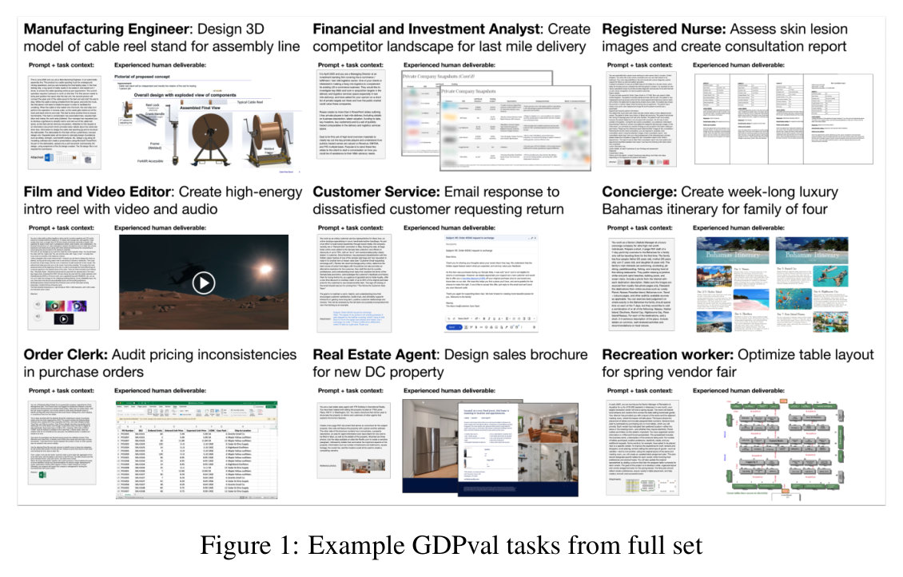
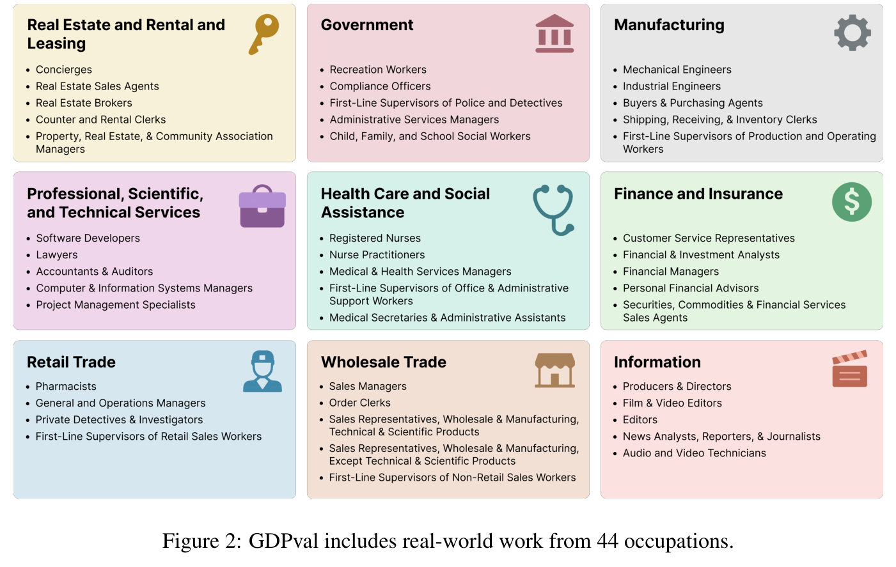
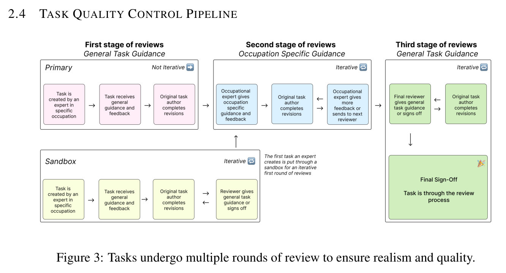
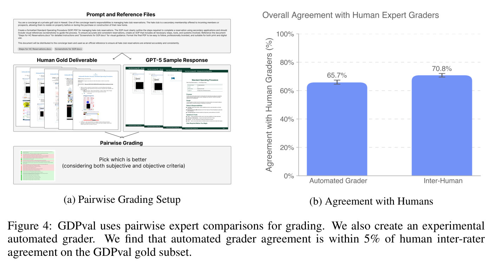
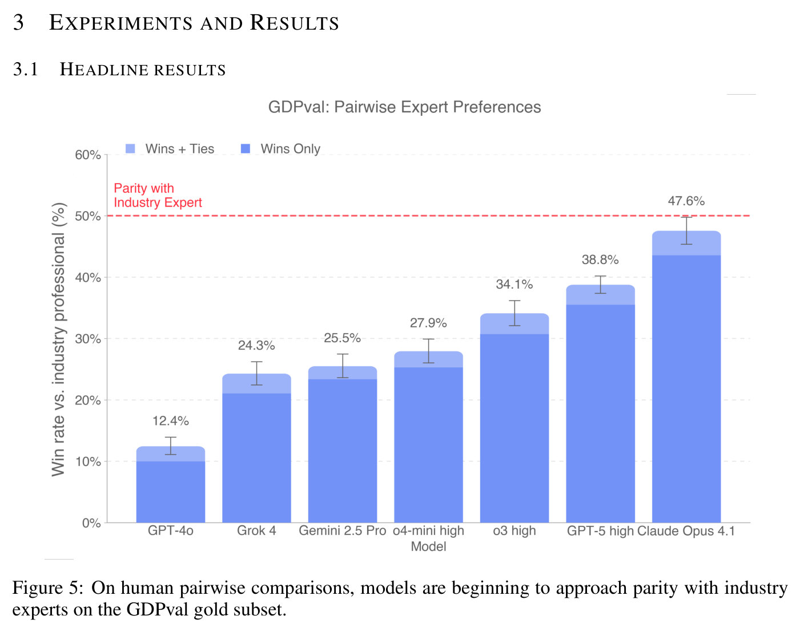
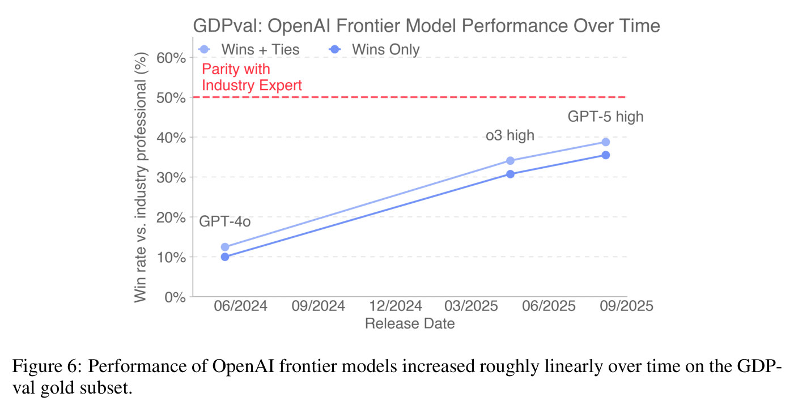
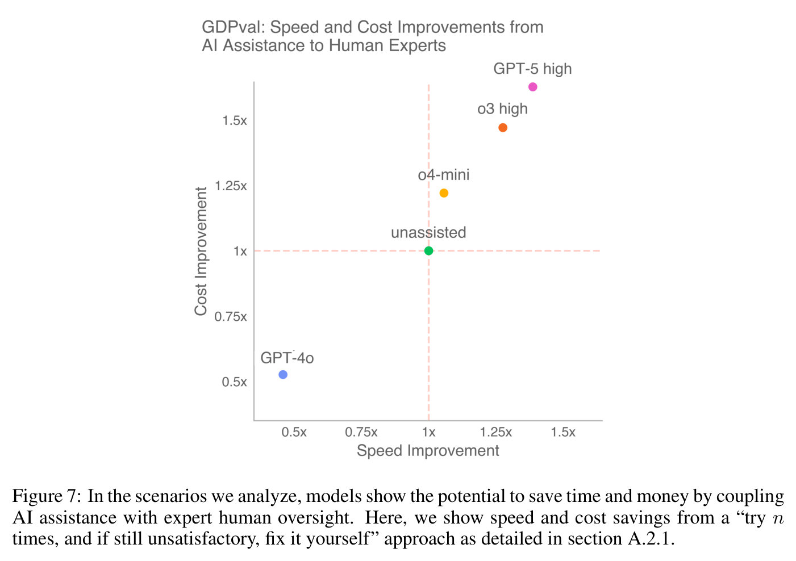
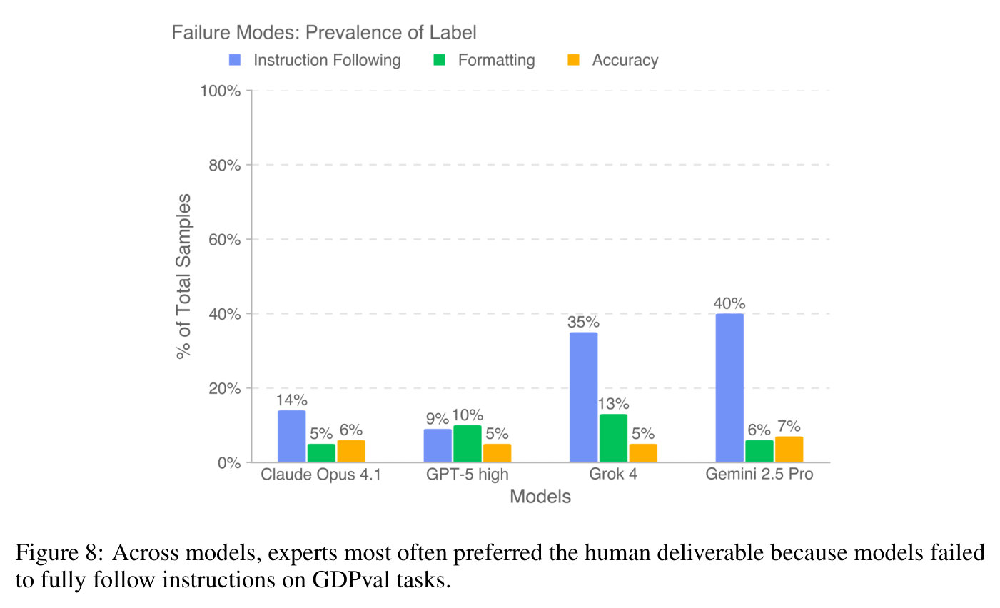
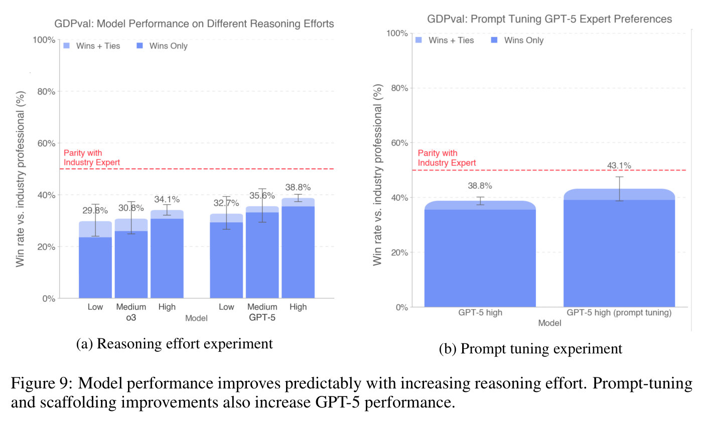

# GDPval: Evaluating AI Model Performance on Real-World Economically Valuable Tasks — main body

Full text of Patwardhan et al. (2025), transcribed from the arXiv LaTeX source and reproduced under CC BY 4.0; copyright the authors. This is the **v1** text (5 October 2025), the paper's only version. Figures are crops of the published PDF, shown with the paper's own caption; this knowledge base adds no description of its own, so what a figure shows is what its caption and the paper's text say. Citations are resolved to author–year; the bibliography is omitted — follow the arXiv link for it. The appendix is not transcribed in this knowledge base; it is at the arXiv link above.

## Contents

| § | Heading | Figures | Tables |
|---|---|---|---|
| — | Abstract | | |
| 1 | Introduction | Figure 1 | |
| 2 | Task Creation | | |
| 2.1 | Prioritizing occupations | Figure 2 | Table 1 |
| 2.2 | Expert Recruitment | | |
| 2.3 | Task Creation | | |
| 2.4 | Task Quality Control Pipeline | Figure 3, Figure 4 | |
| 2.5 | Human Expert Grading and Automated Grading | | |
| 3 | Experiments and Results | | |
| 3.1 | Headline results | Figure 5, Figure 6 | |
| 3.2 | Speed and cost comparison | Figure 7 | |
| 3.3 | Model strengths and weaknesses | Figure 8 | |
| 3.4 | Increasing reasoning effort and scaffolding | Figure 9 | |
| 4 | Open-sourcing | | |
| 5 | Limitations | | |
| 6 | Conclusion | | |
| — | Acknowledgements | | |

## Abstract

We introduce GDPval, a benchmark evaluating AI model capabilities on real-world economically valuable tasks. GDPval covers the majority of U.S. Bureau of Labor Statistics Work Activities for 44 occupations across the top 9 sectors contributing to U.S. GDP (Gross Domestic Product). Tasks are constructed from the representative work of industry professionals with an average of 14 years of experience. We find that frontier model performance on GDPval is improving roughly linearly over time, and that the current best frontier models are approaching industry experts in deliverable quality. We analyze the potential for frontier models, when paired with human oversight, to perform GDPval tasks cheaper and faster than unaided experts. We also demonstrate that increased reasoning effort, increased task context, and increased scaffolding improves model performance on GDPval. Finally, we open-source a gold subset of 220 tasks and provide a public automated grading service at [evals.openai.com](https://evals.openai.com) to facilitate future research in understanding real-world model capabilities.

## 1 Introduction

There is growing debate about how increasingly capable AI models could affect the labor market—whether by automating specific tasks, replacing entire occupations, or creating entirely new kinds of work (Brynjolfsson et al., 2025; Chen et al., 2025). Current approaches to measure the economic impact of AI focus on indicators such as adoption rates, usage patterns, and GDP growth attributed to AI (Chatterji et al., 2025; Tamkin et al., 2024; Appel et al., 2025; Acemoglu, 2025; Bick et al., 2024). However, historical evidence from technological shifts—such as electricity, airplanes, and computers—shows that the transition from invention to economy-wide permeation often takes years or even decades, requiring regulatory, cultural, and procedural changes (David, 1990; Brynjolfsson & Hitt, 2000; Brynjolfsson et al., 2017; Dwivedi et al., 2021; Solow, 1987). Therefore, while informative when available, these methods are lagging indicators of AI impacts. We consider an alternate method for understanding the potential economic impacts of AI: directly measuring AI model capabilities. AI capability evaluations can provide clearer, more directly attributable evidence about model abilities, allowing us to assess economic relevance ahead of widespread adoption.

**Figure 1.** Example GDPval tasks from full set

Our paper introduces the first version of GDPval, a benchmark evaluating AI model performance on real-world economically valuable tasks. GDPval covers the top 9 sectors contributing to U.S. GDP (Gross Domestic Product), with at least 30 tasks per occupation in the full set (and 5 tasks per occupation in the gold subset), across 44 occupations. Each task is constructed based on actual work product created by an expert professional. Given the complexity of automatically grading these tasks, our primary evaluation metric is head-to-head human expert comparison. We also provide an experimental automated grader service for the 220 open-sourced gold subset of tasks. Future GDPval iterations will incorporate greater breadth, realism, interactivity, and contextual nuance.

The initial version of GDPval offers several advantages over existing AI model evaluations:

- **Realism**: Unlike AI benchmarks in the style of an academic test that focus on reasoning difficulty (e.g., Phan et al. (2025); Hendrycks et al. (2020); Rein et al. (2023); Liu et al. (2023)), tasks are based on actual work product from industry experts, validated through multiple rounds and review, and tied to time and cost required for completion.
- **Representative breadth:** Unlike AI evaluations focused on specific domains like software engineering (e.g., Miserendino et al. (2025)), the GDPval full set covers 1,320 tasks across 44 occupations, sourced to cover the majority of Work Activities tracked by O*NET for each occupation U.S. Department of Labor, Employment and Training Administration (2024). This top-down approach allows for representativeness of tasks across occupations. We also build on production AI usage analyses (e.g., Tamkin et al. (2024); Chatterji et al. (2025); Appel et al. (2025)) to cover areas where model adoption is still emerging.
- **Computer use and multi-modality**: Tasks require manipulating a variety of formats (e.g., CAD design files, photos, video, audio, social media posts, diagrams, slide decks, spreadsheets, and customer support conversations). Each task also requires parsing through up to 17 reference files in the gold subset, and 38 in the full set.
- **Subjectivity**: In addition to correctness, expert graders often consider subjective factors such as structure, style, format, aesthetics, and relevance. Our dataset also therefore serves as a helpful testbed to assess automated grader performance.
- **No "upper limit"**: Unlike metrics that could saturate quickly, our primary metric is win rate, which allows for continuous evaluation. Currently, we compare model outputs against a human expert baseline, but we could replace our baseline with increasingly strong models over time and keep evaluating.
- **Long-horizon difficulty**: Tasks require an average of 7 hours of work for an expert professional to complete. On the high end, tasks span up to multiple weeks of work.

## 2 Task Creation

We first identify the sectors that contribute most to U.S. GDP, then source tasks drawn from the highest-earning knowledge work occupations within those sectors.

### 2.1 Prioritizing occupations

GDPval covers tasks from 9 sectors and 44 occupations that collectively earn \$3T annually. We detail below the methodology behind our initial version.

To choose the initial occupations, we:

1. **Selected sectors that contribute over 5% to US GDP** as determined by Q2 2024 Value Added by Industry as a Percentage of Gross Domestic Product (see Federal Reserve Bank of St. Louis (2025)). These 9 sectors are shown in Table 1.
2. **Selected the 5 occupations**[^1] **within each sector that contribute most to total wages and compensation and are predominantly digital.** We took a task-based approach to determining if an occupation should be classified as "predominantly digital." Specifically, we identified all tasks for an occupation from O*NET, a database of occupational data, definitions and tasks from the U.S. Department of Labor. Similar to Eloundou et al. (2023), we prompted GPT-4o to classify each task as digital or non-digital, and then classified the overall occupation as digital if at least 60% of its component tasks were digital. To calculate this percentage, we weighted tasks by the "relevance," "importance," and "frequency" scores for each task reported in O*NET Task Ratings.

We further validated the representativeness of our digital tasks measure by benchmarking it against the Acemoglu & Autor (2011) task content framework. The correlations we observe—digital tasks increasing with non-routine cognitive content and decreasing with routine and manual content—demonstrate alignment with established economic measures of work, as per Appendix A.7.1.

For wage and occupation data, we used O*NET's May 2024 national employment and wage estimates to calculate total wages for 831 occupations (U.S. Bureau of Labor Statistics (2025b)) and further detailed in Appendix A.7.

**Figure 2.** GDPval includes real-world work from 44 occupations.

**Table 1.** Sectors, their value added as a percentage of U.S. GDP (Q2 2024), with representative top occupations and total compensation in billions (USD).

| **Sector** | **% GDP** | **Top Occupations and Total Compensation (in Billions USD)** |
|---|---|---|
| Real Estate and Rental and Leasing | 13.8% | Property/RE/Community Association Managers — \$24.54B |
| | | Counter and Rental Clerks — \$17.42B |
| | | Real Estate Sales Agents — \$13.53B |
| | | Real Estate Brokers — \$4.55B |
| | | Concierges — \$1.80B |
| Manufacturing | 10.0% | First-Line Supervisors of Production and Operating Workers — \$51.07B |
| | | Buyers and Purchasing Agents — \$39.79B |
| | | Shipping, Receiving, and Inventory Clerks — \$38.50B |
| | | Industrial Engineers — \$37.79B |
| | | Mechanical Engineers — \$31.57B |
| Professional, Scientific, and Technical Services | 8.1% | Software Developers — \$239.18B |
| | | Lawyers — \$136.66B |
| | | Accountants and Auditors — \$135.44B |
| | | Computer and Information Systems Managers — \$121.44B |
| | | Project Management Specialists — \$108.77B |
| Government | 11.3% | Compliance Officers — \$33.80B |
| | | Administrative Services Managers — \$32.03B |
| | | Child, Family, and School Social Workers — \$24.10B |
| | | First-Line Supervisors of Police and Detectives — \$17.00B |
| | | Recreation Workers — \$11.51B |
| Health Care and Social Assistance | 7.6% | Registered Nurses — \$323.05B |
| | | First-Line Supervisors of Office/Admin Support — \$107.02B |
| | | Medical & Health Services Managers — \$77.93B |
| | | Nurse Practitioners — \$40.58B |
| | | Medical Secretaries & Admin Assistants — \$37.87B |
| Finance and Insurance | 7.4% | Financial Managers — \$147.74B |
| | | Customer Service Representatives — \$123.70B |
| | | Securities, Commodities, and Financial Services Sales Agents — \$52.14B |
| | | Personal Financial Advisors — \$43.33B |
| | | Financial and Investment Analysts — \$39.67B |
| Retail Trade | 6.3% | General & Operations Managers — \$477.16B |
| | | 1st-Line Supervisors of Retail Sales Workers — \$58.27B |
| | | Pharmacists — \$45.12B |
| | | Private Detectives & Investigators — \$2.39B |
| Wholesale Trade | 5.8% | Sales Reps, Wholesale & Mfg (Except Tech/Scientific) — \$103.21B |
| | | Sales Managers — \$97.16B |
| | | Sales Reps, Wholesale & Mfg (Tech/Scientific) — \$33.66B |
| | | 1st-Line Supervisors of Non-Retail Sales Workers — \$21.43B |
| | | Order Clerks — \$3.86B |
| Information | 5.4% | Producers & Directors — \$16.60B |
| | | Editors — \$8.18B |
| | | News Analysts, Reporters, and Journalists — \$4.41B |
| | | Audio & Video Technicians — \$4.30B |
| | | Film & Video Editors — \$2.41B |

[^1]: We assigned occupations to sectors by using the 2023 BLS National Employment Matrix from U.S. Bureau of Labor Statistics (2025a) to map occupations to sectors by identifying the sector with the highest employment for each occupation. For more detail, see Appendix A.7.

### 2.2 Expert Recruitment

We recruited expert industry professionals to create realistic tasks based on their professional work experience. Experts were required to have a minimum of 4 years of professional experience in their occupation and a strong resume with a demonstrated history of professional recognition, promotion, and management responsibilities. The average expert had 14 years of experience. We further required experts to pass a video interview, a background check, a training and a quiz to participate in the project. Experts were well compensated for their time and experience. Some of the prior employers of our industry experts include: Accenture, Aetna, Apple, AXA Advisors, Bank of America, Barclays, BBC News, Boeing, Budget Rent a Car, Capital One, Centers for Disease Control and Prevention, Citigroup, Condé Nast, CVS Pharmacy, U.S. Department of Defense, Disney, Douglas Elliman, E*TRADE, Federal Trade Commission, General Electric, Goldman Sachs, Google, Guggenheim Partners, HBO, IBM, JPMorgan Chase, Johnson & Johnson, Kmart, Kirkland & Ellis LLP, LinkedIn, Lockheed Martin, Macy's, Massachusetts General Hospital, Meta, Microsoft, Morgan Stanley, National Park Service, NFL Network, Oracle, Paul, Weiss, Rifkind, Wharton & Garrison LLP, Prudential, PwC, Raytheon, Sally Beauty, Samsung, SAP, Scientific American, Sotheby's, Telegraph Media Group, Thermo Fisher Scientific, TIME, Twilio, U.S. Department of Justice, United States Air Force, United States Postal Service, Walgreens, Wells Fargo, White & Case LLP, and Whole Foods.

### 2.3 Task Creation

Each GDPval task consists of two primary components: a request (often with reference files) and a deliverable (work product). Experts classified their requests against O*NET occupational tasks for their occupation to ensure broad and representative coverage across tasks (U.S. Bureau of Labor Statistics, 2025a). More details on task characteristics can be found in Appendix A.4. To assess task quality, we asked occupational experts to rate each task on its difficulty, representativeness, time to complete, and overall quality against real-world standards for their occupation. Each task's dollar value was estimated by multiplying the average estimated completion time by median hourly wages for the corresponding occupation from OEWS data (U.S. Bureau of Labor Statistics, 2025b).

### 2.4 Task Quality Control Pipeline

**Figure 3.** Tasks undergo multiple rounds of review to ensure realism and quality.

All 1,320 tasks in the full GDPval set went through an iterative review pipeline involving both automated model-based screening and multiple stages of human expert review. Each task received an average of five human reviews (with a minimum of three reviews).

**Figure 4.** GDPval uses pairwise expert comparisons for grading. We also create an experimental automated grader. We find that automated grader agreement is within 5% of human inter-rater agreement on the GDPval gold subset. (a) Pairwise Grading Setup (b) Agreement with Humans

Across all stages of review, experts provided detailed comments, and tasks were iteratively revised before subsequent reviews to enhance quality and representativeness, as detailed in Appendix A.5.

### 2.5 Human Expert Grading and Automated Grading

To grade the 220 open-sourced gold subset, we conducted blinded expert pairwise comparisons, where experts in the relevant occupation were presented with a request and reference files and asked to rank two or more unlabeled work deliverables.

On average, grading each comparison for the gold subset took over an hour. Additional occupational experts were sourced to grade human and model deliverables. Experts provided detailed justifications for their choices and rankings, which enabled us to compute our headline win rates for various models compared to the human expert completion.

For the gold subset, we trained an experimental grading model to perform pairwise comparisons in the style of industry professional experts. Although limited, the automated grader is faster and cheaper than expert grading, and achieves 66% agreement with human expert graders, only 5% below human expert inter-rating agreement of 71%. Further detail is in Appendix A.6.

## 3 Experiments and Results

### 3.1 Headline results

**Figure 5.** On human pairwise comparisons, models are beginning to approach parity with industry experts on the GDPval gold subset.

**Figure 6.** Performance of OpenAI frontier models increased roughly linearly over time on the GDPval gold subset.

We evaluated GPT-4o, o4-mini, o3, GPT-5, Claude Opus 4.1, Gemini 2.5 Pro, and Grok 4 using blind pairwise comparisons by professional industry experts[^2]. Claude Opus 4.1 was the best performing model on the GDPval gold subset, excelling in particular on aesthetics (e.g., document formatting, slide layout), while GPT-5 excelled in particular on accuracy (e.g., carefully following instructions, performing correct calculations) as per Figure 8. This distinction is also shown in Appendix A.2.4, where GPT-5 performs better on pure text, while Claude performs better on file types like .pdf, .xslx, and .ppt, demonstrating better visual and aesthetic abilities[^3]. In Figure 5, on the GDPval gold subset, 47.6% of deliverables by Claude Opus 4.1 were graded as better than (wins) or as good as (ties) the human deliverable. Model deliverables outperformed or matched expert humans' deliverables in just over half the tasks.

[^2]: We aimed to keep comparisons as blind as possible, but model samples may still have been identifiable due to stylistic differences. OpenAI outputs often used em dashes, Claude outputs frequently adopted first-person phrasing, and Grok occasionally referred to itself as Grok. Although filenames were scrubbed of model identifiers, to preserve sample identity, we did not alter style or content, so experts may still have been able to infer model origins. We sampled Claude via the UI to enable the maximum GDPval-relevant features. For example, for Claude, we wanted to evaluate its 'Upgraded file creation and analysis' feature (https://www.anthropic.com/news/create-files). For the OpenAI models, we enabled the web search tool and the code interpreter tool, with background sampling. We also preinstalled several libraries not available in the base image, see Appendix A.6.4. For plots shown, we sampled each model 3 times for each prompt, and then had 3 different human graders grade each sample (yielding 9 comparisons per prompt, per model, across 220 tasks).
[^3]: We caveat also that the occupations and task types covered by text tend to be different than those that involve multi-modal

### 3.2 Speed and cost comparison

We analyzed several scenarios to understand the potential speed and cost savings ratio of frontier models on the GDPval gold subset tasks in Appendix A.2.1[^4]. In the scenarios analyzed, incorporating frontier AI models into expert workflows showed the potential to save time and money relative to unaided experts. Fig 7 summarizes expected savings under a "try using the model and if still unsatisfactory, fix it yourself" setup. Here, an expert human samples from a model, reviews outputs, and if unsatisfactory, resamples and repeats. If no satisfactory output is obtained, the human completes the task themselves. Under this setup, as well as other setups (e.g., directly using model outputs, trying the model just once before doing work directly), model assistance can potentially save the expert time and money.

**Figure 7.** In the scenarios we analyze, models show the potential to save time and money by coupling AI assistance with expert human oversight. Here, we show speed and cost savings from a "try $n$ times, and if still unsatisfactory, fix it yourself" approach as detailed in Appendix A.2.1.

[^4]: We were not able to obtain cost estimates for Claude, Gemini, and Grok.

### 3.3 Model strengths and weaknesses

We built a clustering pipeline to analyze why experts preferred or rejected GPT-5 high, Claude Opus 4.1, Gemini 2.5 Pro, and Grok 4 deliverables as shown in Figure 8.[^5] Claude, Grok, and Gemini most often lost due to instruction-following failures, while GPT-5 high lost mainly from formatting errors and had the fewest instruction-following issues. Gemini and Grok frequently promised but failed to provide deliverables, ignored reference data, or used the wrong format. GPT-5 and Grok showed the fewest accuracy errors, though all models sometimes hallucinated data or miscalculated.

**Figure 8.** Across models, experts most often preferred the human deliverable because models failed to fully follow instructions on GDPval tasks.

[^5]: Samples were clustered using expert justifications; labels were mutually exclusive and left blank when the rationale was unclear.

### 3.4 Increasing reasoning effort and scaffolding

To understand the impact of reasoning effort on model performance, we ran GDPval on the o3 and GPT-5 models at low, medium, and high reasoning effort. We found that additional reasoning effort improved performance.

We were also interested in measuring how easily we could improve model capabilities with prompts. For example, many of the observed GPT-5 failure modes were due to obvious formatting errors. We created a prompt which encouraged GPT-5 to rigorously check deliverables for correctness, check layouts by rendering files as images, avoid nonstandard unicode characters, and avoid excess verbosity. The prompt applies generally to multimodal economic tasks and is not overfit to any given question (see Appendix A.3 for details). We also improved agent scaffolding by enabling GET requests in the container and performing best-of-N sampling with N=4 and a GPT-5 judge.

Prompting fully eliminated black-square artifacts from GPT-5 responses, which previously affected over half of generated PDFs, and reduced egregious formatting errors in PowerPoint files from 86% to 64%. This can be partially attributed to a sharp increase in agents using their multi-modal capabilities to inspect deliverables (15% $\rightarrow$ 97%). Prompting also improved human preference win rates by 5 percentage points in Figure 9b. These easy performance gains suggest there are paths to agent improvement on GDPval tasks by training or scaffolding them to be more thorough and take full advantage of their multimodal capabilities.

**Figure 9.** Model performance improves predictably with increasing reasoning effort. Prompt-tuning and scaffolding improvements also increase GPT-5 performance. (a) Reasoning effort experiment (b) Prompt tuning experiment

## 4 Open-sourcing

We open-source the prompts and reference files in our 220-task gold subset. While human expert comparison is still our recommended method of grading, we make an experimental automated grader publicly available at [evals.openai.com](https://evals.openai.com). Please note that the tasks in the open sourced set have been scrubbed of information that could be used to identify the expert who wrote the task. We also note that, as a result of limitations with our automated grader, we don't provide automated grading results for all tasks in the gold subset. Further disclaimers about the open source gold subset are in Appendix A.1.3.

## 5 Limitations

**Dataset size:** The GDPval full set currently consists of only 44 occupations and 30 total tasks per occupation. It is therefore a limited, initial cut of knowledge work tasks, not a comprehensive evaluation of all possible occupational tasks. We are expanding the dataset size.

**Focus on self-contained knowledge work:** Tasks in the initial version of GDPval are oriented around knowledge work that can be performed on a computer, particularly around digital deliverables. Manual labor and physical tasks are not included in the current version. Moreover, tasks that involve extensive tacit knowledge, access to personally identifiable information, use of proprietary software tools, or communication between individuals are out of scope for the current evaluation. We aim to build on this in future versions of the evaluation.

**Tasks are precisely-specified and one-shot, not interactive:** For GDPval, we provide the full context of the task in the prompt, but in real life it often takes effort to figure out the full context of a task and understand what to work on. We are working on improvements to GDPval that involve more interactivity and contextual realism. In the meantime, the experiment in the "Under-contextualized GDPval" section (Appendix A.2.7) demonstrates how model performance degrades with less context.

**Grader performance:** Our current automated grader has a number of limitations compared to human expert graders. More details about the automated grader are available in the Appendix A.6.2.

**Cost:** Constructing and running our evaluation is expensive, particularly with industry expert graders. For this reason, we make an automated grader proxy available, but do not consider it a full substitute for industry expert graders.

## 6 Conclusion

In GDPval, we contribute the following:

1. **Dataset**: We create a new evaluation dataset (GDPval) measuring real-world, economically valuable tasks.
2. **Capability benchmarking:** We analyze quality, speed and cost of deliverables across human industry experts and frontier AI models.
3. **Experiments:** We test how results shift with differing reasoning effort, prompting, scaffolding, and context.
4. **Open-sourcing:** We open-source 220 tasks as part of our gold subset which includes prompts and reference files.
5. **Automated grader:** We release an automated grader to improve accessibility of grading at [evals.openai.com](https://evals.openai.com).

We hope this work contributes to the science of tracking model progress, so that we have better data to assess the social impacts of AI models.

## Acknowledgements

We thank Abhishek Bhardwaj, Addea Gupta, AJ Ostrow, Aleksander Madry, Alexander Wei, Ally Bennett, Becky Waite, Ben Gaffney, Brad Lightcap, Casey Chu, Cassandra Duchan Solis, Charlotte Cole, Dane Stuckey, Eric Wallace, Erik Ritter, Evan Mays, Fidji Simo, Gideon Myles, Hannah Wong, Isa Fulford, Jakub Pachocki, James Lennon, Jared Pochtar, Jason Kwon, Jordan Frand, Julie Steele, Justin Wang, Kai Chen, Karthik Rangarajan, Kevin Liu, Larry Summers, Leo Liu, Leon Maksin, Leyton Ho, Lindsay McCallum, Livvy Pierce, Manoli Liodakis, Mark Chen, Max Schwarzer, Miles Palley, Miles Wang, Nakul Khanna, Nat McAleese, Natalie Kim, Nicholas Carlini, Nick Otis, Nick Ryder, Noam Brown, Noel Bundick, Paul Radulovic, Phillip Guo, Prashanth R, Rachel Brown, Raoul de Liedekerke, Robert Rotsted, Ronnie Chatterji, Ryan Kaufman, Ryan Rotsted, Sam Altman, Sam Bowman, Sherwin Wu, Tom Cunningham, Tom Stasi, Tony Song, Trevor Creech, Wenda Zhou, Wenlei Xie, Wyatt Thompson, and Yara Khakbaz for discussion, assistance, and review. We are also grateful to our vendor partners for their collaboration and support throughout this research, and extend a special thank you to the industry experts who contributed their time and expertise to GDPval, without whom this work would not have been possible.
