# Measuring AI Ability to Complete Long Tasks — main body

Full text of Kwa et al. (2025), transcribed from the arXiv LaTeX source and reproduced under CC BY 4.0; copyright the authors. This is the **v2** text (30 March 2025), the version current on the lecture date (17 November 2025) and the version the lecture quotes; later arXiv revisions v3 and v4 (2026) are retitled "Measuring AI Ability to Complete Long *Software* Tasks" and report different results. Figures are crops of the published PDF, shown with the paper's own caption; this knowledge base adds no description of its own, so what a figure shows is what its caption and the paper's text say. Citations are resolved to author–year; the bibliography is omitted — follow the arXiv link for it. The appendices are not transcribed in this knowledge base; they are at the arXiv link above.

## Contents

| § | Heading | Figures | Tables |
|---|---|---|---|
| — | Abstract | | |
| 1 | Introduction | Figure 1, Figure 2 | |
| 2 | Related work | | |
| 2.1 | Agent and capability benchmarks | | |
| 2.2 | Forecasting AI progress | | |
| 2.3 | Psychometric methods and Item Response Theory | | |
| 3 | Measuring AI agent performance on realistic tasks | | |
| 3.1 | Task suite / dataset | | |
| 3.1.1 | HCAST tasks | | |
| 3.1.2 | RE-Bench suite | | |
| 3.1.3 | Software atomic actions (SWAA) suite | | |
| 3.1.4 | Examples of tasks of varying lengths | | Table 1 |
| 3.2 | Baselining | | Table 2 |
| 3.2.1 | HCAST tasks | | |
| 3.2.2 | RE-Bench | | |
| 3.2.3 | SWAA | | |
| 3.3 | Evaluating AI agent performance on task suites | | |
| 3.3.1 | Agent scaffolds | Figure 3 | |
| 3.3.2 | Results | | |
| 3.3.3 | Model success rate vs baseline time | | |
| 4 | Computing time horizon | | |
| 4.1 | From raw data to time horizon | Figure 4, Figure 5 | |
| 4.2 | Model horizon length vs. release date | | |
| 4.2.1 | Time horizons at 50% success rate vs 80% success rate | Figure 6 | |
| 5 | Qualitative analysis | | Table 3 |
| 6 | External validity and robustness | Figure 7 | |
| 6.1 | Retrodiction from 2023–2025 data | Figure 8 | |
| 6.2 | Messiness factors | Figure 9, Figure 10 | |
| 6.3 | SWE-bench Verified | Figure 11 | |
| 6.4 | Internal PR experiments | | |
| 7 | Extrapolation | | |
| 7.1 | Extrapolating towards one-month-horizon AI | Figure 12 | |
| 7.2 | Difficulties in extrapolation | | |
| 7.2.1 | Systematic differences between our tasks and real tasks | | |
| 7.2.2 | Future changes in time horizon trends | | |
| 8 | Discussion | | |
| 8.1 | Measuring and interpreting time horizon | | |
| 8.2 | Limitations and future work | Figure 13 | |
| 8.3 | Summary | | |
| — | Acknowledgments | | |

## Abstract

Despite rapid progress on AI benchmarks, the real-world meaning of benchmark performance remains unclear. To quantify the capabilities of AI systems in terms of human capabilities, we propose a new metric: *50%-task-completion time horizon*. This is the time humans typically take to complete tasks that AI models can complete with 50% success rate. We first timed humans with relevant domain expertise on a combination of RE-Bench, HCAST, and 66 novel shorter tasks. On these tasks, current frontier AI models such as Claude 3.7 Sonnet have a 50% time horizon of around 50 minutes. Furthermore, frontier AI time horizon has been doubling approximately every seven months since 2019, though the trend may have accelerated in 2024. The increase in AI models' time horizons seems to be primarily driven by greater reliability and ability to adapt to mistakes, combined with better logical reasoning and tool use capabilities. We discuss the limitations of our results—including their degree of external validity—and the implications of increased autonomy for dangerous capabilities. If these results generalize to real-world software tasks, extrapolation of this trend predicts that within 5 years, AI systems will be capable of automating many software tasks that currently take humans a month.

## 1 Introduction

**Figure 1.** The length of tasks (measured by how long they take human professionals) that generalist autonomous frontier model agents can complete with 50% reliability has been doubling approximately every 7 months for the last 6 years (Section 4.2). The shaded region represents 95% CI calculated by hierarchical bootstrap over task families, tasks, and task attempts. Even if the absolute measurements are off by a factor of 10, the trend predicts that in under a decade we will see AI agents that can independently complete a large fraction of software tasks that currently take humans days or weeks (Section 7).

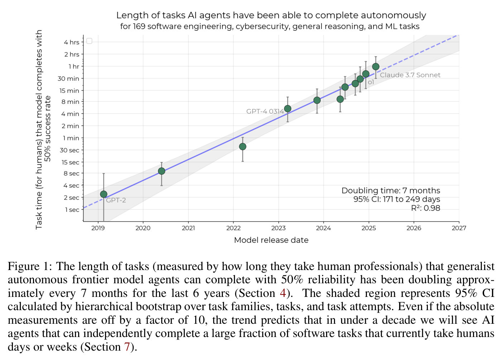

In the last five years, frontier AI systems have undergone a dramatic transformation in capabilities, evolving from basic text generation (Radford et al., 2019) to autonomously executing complex multi-hour machine learning research projects (Wijk et al., 2024). Sufficiently capable AIs could perform dangerous, highly complex actions like autonomous development of chemical, biological, radiological or nuclear weapons (CBRN) and self-replication and adaptation outside human control (Phuong et al., 2024). Understanding AI capabilities helps inform the development of safety guardrails as systems become increasingly powerful. In particular, many frontier AI developers have committed to using measures of specific AI capabilities to determine the necessary risk mitigations for their frontier AI systems.[^1] Robust benchmarks that can accurately track and forecast AI capabilities thus form the foundation for responsible AI governance and risk mitigation.

However, existing benchmarks face several key limitations. First, they often consist of artificial rather than economically valuable tasks. Second, benchmarks are often adversarially selected for tasks that current models struggle with compared to humans,[^2] biasing the comparison to human performance. Most critically, individual benchmarks saturate increasingly quickly (Maslej et al., 2024), and we lack a more general, intuitive, and quantitative way to compare between different benchmarks,[^3] which prevents meaningful comparison between models of vastly different capabilities (e.g., GPT-2 versus o1). As a consequence, while the last few years have seen dramatic increases in AI performance on many individual benchmarks, understanding the progress of AI capabilities in general has required estimating the *qualitative difficulty* of the latest benchmarks AI systems can pass.

**Figure 2.** Our methodology for measuring AI agent time horizon. First, we create a diverse task suite of 170 tasks. Second, we have both humans and AI agents (consisting of an AI model and a scaffold) attempt these tasks, recording the time taken by successful humans and the success rate for AI agents. Third, we fit a logistic model to find the time horizon at which each AI agent has a 50% chance of success, and plot this against the release date of the model.

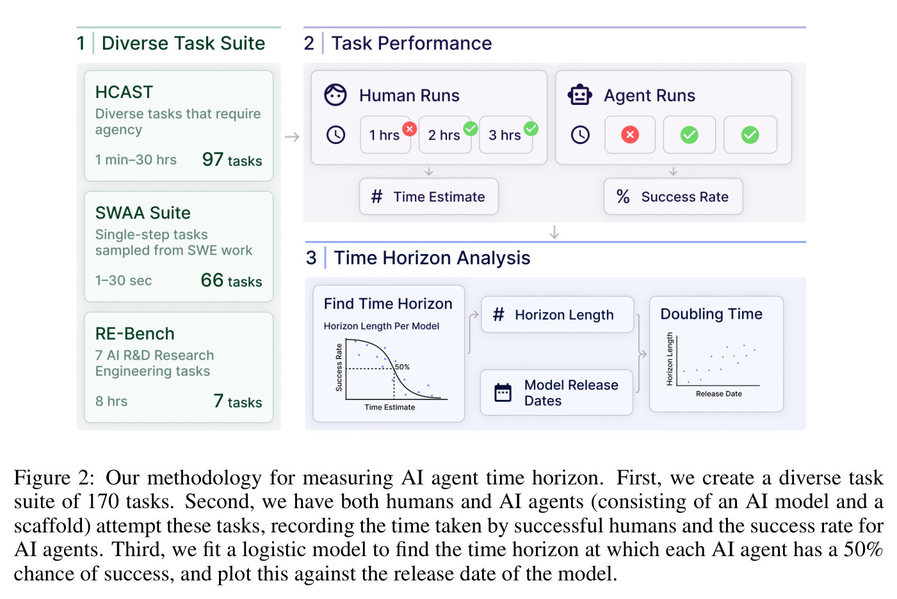

We propose tracking AI progress over time using the **task completion time horizon**: the duration of tasks that models can complete at a certain success probability, providing an intuitive measure of real-world capability compared to humans. As models may not reliably complete *all* tasks of a given length, we operationalize this by measuring the **X%-(task completion) time horizon**–the length of tasks that models can complete approximately X% of the time.

We prototype this methodology using three datasets designed to capture skills required for research or software engineering (Section 3.1), totaling 170 tasks with a wide range of difficulty: HCAST (Rein et al., 2025), RE-Bench (Wijk et al., 2024), and Software Atomic Actions (SWAA), a new suite of shorter software tasks that can measure pre-2023 models (Section 3.1.3). Using skilled human baseliners, we estimate the duration that a domain knowledgeable human (without task-specific context) takes to complete these tasks (Section 3.2). We evaluate the performance of 13 frontier models from 2019 to 2025 on these tasks (Section 3.3). Using methodology inspired by human psychometric studies, we then estimate the duration of tasks that models can complete with 50% success rate—the 50% time horizon (Section 4.1).

We find that the 50% time horizon has been growing exponentially from 2019–2025 on our tasks, with a doubling time of approximately seven months (Figure 1). We compare our main result with our exploratory results on non-SWAA tasks, finding that the 2023–2025 horizon growth rate is consistent with the 2019–2025 rate to within 11% (Section 6.1). We also measure the 80% time horizon of models (Figure 6) and find a similar trend, though horizons are roughly 5x shorter. This progress appears to be driven by several key factors: improved logical reasoning capabilities, better tool use capabilities, and greater reliability and self-awareness in task execution (Section 5).[^4] We also note several limitations of current systems—notably, performance is much lower on less structured, "messier" tasks (Section 6.2).

Since our tasks do not perfectly represent the average segment of intellectual labor by researchers and software engineers, this raises the question of external validity (Section 6): whether the exponential trend holds on real-world tasks. We include results from three supplementary external validity experiments.

First, we score our HCAST and RE-Bench tasks against a list of 16 "messiness" factors that aim to capture some systematic differences between our tasks and hard "real-world" tasks. Some examples include whether the task is resource limited, novel, or involves a dynamic environment (Section D.4). Controlling for task length, we find models perform worse on tasks that have higher messiness scores. Notably, *trends* in AI agent performance over time are similar for the lower and higher messiness subsets of our tasks (see Figure 9). In particular, we find no evidence of plateaus in performance trends specific to our higher messiness subset.

Second, we replicate our methods on SWE-bench Verified (Section 6.3), which includes human difficulty annotations. We find that the exponential trend still holds (Figure 11), albeit with an even shorter doubling time, possibly because SWE-bench Verified difficulty annotations, meant to represent high-context maintainer time, may differentially underestimate how long human contractors take to perform easier SWE-bench tasks.

Third, we measure AI agent performance on a small set of our internal pull requests (PRs) (Section 6.4). We find large differences in the speed at which different human groups complete the internal PR tasks, with contractors taking 5-18x longer to fix issues than repo maintainers. When using contractor (rather than maintainer) time-to-complete as a measure of task length, model time horizons derived from combined performance on SWAA, HCAST and RE-Bench are compatible with AI agent performance on internal PRs.

Our supplementary experiments find little evidence of performance trends being slower on the somewhat more realistic tasks we tested, but do not rule out the possibility that trends are meaningfully slower on the distribution of tasks required to automate software engineer jobs. These experiments were designed to detect large trend differences and constant factor shifts in model performance. We also find evidence that AI agent time horizons can differ by a large factor depending on the task domain and reference human population.

We conclude by discussing implications for AI capabilities forecasting (Section 8). Naively extrapolating the trend in horizon length implies that AI will reach a time horizon of >1 month (167 work hours) between late 2028 and early 2031 (Figure 12). However, extrapolation is affected by both external validity concerns and future changes in the growth rate. We discuss several possible factors that could either speed up or slow down the future trend in Section 7.2.

[^1]: An updated list of frontier AI safety policies can be found at: https://metr.org/faisc.
[^2]: For example, HellaSwag (Zellers et al., 2019) and Humanity's Last Exam (Phan et al., 2025) were both generated by adversarially filtering problems against the best performing language models available at the time.
[^3]: As with our tasks, SWE-bench Verified (Chowdhury et al., 2024) does come with human-estimated task completion times. We use SWE-bench Verified tasks and accompanying time estimates to validate our main result in Section 6.3.
[^4]: Code to reproduce our figures can be found at: https://github.com/METR/eval-analysis-public

## 2 Related work

### 2.1 Agent and capability benchmarks

The evaluation of AI capabilities has evolved significantly from single-task benchmarks to complex, multi-step evaluations designed to assess agent-like behavior. While traditional benchmarks such as GLUE (Wang et al., 2018), SuperGLUE (Wang et al., 2019), and MMLU (Hendrycks et al., 2020) have provided valuable insights into language model performance, they primarily measure static knowledge rather than the dynamic problem-solving capabilities essential for real-world applications. Recent work has developed more complex agent benchmarks. AgentBench (Liu et al., 2023) evaluates agents across diverse environments including web browsing, coding, and game playing. MLAgentBench (Huang et al., 2024) focuses specifically on machine learning research tasks, while ToolBench (Qin et al., 2023) assesses tool use capabilities. The recent ZeroBench (Roberts et al., 2025) involve difficult reasoning, but in the context of visual puzzles rather than economically valuable tasks. Other noteworthy benchmarks include GAIA (Mialon et al., 2024), which evaluates reasoning across multiple modalities, and BIG-bench (Srivastava et al., 2022), which contains hundreds of diverse tasks including many requiring multi-step reasoning.

Software engineering has emerged as a particularly informative domain for evaluating AI capabilities. HumanEval (Chen et al., 2021) and MBPP (Austin et al., 2021) provide programming challenges of varying complexity, while more complex benchmarks like SWE-bench (Jimenez et al., 2024) and APPS (Hendrycks et al., 2021) test more sophisticated programming abilities. We use SWE-bench Verified (Chowdhury et al., 2024)'s human time estimates for task completion in our work. RE-Bench (Wijk et al., 2024), which we incorporate in our dataset, evaluates models on complex research engineering tasks that may require hours of human effort and compares AI performance to human machine learning engineers.

While these benchmarks provide valuable insights into specific capabilities, they often lack a unified metric that allows for tracking progress over time and comparing models of vastly different capabilities. Our time horizon approach aims to address this gap by providing a continuous metric that can be used to measure progress across different capability levels.

### 2.2 Forecasting AI progress

Quantitative forecasting of AI progress has employed various approaches, often starting with the observation that the compute used in AI training has increased dramatically over time. Amodei and Hernandez (2018) observed that AI training compute usage has been increasing exponentially, doubling approximately every 3.4 months between 2012 and 2018; Epoch AI (2024) included more recent data as well as trends in training dataset size and energy usage.

Other work has studied how AI performance has increased over time, relating benchmark performance to release date, compute usage, and other inputs. Sevilla et al. (2022) found that compute usage growth rate increased at the start of the "deep learning era" in 2010, coinciding with increases in performance. More recently, Owen (2024) and Pimpale et al. (2025) use compute and other metrics to forecast future benchmark performance.

Several recent efforts have been made to contextualize AI benchmark performance. One such effort is the annual AI Index Report (Maslej et al., 2024), which tracks performance across various benchmarks, including the date at which models achieved human-level performance. Murray et al. (2025) had cybersecurity experts relate AI performance on Cybench (Zhang et al., 2024) to the ability to autonomously develop malware. Phuong et al. (2024) commissioned professional forecasters to predict whether AI ranks amongst top public concerns by 2030, conditioned on benchmark performance. These efforts generally lack a unified, quantitative metric for cross-benchmark comparison.

Carlsmith (2020) and Cotra (2020) developed the "bio-anchors" framework, in which they related the compute involved in training AI models to the "effective horizon length" of tasks required for AI to have transformative impacts. Ngo (2023) proposed using the time horizon for which AI systems outperform most human experts at most tasks to measure general AI capabilities. In our work, we empirically evaluate the relationship between task duration and AI agent success rate, which we convert into a quantitative metric of AI agent performance.

### 2.3 Psychometric methods and Item Response Theory

Our methodological approach draws inspiration from psychometric testing, particularly Item Response Theory (IRT) (Baker, 2001), which models the relationship between latent traits (such as ability) and observed responses to test items. In traditional IRT, item difficulty is a parameter in a logistic model predicting response correctness based on respondent ability. Our approach inverts this, using task completion time (a proxy for difficulty) to predict AI performance. Our methodology also relates to difficulty estimation techniques in educational testing (de Ayala, 2017), where multiple metrics including completion time are used to estimate the difficulty of tasks. IRT has been applied to machine learning classifiers by Martínez-Plumed et al. (2019), and was used to design efficient benchmarks in Song and Flach (2021).

## 3 Measuring AI agent performance on realistic tasks

### 3.1 Task suite / dataset

Our tasks are made up of three distinct task suites:

1. A subset of HCAST (Rein et al., 2025): 97 diverse software tasks ranging from 1 minute to around 30 hours.[^5]
2. RE-Bench (Wijk et al., 2024): 7 difficult ML research engineering tasks, all eight hours long.
3. Software atomic actions (SWAA): 66 single-step tasks representing short segments of work by software developers, ranging from 1 second to 30 seconds.

All tasks are automatically scored with a continuous score or binary threshold; details of how we normalize and process scores are given in Section 4.1. As with most benchmarks, our three task suites were also designed to isolate a specific unit of work that can be reliably accomplished within a time limit. This usually means that the tasks require much less context than the average task in the middle of a larger project.[^6] We confirmed that all tasks were doable given the instructions provided by having humans successfully complete each of our tasks at least once.[^7]

The HCAST and SWAA suites are divided into *task families*, which are groups of tasks that are similar. For example, the "crossword" task family consists of tasks such as creating a 3x3 crossword puzzle, or a 5x5 crossword puzzle, etc. We segment tasks into families because performance within families is correlated and we down-weight families with many tasks for diversity.

#### 3.1.1 HCAST tasks

We use 97 tasks from 46 task families in HCAST, a diverse set of challenges in cybersecurity, machine learning, software engineering, and general reasoning.

Tasks in this suite range from easy tasks that take humans a couple of minutes (e.g. looking up a basic factual question on Wikipedia) to tasks that take expert humans multiple hours (e.g. writing CUDA kernels, or fixing a subtle bug in PyTorch). Because modern frontier AI systems are relatively more proficient at text-based tasks, the majority of these tasks do not require visual/multimodal capabilities, and all tasks are solvable by text editing via a bash shell.

Compared to many recent benchmarks, tasks in HCAST are not designed to be as difficult as possible for either human domain professionals or current AI systems. Instead, most tasks are designed to be realistic, such that doing well on the task requires skills we expect to be economically useful. As a result, we expect that most of these tasks are solvable by humans with a few years of professional experience in the relevant domain.

Tasks are defined by their instructions, starter resources, and an algorithmic scoring function. Task instructions are strings, typically between 1-2 sentences and a few paragraphs, although they can refer to other sources of information included as starter resources, or externally available via the internet. Starter resources typically consist of code, data, and documentation.

Each task is automatically scored between 0 and 1, with higher scores indicating better performance. Many tasks only return scores of 0 or 1, but for tasks with continuous scoring, we manually define a success threshold score, which we use in some of our analysis to binarize agent scores.[^8]

#### 3.1.2 RE-Bench suite

RE-Bench consists of 7 challenging open-ended ML research engineering environments, each of which are intended to take a human expert approximately 8 hours to complete. See Wijk et al. (2024) for more details.

#### 3.1.3 Software atomic actions (SWAA) suite

HCAST is designed to be a diverse set of tasks, but the shortest tasks are around 1 minute long, limiting both the representativeness and the achievable resolution in measuring AI agent performance on shorter tasks. To fill this gap, we observed that real-world intellectual labor consists in part of measurable, single-step actions shorter than 1 minute. We created the SWAA task suite, which comprises 66 small tasks corresponding to <1 minute atomic actions commonly performed in software engineering work. The SWAA subset includes both multiple-choice and completion questions.

**Example SWAA task (file selection)**

```
Which file is most likely to have a password in it?
    1. credentials.txt
    2. installation_notes.txt
    3. main.py
    4. launcher_win.exe
```

In contrast to other simple benchmarks like LAMBADA (Paperno et al., 2016) or GSM8K (Cobbe et al., 2021), which test skills not directly applicable to software engineering, the SWAA set represents actions that are needed in both software engineering work and our longer tasks. SWAA consists of 5 task families, three representing common decisions, one for code completion, and one for math; see Appendix A.1 for more details.

Development of SWAA tasks was blind to AI agent performance; that is, all tasks were written before seeing AI attempts, and elicitation (development of the few-shot prompt used for evaluation) was carried out on a separate development task suite.

#### 3.1.4 Examples of tasks of varying lengths

Table 1 contains example tasks. Tasks that take less than one minute measure knowledge which would be needed for professional software engineering but do not require agency. At around one minute, tasks become similar to components of economically valuable work but are not entire projects (e.g. answering a basic question on Wikipedia). At about ten minutes, tasks become the difficulty of approximately the easiest meaningful step of a real software project (e.g. configuring a common open-source package). The shortest tasks which could reasonably be said to be standalone economically valuable projects take around one hour (e.g. writing a script to transform data from one format into another) and by eight hours tasks represent meaningfully valuable software projects (e.g. speeding up a python script by implementing custom CUDA kernels). Many more examples of these tasks are provided in Wijk et al. (2024) and Rein et al. (2025).

**Table 1.** Example tasks of differing durations. More examples can be found in Rein et al. (2025) and Wijk et al. (2024).

| Family | Length | Description |
|---|---|---|
| `find_shell_script` | 3 seconds | Multiple choice: "Which file is a shell script?" Choices: "run.sh", "run.txt", "run.py", "run.md" |
| `wikipedia_research` | 1 minute | Research simple factual information from Wikipedia and provide accurate answers to straightforward questions. |
| `oxdna_simple` | 9 minutes | Detect and fix a bug in the input files for a molecular dynamics simulation using the oxDNA package. |
| `munge_data` | 56 minutes | Write a Python script to transform JSON data from one format to another by inferring the conversion rules from provided example files. |
| `cuda_backtesting` | 8 hours | Speed up a Python backtesting tool for trade executions by implementing custom CUDA kernels while preserving all functionality, aiming for a 30x performance improvement. |

### 3.2 Baselining

In order to ground AI agent performance, we also measure the performance of multiple human "baseliners" on most of our tasks and recorded the duration of their attempts. In total, we use over 800 baselines totaling 2,529 hours, of which 558 baselines (286 successful) come from HCAST and RE-Bench, and 249 (236 successful) from the shorter SWAA tasks.

**Baseliner skill and experience.** Our baseliners are skilled professionals in software engineering, machine learning, and cybersecurity, with the majority having attended world top-100 universities. They have an average of about 5 years of relevant experience, with software engineering baseliners having more experience than ML or cybersecurity baseliners.

**Table 2.** The source of our time estimates by task suite. In total, 148 of our 169 tasks have human baselines, but we rely on researcher estimates for 21 tasks in HCAST.

| Suite | Time Estimate Source | Number of Tasks |
|---|---|---|
| HCAST | Estimate | 21 |
| | Baseline | 76 |
| RE-Bench | Estimate | 0 |
| | Baseline | 7 |
| SWAA | Estimate | 0 |
| | Baseline | 66 |

#### 3.2.1 HCAST tasks

We use existing baselines collected as part of HCAST. These baselines are collected from domain professionals with relevant experience in software engineering, ML, and cybersecurity. Baseliners work in the same environment as agents, using Vivaria,[^9] with their screens and audio recorded for manual review, to prevent cheating. They are incentivized with bonuses for successful completion and for completing tasks faster than other baseliners. After screening out failed attempts and those with issues (such as using disallowed AI tools), we use 286 successful baselines from approximately 460 total attempts. Task durations are calculated using the geometric mean of successful baselines, with manual estimates for tasks lacking successful baselines.[^10]

#### 3.2.2 RE-Bench

For RE-Bench, we used the baselines from the RE-Bench paper. As baseliners were instructed to achieve the best performance for each task, we consider the task duration of each of these 6 tasks as 8 hours, and instead use the mean score achieved by baseliners who spent between 7 and 9 hours to convert raw score into success threshold.

#### 3.2.3 SWAA

Unlike HCAST and RE-Bench, which were baselined by external contractors, SWAA is baselined by METR employees with relevant expertise using a custom webapp that enables more accurate timing. Because these tasks are intended to be a single step and exclude context acquisition, the timer for SWAA tasks ends as soon as the user chooses a response. For decision based tasks, only one selection is allowed to avoid random guessing; for fill in the blank tasks, baseliners can try multiple times until getting the answer correctly or opting to skip. We baselined each decision-based task 4 times and each fill-in-the-blank style task 3 times.

### 3.3 Evaluating AI agent performance on task suites

Most models we evaluated in this paper were models we had previously evaluated and therefore could reuse our scaffolding. We also included the earlier frontier models gpt-3.5-turbo-instruct, davinci-002 (GPT-3), and GPT-2. Full information on the models and agents used can be found in Appendix B.3.

#### 3.3.1 Agent scaffolds

We used the same agent scaffolds across the evaluation suite, with no task-specific prompting or scaffolding, except for the SWAA tasks, which used a simple prompting scaffold. All agents were provided with the same affordances provided to human baseliners.

Most AI models were evaluated with modular-public—our basic agent scaffold.[^11] This scaffold provides the model with Python and Bash commands and some very simple context management to keep the input within the context window length of the LM. We used a slightly different scaffold for o1-preview and o1, because they seemed to struggle with tool use, responding to environmental feedback, and generally acting as an agent. These are described further in Appendix B.3.

GPT-2 is incompatible with our scaffolding due to low context length, so we imputed a score of zero for GPT-2 on all tasks in RE-Bench and HCAST. We think this is reasonable because the far more capable davinci-002 (GPT-3) scores zero on this set. Removing these imputed GPT-2 zero scores has a negligible effect on all subsequent results in this paper.

**Figure 3.** Average task success rate across our entire combined suite, for each model. As with all of the results reported in the main body of this work, to reduce the influence of large task families, we weight each task by the inverse square root of the number of tasks in the family it belongs to.

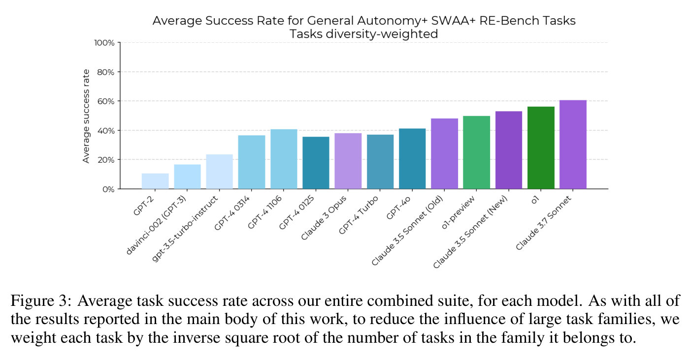

#### 3.3.2 Results

We performed 8 runs[^12] per agent/task pair and report the average results in Figure 3. As with most benchmarks, we notice a strong upwards trend over time, with recent models completing approximately 50% of all tasks, while earlier models perform substantially worse. We note that there is substantial correlation between the tasks that models can complete (Figure 22), with average correlation of approximately 0.73.

#### 3.3.3 Model success rate vs baseline time

There is a negative correlation between the time it takes a human baseliner to complete a task and the average success rate (across all models) on the task. This decrease in success rate over length (Figure 4) is well-fit by an exponential model ($R^2 \approx 0.83$ when regressing model success rate against the logarithm of human time-to-complete). Notably, the correlation of model success with log human time (0.91) is higher than the average correlation between models (0.73, see Figure 22).

We sanity check this fit by examining the human-time-to-complete of tasks that earlier versus later models can complete. As expected, pre-2023 models like GPT-2 or GPT-3 can complete tasks requiring only writing a few words, but fail all tasks above 1 minute. In contrast, recent frontier models such as Claude 3.5 Sonnet (new) and o1 can complete some tasks that take human baseliners more than 4 hours (Figure 5).

[^5]: Our results also include one task from GAIA (Mialon et al., 2024), and five tasks involving writing code that is robust to an adversary, which are not included in HCAST.
[^6]: We define context as information that experienced employees use to complete a task which is *not* explicitly in the task description or possessed by most external experts. For example, when fixing a bug in a software package, the package's maintainer may use their experience with past bugs in the same package to guess at the bug's cause, fluency with the codebase to find the bug, and knowledge of their organization's priorities to decide whether to apply a quick patch or a more thorough fix. We discuss possible effects of context in Section 6.
[^7]: As many of these attempts were done by in-house staff or were done using different methodology, we exclude these attempts from our human baseline numbers.
[^8]: A small subset of these tasks is publicly available at https://github.com/METR/public-tasks. (We do not share the content of most tasks to reduce the likelihood of AI systems accidentally or intentionally being trained on them.)
[^9]: Our open source platform for language model agent evals: https://vivaria.metr.org/.
[^10]: Non-baseline estimates were based on information including the length of QA runs that did not follow strict baseline conditions, and the length of similar tasks with successful baselines.
[^11]: Code for this agent scaffold can be found at https://github.com/poking-agents/modular-public.
[^12]: This number is approximate, because a small number of runs failed due to internal infrastructure issues.

## 4 Computing time horizon

To calculate a more intuitive metric for AI capabilities progress, we convert the performance of each model on our tasks to an estimate of their task completion time horizons.

### 4.1 From raw data to time horizon

First, the agent performance on each task is converted to a binary value (success or failure). Many tasks are naturally binary, including all SWAA tasks and the majority of HCAST tasks. Some tasks are continuously scored; these are binarized via a task-specific threshold. For example, if the task is to minimize the loss of a model, runs are binarized based on whether they achieved a loss below some threshold. Note that binarization particularly affects more challenging tasks such as RE-Bench, since current frontier models' partial progress is usually binarized to 0 (as they are below human level on these tasks).

**Figure 4.** Model success rates are negatively correlated with how much time it takes a human to complete the task. ($y=-0.07x+0.66$, $R^2: 0.83$)

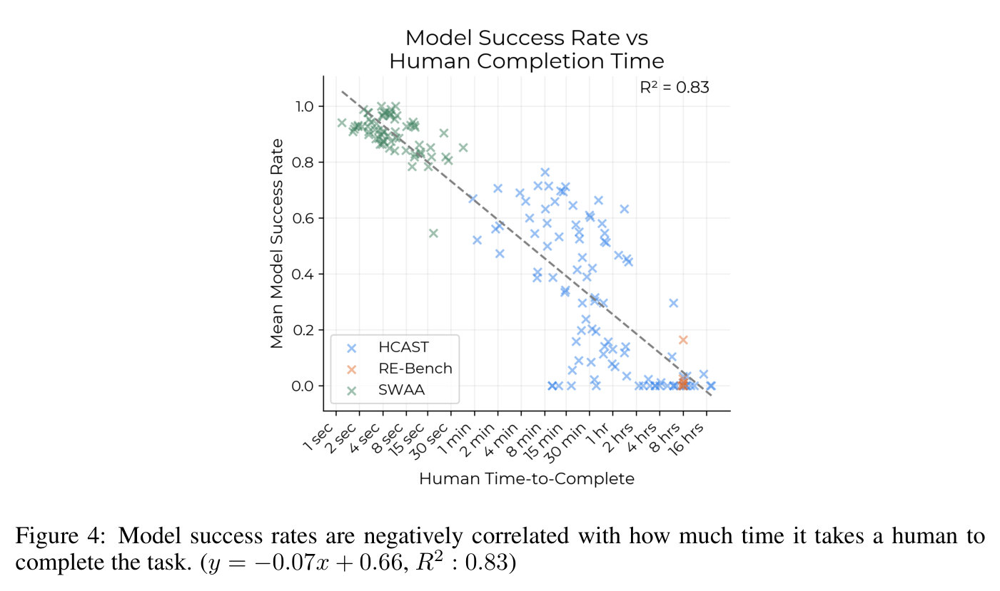

**Figure 5.** Success rates of all models on our test suite, showing the computation of time horizon as predicted 50% success rate time. The logistic fit is fairly good, though there is a jump in success rate between <1 minute tasks and >1 minute tasks, which corresponds to the boundary between SWAA and HCAST tasks.

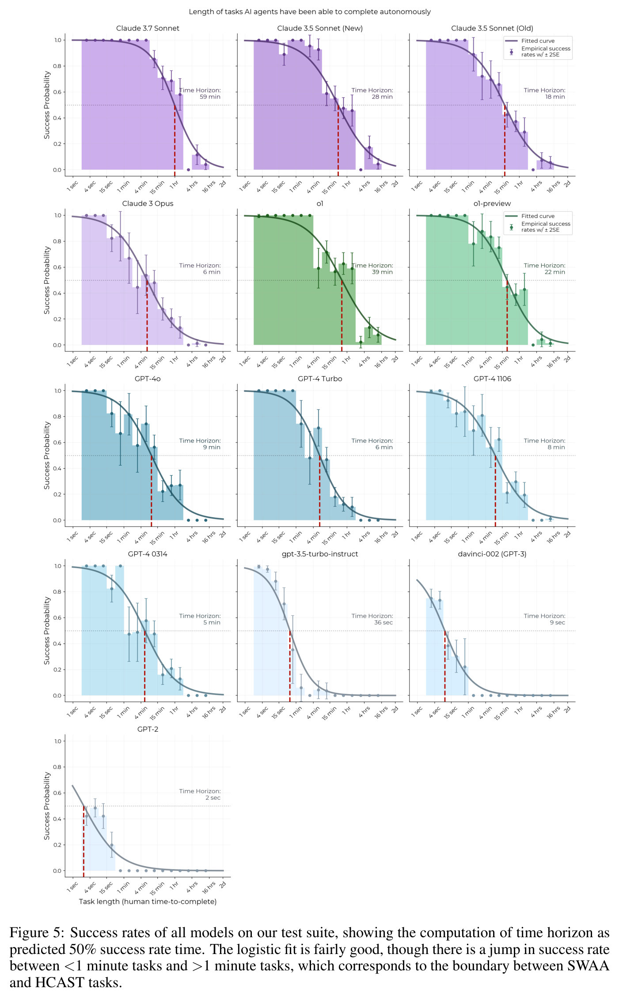

The task-specific threshold is chosen to represent human performance. For HCAST, the task-specific threshold is the same "target score" the human baseliner tries to achieve, which we also use to filter for successful runs. RE-Bench tasks have a fixed time rating of 8 hours, so the task-specific threshold is the average score of 7-9-hour human runs.

Once we have agent success rates and time ratings for each task, our approach is inspired by item response theory (IRT) (Baker, 2001). Like in IRT, we use logistic regression to find the task difficulty at which the agent has a 50% chance of success, but unlike IRT, we exploit the fact that we have human baselines to use difficulty ratings based on human time rather than ratings learned from agent performance. Specifically, we perform logistic regression using:

$$
p_{\mathrm{success}}(\mathrm{model}, \mathrm{task}) = \sigma((\log h_{\mathrm{model}} - \log t_{\mathrm{task}}) \cdot \beta_{\mathrm{model}})
$$

where $t_{\mathrm{task}}$ is the geometric mean time of successful human baselines, and $h_{\mathrm{model}}$ and $\beta_{\mathrm{model}}$ are learned parameters, with $h_{\mathrm{model}}$ representing the 50% horizon time. Further details and comparison to standard IRT methods are provided in Appendix B.4.

**Excess success rates.** Excess success rates ($\frac{S_{observed}-S_{predicted}}{S_{predicted}}$) are a metric for how much better (or worse) an AI agent performed compared to what we would expect, given a task's length and that model's ability (expected success can be seen in Figure 5). The average correlation between model excess success rates across all tasks is 0.40, indicating that AI agents still have moderately correlated performance when controlling for task length (See Figure 23 for the full correlation matrix).

### 4.2 Model horizon length vs. release date

In Figure 1, we plot the time horizons of each model against their release date—the date at which the lab first publicly announced the frontier model.[^13] In addition, we linearly regress[^14] $\log(\text{time horizon})$ against release date, finding that time horizon has doubled every 212 days with a 95% bootstraped confidence interval 171–249 days (or ±19%). Error bars are calculated via 10,000 samples from a three-level hierarchical bootstrap over task families, then tasks, then runs.

While there are wide error bars on each individual models' horizon lengths, these errors are highly correlated between models. This is because tasks at the same human time rating vary widely in difficulty for models, and sampling easy (or hard) tasks will result in a higher (or lower) horizon estimate for all models. Therefore, we are more confident in the slope of the time horizon trend than in the time horizon of any particular model. The fit is not sensitive to various hyperparameters such as regularization, weighting of tasks, and WLS vs. OLS (see Figure 12).

Horizon length on our tasks increases substantially over the entire time period from 2019 to early 2025. Base models like GPT-3 can complete some tasks requiring only writing a few words, but fail all tasks above 1 minute. Chat models like GPT-4 and Claude 3 Opus are able to complete the easier HCAST tasks with some frequency, leading to time horizons in the 5–30 minute range. However, the trend in 2024 and early 2025 may be faster, with o1 and Claude 3.7 Sonnet lying above the long-run trend. Though the gap is difficult to distinguish from noise, it is robust to methodological ablations like using continuous scoring (Appendix D).

#### 4.2.1 Time horizons at 50% success rate vs 80% success rate

**Figure 6.** Trend in 80% success rate time horizon. The doubling time is similar to the 50% plot, but horizons are substantially lower. 50% horizon trend shown in grey.

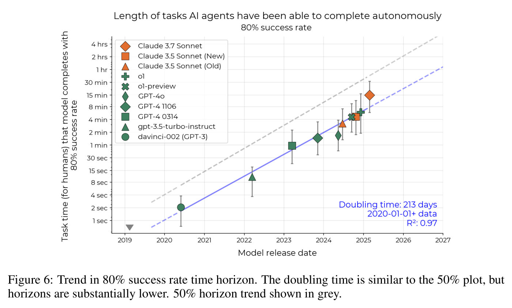

To check whether our choice of 50% success rate affects the long-run trend, we also compute the time horizon at which AI agents succeed at tasks with 80% success rate, shown in Figure 6. The doubling time in 80% time horizon (213 days) is similar to the doubling time of 50% time horizon (212 days), within margin of error. However, there is a large gap between models' 50% time horizon and 80% time horizon—Claude 3.7 Sonnet has the longest 80%-horizon among models we examined at around 15 minutes, in contrast to its 50%-horizon of 59 minutes. This gap suggests that even models that sometimes succeed on difficult and diverse tasks cannot reliably perform tasks of moderate length. Due to our limited dataset, we cannot confidently measure time horizons at very high success rates (e.g. 95%)– see Section 8.1.

[^13]: In most cases, the release date is for each frontier AI model is the same model as the one we evaluated. However, GPT-3 (davinci) and GPT-3.5 (code-davinci-002 and text-davinci-002) are closed-source and no longer available through API access, but we use their release dates for the closest available models, which OpenAI advertises as having equivalent performance: GPT-3's release date for davinci-002, and GPT-3.5's date for gpt3.5-turbo-instruct.
[^14]: Specifically, we perform Ordinary Least Squares regression on log(model horizon) = α + β · release date. In Appendix D we discuss other curve-fitting methods, and conclude that the fit is not sensitive to various hyperparameters such as regularization, weighting of tasks, or WLS vs. OLS.

## 5 Qualitative analysis

To better contextualize the observed trend of improved model performance, we examined the transcripts for the tasks where earlier models (e.g. GPT-4) do substantially worse than current models. Specifically, we categorized our task families based on the type of expertise required, and noticed that current models tend to outperform earlier models for tasks that involved ML training, reverse engineering compiled software binaries, and cybersecurity CTFs. In addition, we noticed that agents improved greatly on tasks requiring situational awareness of the AI agent's limitations or defeating an opposing strategy. This gave us five sets of task families to examine.

For each of these task family sets, we then used contractors to manually read through all runs from all models for all tasks in each of these five task families, and identified possible explanations for the improvement in AI agent performance on those tasks, as well as potential limitations. We find that models seem to have improved greatly in terms of tool use capabilities, demonstrate a markedly greater ability to adapt to mistakes (as opposed to repeating unsuccessful actions), and perform much better at parts of tasks requiring logical reasoning or code generation. However, we noticed that AI agents still seem to struggle in intuitively "messier" environments—specifically, environments without clear feedback loops, or where the agent needs to proactively seek out relevant information. We provide examples of both the improvements and these limitations in Appendix C.

To better understand the differences between current and older AI agent failures, we separately sampled 31 unsuccessful agent runs from our GPT-4 1106 agent and 32 unsuccessful runs from our o1 agent, and manually labeled them for the following exclusive categories of failures:

- **Poor planning and tool choice**: the agent generates a high level plan that seems unworkable on its own merits, or picks tools for the plan that would not accomplish the desired purpose.
- **Incorrect mental math or reasoning**: the agent performs incorrect mental math or logical reasoning at a crucial step, causing the run to fail.
- **Premature task abandonment**: The agent abandons the task in the middle of the attempt and either submits a nonsensical answer or submits a solution without checking for correctness. These failures often result from the agent submitting their answer before looking at all the pieces of code or information required to arrive at the correct solution.
- **Repeating failed actions**: The agent repeats the same behavior that doesn't make progress toward the problem, such as running a command that leads to an error over and over again, without trying other approaches.

We report the results in Table 3. We find that over a third of the GPT-4 failures resulted from repeating failed actions, compared to 2 out of 32 for o1, which we see as quantitative evidence for our claim that models seem to have improved in their ability to adapt to mistakes. Interestingly, half of the o1 failures resulted from abandoning the task prematurely, while only a quarter of the GPT-4 failures resulted from the same—this may result from o1 failures occurring on qualitatively more difficult tasks, or may reflect idiosyncrasies of o1.

**Table 3.** Number of different categories of failures for 31 failed runs by GPT-4 1106 and 32 failed runs by o1 (Section 5). Note that as o1 succeeds at more tasks, its failures correspond to more challenging tasks compared to GPT-4's failures.

| *Failure type* | GPT-4 1106 | o1 |
|---|---|---|
| Poor planning/tool choice | 4 | 6 |
| Incorrect mental math/reasoning | 6 | 7 |
| Premature task abandonment | 8 | 16 |
| Repeating failed actions | 12 | 2 |
| Other | 1 | 1 |
| Total | 31 | 32 |

## 6 External validity and robustness

To investigate the applicability of our results to other benchmarks, and to real task distributions, we performed four supplementary experiments. First, we check whether the 2023–2025 trend without the SWAA dataset retrodicts the trend since 2019, and find that the trends agree. Second, we label each of our tasks on 16 "messiness" factors—factors that we expect to (1) be representative of how real-world tasks may systematically differ from our tasks and (2) be relevant to AI agent performance. Third, we calculate AI agent horizon lengths from SWE-bench Verified tasks. We find a similar exponential trend, although with a shorter doubling time. However, we believe this shorter doubling time to be a result of SWE-bench Verified time annotations differentially underestimating the difficulty easier SWE-bench tasks. Finally, we collect and baseline a small set of uncontaminated issues from internal METR repositories. We find that our contracted human baseliners take much longer to complete these tasks than repository maintainers. We also find that AI agent performance is worse than would be predicted by maintainer time-to-complete but is consistent with contractor time-to-complete, given the AI agent success curves from HCAST + SWAA + RE-Bench tasks shown in Figure 5.

**Figure 7.** Time horizons on HCAST + RE-bench, for models starting with GPT-4 0314.

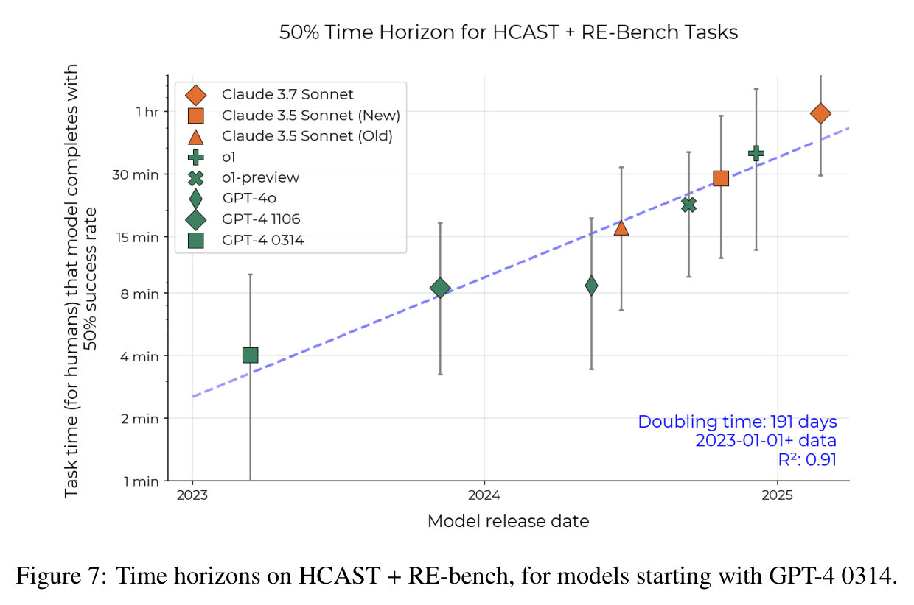

### 6.1 Retrodiction from 2023–2025 data

As part of exploratory work for this paper, we measured the time horizon of 9 frontier and near-frontier models released in 2023 and 2024, using only our HCAST and RE-Bench suites. This trend (with Claude 3.7 Sonnet added) is shown in Figure 7: time horizon doubles about every six months. Since we only had two 2023 models (GPT-4 0314 and GPT-4 1106) and a small data range (release date spanning 2 years and time horizon spanning 5 doublings), error bars were very wide. In addition, restricting our data further to 2024-only models produced a different trend with time horizon doubling about every three months, so any extrapolation into the future would not be robust.

To address these issues, we collected more data to extend the trendline into the past, developing the Software Atomic Actions (SWAA) suite to decrease the minimum human time of our task suite from 1 minute to under 2 seconds, and enabling us to measure GPT-2, davinci-002 (GPT-3) and GPT-3.5-turbo-instruct on the combined suite.

The 2023–2025 trend retrodicts the longer-term trend well (Figure 8). The measured doubling time over the whole 6 year period 2019–2025 inclusive was 212 days, which closely matches the 191-day trend based on data from non-SWAA tasks and 2023–2025 models.

**Figure 8.** The full time series for the time horizon of models, by release date. We plot in blue the regression from only 2023+ data on HCAST + RE-Bench tasks, extended into the past, and in gray the regression with all tasks (including SWAA) on the whole 6 year period. Points on the graph are models' time horizons on all data including SWAA.

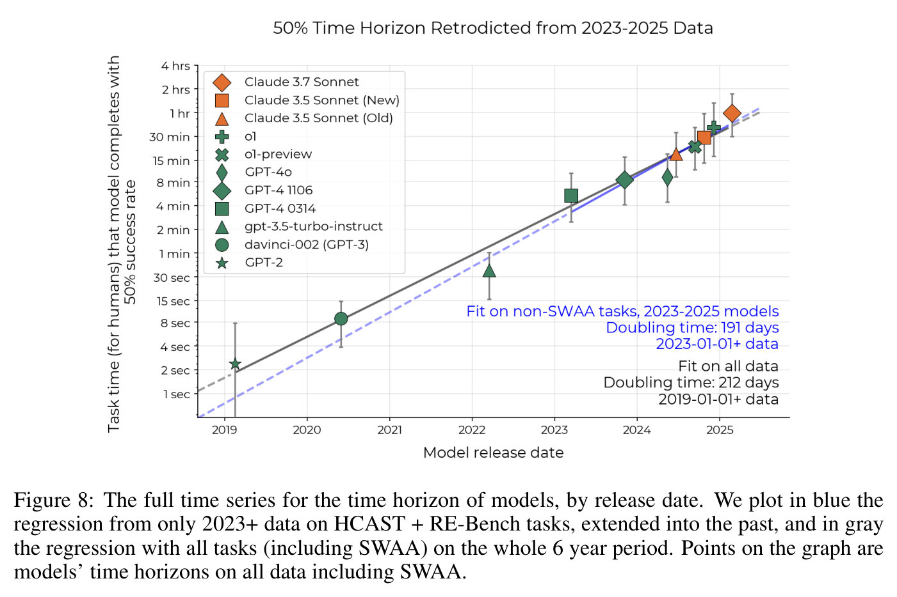

### 6.2 Messiness factors

Real-world intellectual labor often involves messy details that benchmarks usually don't include, such as being under-specified or poorly scoped, having unclear feedback loops or success criteria, or requiring coordination between multiple streams of work in real-time. We generally observed that agents struggle more on tasks that have these "messy" details (Section 5). A natural question is therefore whether agents showed similar rates of improvement on "less messy" and "more messy" tasks.

**Figure 9.** Performance trends over time for HCAST and RE-Bench tasks by length and messiness (Section 6.2). The data spans only 2023–2024 as pre-2023 models score 0 on non-SWAA tasks. Whilst our messier tasks have lower average success rates, trends in model performance improvements are not obviously slower on the high messiness split.

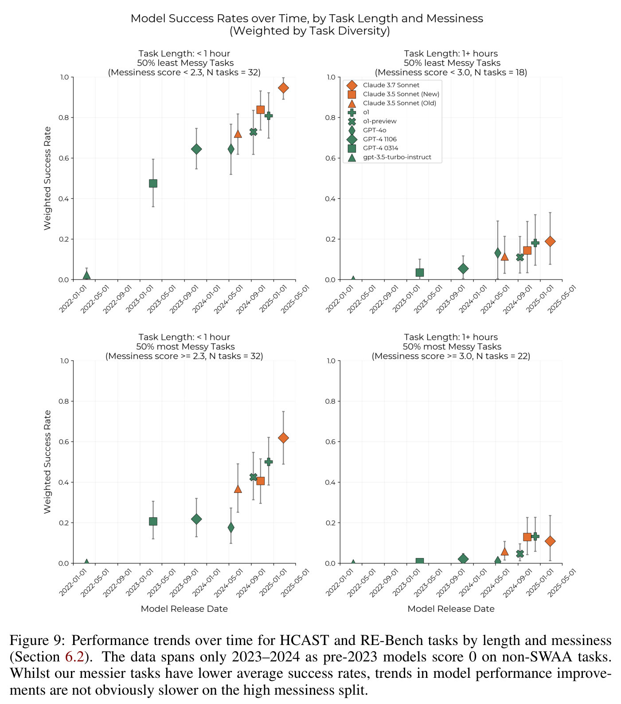

We rated HCAST and RE-Bench tasks on 16 properties that we expected to be 1) **representative** of how real world tasks might be systematically harder than our tasks and 2) **relevant** to AI agent performance. Some example factors include whether the task involved a novel situation, was constrained by a finite resource, involved real-time coordination, or was sourced from a real-world context. We labeled RE-bench and HCAST tasks on the presence or absence of these 16 messiness factors, then summed these to obtain a "messiness score" ranging from 0 to 16. Factor definitions can be found in Appendix D.4.

The mean messiness score amongst HCAST and RE-Bench tasks is 3.2/16. None of these tasks have a messiness score above 8/16. For comparison, a task like 'write a good research paper' would score between 9/16 and 15/16, depending on the specifics of the task.

On HCAST tasks, AI agents do perform worse on messier tasks than would be predicted from the task's length alone (b=-0.081, $R^2$ = 0.251), see Figure 10. An increase in task messiness by 1 point reduces mean success rates by roughly 8.1%[^15].

However, trends in AI agent performance over time are similar for lower and higher messiness subsets of our tasks. For example, on sub hour tasks, success rates increased by 40 percentage points between Jan. 2023 and May 2025 in both high and low messiness splits (Figure 9). In particular, we find no evidence of either much slower performance trends, or a plateau, specific to our higher messiness subset.

**Figure 10.** We plot the excess success rate (the observed empirical task success rate, minus success rate we would predict using the task's length, see Section 4.1) against messiness score for each task. As discussed in Section 6.2, there is a negative relationship between excess success rates and messiness.

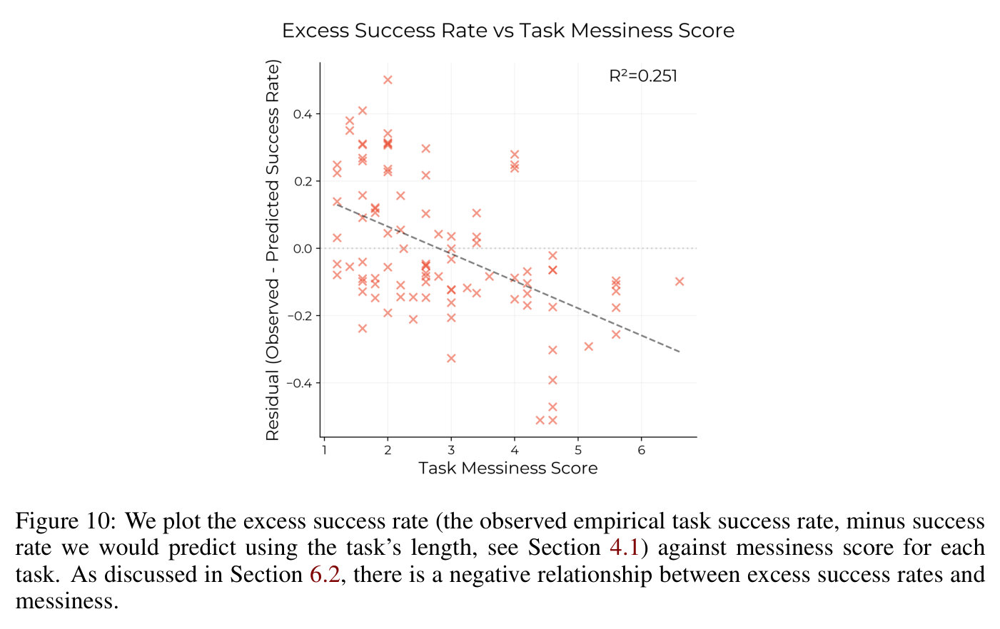

### 6.3 SWE-bench Verified

To check whether we observe similar performance trends in time horizon on other benchmarks, we apply our methodology to SWE-bench Verified. SWE-bench Verified is an industry standard benchmark for evaluating language model performance on software engineering tasks (OpenAI, 2025). All tasks in the SWE-bench Verified dataset were harvested from large open source repositories, like matplotlib or django, and then filtered to ensure they are automatically checkable and well-specified (Jimenez et al., 2024).

**Figure 11.** Performance of frontier AI models using reported SWE-bench Verified results (Section 6.3). We observe a similar exponential trend to Figure 1, albeit with a steeper slope.

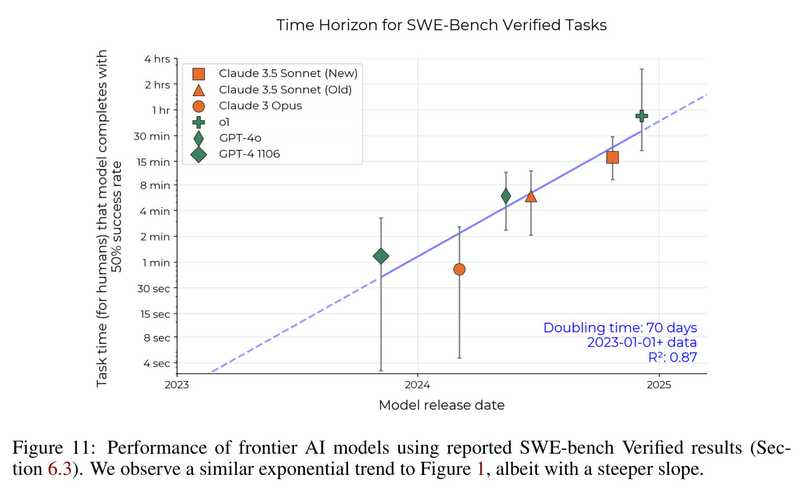

Model time horizon computed from SWE-bench Verified tasks seem to follow an exponential trend from late 2023 through 2024. However, while the doubling time predicted by HCAST + SWAA + RE-bench using 2024 models is 104 days, the doubling time predicted by the SWE-bench Verified results is shorter—around 70 days.

SWE-bench Verified time annotations were based on the expected time it would take an "engineer who has had a few hours to familiarize themselves with the codebase" to solve the issue (Jimenez et al., 2024). We found that annotator time estimates differentially underestimate how long our contract baseliners take to complete the easiest SWE-bench verified tasks. As a result, our time horizon estimates for SWE-bench Verified (which use annotator times) are likely to underestimate the time horizon of less capable models relative to contractor times, in turn shortening doubling times. For more details see Appendix D.3.

### 6.4 Internal PR experiments

We also ran GPT-4o, Claude 3.5 Sonnet (New), and o1 on five uncontaminated issues from an internal METR repository. Resolving these issues was real work performed by METR staff, so we might expect results on these tasks to better represent performance on real economically valuable tasks than a typical benchmark task.

We find that our contract baseliners take 5x-18x longer to resolve issues than repository maintainers. Additionally, AI agent performance on these issues is not inconsistent with AI agent success rate curves derived from HCAST, SWAA, and RE-Bench performance if *contractor* time-to-complete is used to measure the tasks length. However, it takes much longer for our contract baseliners to complete these tasks than repository maintainers. This suggests that time horizons may have better correspondence to the labor of a low-context human, rather than a high-context human. See Appendix B.2 for methodological details and more results.

[^15]: A linear approximation of this relationship is used for the purpose of roughly quantifying the size of this effect in an intuitive way.

## 7 Extrapolation

### 7.1 Extrapolating towards one-month-horizon AI

When forecasting when AI systems will be capable of autonomously generating large economic value and when they will be capable of catastrophic actions, it is necessary to choose a concrete threshold for horizon length. We chose one month (approximately 167 working hours for a fair comparison with humans, since humans cannot work 24/7) for two reasons. First, Ngo (2023) writes that a 1-month AGI (defined as an AI that outperforms most knowledgeable humans who are given 1 month of work hours, i.e. 167 hours, to perform the task) would necessarily exceed human performance both at tasks including writing large software applications or founding startups (clearly economically valuable), and including novel scientific discoveries.[^16] Second, one month is around the period when new hires at a company begin to complete onboarding and generate economic value,[^17] and so an AI with a horizon of 1 month could be capable of acquiring context like a human employee, allowing it to complete high-context as well as low-context tasks.

In this section, we attempt to forecast when AIs will reach a 50%-time horizon of 1 month, because it intuitively seems that a system capable of this length of task, even at 50% reliability, would be transformative for our society, including potentially being proficient in capabilities that could threaten society with catastrophic harm.

**Figure 12.** A sensitivity analysis of the extrapolated date at which frontier AI systems will have a horizon of 1 month. In each row, we apply 10,000 random perturbations to our data and find the distribution over the date of 1-month AI implied by the perturbed data. Box endpoints represent the 25th and 75th percentiles, and whiskers the 10th and 90th percentiles, with outliers not displayed. Note that this plot does not account for future changes in the trend or external validity concerns, which are responsible for the majority of our uncertainty.

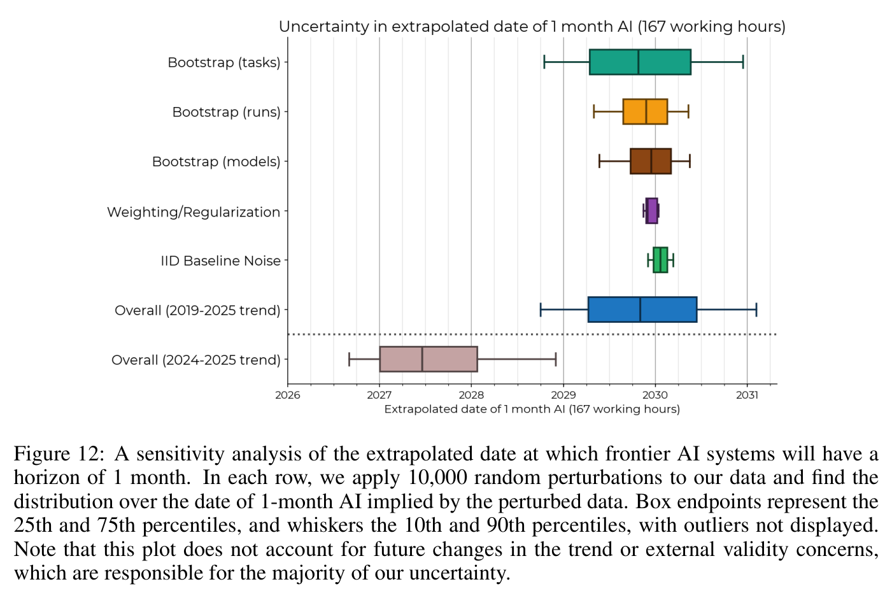

**Sensitivity analysis.** Although extrapolation is always imperfect, forecasting AI horizon lengths far into the future is much more sensitive to changes in doubling rate than to constant factors in horizon length. For example, a naive extrapolation based on o1's time horizon of 39 minutes and a past doubling time of 218 days (3.2x/year) predicts that AIs will reach a 1-month 50% time horizon (roughly 8 doublings over o1) about 4.8 years after the release date of o1. A 2x increase in doubling time would delay the 1 month point by a further 4.8 years, but a 2x constant factor decrease in horizon length would only delay it by 0.6 years.

Figure 12 shows a sensitivity analysis of our results over various sources of noise. "Bootstrap (tasks)" reflects our limited number of tasks and the fact that tasks of the same human duration vary in difficulty for models, while "Bootstap (runs)" derives from our limited number of runs; the combination of these two is shown as the confidence region in Figure 1. "Bootstrap (models)" represents the limited number of models in our dataset. "Weighting/regularization" represents methodological choices; this perturbation includes 10 hyperparameter combinations with and without task diversity weighting, and with a logistic regression regularization parameter between 0.01 and 0.2. "IID Baseline Noise" multiplies every task duration by a random factor based on the empirical distribution of baseline times. We combine these into an overall estimate of uncertainty in the past trend, and do the same for the 2024–2025 only trend (note that our confidence in this trend is much lower because there are only six models in this time span).

Because our analysis puts low probability on the growth rate of time horizon on our tasks being much slower than one doubling every 8 months, the uncertainty in the extrapolated date of 1-month AI is fairly small (80% CI width about 2 years, central estimate late 2029). Bootstrapping over our task distribution and runs contributes most of the uncertainty, representing our limited task dataset and the variance in difficulty (for models) between tasks of the same human length, as well as run-to-run variance. If future progress instead follows the 2024–2025 trend, 1-month AI would arrive sooner, with half the probability in 2027 and early 2028.

It is possible that systematic biases and alternate methodologies have a greater impact on forecasts, and we discuss these in Appendix D. In addition, due to the inherent difficulty of predicting the future, real forecasts will have larger error than this naive extrapolation, which we discuss below.

### 7.2 Difficulties in extrapolation

Most of our uncertainty about the future comes from (a) applicability to real tasks, partly discussed in Section 6, and (b) future changes in the time horizon growth rate.

#### 7.2.1 Systematic differences between our tasks and real tasks

The tasks we use to benchmark AI capabilities are systematically different from real tasks. These differences could result in the trends we observe on our tasks not generalizing to real world tasks. For instance, all SWAA, HCAST, and RE-Bench differ from real-world tasks in the following ways:

- **Automatic scoring** All tasks we use are automatically scorable, meaning a piece of code running in the task environment determines the final score. This imposes constraints on e.g. the format of solutions, that tend to reduce task open-endedness, and the need for sensible value judgments.
- **No interaction with other agents** None of our tasks involve interacting with other autonomous agents. Coordinating with, or competing with, other agents seems likely to increase task difficulty. For instance, by increasing the importance of strategic decision-making, real-time coordination, and predicting the actions of other complex agents.
- **Lax resource constraints** None of our SWAA tasks, and few of our HCAST tasks saliently involve making efficient use of a limited resource—a common constraint in real-world tasks.
- **Unpunishing** Similarly, very few of our tasks are punishing of single mistakes.[^18] This is in part to reduce the expected cost of collecting human baselines. Real world tasks can often be more punishing, for instance, when they involve competing against other agents. For instance, a single blunder in a chess game can greatly reduce the chance of winning the game.
- **Static environments** Our tasks typically use environments that do not significantly change unless directly acted upon by the agent. In contrast, real tasks often occur in the context of a changing environment.

We attempted to measure how these systematic differences might affect AI agent performance in Section 6.2, by including the above properties as "messiness" factors. We found that though the absolute performance on "messier" tasks was lower, the trends in performance were similar to less messy tasks. Even so, these systematic differences cast doubt on whether the rapid performance improvements seen on our tasks (and other benchmarks like SWE-Bench Verified) will generalize to real world tasks.

Regardless of whether or not this trend generalizes to real world tasks, we believe our results to be significant. If our results do not generalize to real tasks, then benchmarks like HCAST and SWE-Bench Verified may be insufficient for forecasting AI capabilities on real tasks, and we may need more realistic benchmarks. On the other hand, if our results do generalize to real tasks, then extrapolating our trend predicts that AIs capable of automating a month of human software development will be made before 2032.

#### 7.2.2 Future changes in time horizon trends

Here, we discuss three additional possible factors that could significantly change the time horizon growth rate: agency training, compute scaling, and automation of AI research and development.

**Agency training** Horizon growth since 2024, which may be faster than the long-term trend, could be explained by researchers post-training models to be more agentic (that is, capable of taking many sequential actions towards completing a task) using outcome-based RL. Research into making models capable and agentic is likely to continue. Future agency training could be faster than the long-run trend (since post-training may be more compute-efficient than pretraining at increasing horizon length). But 2024–2025 agency training could also be a one-time boost from picking low-hanging fruit, in which case horizon growth will slow once these gains are exhausted. Overall, we think agency training is more likely to increase the time horizon growth rate compared to the 2019–2024 trend.

**Compute scaling** Between the release of GPT-2 and today, the compute used to train the most impressive frontier language models has increased by at least a factor of 10,000x (Epoch AI, 2024), with training compute usage doubling every 6–10 months (Sevilla et al., 2022). More recently, models like o1 and o3 have began to use more compute at inference time. It is unclear whether there is sufficient capacity to expand either training or inference compute by many more orders of magnitude in the next 5 years. However, algorithmic improvements, which have historically decreased the compute requirements for a fixed performance level (Erdil and Besiroglu, 2023) (Ho et al., 2024), can substitute for compute limitations. We think that limits to compute scaling will slow the growth of AI agent time horizons somewhat, but be partially compensated by more investment into algorithmic improvement.

**Automation of AI R&D** The main inputs to AI research and development are compute and researcher time. If future AI systems are capable of substituting for human research engineers and/or increasing the compute-efficiency of training, the rate of AI progress will increase. We think it is likely that there will be substantial AI R&D automation once frontier AI time horizon reaches tens of hours, shortening the time from then until one-month-horizon AI.

[^16]: Note that our forecasts concern AI with a 1-month horizon on software tasks, not 1-month AGI, because we evaluate models only on software and research tasks. Nevertheless, given past correlations in different areas of AI performance, 1-month (167 hours) time horizon AI may be significantly generally capable.
[^17]: Onboarding "can last from a few weeks to more than a year" (Zielinski, 2019), and employees often start generating economic value midway through the onboarding process.
[^18]: With the exception of submitting an answer too early on HCAST tasks.

## 8 Discussion

### 8.1 Measuring and interpreting time horizon

Although time horizon is an intuitive measure of AI agent capability, measuring it requires a large dataset annotated with human time, and time horizon is always measured relative to a task distribution and baseliners' levels of context and skill.

**Context and skill effects**

At real companies, junior software engineer hires often take weeks of onboarding to begin contributing economic value. The human baseliners that determine the length of our tasks have much less context than average employees, potentially *increasing* measured task length. Our tasks are designed to require minimal context, which somewhat mitigates this problem; our internal PRs (Section 6.4) were not designed this way, and so baseliners took many times longer than employees. However, highly skilled baseliners can also complete tasks far faster than average employees. Our expert baseliners are likely much more skilled than the average software engineer, potentially *decreasing* our measured task length.

**Task distribution effects** Figure 4 shows that AI agent success rate is imperfectly predicted by human time-to-complete, meaning that other factors also substantially influence the difficulty of tasks. When models are measured in different domains of intellectual labor like research mathematics, computational biology, or law, we expect their time horizons to differ.

**Measuring extreme time horizons** Accurately measuring that the X%–time horizon of an AI agent is about $t$ minutes requires many tasks of human length $t$ that the AI agent completes with a success rate of about X%. This has two implications. First, accurately measuring very long time horizons requires a dataset of difficult tasks with long human baseline runs, which can be impractical to construct, especially because success criteria for realistic difficult tasks are often complex enough to require manual grading. Second, measuring time horizons at extremely high success levels– 95%, 98%, or higher– requires very large task datasets with near-zero label noise that cover the population of tasks they are meant to represent.

**AGI will have "infinite" horizon length** An infinite time horizon does not mean an arbitrarily capable AI, merely the ability to complete tasks that take humans an arbitrarily long length of time. If an artificial general intelligence (AGI) is capable of completing *all* tasks expert humans can with a success rate of at least X%, its X% time horizon will necessarily be infinite. Therefore, if such systems are ever developed, the long-term trend in time horizon will be faster than exponential, with an asymptote at the date of AGI deployment.

**Human time horizon measurements** In theory, one could also measure the time horizon of a human or population of humans. However, there are both theoretical and practical difficulties to doing so. We discuss this more in Appendix B.1.1.

### 8.2 Limitations and future work

We believe that there are several ways in which our work could be improved.

**More models with better elicitation**

In general, we find that properly eliciting models can make a very large difference in their performance.[^19] We have put a limited amount of effort into eliciting models to get good performance on our tasks, so while our results are a reasonable lower bound, some models may have somewhat greater capabilities than we demonstrate. The most work was done to elicit o1 and the original Claude 3.5 Sonnet, each of which had around 2-3 engineer weeks of iterative development. All other models use the same scaffolding with at most minor changes. Future work could replicate our results with more effort spent on eliciting the full capabilities of frontier models.

**More rigorous human baselining**

Our per-task human time estimates are likely noisy due to relatively small sample size, and potentially also systematically skewed in various ways. Most notably, we select only successful completions of a task, and encourage baseliners to give up on tasks they may not complete in a reasonable amount of time. Our baseliners' skills also vary significantly, and a wide variety of skills are relevant to our tasks. Though we attempt to match baseliners with appropriate tasks, this process is unlikely to be perfect. From manual reviews of baseline attempts, we also observe that humans sometimes simply give up even when the task seems within their capabilities, and it is unclear what selection effects are produced on the distribution of success times as a result. See See Appendix B.1.1 for further discussion of how bias in human baseline times could affect our results. Future work could replicate our results with more rigorous human baseliner selection or explore how sensitive the results are to methodological choices around human baselining.

**More natural, varied tasks**

There are reasons to believe that our task distribution is systematically different from the distribution of economically valuable work (and perhaps systematically different than the distribution of risk-model relevant tasks). We explored some of these reasons in Section 6, but there remain many differences that we did not explore. For example, the modality of interaction in our tasks is also relatively narrow—for example, none of our tasks require the use of a mouse. None of our tasks require cooperating or competing with humans or other agents,[^20] while real software engineering or ML research involves communicating and coordinating with managers and other engineers or researchers. Many real-world tasks require very high reliability, and these are underrepresented in our dataset due to the difficulty of measuring models on these tasks. Most importantly, the tasks we study are heavily skewed toward software engineering and ML research. Future work could explore how the capabilities of AI agents are progressing in other domains.

**More use of inference compute** Our scaffolds made relatively limited use of inference-time compute. When assuming that the human expert is compensated at \$143.61/hour (average L4 Engineer salary at Google divided by 2,000 hours), more than 80% of successful runs cost less than 10% of what it would cost for a human to perform the same task. (Figure 13). This implies that if inference-time computation could be used to improve performance, there is substantial room to do so while still remaining economically competitive with human experts. Previous research has found that techniques such as best-of-k can substantially improve performance on a subset of these tasks, (Wijk et al., 2024) and better use of inference-time compute may lead to substantially different scores.

**Data analysis** The 2024–2025 trend appears faster than the 2019–2025 trend, but due to the small number of models it is unclear if this is noise. Future work should include hypothesis testing to detect a possible 2024 slope change, and more sophisticated statistical methods to create credible intervals for an overall forecast. We also lose some information in the multiple stages of estimation—conversion of baseline data to task difficulty ratings, time horizon computation, and linear regression to find the trend—and end-to-end methods could be more data-efficient.

**Figure 13.** Cost of a successful run using an LLM agent as a fraction of the cost of the salary of a human expert performing the same task.

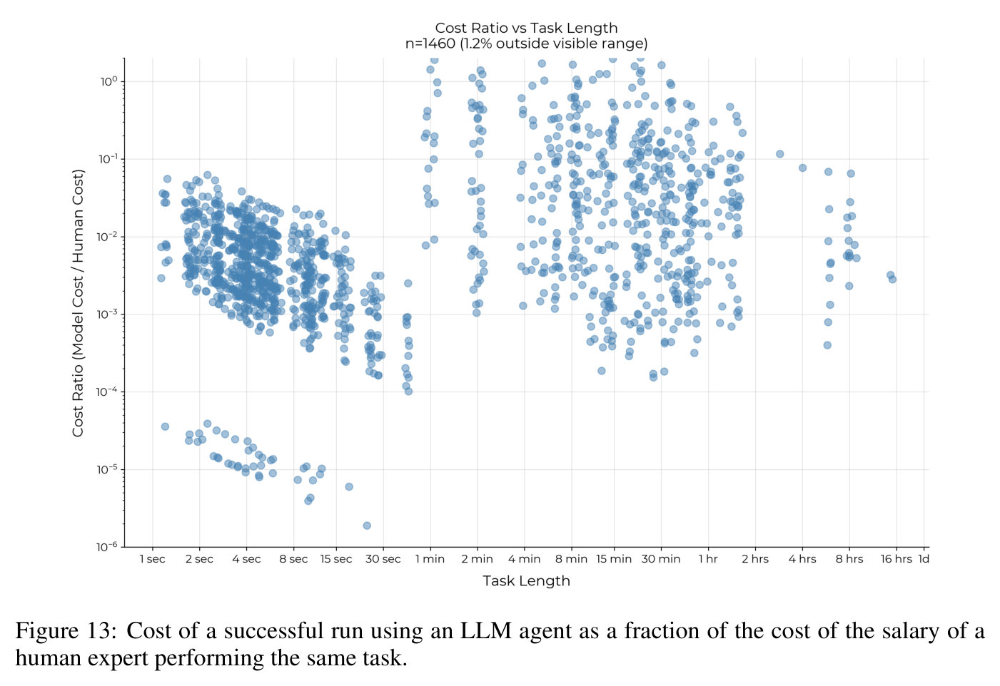

### 8.3 Summary

In this paper, we proposed an intuitive, quantitative metric for AI capabilities: the task completion time horizon, which relates AI performance on tasks to the typical length of time human experts require to complete the tasks. We constructed a dataset of 66 shorter SWAA tasks, combined these with tasks from RE-Bench and HCAST, and conducted 236 human runs on SWAA tasks to estimate the difficulty of the tasks, combining these difficulty estimates with baselines collected from RE-Bench and HCAST. To measure the trend in time horizon, we benchmarked 11 frontier AI models released between 2019 and 2025 on our dataset, calculated the time horizon of each model (Section 4), and then plotted this against release date.

We observed that the 50% task completion time horizon on our tasks has been growing exponentially from 2019–2025 with a doubling time of approximately seven months (Figure 1), a similar trend to our exploratory work on the trend since 2023 without SWAA data (Section 6.1). Measuring the 80% time horizon revealed a similar exponential trend, though these horizons are approximately 5x shorter than the 50% horizons (Section 4.2.1). Our qualitative analysis (Section 5) identified several factors driving this progress. We also noted important limitations of current systems, particularly their lower performance on less structured, "messier" tasks (Section 6.2).

To investigate the extent to which our observed trend is externally valid (Section 6), we replicated our methods on SWE-bench Verified (Section 6.3) and analyzed the impact of task "messiness"" on model performance (Section 6.2). We observed a similar exponentially increasing time horizon for both SWE-Bench and subsets of our tasks categorized by low and high messiness. However, due to systematic differences between these benchmarks and real-world tasks, these results may still not generalize to actual real-world tasks.

Finally, we attempt to extrapolate the trend on our tasks to one-month (167 hours) AI (Section 7.1), finding that if both the trend continues and observed performance trends generalize to real-world tasks, an 80% confidence interval for the release date of AI that can complete 1-month long software tasks spans from late 2028 to early 2031 (Section 7.2).

[^19]: This is a common obervation; see e.g. the improvements to software development capabilities from AIDE (Jiang et al., 2025) or METR's recent work on KernelBench: https://metr.org/blog/2025-02-14-measuring-automated-kernel-engineering/.
[^20]: See Xu et al. (2024) for an example of a recent benchmark that requires multi-agent interaction in a relatively realistic setting.

## Acknowledgments

The authors thank the following reviewers for feedback on draft versions of this paper. Ryan Greenblatt, Aaron Scher, Romeo Dean, Mike Knoop, Jeff Wu, Steve Newman, Rohit Krishnan, Taren Stinebrickner-Kauffman, JS Denain, Jacob Pfau, Seb Krier, Anton Troynikov, Max Henderson, Ajeya Cotra, Max Nadeau, Tamay Besiroglu, Nate Thomas. The authors thank Charles Foster and Michael Chen for their support with the publication.

We especially thank the following reviewers for substantial feedback: Sara Fish, David Duvenaud, Eli Lifland, Holden Karnofsky, and Rif A. Saurous. We also thank Stephanie He for her graphic design work on Figure 2, and Ryan Greenblatt for input on the scoring methodology.
