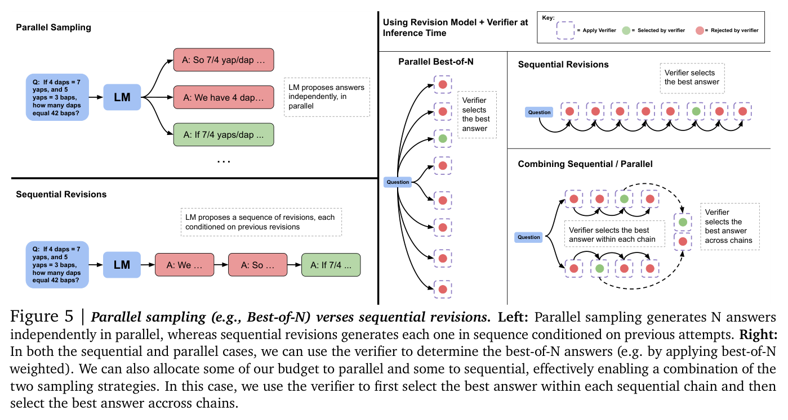
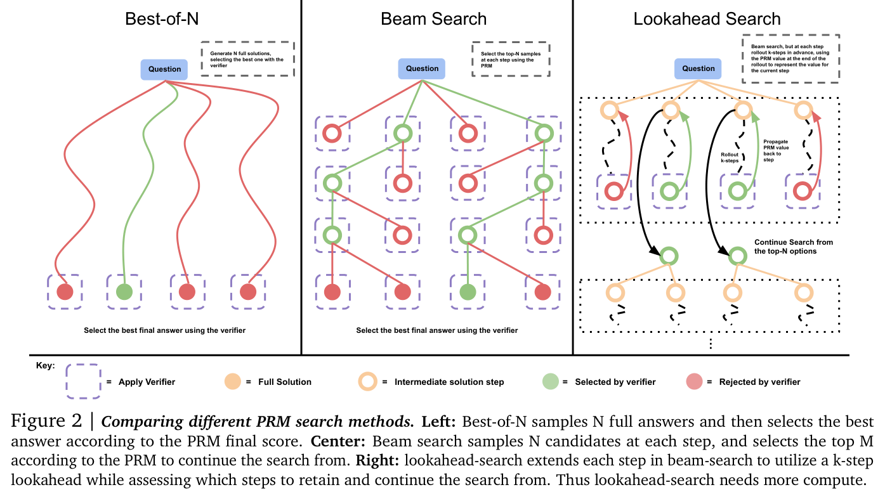
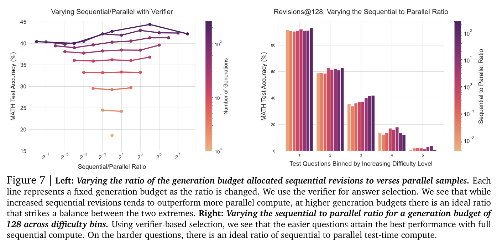
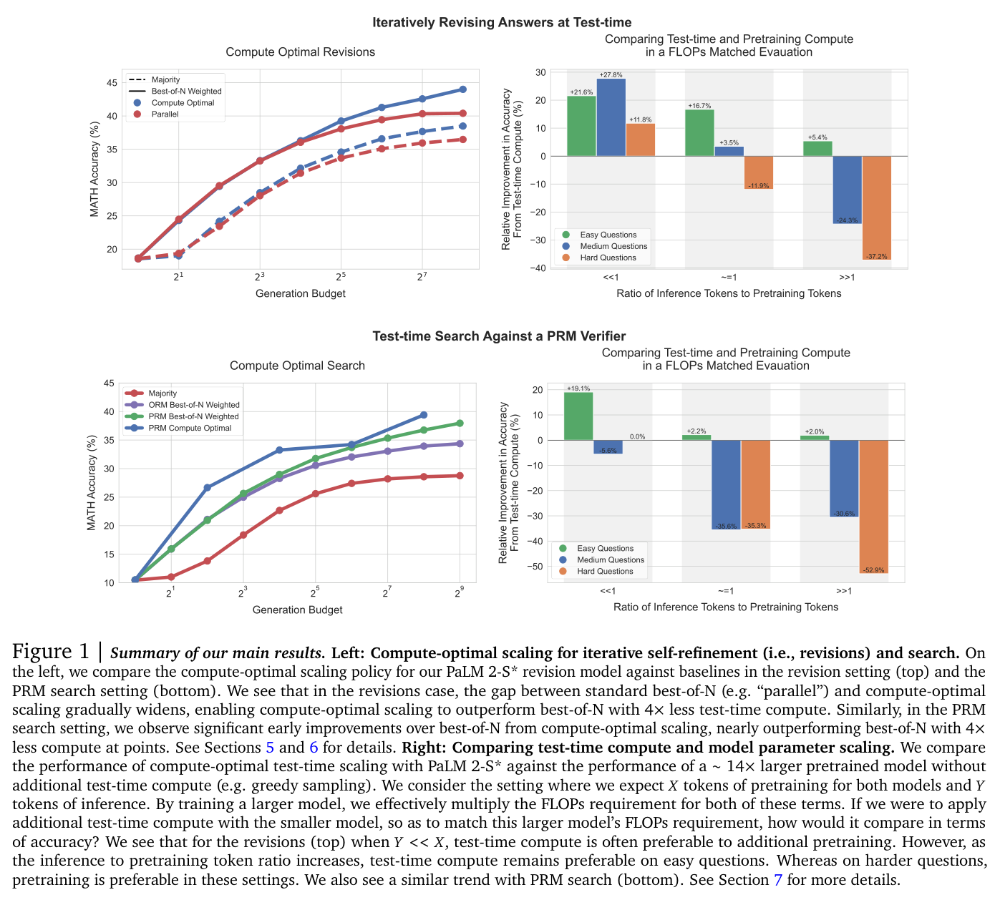

# Lecture 2 — Test-Time Compute Scaling

This lecture is about making a model better **without changing its parameters**: spending more
computation when it answers. It builds the case in four steps, one per reading. *Large Language
Monkeys* shows that simply sampling many answers raises the fraction of problems a model can solve,
and that this **coverage** grows predictably with the number of samples — an inference-time scaling
law. *How Do Large Language Monkeys Get Their Power (Laws)?* explains why that law is a power law: a
long tail of very hard problems. Coverage only becomes accuracy if something can pick the right
answer, and in domains without a verifier the common selection methods stall — the
**generation–verification gap**. Snell et al. then widen the menu of test-time strategies
(sequential revisions, search guided by process reward models), show that the best one depends on
how hard the question is, and ask when test-time compute beats a bigger pretrained model. *Archon*
closes by treating the combination of inference-time techniques as an architecture to be searched.

The captions do not name the lecturer, so this page does not either. The lecturer refers to
Large Language Monkeys and to Weaver as work "we" did, and says the course TA is a co-author of
Archon (≈45:51).

[Edited transcript](../raw/transcripts/02-test-time-compute-scaling.md) ·
[verbatim captions](../raw/transcripts/original/02-test-time-compute-scaling.md) ·
[video](https://www.youtube.com/watch?v=-Ggc37xLj_Y) ·
[course website](https://cs329a.stanford.edu/) · [sources](../sources.md)

> **Numbering.** This is catalog position 2 ("Part 2 | Test-Time Compute Scaling") and site schedule
> row 2 (Fri Sep 26). The mapping is confirmed: the lecture discusses all four of the readings the
> site lists for row 2.

## Readings

The course publishes no slides; these four papers, listed on the course site for this lecture, are
its course material. Their full text is in this KB, transcribed from the arXiv LaTeX source under
CC BY 4.0. Cite them by section, figure or table.

| Reading | Full text in this KB | Where the lecture covers it |
|---|---|---|
| Brown et al. (2024), [Large Language Monkeys: Scaling Inference Compute with Repeated Sampling](https://arxiv.org/abs/2407.21787) | [main body](../raw/papers/02-large-language-monkeys.md) · [appendix](../raw/papers/02-large-language-monkeys-appendix.md) | ≈0:52–7:10, 11:53–19:04 |
| Schaeffer et al. (2025), [How Do Large Language Monkeys Get Their Power (Laws)?](https://arxiv.org/abs/2502.17578) | [main body](../raw/papers/02-monkeys-power-laws.md) (appendices not transcribed) | ≈7:10–11:08 |
| Snell et al. (2024), [Scaling LLM Test-Time Compute Optimally can be More Effective than Scaling Model Parameters](https://arxiv.org/abs/2408.03314) | [main body](../raw/papers/02-scaling-test-time-compute-optimally.md) (appendices not transcribed) | ≈26:55–45:03 |
| Saad-Falcon et al. (2024), [Archon: An Architecture Search Framework for Inference-Time Techniques](https://www.arxiv.org/abs/2409.15254) | [main body](../raw/papers/02-archon.md) (appendices not transcribed) | ≈45:03–1:03:05 |

**About the figures on this page.** Each image is the paper's own figure, cropped from the published
PDF with its printed caption. This KB does not read values off charts: what a figure shows is what
its caption and the paper's text say, and the one-line captions below restate only that.

## Three stages, and where this lecture sits

The lecture opens with the three stages of LLM development (≈0:05). **Pre-training** historically
takes the most time — months, on a great many GPUs, over trillions of tokens. **Fine-tuning** has
historically used orders of magnitude less data and compute. **Inference** is where the model gets
used, and the lecture's subject is the ways that, at inference time, "we can make the model be better
and become more useful without changing the parameters of the model and without any fine tuning of
the models" (≈0:52).

## Repeated sampling: Large Language Monkeys

The name recalls the infinite monkey theorem, introduced in [lecture 1](01-course-overview.md). The
idea: instead of answering a problem once, ask the model the same problem again and again — 10 times,
100 times, more — and let a **verifier** say which of the responses is correct; that response is the
system's output (≈0:52–1:39).

*Brown et al. (2024), Figure 1: generate many independent candidates at positive temperature, then
use a domain-specific verifier such as unit tests to select the final answer.*

The paper names the two properties that decide whether this works (§1): **coverage** — as samples
increase, what fraction of problems can be solved by *any* generated sample — and **precision** —
how often the correct samples can be identified. In coding, coverage is the familiar $\text{pass@}k$. The
paper estimates it without bias from $N$ samples per problem, of which $C_i$ are correct for problem
$i$ (§2, Equation 1):

$$\text{pass@}k = \frac{1}{\#\text{ of problems}} \sum_{i=1}^{\#\text{ of problems}} \left(1 - \frac{\binom{N - C_i}{k}}{\binom{N}{k}}\right)$$

The headline is that repeated sampling lets weaker models overtake stronger ones. The lecture's
example is Llama 3 8B or 70B, which with one attempt is not as capable as GPT-4o, but with repeated
sampling and correct selection does better than "these larger and proprietary ones" across hard math,
coding and question-answering problems (≈1:39–2:25). The lecturer's reading: the models "already know
the answers to these hard problems, and just by doing this repeated sampling, we are eliciting and
surfacing those answers" (≈2:25). In the paper, sampling up to 10,000 times per problem raises Gemma-2B's
coverage on CodeContests from 0.02% to 7.1% (§2.2), and on SWE-bench Lite the fraction of issues
DeepSeek-Coder-V2-Instruct solves rises from 15.9% with one sample to 56% with 250, above the 43%
single-attempt state of the art at the time (Abstract; §2.1).

*Brown et al. (2024), Figure 2: across five tasks, coverage increases as the number of samples
grows, including the 15.9% to 56% rise on SWE-bench Lite.*

The lecture says repeated sampling has worked "across pretty much any domain that we have tried",
including agentic benchmarks like SWE-bench, and shows a chart of coverage for 1 to 1,000 samples on
which a DeepSeek model — "I believe this was the DeepSeek-V3 model" — outperforms Claude 3.5 and
o1-preview after 1,000 samples (≈3:13–4:00). **That chart is not in any of this lecture's readings**
(the Monkeys paper's SWE-bench results use DeepSeek-Coder-V2-Instruct and 250 attempts), so its
source and numbers cannot be checked here. The point made with it stands on its own: where unit
tests can select the correct sample, "we have an end-to-end automated way to create a more capable
model" out of an open-source one (≈4:00).

## An inference scaling law

Pre-training has scaling laws that predict how test loss falls with data, compute and parameters
(see [scaling laws](scaling-laws.md)); the lecture's claim is that inference has one too (≈4:00–4:49).
The relationship between coverage and the number of samples $k$ drawn in parallel follows what the
lecture calls "an exponential power law", with coefficients found by curve fitting (≈4:49–5:37). The
paper calls it an **exponentiated power law** and writes it for coverage $c$ with fitted parameters
$a, b \in \mathbb{R}$ (§3.1, Equations 2–3):

$$\log(c) \approx a k^{b} \qquad\Longleftrightarrow\qquad c \approx \exp\!\left(a k^{b}\right)$$

The lecture stresses that the predicted curve "for the most part, very closely follows" the measured
coverage across Llama 3, Gemma and Pythia models from 70 million to 70 billion parameters, that even
the 70M model shows it, and that it holds across domains (≈5:37–7:10). The practical use: to reach a
target coverage, you can predict how many samples you will need and how much compute to allocate
(≈6:23). The paper is more guarded — "these laws are not as exact as training scaling laws (most
strikingly on MiniF2F-MATH)", but they are "encouraging early evidence" (§3.1).

*Brown et al. (2024), Figure 5: exponentiated power-law fits to coverage curves for most tasks and
models; the caption flags Llama-3-8B-Instruct on MiniF2F-MATH as one that does not follow the trend
closely.*

## Why a power law? A long tail of hard problems

The lecture then asks why coverage should follow a power law at all, since the single-problem
calculation predicts something else (≈7:10). If problem $i$ is solved by one attempt with probability
$\text{pass}_i@1$, then $k$ independent attempts all fail with probability $(1 - \text{pass}_i@1)^k$,
so

$$\text{pass}_i@k = 1 - (1 - \text{pass}_i@1)^k ,$$

which approaches 1 **exponentially** fast in $k$ (≈7:58). Yet across a whole suite of problems the
observed behaviour is a power law (≈8:45). This is the puzzle Schaeffer et al. set up: on each problem
$-\log(\text{pass}_i@k)$ falls exponentially with $k$, while the negative log of the *average* success
rate falls as a power law (Figure 3 caption), written

$$-\log\big(\text{pass}_{\mathcal{D}}@k\big) \approx a\,k^{-b},$$

where $\text{pass}_{\mathcal{D}}@k$ averages $\text{pass}_i@k$ over the distribution $\mathcal{D}$ of
single-attempt success rates across the benchmark's problems (§3, Equation 10). This is the same law
as Brown et al.'s: coverage $c$ is $\text{pass}_{\mathcal{D}}@k$, and since $\log c \le 0$ and falls in
magnitude as $k$ grows, their fitted $a$ and $b$ are negative — the sign convention differs, not the law.

*Schaeffer et al. (2025), Figure 2: the aggregate power law (left) arises from per-problem exponential
scaling (centre) combined with a distribution of single-attempt success rates that has a left
power-law tail of small values (right).*

The answer the lecture gives is that "the sufficient and necessary condition" for the observed
scaling law is **a long tail of hard problems** (≈9:32). The paper states it precisely (§3, Theorems
3.1 and 3.2): $-\log(\text{pass}_{\mathcal{D}}@k)$ scales as a power law in $k$ with exponent $b$ if and
only if the density of single-attempt success rates behaves like a power law near zero,

$$p_{\mathcal{D}}(\text{pass}_i@1) \propto (\text{pass}_i@1)^{\,b-1} \quad\text{as } \text{pass}_i@1 \to 0^+ .$$

Its intuition: every problem is being solved exponentially quickly, but some have
$\text{pass}_i@1$ so small that they stay unsolved for many, many attempts, and polynomial density
near zero "piles up" enough of them that the aggregate improves only at a power-law rate (§3). The
lecture reports that this condition holds empirically: most problems are easy and solved at $\text{pass@}1$,
and as difficulty rises there is a long tail of problems with lower and lower $\text{pass@}1$ (≈9:32–11:08).

*Schaeffer et al. (2025), Figure 4: distributions of single-attempt success rates have power-law-like
left tails, well fit by scaled Beta-Binomial distributions; the caption notes Llama 3 8B IT lacks
such a tail and correspondingly did not show aggregate power-law scaling under Best-of-N
jailbreaking.*

The paper goes a step beyond the lecture: fitting the distribution of $\text{pass}_i@1$ gives an
estimator of the power-law exponent with "an order of magnitude lower relative error, or
equivalently, $\sim$2-4 orders of magnitude less inference compute" (Abstract; §5).

## Why this changes the economics

Companies have spent hundreds of millions or billions of dollars on pre-training, much less on
fine-tuning, and almost nothing per inference call, when inference was one back-and-forth with the
user (≈11:08). The new paradigm spends "a whole lot more compute on inference" to increase
capability, and that compute can run **offline**: agents can be released to keep generating tokens and
improving their answers (≈11:53).

The Monkeys paper puts numbers on the trade (§2.3). Holding inference FLOPs fixed, the best model size
depends on the task: on MiniF2F, GSM8K and MATH, Llama-3-8B-Instruct always reaches higher coverage
than the 70B model, while on CodeContests the 70B model is almost always more cost-effective. In
dollars, on SWE-bench Lite with the same agent framework (Table 1):

| Model | Attempts | Issues solved (%) | Total cost (USD) | Relative total cost |
|---|---|---|---|---|
| DeepSeek-Coder-V2-Instruct | 5 | 29.62 | 10.8 | 1x |
| GPT-4o | 1 | 24.00 | 39 | 3.6x |
| Claude 3.5 Sonnet | 1 | 26.70 | 51 | 4.7x |

## Verification is what turns coverage into accuracy

A pile of samples is only useful if you can tell which are correct, so repeated sampling needs
**automated verification** (≈11:53). How hard that is depends on the domain (≈12:43–15:10):

- **Formal proofs.** For some math problems a proof can be checked step by step by formal proof
  software.
- **Unit tests** for code. Writing a unit test is "arguably" much simpler than writing the whole
  program, so tests can even be written by humans and used as the verifier.
- **"AI as a compiler"**, a project in the lecturer's lab: generate low-level code such as CUDA from a
  PyTorch source, and verify it by checking that both produce the same output for any input — no
  judgement about the code itself is needed (≈13:29). On
  [KernelBench](https://arxiv.org/abs/2502.10517), a CUDA-generation benchmark, coverage again
  improves as more samples are taken, with what is "by default" a perfect verifier (≈14:21).
  KernelBench is a reading the site lists under a later session (schedule row 13); it is not ingested
  for this lecture.
- **Translation between programming languages**, such as porting Python or C++ to Java, where
  equivalence is much easier to measure (≈15:10).

Even automatic verifiers are imperfect, and the Monkeys paper gives two cautionary tales (§4.2):
11.3% of SWE-bench Lite problems have **flaky test suites** that give inconsistent results on the same
candidate, and of the 122 CodeContests test problems with Python3 solutions, 35 have "correct"
reference solutions that **fail their own tests**. A student asks whether coverage on software tasks is
real; the answer is that a failure mode is always possible "if your unit tests don't have true
coverage of the code, so the quality of the verifier matters" (≈26:08).

## The generation–verification gap

Where no verifier exists, "there is a large gap between best of n methods such as majority voting and
model-based rankers and what is the true coverage of the model" (≈15:10). The lecture's chart compares
**majority voting** — pick the answer that appears most often — and **reward models** that score each
answer, against coverage, which is what a perfect selector would achieve (≈15:58–17:30).

*Brown et al. (2024), Figure 7: majority voting, reward-model best-of-$N$ and reward-model majority
voting all fail to reach the coverage upper bound and saturate before 100 samples.*

Majority voting plateaus after 10 or 50 samples, and the gap is larger on the harder MATH dataset
than on GSM8K (≈16:44). Reward models — "LLMs that are trained to score the response quality" — leave
a large gap too, and this is what the lecture calls the **generation verification gap**: models can
generate many good responses, and the gap measures how much of that we fail to capture (≈17:30). The
paper's numbers: with Llama-3-8B-Instruct on MATH, coverage rises from 82.9% at 100 samples to 98.44%
at 10,000, while the best selection method moves only from 40.50% to 41.41% (§1).

Why majority voting fails is visible in how rarely the hardest problems are solved: some are solved
once, twice or three times in 1,000 or 10,000 samples, so a vote cannot surface them; on simpler
GSM8K problems voting works for many, but still not for the hardest (≈17:30–19:04).

*Brown et al. (2024), Figure 8: for each GSM8K and MATH problem, the fraction of 10,000 samples that are
correct, green where self-consistency picked the right answer and red where it did not; many problems
have correct solutions that are sampled infrequently.*

Is there anything for a verifier to find? The paper hand-graded 105 chains of thought from correct
Llama-3-8B-Instruct samples on GSM8K and found over 90% faithful, even for problems where correct
answers are rare — "signal for a verifier to exploit" (§4.1, Table 2). The lecture's own remark on
manually checking math answers is garbled in the captions at the key number (≈26:08, marked
[Ed: unclear] in the transcript), so it is not restated here.

## Discussion: where would you take repeated sampling?

After a two-minute discussion (≈19:04–19:52), students offered directions and the lecturer responded:

- **The verifier is what matters.** Sampling many answers helps greatly with a good verifier, and the
  verifier's quality is very important (≈19:52–20:40).
- **Revising a solution** rather than sampling independently — "we're going to hear about it in a
  minute" (≈20:40).
- **Retrieval first.** One student proposed a hybrid with a knowledge graph and documentation
  (retrieval-augmented generation), consulted when accuracy falls short (≈21:26–22:13).
- **Explore before sampling.** Let the model study the domain, "almost like a self-study approach",
  and feed that context into parallel sampling. Ways to improve test-time scaling beyond repeated
  sampling include "self-study, search, and tool use" (≈22:13–23:01).
- **Refuting instead of verifying.** Some answers are expensive to verify but easy to show wrong, so
  bad answers can be filtered; simulations, other tools or another model can filter too (≈23:01–24:34).
  The 10,000 samples per problem are public on Hugging Face (the paper's
  [data link](https://huggingface.co/datasets/ScalingIntelligence/monkey_business)), and shrinking the
  gap could make a course project (≈24:34).
- **Many verifiers, then vote.** This is the idea behind **Weaver**, "a week supervised" — weakly
  supervised — ensemble of 10 or 20 verifiers that the lecturer's group built, coming in the next
  lecture; it is costly in compute (≈24:34–25:22). Its paper,
  [Shrinking the Generation-Verification Gap with Weak Verifiers](https://arxiv.org/abs/2506.18203), is
  a reading for catalog lecture 3, *Robust Verification*, and is not ingested here (see
  [verifiers](verifiers.md)).

## Beyond parallel samples: Snell et al.

### Proposer and verifier

Repeated sampling is one way to scale; the lecture turns to *Scaling LLM Test-Time Compute Optimally*
for others (≈26:55). The paper unifies test-time methods as two knobs on the model's output distribution
(§2): modify the **proposal distribution** — for example by having the model revise its own answers —
or apply **verifiers or scorers** to select among candidates.

The lecture's contrast is **parallel sampling**, many independent answers, versus **sequential
revisions**, where the model produces an initial approach and keeps revising and adding to it until it
is confident (≈26:55–27:42). Asked whether that is done by prompting, the lecturer says to assume so
here, while noting that reasoning models are now trained to show this behaviour internally
(≈27:42–28:27; see [reasoning models](reasoning-models.md)).

*Snell et al. (2024), Figure 5: parallel sampling generates $N$ answers independently, sequential
revisions condition each on previous attempts, and a verifier can pick the best answer within and
across chains.*

On revisions the lecture and paper differ in a way worth knowing. The lecture says that "right now,
every model that we use pretty much" is capable of revisions if asked, as long as it is
instruction-tuned (≈35:36). The paper, written earlier, found that prompting off-the-shelf models "is
not effective at enabling effective revisions at test time", so it fine-tunes a PaLM 2-S* revision
model (§2, §6.1); even then about 38% of correct answers get revised back into incorrect ones, which is
why it selects the final answer by verifier or sequential majority vote (§6.1).

### Outcome and process reward models

Test-time compute can also be spent on **selection** (≈28:27–29:58):

- An **outcome reward model (ORM)** looks at the final answer and produces a score; it is trained to
  reward an output, and its quality can be limited, especially in new domains.
- A **process reward model (PRM)** scores **each step** of a solution — say, each of the five steps a
  model takes on a math problem.

Best-of-N with a verifier is simple: sample in parallel and take the answer the ORM scores highest
(≈29:58). A PRM enables search instead. In the lecture's example, with a budget of four samples at each
level, the PRM picks the top two to expand, and sampling continues from them — a **beam search** guided
by the PRM (≈29:58–30:49).

*Snell et al. (2024), Figure 2: best-of-$N$ scores full answers with the PRM; beam search samples N
candidates per step and keeps the top M; lookahead search adds a k-step lookahead and needs more
compute.*

From the Q&A (≈30:49–33:13): candidates are chosen by PRM score, imagined as a number between 0 and 1
for a step. PRMs are generally fine-tuned from language models, work better in-domain — training on a
subset of the target task helps — but show some generalization. They score **per step, not per
token**: a step is "one intellectually meaningful chunk of the result", or can be defined as a sentence,
and one way to get training labels is to have humans mark each step good or bad. Combining parallel
samples with sequential revisions, using a PRM or ORM to select, does better (≈33:13–34:00), and many
off-the-shelf PRMs exist, or you can train your own (≈34:00). In the paper, beam search is best at low
generation budgets but its advantage diminishes as the budget grows, and on easy problems it shows
signs of over-optimizing the PRM (Figure 3 caption; §5.3).

### Allocating compute by question difficulty

The experiments use MATH — the split with 12k training and 500 test questions — and a PaLM model
(≈34:00–34:45; the paper specifies PaLM 2-S*, §4). The key move is a notion of **difficulty**: bin each
question by the model's $\text{pass@}1$ on it (≈34:45). In the paper, $\text{pass@}1$ is estimated from 2048 samples and
binned into five quantiles; the "oracle" version uses ground-truth correctness, and a deployable
"model-predicted" version uses a learned verifier's scores instead (§3.2).

The **test-time compute-optimal strategy** chooses, for prompt $q$ and compute budget $N$, the
test-time hyperparameters $\theta$ (such as the mix of revisions and parallel samples, or the search
method) that maximize the chance the output $y$ matches the correct answer $y^*(q)$ (§3.1, Equation 1):

$$\theta^{*}_{q,y^*(q)}(N) = \operatorname{argmax}_{\theta} \left( \mathbb{E}_{y \sim \operatorname{Target}(\theta, N, q)} \left[ \mathbb{1}_{y = y^*(q)} \right] \right)$$

Difficulty stands in for $q$: the best strategy is picked per difficulty bin (§3.2). How best to mix
revisions and parallel scaling "still is an open research" question, and the goal is the minimum
generation budget for each accuracy (≈36:25). The lecture's reading of the difficulty results
(≈36:25–37:57): on easier problems, the configuration with the most sequential tokens does best; on
harder ones the optimum is harder to call, and the right ratio shifts even between the two hardest
bins.

*Snell et al. (2024), Figure 7: at a fixed budget there is an ideal sequential-to-parallel ratio; easier
questions do best with fully sequential compute, harder ones with a balance of the two.*

The paper's explanation is that parallel sampling acts as a **global search** over different
high-level approaches, while revisions act as **local refinement** of answers already on the right
track (§6.2). Allocating compute by difficulty outperforms best-of-$N$ using up to **$4\times$** less test-time
compute, for both revisions and PRM search (Abstract; Figures 4 and 8).

### Test-time compute versus a bigger model

Should you sample more from a small model or pretrain a larger one? The lecture's finding, "still the
true observation as of today": for **easy and medium** questions, additional test-time compute can be
more favourable than scaling pre-training, while for the **hardest** questions larger, more
pre-trained models still do better (≈37:57–38:46). Smaller open models are becoming more useful with
more test-time compute, but on very hard problems frontier models do better "even if we had a whole
lot like infinite budget" — or any reasonably large one (≈38:46–39:35).

*Snell et al. (2024), Figure 1: left, compute-optimal scaling against best-of-$N$ for revisions and PRM
search; right, compute-optimal test-time scaling of PaLM 2-S* against a $\sim 14\times$ larger pretrained model
as the ratio of inference to pretraining tokens grows.*

The paper frames this as a **FLOPs-matched** comparison (§7; Figure 9). With
$R = D_{\text{inference}} / D_{\text{pretrain}}$, the ratio of inference tokens to pretraining tokens, a
$\sim 14\times$ larger model's greedy $\text{pass@}1$ is placed at the FLOPs-equivalent test-time budget. On easy questions
or with a low inference load ($R \ll 1$), test-time compute can generally beat scaling parameters; on
hard questions or with a high inference load ($R \gg 1$), pretraining is more effective (Figure 9
caption). The abstract's summary: on problems where the smaller model has "somewhat non-trivial" success
rates, test-time compute can outperform a $14\times$ larger model.

From the Q&A (≈39:35–41:53): pre-training happens once while test-time scaling is paid on every query —
true, the lecturer agrees, and it makes the question of whether we are "done doing pre-training" an
open one; test-time scaling is valuable partly because not everyone can afford to pre-train a large
model, but for the hardest problems better pre-trained models still win. The ratio on the chart is "some
ratio of pre-training to inference compute", not a one-to-one pairing. And while you can always
fine-tune a small model to be better on a particular set of questions, this comparison is about
general-purpose training recipes.

### Discussion: sequential, parallel, or both?

In the second discussion (≈42:41–45:03), a student noted that **tree search** mixes sequential and
parallel steps — the beam search with a PRM cutting the tree at each level and exploring only
promising branches (≈42:41–43:29). Another suggested that easier problems suit sequential refinement,
since almost any path leads to the answer, while harder ones need many parallel attempts to find even
one viable solution — which the lecturer calls an intuitive way to think about it (≈43:29–45:03). The
lecture frames the whole problem as a knob: generated tokens raise answer quality, so how should you
allocate them, and how do you elicit the right generations (≈45:03)?

## Inference-time architectures: Archon

### The problem

Archon treats combining inference-time techniques as **inference architecture design** (≈45:03–46:37):
mix and match models and techniques to push out the frontier of correctness against cost, without
wasting tokens. Its inputs are a set of target benchmarks, an **inference call budget**, a set of
available LLMs and a set of inference-time techniques; an optimizer puts them together and outputs an
architecture (≈46:37–47:23). The captions name the optimizer only as "itest", marked [Ed: unclear] in
the transcript; the lecturer glosses it as inference-time architecture search. In the paper, the search
uses Bayesian optimization (Figure 2; §3.3).

*Saad-Falcon et al. (2024), Figure 2: from target benchmarks, an inference call budget, available LLMs
and inference-time techniques, Bayesian optimization builds and evaluates configurations and returns an
optimized Archon architecture.*

### The components

All of these are prompting-based — no model is trained for its role (≈49:49). Definitions are from the
paper (§3.1):

| Component | What it does (§3.1) | Lecture |
|---|---|---|
| **Generator** | Takes the prompt and outputs candidate responses; can be sampled many times or run as an ensemble of models. | ≈48:11 |
| **Fuser** | Given the prompt and a set of responses, combines them into one or more higher-quality responses. | ≈48:11–49:49 |
| **Critic** | Produces strengths and weaknesses for each response, used to improve the final response. | ≈49:49 |
| **Ranker** | Ranks candidates by quality and keeps the top-$K$. | ≈49:49–50:38 |
| **Verifier** | In two stages, reasons about whether a response is correct and gives a verdict; only verified responses pass on. | ≈50:38 |
| **Unit Test Generator / Evaluator** | The generator writes 5–10 concise test statements; the evaluator judges candidates against them, and only responses passing all tests proceed. | ≈54:30–56:04 |

**Fusion** was "surprisingly a very effective method" (≈48:11). The model is shown the question and all
$K$ responses and asked to synthesize one answer, aware of every way the question was answered — a
sequential step on top of parallel samples (≈49:02). In the paper the Fuser improved performance on
every benchmark, by 8.9% on average (§3.1).

The lecture shows a win-rate chart for one reasoning benchmark (≈51:23–54:30). With 1 to 10 samples from
one model, random selection does worst, model ranking does better, oracle selection better still — and
**fusing** the samples does better than oracle selection, with ranking first and then fusing the top five
best of all. The same ordering holds when the samples come from ensembles of 1 to 10 different models,
added best-first, with the best model doing the fusing (≈53:44–54:30). **This chart is not in Archon's
main body**; the paper points to its appendix for these component analyses, which this KB does not
transcribe, so the figure is cited to the lecture only.

The **unit-test evaluator** "is even crazier": instead of running tests, the model is asked to judge a
generated answer against them (≈55:18). For the problem "check for balanceness of round brackets", good
generated tests include "given a string with an odd number of brackets, the solution should output no"
and "when a closing bracket is encountered, it must match the most recently opened bracket that hasn't
been matched yet"; the model can also be asked to write code for the tests (≈55:18–56:04). In the paper,
more sampling plus unit-test generation and evaluation raised CodeContests $\text{pass@}1$ from 17.9% to 29.3%
(§3.1).

### Architectures are layers

Like a neural network, an Archon architecture is a stack of layers of LLM components called in parallel,
each transforming or filtering the list of candidate responses — but no weights are learned, so it runs
off the shelf (§3.2). The architecture the lecture shows starts with generations from different models,
then a critic and a ranker, then several fusers, then more critique and ranking (≈56:04–56:51).

*Saad-Falcon et al. (2024), Figure 3: an example architecture — ten generators, a critic, a ranker, a
layer of six fusers, a verifier, and a final fuser.*

Because search is expensive, the team narrowed the space offline, for example after finding that the
sequence generation–critic–ranker–fuser works well, and then optimized accuracy against the number of
model calls on a training set; for coding the optimized architecture generates many samples, generates
unit tests, and evaluates against them (≈56:51–58:24).

**Depth helps.** Stacking more layers of inference-time techniques improves accuracy: an ensemble with
three layers of critics and fusers and a final fuser beats both the best single model once and the best
model sampled eight times with one fusion layer, across many tasks — "just like in deep learning, we are
adding layers" (≈58:24–59:12).

*Saad-Falcon et al. (2024), Figure 4: at a controlled inference budget, ensembling and fusion across 8
different 70B models beats repeated sampling from the top model, and adding layers of critique and fusion
gave an 18.8% average boost, though the best architecture differed by task.*

### Searching for an architecture

To make search tractable, the optimizer was restricted: one inference-time technique per layer, the first
layer always the generator, a critic always before a ranker or fuser, and a unit-test generator always
followed by its evaluator (≈59:12–59:57). These are the paper's rules for construction (§3.2), and its
search space has six hyperparameter axes — number of generator models, samples per model, fusion layers,
fusers per layer, critic and ranker layers, and an optional evaluation layer — for 9,576 configurations
(§3.3). Bayesian optimization, for which "a ton of good open source software" exists, beats greedy search
and random selection and is much more sample-efficient (≈59:57–1:00:43). The paper reports it found the
best architecture in 96.0% of searches, with 88.5% fewer evaluations than greedy search and 90.4% fewer
than random search (§3.3).

### Results

The architecture produces one response at the end, so what is optimized is $\text{pass@}1$ (≈1:00:43–1:01:29).
Using only open-source models, Archon could match or exceed the frontier closed-source models of the time
by a large margin on many tasks (≈1:01:29). It can be optimized for one task or as a **general-purpose**
architecture, and even the general-purpose one does well beyond the tasks it was searched on (≈1:01:29–1:02:17);
in the paper, generalized architectures reach 91 to 95% of the specialized ones' performance on GPQA,
MMLU and MMLU Pro, which they were not searched for (Table 2).

The lecture gives the average improvement over GPT-4o and Claude 3.5 Sonnet as **14.1%**, across
instruction-following, reasoning, math and coding (≈1:02:17). The paper's abstract reports **15.1%** on
average over o1, GPT-4o and Claude 3.5 Sonnet. The lecture ran out of time before its closing discussion
questions (≈1:02:17–1:03:05).

## Connections

- [Test-time scaling](test-time-scaling.md) — the concept page this lecture fills in: repeated sampling,
  inference scaling laws, revisions and search, compute-optimal allocation, inference-time architectures.
- [Verifiers](verifiers.md) — verifiable domains, the generation–verification gap, ORMs and PRMs; the
  next catalog lecture, *Robust Verification*, is devoted to them.
- [Scaling laws](scaling-laws.md) — pre-training laws and their inference-time counterpart.
- [Reasoning models](reasoning-models.md) — models trained to revise internally, which the lecture
  contrasts with prompted revisions.
- [Lecture 1 — Course Overview](01-course-overview.md) previewed Large Language Monkeys and o1-style
  test-time scaling.
