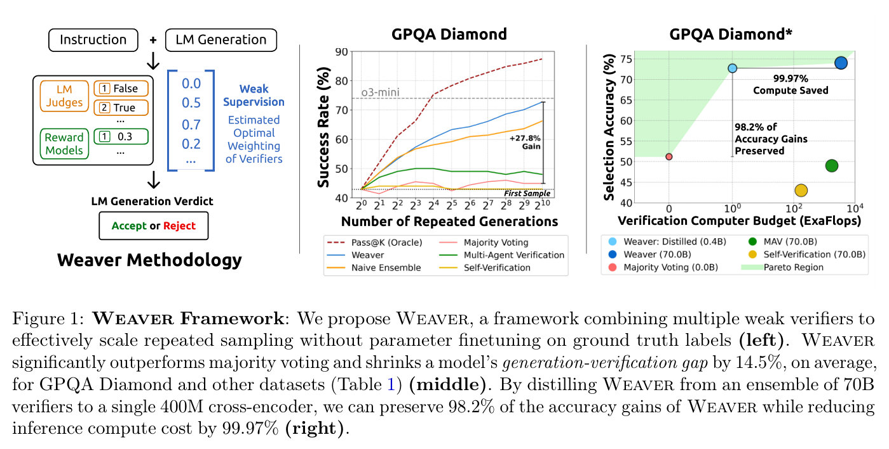
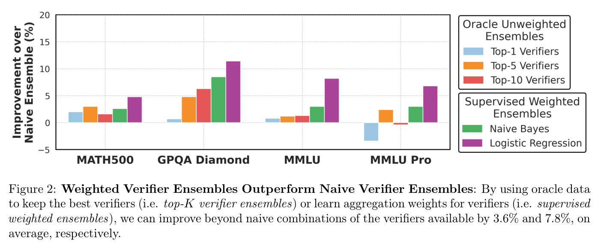
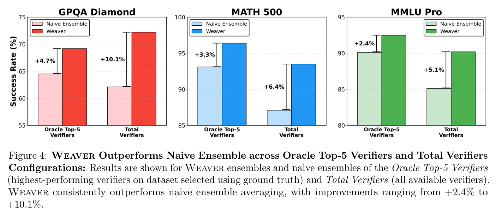
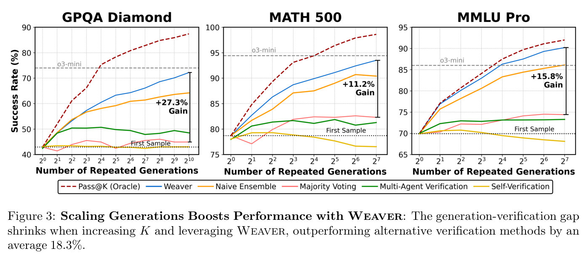
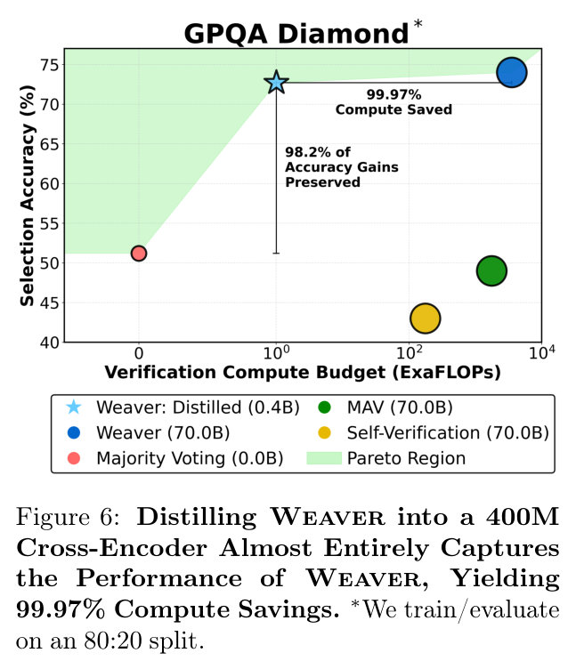
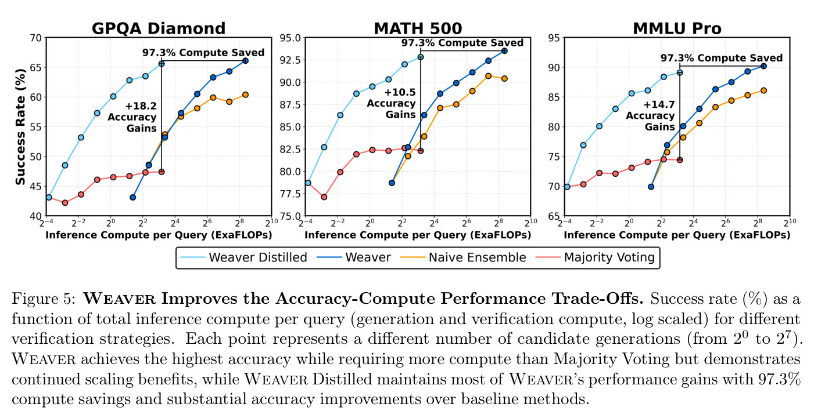

# Lecture 3 — Robust Verification

[Lecture 2](02-test-time-compute-scaling.md) ended on a problem: a model often *can* generate a correct
answer to a hard question, but repeated sampling only turns that into accuracy if something can tell
which answer is correct. This lecture is about that something — the **verifier** — and it follows
four papers that trace how the approach changed over about four years (≈0:52). *Training Verifiers to
Solve Math Word Problems* (OpenAI, 2021) trains a verifier to judge whole solutions and uses it to
pick the best of many samples. *Let's Verify Step by Step* (OpenAI, 2023) compares judging only the
final outcome with judging every step, using human step-level labels, and finds step-level
**process supervision** clearly better. *Math-Shepherd* (2023) removes the human labellers by
estimating each step's quality from the model's own continuations, and uses the resulting verifier
both to rerank answers and as a reward for reinforcement learning. *Weaver* (2025) trains no new
verifier at all: it combines many imperfect existing verifiers into one strong one with weak
supervision, then distills the ensemble into a small model.

The captions do not name the lecturer, so this page does not either. The lecturer speaks about
Weaver as work "we" did (≈52:18, ≈55:29).

[Edited transcript](../raw/transcripts/03-robust-verification.md) ·
[verbatim captions](../raw/transcripts/original/03-robust-verification.md) ·
[video](https://www.youtube.com/watch?v=p7TdPUcPoik) ·
[course website](https://cs329a.stanford.edu/) · [sources](../sources.md)

> **Numbering.** This is catalog position 3 ("Part 3 | Robust Verification") and site schedule row 3
> (Mon Sep 29). The mapping is confirmed: the lecture discusses all four readings the site lists for
> row 3, in the site's order of topics.

## Readings

The course publishes no slides; these four papers, listed on the course site for this lecture, are
its course material. **Only Weaver's full text is in this KB.** The other three carry arXiv's
non-exclusive licence, which does not permit republishing their text or figures, so they are
linked at arXiv, discussed and cited by section, figure and table here, but not reproduced.

| Reading | In this KB | Where the lecture covers it |
|---|---|---|
| Cobbe et al. (2021), [Training Verifiers to Solve Math Word Problems](https://arxiv.org/abs/2110.14168) | linked only (arXiv non-exclusive licence) | ≈0:52–21:06 |
| Lightman et al. (2023), [Let's Verify Step by Step](https://arxiv.org/abs/2305.20050) | linked only (arXiv non-exclusive licence) | ≈21:06–37:27 |
| Wang et al. (2023), [Math-Shepherd: Verify and Reinforce LLMs Step-by-step without Human Annotations](https://arxiv.org/abs/2312.08935) | linked only (arXiv non-exclusive licence) | ≈37:27–51:33 |
| Saad-Falcon et al. (2025), [Shrinking the Generation-Verification Gap with Weak Verifiers](https://arxiv.org/abs/2506.18203) | [main body](../raw/papers/03-weaver.md) (CC BY 4.0; appendices not transcribed) | ≈51:33–1:06:30 |

**About the figures on this page.** Only Weaver's figures appear, each cropped from the published PDF
with its printed caption. This KB does not read values off charts: what a figure shows is what its
caption and the paper's text say. For the other three papers, the page names the figure or table
that carries a result, so a reader can open it at arXiv; numbers quoted from them come from their
text and tables, never from a chart.

## From the generation–verification gap to verification

The lecture opens by recalling lecture 2's **generation–verification gap**: language models seem to
know the answer to many hard questions, and methods such as repeated sampling can generate one, but
the question is how to automatically select the correct answer, or guide the model while it produces
one (≈0:05). The lecturer adds that the motivation of the first paper — LLMs hallucinate and can
confidently present wrong solutions — "still is true to this day" (≈0:52).

## Training Verifiers to Solve Math Word Problems (Cobbe et al., 2021)

### GSM8K

One contribution of the paper was a new math reasoning benchmark, **GSM8K** (≈1:37). It consists of
8,500 grade-school math problems, built for quality and diversity, with a focus on **multi-step
reasoning**: the problems are simple, but reaching the answer takes a few steps; and the solutions
are written in natural language rather than as pure math (≈2:24–3:13). The paper splits the 8.5K
problems into 7.5K training and 1K test problems, each taking between 2 and 8 steps of elementary
arithmetic (Cobbe et al., §2). The lecturer notes that GSM8K has become a big part of LLM
benchmarking and is still a useful evaluation for smaller models — worth considering for course
projects (≈1:37–2:24).

### Training the verifier

The paper's second contribution, and the lecture's focus, is a **verifier**: a model that outputs
the probability that a solution is correct (≈3:13; Cobbe et al., §4.2). The lecturer's analogy is a
rubric — a human solving problems benefits from a way to tell whether they are right, and the
verifier gives the language model the same thing (≈3:13).

The training recipe (≈3:59–4:45, ≈7:03; Cobbe et al., §4.2, Figure 4):

1. Fine-tune the generator language model on the training set for **2 epochs**.
2. Sample **100 completions** for each training problem and label each as correct or incorrect.
   Because every GSM8K problem has a human-written final answer, the label is simply whether a
   completion reaches it.
3. Train the verifier for a **single epoch** on this labelled data.

The paper stops the generator at 2 epochs because the diversity of its samples starts to collapse
after that (§4.2, Figure 3), and it notes the cost of labelling by final answer alone: some solutions
reach the right answer with flawed reasoning, which become **false positives** (§4.2). The lecturer
adds that the first step — supervised fine-tuning of the generator — is debatable today, since
language models already follow instructions and understand math well, and many newer verifiers go
straight to training the verifier objective (≈7:03).

The verifier is itself a language model with a small **scalar head** that outputs a correctness
prediction for each token; the question's tokens are masked out of the loss (≈6:17). It is trained
with **two losses**: the binary correctness loss and the ordinary next-token language-modelling loss
(≈5:31–6:17). The paper calls the language-modelling objective "a strict improvement" over training
on correctness alone (§4.3, Figure 6b).

At test time, the system samples many completions, scores each with the verifier, and returns the
highest-scoring one (≈4:45). The paper uses 100 completions per test problem (§4.2).

### Token-level labels, and the score after the last token

The lecture describes the ablation on *where* the correctness prediction is made as sentence-level
versus token-level labels (≈7:49). In the paper the comparison is between a **solution-level**
verifier, which predicts correctness only after the final token, and a **token-level** verifier,
which predicts it after every token — a token-level value function (Cobbe et al., §4.3, Figure 6a).
Predicting at every token is noisier, as the lecture says: the model is asked whether each token
still follows a pattern that leads to a correct final answer (≈7:49–8:35). The paper finds it trains
more slowly at first but ultimately outperforms the solution-level verifier, which starts to overfit
(§4.3).

Even with a prediction per token, a solution needs one score. The verifier's prediction **after the
last token** is used as the score for the whole solution (≈8:35–9:22). The lecture then shows two
solutions coloured token by token, green for a high verifier score and red for a low one: in the
first, some low scores in the middle give way to green at the end, and the solution is correct; in
the second, it starts well, a mistake late in the solution turns the last token red, and the
solution is indeed wrong (≈9:22–10:58).

### Verification versus fine-tuning

The baseline is plain supervised fine-tuning on GSM8K; the alternative samples 100 solutions per
problem and returns the verifier's top choice (≈10:58). For both 6B and 175B models — the lecturer
believes the 175B one is GPT-3, and the paper initialises both from the GPT-3 family (§4) —
verification works better as the training set grows and eventually outperforms fine-tuning alone;
with small training sets, below about 1,000 problems for the 175B model, it does not help much
(≈10:58–11:44; Cobbe et al., §4.2, Figure 5). The paper attributes the small-data failure to
overfitting to the correct final answer before learning more general properties of correct
reasoning, and summarises that verifiers give roughly the same boost as a $30\times$ **increase in model
size** (§1, §4.2).

A student question about the plot follows here and is mostly inaudible in the captions (≈11:44–12:31).

### Generator size versus verifier size

The lecturer calls this result "very interesting" and a possible research project (≈12:31). With a
large generator and a small verifier the system does better than with a small generator and a large
verifier (≈13:18; Cobbe et al., §4.3, Figure 6c). The lecturer finds this somewhat intuitive if
generation is on average a harder task than verification. Finding the **Pareto-optimal** sizes of the
two relative to each other would be a very interesting question now that base generators have
improved a lot and many verifiers exist — Hugging Face even has a leaderboard of verifier and reward
models (≈13:18–14:05). The paper draws a more cautious lesson from the same figure: verification
still works when the verifier is much smaller than the generator, which suggests the verifier may
rely on "relatively coarse heuristics" rather than thorough checking (§4.3).

### How far does sampling more help?

Increasing the number of completions per problem helps up to about **400**; beyond that the benefit
disappears, and at 800 the verifier "fails to track" which solutions are best (≈14:05–14:52; Cobbe et
al., §5.1, Figure 7a). The lecturer contrasts this with majority voting in lecture 2, which stopped
tracking the correct answer somewhere below 50 samples even as coverage kept rising, whereas here the
verifier stays useful up to 400 (≈14:52–15:38).

Asked why accuracy *drops* past 400 rather than levelling off, the lecturer explains that the plot
shows the output of the whole system, not coverage: with 800 candidates the verifier's precision
falls, and when a correct and an incorrect solution are very close it cannot tell them apart as well
as it could among 400 (≈17:13–17:58). The paper puts it as the benefits of search being outweighed by
the risk of finding **adversarial solutions that fool the verifier** (§5.1). In practice the paper
stops at 100 samples, which captures most of the gain (≈17:58; §5.1).

### Questions on the first paper

- **Where the labels come from.** Each problem's answer was written once, offline, by humans. The
  model then generates 100 solutions per problem, and each is compared with that ground truth to
  create its label (≈16:25).
- **Test-time scaling of the verifier itself** — does it make sense? Yes, and the lecture returns to
  it later (≈19:33); Weaver's ensembles are one way of doing it.
- **Would fine-tuning catch up with enough data?** With a great deal of data the two would probably
  converge. But the "beauty of a verifier" is that the base language model is not fine-tuned onto one
  dataset or task: the generator stays general, and the verifier guides it (≈19:33–21:06).

## Let's Verify Step by Step (Lightman et al., 2023)

### Outcome versus process reward models

The second paper, also from OpenAI and less than two years after the first, starts from the same
problem: a model solving a problem step by step can make one misstep early and derail the whole
answer (≈21:06–21:51). It compares two kinds of reward model (≈21:51):

- An **outcome reward model (ORM)** — like the verifier in the first paper — gives a reward to the
  entire solution, based on whether it is correct.
- A **process reward model (PRM)** gives a separate reward to each step.

Training data differs accordingly (≈22:40–23:28). For an ORM, a generated solution's final answer is
matched against the ground truth, and that is the label. For a PRM, the paper had **human annotators**
go through the model's steps and label each one. A PRM then scores a whole solution by combining its
step scores. In the paper, a solution's PRM score is the probability that every step is correct,
implemented as the product of the per-step correctness probabilities (≈23:28; Lightman et al., §2.6):

$$\text{score}(s) = \prod_{i=1}^{K} p_i$$

where $s$ is a solution with $K$ steps and $p_i$ is the PRM's probability that step $i$ is correct.
The ORM's score is its prediction at the solution's final token (≈28:52; §2.5). One detail from the
paper: step labels are collected only up to the **first incorrect step**, which keeps the comparison
with outcome supervision fair and the labelling effort similar (§2.6).

This is **process supervision**. Its advantage is credit assignment: it is a more precise way of
assigning labels to the parts of a solution than looking only at the output answer (≈24:15; §6.1).

### Why it matters for test-time scaling: false positives

The lecturer singles out a property that "could be a pitfall for test time scaling": a model can
hallucinate and still reach a correct final answer through a wrong process, and this happens
surprisingly often. Outcome supervision rewards that; process supervision, which sees and scores
every step, is much less likely to (≈25:00–25:46). Process supervision also encourages interpretable
reasoning and a **human-endorsed** process, since humans wrote the labels (≈25:46). The paper adds an
alignment argument: because process supervision performed *better*, it carries a negative
"alignment tax" (§6.2).

### PRM800K and active learning

The paper released **PRM800K**, an open dataset of 800,000 step-level human labels (≈25:46). The
paper describes it as 800K step labels across 75K solutions to 12K problems (§2.4). Each step was
labelled **positive**, **negative** or **neutral** — neutral for ambiguity, such as a step that is
subtly misleading or technically valid but a poor suggestion (≈27:18; §2.4, Figure 1). Because
PRM800K's training set includes 4.5K MATH test problems, the paper evaluates on the remaining 500 (§2.4)
— the MATH500 subset that Math-Shepherd and Weaver also report on.

To get higher-value labels, the generator produced many samples per problem and the labelling
prioritised **convincing wrong-answer** solutions, and the PRM was retrained iteratively on the data
collected so far (≈26:32–27:18). The lecture describes these as samples whose final answers were
correct but whose intermediate steps were not (≈26:32). The paper defines the term differently:
*convincing* means rated highly by the current best PRM, and *wrong-answer* means the solution reaches
an **incorrect** final answer — so the PRM must be wrong about at least one of its steps (§2.4). The
lecture credits this strategy with being **2.6 times** more data-efficient than choosing samples at
random (≈26:32). In the paper the $2.6\times$ figure comes from its small-scale synthetic experiments,
estimated from the slopes of the best-fit lines with and without active learning (§4.2, Figure 4a).

The lecture's labelled example: *The denominator of a fraction is 7 less than 3 times the numerator.
If the fraction is equivalent to 2/5, what is the numerator of the fraction?* The first five steps are
labelled correct; in the last the model gets the arithmetic wrong — the lecturer says $x$ should be
14 but the model gives 7 — and that step is labelled incorrect (≈27:18–28:06).

The large-scale models were fine-tuned from GPT-4, first with supervised fine-tuning, then trained as
an ORM or a PRM (≈28:06). The paper specifies the base GPT-4 model, trained only to predict the next
token and not with RLHF, further fine-tuned on about 1.5B math-relevant tokens it calls MathMix
(§2.2).

### Results

The PRM outperforms both the ORM and majority voting as the number of solutions per problem, $N$,
grows; majority voting stops improving after around 100 samples (≈28:52–29:39). The paper's best PRM
solves **78.2%** of its representative MATH test subset, and the gap over the ORM and majority voting
widens as $N$ increases (Lightman et al., §1, §3, Figure 3). The PRM also finds correct solutions to
problems where they are very rare — the lecture says problems with less than 5% correct answers among
the samples (≈29:39); the paper says problems with "a low single-digit percentage solve-rate" under
the generator (§6.3).

**Data efficiency.** Both PRMs and ORMs improve with more labels, but the PRM is more
sample-efficient (≈29:39–30:25; §4.1, Figure 4a). The lecturer's gloss is that 100 labelled solutions
per problem for an ORM are worth about one per problem for a PRM (≈30:25). These data-efficiency
experiments are small-scale ones in which the large PRM, not humans, supplies the labels (§4).

**Generalisation.** The lecturer calls generalisation to new domains and datasets the property "we
all should strive" for when training verifiers and reward models (≈30:25–31:10). On held-out STEM
questions from recent AP and AMC exams, the lecture says majority voting generalises better than the
ORM, but the PRM beats majority voting and tolerates much more distribution shift (≈31:10). The
paper's Table 1 bears this out only in part: majority voting beats the ORM on AP Calculus (80.0% vs
68.9%), AP Chemistry (71.7% vs 68.9%) and AP Physics (82.2% vs 77.8%), but not on AMC10/12 (32.8% vs
49.1%) or in aggregate (61.3% vs 63.8%). The PRM leads on every test, at 72.9% in aggregate (Lightman
et al., §5, Table 1).

### Questions on the second paper

- **Can PRMs hurt?** A step can look good without contributing to the answer. The lecturer's answer
  is that newer approaches **combine** PRM- and ORM-based signals to get the benefits of both, and
  that a PRM's score threshold is a new hyperparameter to tune — additional complexity (≈31:10–32:00).
- **Is the comparison fair when PRMs need more labels?** An ORM needs $k$ labels per problem, a PRM
  $k$ times the number of steps, and the number of steps is hard to control. The lecturer believes
  the paper tries to account for this in some of its plots (≈32:46).
- **What is majority voting here?** Sample $n$ solutions, use no reward model, and take the final
  answer that appears most often — matching on final answers, not reasoning (≈32:46–33:33). The
  lecturer assumes a single PRM is used across the generalisation tests (≈33:33).
- **Can a generator game a PRM by skipping reasoning** — "let's call the numerator $x$", then the bare step
  $x = 14$? The PRM scores each step given the previous ones, so it does not by itself encourage a
  step-by-step process. When the generator is left unchanged this is not the failure mode, because the
  generator can simply be prompted to reason in steps. The risk arises when the generator is
  fine-tuned against the PRM: it may stop reasoning and emit whatever the PRM likes, so the chain of
  thought must be checked. Here the labels are human, and a human would mark a step that skips
  reasoning as poor; with model-generated labels, as in the next paper, this becomes a real caveat
  (≈34:20–37:27).

## Math-Shepherd (Wang et al., 2023)

### Motivation

Stronger verifiers can substantially improve a model's reasoning, especially with test-time scaling,
and PRMs beat ORMs — but they need a lot of data that is hard to collect. Math-Shepherd asks whether
PRM labels can be collected automatically, without human annotators (≈37:27–38:14). It does two
things: **automatic step annotation**, and bringing the resulting reward model into the generator's
optimisation through reinforcement learning (≈38:14).

### Automatic process annotation

The paper defines a step's quality as its **potential to reach the correct final answer** (≈39:00;
Wang et al., §3.3.1, inspired by Monte Carlo tree search). To estimate it for a step $s_i$, a
"completer" model samples $N$ continuations from that step to a final answer, giving answers
$A = \lbrace a_1, \dots, a_N\rbrace$, which are compared with the golden answer $a^{\ast}$ (≈39:00; §3.3.2). Two
estimates follow (≈39:00–39:46; §3.3.2, Equations 3 and 4):

- **Hard estimate (HE)** — the step is good if *any* continuation reaches the correct answer:

$$y_{s_i}^{HE} = \begin{cases} 1 & \text{if } \exists\thinspace  a_j \in A,\ a_j = a^{\ast} \cr  0 & \text{otherwise} \end{cases}$$

- **Soft estimate (SE)** — the fraction of continuations that reach it:

$$y_{s_i}^{SE} = \frac{\sum_{j=1}^{N} \mathbb{I}(a_j = a^{\ast})}{N}$$

where $\mathbb{I}$ is 1 when its condition holds and 0 otherwise. In the lecture's example, $N = 3$
continuations are sampled from step 1 and two of them reach the correct answer, so the hard estimate
for step 1 is 1 and the soft estimate is 2/3 (≈39:46–40:34; the paper's Figure 2 shows this case).
These estimates replace the human annotations of the previous paper, on the assumption that every
problem has a known final answer (≈40:34).

### What goes wrong: the class's answers

Asked for drawbacks, students and lecturer arrive at three (≈40:34–42:54):

1. **Unusual but valid paths score low.** A step that leads to the answer only rarely may need $N = 100$
   continuations to show a correct trajectory; with $N = 3$ it gets 0 (≈41:21–42:09).
2. **Hard problems give no signal**, because few continuations from any step are correct (≈42:09–42:54).
3. **Wrong intermediate steps still get labelled correct** if continuations from them happen to reach
   the right answer. More samples may expose the wrongness, but that is not guaranteed (≈42:54).

The paper's own limitations section names two related costs: the annotation contains noise, and the
completion process demands a lot of compute — though far less than human annotation (§6).

### Verification and reinforcement learning

For verification, the recipe is the usual $\text{best-of-}N$: sample $N$ candidate solutions, score them with
the PRM, and pick the highest (≈42:54). The paper represents a solution's PRM score by the **minimum**
of its step scores (§3.4) — not the product that Lightman et al. use. The PRM also serves as the
**reward model** for training the generator, encouraging it to produce steps the PRM scores highly
(≈43:42). The paper implements this as step-by-step PPO, which gives a reward at the end of each
reasoning step instead of only at the end of the response (§3.5).

On hard versus soft estimates, the lecture says soft annotations looked better as $N$ increased, but
the best results came at $N = 4$, where it did not matter which was used; the authors went with the
hard estimate because it is easier to measure (≈43:42–44:28). The paper's analysis is on 160 manually
annotated GSM8K steps: the hard estimate's accuracy reaches 86% at $N = 4$ and declines for larger $N$,
which the authors trace to false positives; the soft estimate moves closer to the human labels as $N$
grows; and a verifier trained on either performs about the same (§5.2, Figure 4). It trains on hard
estimates "for the sake of convenience", since two special tokens then let a standard language-model
pipeline learn the labels (§4). The lecture's phrase for $N$ — "the depth of the trajectory
completions" (≈43:42) — does not match the paper, where $N$ is the number of continuations decoded
from a step.

### Results

Against self-consistency (another name for majority voting) and an ORM, the Math-Shepherd PRM does
best — and **no human annotation** was involved (≈44:28; Wang et al., §5.1, Figure 3). On MATH it
also beats a PRM trained on PRM800K, the previous paper's human-labelled data; MATH is much harder
than GSM8K, and the lecturer says the gains there were even larger (≈45:17). The paper attributes the
win over PRM800K to distribution gap (PRM800K was labelled on GPT-4 outputs) and data quantity (its
automatic dataset is four times larger) (§5.1). The advantage over the baselines holds across
LLaMA2-70B, LLemma-34B and DeepSeek-67B generators on GSM8K and MATH500 (≈45:17–46:02; §4.1,
Table 1). With verification over 256 outputs, DeepSeek-67B reaches 93.3% on GSM8K with Math-Shepherd
alone and 48.1% on MATH500 with Math-Shepherd combined with self-consistency, against 88.2% and
45.4% for self-consistency alone (Wang et al., §4.1, Table 1).

For reinforcement learning, the paper takes Mistral-7B and trains it with PPO against the PRM, which
the lecture says gives much higher results than RL with an ORM (≈46:02–46:50). Evaluated with greedy
decoding, step-by-step PPO with Math-Shepherd raises Mistral-7B from 77.9% to 84.1% on GSM8K and from
28.6% to 33.0% on MATH, against 81.8% and 31.3% for PPO with an ORM (Wang et al., §4.1, Table 2).
The lecturer judges this gain slightly smaller than the test-time-scaling gain, but another route to
self-improvement: the model generates the annotations, the PRM trained on them improves the generator
both at test time and through RL fine-tuning — "multiple levels" of the model generating data and
reward signal for itself (≈46:50). Combining the RL-trained model with verification is better still,
though the gains seem to plateau (≈47:38). The paper's best combined results are 89.1% on GSM8K and
43.5% on MATH (§4.1, Table 3), both with Math-Shepherd combined with self-consistency. The paper
also finds that after RL, verifying with a reward model alone is inferior to self-consistency — in
Table 3 this holds on MATH500, not on GSM8K — and reasons that the initial reward model is not strong
enough to supervise the improved model, pointing to iterative RL as future work (§4.1). See
[self-improvement](self-improvement.md).

### Questions on the third paper

- **PRMs that reward self-correction.** One way is to give the scoring model a rubric or set of rules
  for the dataset and check each step against it. Another is tools: in the fraction example, a
  calculator or SymPy would settle the step. More supervision, tool use and agentic approaches can all
  improve verification (≈47:38–49:11).
- **Is test-time compute controlled between generator and verifier?** The lecturer is not sure the
  paper controls it for process versus outcome verifiers, since that is hard to do — and calls it a
  question worth investigating: under a fixed compute budget, how should samples be split between the
  generator and the verifier? A fair ORM–PRM comparison also needs both trained on the same data
  (≈49:11–49:58).
- **Why greedy decoding after RL?** The combined results use verification over 256 outputs; greedy
  decoding is the no-verification row. Repeating the whole process — new labels and a new verifier
  starting from the PPO-trained model — "would be interesting to see" (≈49:58–51:33).

## Weaver: Shrinking the Generation-Verification Gap with Weak Verifiers (Saad-Falcon et al., 2025)

Full text: [raw/papers/03-weaver.md](../raw/papers/03-weaver.md) (main body).

### Ensembling imperfect verifiers instead of training a new one

The last paper is from Stanford, and the lecturer describes it as a NeurIPS 2025 paper (≈51:33). The
motivation is still the generation–verification gap, but the approach differs from the three before
it: no new verifier is trained. Instead the gap is attacked with inference compute — specifically an
**ensemble of verifiers** (≈52:18). "Weak" does not mean verifiers chosen for being bad. These are the
best verifiers available, and they are weak only in that none is perfect: their scores correlate with
the true label, with imperfections (≈52:18–53:05). The pool mixes two kinds: reward models — the ORMs
and PRMs of the earlier papers — and **LLMs as judges**, shown an answer and asked whether it is
correct, possibly with tools and rubrics (≈53:05).

The paper makes the gap precise (Saad-Falcon et al., §3). For $n$ queries with $K$ sampled responses
each, where $y_{ij} \in \lbrace 0, 1\rbrace$ says whether response $j$ to query $i$ is correct,

$$Pass@K = \frac{1}{n} \sum_{i=1}^{n} \mathbf{1}\left(\exists j \in [K]: y_{ij} = 1\right)$$

is the fraction of queries with at least one correct response — the best any selector could do. A
verification strategy's **success rate** is how often the response it selects is correct, and the
**generation–verification gap** is $\text{Pass@}K$ minus the success rate.

*Saad-Falcon et al. (2025), Figure 1: the Weaver framework (left); Weaver against majority voting and the generation–verification gap (middle); distilling Weaver into a 400M cross-encoder (right).*

### Weighted ensembles beat naive ones

The first chart the lecture shows ensembles the top 1, top 5 and top 10 verifiers, ranked by how good
they are, across four datasets: simply ensembling them does improve results, but not monotonically
(≈53:52). What *always* helped was learning a weight for each verifier from labelled data — with
methods as simple as **Naive Bayes** or **logistic regression**, one weight per verifier — and then
applying those weights on the test set (≈54:41–55:29).

The paper's version of this finding (§4.1): a naive ensemble selects the response with the highest
*average* verifier score, which ignores that individual verifiers' success rates differ by up to
37.5%. With Llama 3.3 70B Instruct generating responses and 33 reward models and LM judges of 7B–72B as
verifiers, weighted ensembles reach up to 11.2 points higher success rate than the naive one. But
those weighted ensembles are "oracle" methods, fitted with the labels of the whole test set; using
labels for only 1% of it drops accuracy by 20.1% on average. The question Weaver answers is how to get
good weights with very few labels.

*Saad-Falcon et al. (2025), Figure 2: keeping the best verifiers (top-K ensembles) or learning aggregation weights (supervised weighted ensembles), both using oracle data, improves on naive combinations by 3.6% and 7.8% on average.*

### How Weaver works: score, weight, select

The lecture summarises Weaver as **score, weight and select** (≈55:29–56:17):

1. **Score and filter.** Collect every verifier's score for every response, normalise the scores onto
   one scale, and filter out low-quality verifiers, using the very limited labels available to spot
   verifiers that are simply bad against them. The lecturer says the team found this filtering a very
   important step: a verifier must be above a certain quality to be let into the pool (≈55:29–56:17).
   In the paper, scores are binarised into votes and low-quality verifiers discarded (§4.2; details in
   its Appendices B.2 and B.3).
2. **Weight.** Use **weak supervision** to estimate each verifier's accuracy from very little labelled
   data (≈56:17).
3. **Select.** Combine the verifiers' outputs with those weights into one score per response, and pick
   the best (≈56:17).

Weak supervision is a body of work the lecturer connects to Snorkel, by Alex Ratner and colleagues,
and other work from Stanford (≈57:02); the paper builds on Ratner et al. (§2, §4.2.1).

**The setup** (≈57:02–57:51; §3, §4.2.1). There are $n$ queries, $K$ responses per query and $m$
verifiers, so $n \cdot K \cdot m$ scores in all. The goal is the probability that response $j$ to query
$i$ is correct given every verifier's verdict on it. Let $Y$ be the unknown correctness of a response
and $S_1, \dots, S_m$ the verifiers' binary votes on it.

**The key assumption** is that each verifier captures an independent aspect of correctness — formally,
any two votes $S_i$ and $S_j$ are conditionally independent given $Y$ (≈57:51; §4.2.1). The
lecturer's intuition for where the signal comes from: if every verifier always gave every sample the
same score, the pool would teach nothing new; the information is in how the verifiers agree and
disagree with each other (≈57:51–58:36). Under the assumption, the posterior is (Equation 1):

$$\Pr(Y = 1 \mid S_1 = \bar{s}_ 1, \dots, S_m = \bar{s}_ m) = \frac{\prod_{i=1}^{m} \Pr(S_i = \bar{s}_ i \mid Y = 1)\thinspace \Pr(Y = 1)}{\Pr(S_1 = \bar{s}_ 1, \dots, S_m = \bar{s}_ m)}$$

where $\bar{s}_ i$ is verifier $i$'s observed vote. $\Pr(Y = 1)$ is estimated from a small labelled
development set — 1% of the test set, for example 5 to 10 query–answer pairs (§3) — but each verifier's
**accuracy parameter** $\Pr(S_i = 1 \mid Y = 1)$ cannot be computed directly, because $Y$ is unknown.

**Estimating accuracies without labels** (≈58:36–59:22; §4.2.1). Two sets of equations constrain them.
The first holds because of the conditional-independence assumption (Equation 2):

$$\Pr(S_i, S_j) = \Pr(S_i \mid Y = 1)\Pr(S_j \mid Y = 1)\Pr(Y = 1) + \Pr(S_i \mid Y = 0)\Pr(S_j \mid Y = 0)\Pr(Y = 0)$$

The second needs no assumption — it is just how probability works (Equation 3):

$$\Pr(S_i = 1) = \Pr(S_i = 1 \mid Y = 1)\Pr(Y = 1) + \Pr(S_i = 1 \mid Y = 0)\Pr(Y = 0)$$

The left-hand sides can be measured from the verifiers' votes alone. Weaver fits the accuracy
parameters so both sides match, by gradient descent on the combined squared error (Equation 5), then
plugs them into Equation 1 and selects the response with the highest posterior. The lecture presents
the same two equations and the resulting optimisation for the verifier weights (≈58:36–59:22).

### Results

**Against the naive ensemble**, Weaver helps, with larger gains on relatively hard datasets — the
lecture names GPQA Diamond, MATH and MMLU Pro — where even a low baseline gets a large boost
(≈59:22). In the paper's verifier-count experiment Weaver beats naive averaging by +2.4% to +10.1%,
most on GPQA Diamond (+10.1%) and MMLU Pro (+5.1%) (§5.2, Figure 4).

*Saad-Falcon et al. (2025), Figure 4: Weaver and naive ensembles over the oracle top-5 verifiers and over all available verifiers; Weaver's improvements range from +2.4% to +10.1%.*

**Ways to scale verification compute.** The lecture lists them: sample more generations (10, 100,
1,000), use larger generator and verifier models, and add more verifiers to the pool (≈1:00:07). The
paper's Table 2 sets out the same four dimensions — sample count, model size, verifier count and total
inference compute — and adding verifiers is the axis Weaver introduces (§5.2).

**More generations.** The lecture describes a comparison with a dashed $\text{Pass@}K$ oracle line — what a
perfect selector would achieve — a *supervised* Weaver fitted with a large labelled set, the
*unsupervised* Weaver using 1% of each dataset's labels, a naive ensemble (still of filtered,
good verifiers), majority voting, and Multi-Agent Verification (≈1:00:07–1:01:40). All the verifier
ensembles do much better than majority voting and **Multi-Agent Verification (MAV)**, which prompts
LLMs to score a response on different aspects, rubric-style, and does little better than majority
voting — or worse, in two cases (≈1:01:40). In the paper's main-body version, Weaver keeps narrowing
the gap to $\text{Pass@}K$ as $K$ grows from $2^0$ to $2^{10}$, while the other verification strategies plateau
after a few generations, most visibly on GPQA (§5.2, Figure 3). Figure 3's caption does not name a
supervised Weaver variant, so the chart in the lecture may be a different version of it.

*Saad-Falcon et al. (2025), Figure 3: the generation–verification gap shrinks as* $K$ *increases with Weaver, which outperforms the alternative verification methods by an average 18.3%.*

**Against frontier models.** The lecturer points to "drastic" gains — from slightly over 40% to over
70% on hard problems, matching o3-mini (≈1:01:40). The paper's Table 1 (Llama 3.3 70B Instruct
generating $K = 100$ responses) has a jump of that size on GPQA Diamond, from 42.9% for the first
sample to 72.1% with Weaver, against 74.0% for o3-mini. Averaged over MATH500, GPQA Diamond, MMLU
College and MMLU Pro:

| Method (Table 1) | Average |
|---|---|
| First sample | 68.4% |
| Majority voting (100 generations) | 72.2% |
| Multi-Agent Verification | 71.6% |
| Weaver | 87.7% |
| o3-mini (one sample) | 86.7% |
| Oracle verification ($\text{Pass@100}$) | 91.9% |

**Weak to strong.** Weaver narrows the gap *between model classes* (≈1:02:29). With Llama 3.1 8B
Instruct generating and a pool of verifiers of 8B and below, the lecture gives an average of 70%,
almost the accuracy of majority voting with 70B models — an 8B system brought roughly into the 70B
class by inference scaling and verification. The lecturer stresses that these are **end results** — the
accuracy of the whole system — not coverage, unlike most of lecture 2 (≈1:02:29–1:03:19). Applying the
same approach at 70B gives, in the lecture, an average of 86.2%, very comparable to o3-mini, a
proprietary model of a different class (≈1:03:19–1:04:07). The paper's Table 3 has the 8B Weaver at
70.0% against 71.6% for 70B majority voting — within 1.6% — and the 70B Weaver at **87.6%**, 1.0%
above o3-mini's 86.7% (§5.2). The lecture's 86.2% for the 70B setting does not match the paper.

### Distilling Weaver

An ensemble is expensive: every LLM judge and reward model must run on every response, and with 100
samples per query instead of one the cost multiplies (≈1:04:07). The proposal is to train Weaver once
and **distill** it into a much smaller model. The lecture says the distilled model can be as small as
about 400 million parameters, against a verifier pool in the 70B range, and captures 97% of the
ensemble's accuracy while using over 99% less compute at test time; the distilled and original
versions are open-sourced, with checkpoints available (≈1:04:07–1:05:42).

The paper's figures differ slightly (§6). The distilled model is a cross-encoder, ModernBERT-Large
(396M), trained on Weaver's pseudolabels: it takes a query–response pair and predicts Weaver's
probability that the response is correct. It captures **98.2%** of Weaver's performance (the abstract
and introduction say 98.7%). Running Weaver with all verifiers costs 35.35 exaFLOPs for a query's 100
samples, the cross-encoder 1.01 — a saving of **99.97%** — and it needs a single A100 GPU rather than an
8-GPU node per 70B verifier.

*Saad-Falcon et al. (2025), Figure 6: distilling Weaver into a 400M cross-encoder almost entirely captures its performance, with 99.97% compute savings.*

The last chart compares success rate against total inference compute (≈1:05:42–1:06:30). The distilled
model is far more efficient; and even the original Weaver, because it reaches higher accuracy, becomes
more FLOP-efficient at those accuracy levels than the naive ensemble and majority voting. The paper
reports that majority voting plateaus at around $2^2$ to $2^3$ ExaFLOPs per query while Weaver keeps
improving up to 512 (§5.2, Figure 5).

*Saad-Falcon et al. (2025), Figure 5: success rate against total inference compute per query for different verification strategies; Weaver reaches the highest accuracy, and Weaver Distilled keeps most of its gains with 97.3% compute savings.*

## Recap

The lecturer closes with a summary of the four papers (≈1:06:30–1:08:05). Verification improves both
training and inference. Process rewards are very effective, more so than outcome rewards, though the
best results may need both PRMs and ORMs. Verifier training needs a lot of data, the verifier gets
better the more it is given, and it can be used in RL fine-tuning to improve the generator too.
Weaver took a different route — weakly supervised optimisation over an ensemble of verifiers — which
is test-time scaling by adding more verifiers rather than sampling one verifier more, and which can
be distilled into a much smaller model that keeps much of the quality.

## Closing questions

- **Beyond math.** Some of the benchmarks included coding problems. Coding is a very interesting area
  for verification: **CodeMonkeys** has the model generate unit tests that then serve as the verifier
  (≈1:08:05–1:08:51). The site lists [CodeMonkeys](https://arxiv.org/abs/2501.14723) under schedule
  row 13, which has no video in the catalog; lecture 1 also previews it (see
  [lecture 1](01-course-overview.md)).
- **Reasoning models.** Generation–verification and test-time scaling still help them. A big part of
  how reasoning models are trained is generating reasoning steps, rewarding them in an RL loop, and
  training on the positive trajectories, so test-time scaling is built into their training — but more
  sampling still lets them explore more of the solution space (≈1:08:51–1:10:25). See
  [reasoning models](reasoning-models.md).
- **Will repeated sampling move entirely into training?** That is the hoped-for direction — a model
  very good at $\text{pass@}1$ is more efficient. The catch is that sharpening a model's distribution toward
  one answer can lose the creativity and diversity of its solutions, which remain valuable
  (≈1:10:25–1:11:59).
- **Should generator and verifier come from the same model family?** A good research question. Models
  tend to like their own generations; a later paper in the course looks at models benefiting from a
  different class of verifier; but the lecturer knows of no study of same size and family versus
  different size and family (≈1:11:59–1:12:45).

## Related pages

- [Verifiers](verifiers.md) — the cross-lecture page: verifiable domains, the generation–verification
  gap, ORMs and PRMs, and this lecture's four approaches.
- [Test-time scaling](test-time-scaling.md) — $\text{best-of-}N$ with a verifier, and why selection limits
  what sampling can deliver.
- [Self-improvement](self-improvement.md) — Math-Shepherd's model-generated labels and PRM-driven RL
  as a self-improvement loop.
- [Lecture 2 — Test-Time Compute Scaling](02-test-time-compute-scaling.md) — the generation–verification
  gap this lecture sets out to close, and Snell et al.'s PRM-guided search.
