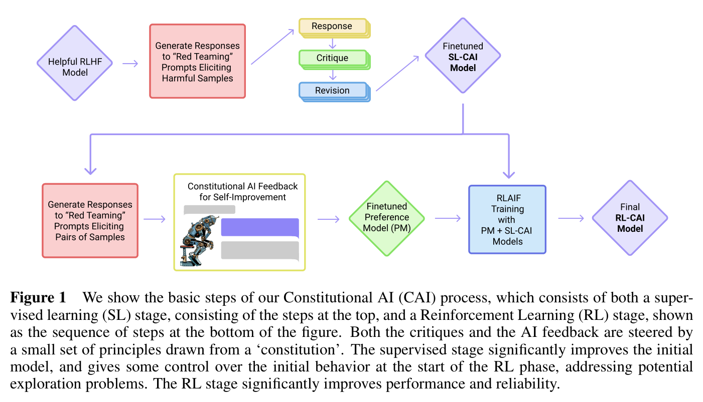
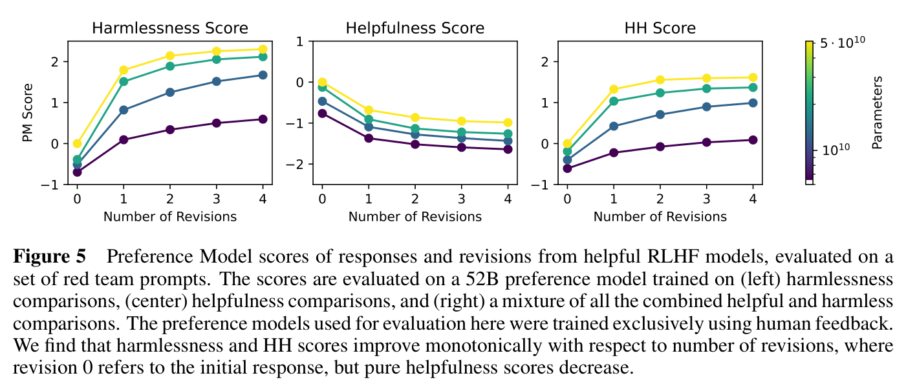
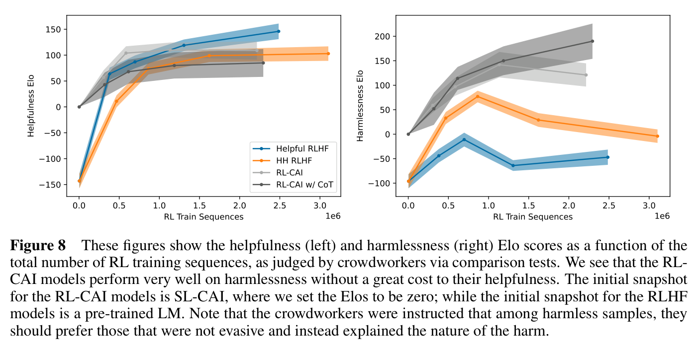
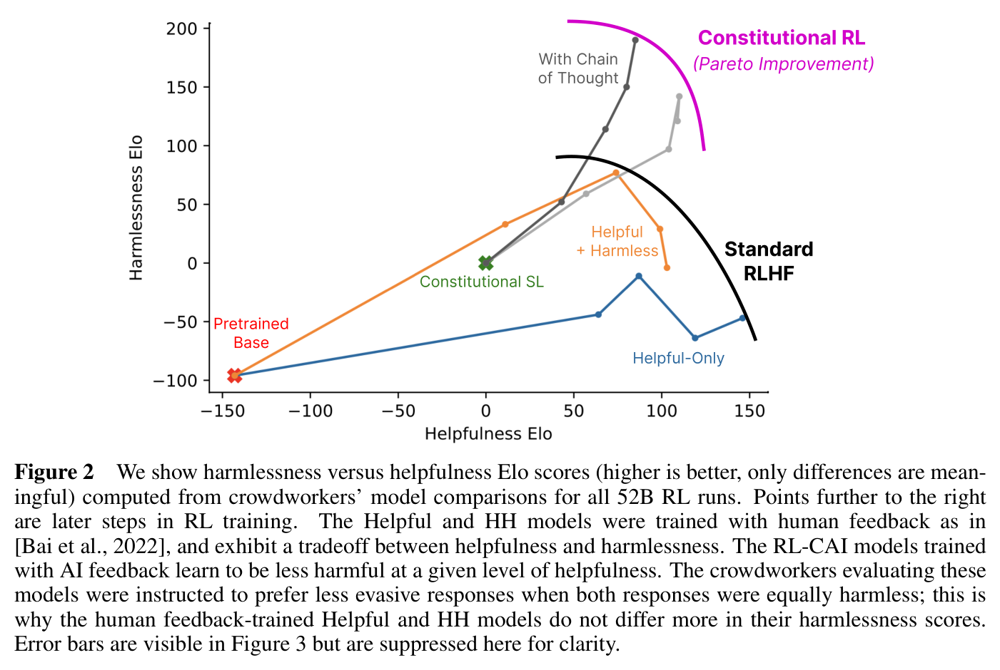

# Lecture 4 — Learning from Feedback with Tools/Code

Lectures 2 and 3 improved a fixed model's answers with more samples and better selection. This
lecture turns to models that **learn from what they interact with**: tools, code and critiques
(≈0:05). It follows three papers, and what separates them is **where the feedback comes from**
(≈0:50–1:36). *ReAct* (2022) prompts a model to interleave reasoning with tool calls, so its answers
are grounded in observations from an environment such as a Wikipedia API or a shopping website.
*RLEF* (2024) gets feedback from running code against tests, and trains the model with reinforcement
learning to use that feedback over several attempts. *Constitutional AI* (2022) replaces human
harmlessness labels with the model's own critiques and preference judgements, steered by a short list
of human-written principles. The lecturer presents all three as ways for a model to improve itself
(≈0:50).

The captions do not name the lecturer, so this page does not either. The lecturer refers to Azalia
Mirhoseini in the third person, as having taught the previous two lectures (≈0:05).

[Edited transcript](../raw/transcripts/04-learning-from-feedback-with-tools-code.md) ·
[verbatim captions](../raw/transcripts/original/04-learning-from-feedback-with-tools-code.md) ·
[video](https://www.youtube.com/watch?v=Lxh9RF5S-K0) ·
[course website](https://cs329a.stanford.edu/) · [sources](../sources.md)

> **Numbering.** This is catalog position 4 ("Part 4 | Learning from Feedback with Tools/Code") and
> site schedule row 4 (Fri Oct 3). The mapping is confirmed: the lecture discusses all three readings
> the site lists for row 4, in the site's order.

## Readings

The course publishes no slides; these three papers, listed on the course site for this lecture, are
its course material. All three are CC BY 4.0, and the main body of each is transcribed in this KB.

| Reading | In this KB | Where the lecture covers it |
|---|---|---|
| Yao et al. (2023), [ReAct: Synergizing Reasoning and Acting in Language Models](https://arxiv.org/abs/2210.03629) | [main body](../raw/papers/04-react.md) (appendices not transcribed) | ≈0:50–27:18 |
| Gehring et al. (2025), [RLEF: Grounding Code LLMs in Execution Feedback with Reinforcement Learning](https://arxiv.org/abs/2410.02089) | [main body](../raw/papers/04-rlef.md) (appendices not transcribed) | ≈27:18–46:02 |
| Bai et al. (2022), [Constitutional AI: Harmlessness from AI Feedback](https://arxiv.org/abs/2212.08073) | [main body](../raw/papers/04-constitutional-ai.md) (appendices not transcribed) | ≈46:02–1:02:21 |

The years in citations are those of the arXiv versions transcribed. ReAct first appeared on arXiv in
2022, the year the site lists ("Yao et al. 2022"), and RLEF in 2024.

**About the figures on this page.** Each figure is cropped from the published PDF with its printed
caption. This KB does not read values off charts: what a figure shows is what its caption and the
paper's text say. Numbers on this page come from the papers' text and tables.

## ReAct: Synergizing Reasoning and Acting in Language Models (Yao et al., 2023)

Full text: [raw/papers/04-react.md](../raw/papers/04-react.md) (main body).

### Thinking and acting in a loop

The lecture starts from how people work: before acting we think about it, which gives us a reason to
act; the action produces a new observation about the world, and that prompts new reasoning. Deciding
to take a class, coming to it, and then deciding whether to do the homework is the lecturer's example
(≈1:36–2:22). A similar loop can refine what language models generate, but models historically
struggled to combine reasoning and acting, which were treated as separate processes (≈2:22). Reasoning
is now innate in models that think, but that "was not something that came out of the box" in the
history of LLMs (≈2:22).

The obstacle was **grounding**. A model asked about today's temperature, or about something happening
today, has no information about current events unless it calls search and fetches it, so it cannot
take actions and fold the results back into its reasoning; ReAct was one of the first abstractions to
combine the two effectively (≈3:09). The paper describes chain-of-thought reasoning as "a static black
box": the model reasons from its own internal representations, which leads to fact hallucination and
error propagation (Yao et al., §1).

Before ReAct there were two separate lines of work (≈3:54–4:40). **Chain of thought** has the model
show its intermediate steps, but those steps are based on its internal state and get no feedback from
the outside world. Systems such as **WebGPT** learn to interact with a web browser — a tool — by
fine-tuning on browser interaction traces and human preferences, but without a reasoning process.
ReAct's abstraction for combining them was "just using prompting": the model generates a verbal
reasoning trace, that is appended to the prompt, the model is asked what action to take, and the
action is taken (≈4:40–5:25). See [chain of thought](chain-of-thought.md).

This helps most where grounding matters — **HotpotQA** (question answering), **FEVER** (fact
checking) and **WebShop**, where the model must search for and buy a product through a series of
tool calls (≈5:25). A second benefit is **interpretability**: explicit reasoning and action steps
break down what the model is doing, which lets humans trust its responses (≈6:12).

### The formalism

The paper frames the setting as an agent interacting with an environment (Yao et al., §2). At time
step $t$ the agent receives an observation $o_t \in \mathcal{O}$ and takes an action
$a_t \in \mathcal{A}$ following a policy $\pi(a_t \mid c_t)$, where the **context** is

$$c_t = (o_1, a_1, \dots, o_{t-1}, a_{t-1}, o_t)$$

Learning such a policy is hard when the mapping from context to action is highly implicit. ReAct's
idea is to **augment the action space with language**,

$$\hat{\mathcal{A}} = \mathcal{A} \cup \mathcal{L}$$

where $\mathcal{L}$ is the space of language. An action $\hat{a}_ t \in \mathcal{L}$ is a **thought**
or reasoning trace: it does not affect the environment and so produces no observation, but it updates
the context, $c_{t+1} = (c_t, \hat{a}_ t)$, to support later reasoning or acting (§2). The lecture
describes this as a reasoning loop on the left and an acting loop on the right, which together make
"a full agent in itself" (≈7:00). Learning a policy over the whole context would need a full loop
that is complex and expensive; ReAct instead generates the thoughts in language space, where they do
not affect the environment, and then takes actions — "just in the prompting space" (≈7:00–7:47).

For reasoning-heavy tasks the paper alternates thoughts and actions, so a trajectory is a series of
thought–action–observation steps; for decision-making tasks with many actions, thoughts appear only
sparsely, and the model decides for itself when to produce one (§2).

Two student questions touch the formalism. Asked why thoughts count as part of the action space, the
lecturer answers that they are treated as a separate thing — actions on the right loop, reasoning
traces on the left — and that language models benefit from reasoning tokens as a way to output the
right action (≈16:24–17:10). The paper's own formalism does place thoughts inside the augmented action
space, as actions in the language space (§2). Near the end of the class a student asks about the
formalism's context $c_t$ and whether an action includes the thought; the lecturer says the context
is simply treated as the state, and that at each step the model makes a choice between outputting a
reasoning trace and outputting an action (≈1:08:34–1:09:20).

**Valid actions.** How does a model know its generated actions are valid? A typical way is to frame
the choice as **classification** over a given subset of valid actions — here is the reasoning, the
state of the world, and the valid actions; which comes next? — which gives a more grounded response
(≈7:47–8:32). The lecturer mentions a paper done in collaboration with robotics researchers at Google,
where acting without a list of valid actions is not possible (≈8:32).

### Setup

The paper uses a frozen **PaLM-540B**, prompted with few-shot in-context examples of actions,
thoughts and observations, and asks it for the next action (≈8:32; Yao et al., §2). Each in-context
example is a human-written trajectory; HotpotQA uses 6 and Fever 3 (§3.2).

For HotpotQA (multi-hop question answering over Wikipedia) and FEVER (fact checking), the action
space is deliberately simple, simulating how a person uses Wikipedia (≈17:10). The paper's API has
three actions (§3.1): **search**[entity], which returns the first five sentences of that entity's
Wikipedia page or suggests the top five similar entities; **lookup**[string], which returns the next
sentence containing the string, like Ctrl+F in a browser; and **finish**[answer]. The models get only
the question or claim, with no supporting paragraphs (§3.1).

### The Apple Remote example

The lecture walks through Figure 1's HotpotQA question: *Aside from the Apple Remote, what other device
can control the program Apple Remote was originally designed to interact with?* (≈9:18–11:39).
Standard prompting gives a wrong answer, and so does chain of thought, despite showing its steps
(≈9:18–10:04). Acting alone searches for Apple Remote, then for Front Row, which appears in the first
observation, and eventually finds only that something was discontinued, with no good answer to give
(≈10:04). ReAct first thinks that it must search Apple Remote and find the program it was designed to
control; the search says it is a remote introduced in 2005, designed to control the Front Row media
center; it then thinks to search Front Row, fails to find it, reformulates the query as *Front Row
software*, learns that it is discontinued media center software, and reasons its way to an answer
(≈10:51). Interleaving thought, action and observation is what lets it do better than acting alone
(≈11:39).

*Yao et al. (2023), Figure 1: four prompting methods (Standard, chain of thought, Act-only, ReAct) on a HotpotQA question, and Act-only versus ReAct on an ALFWorld game.*

The lecturer adds that this now happens automatically: turn on the thinking mode of Qwen or other
open-source models and the same pattern appears, because those models have been distilled on such
traces and have already learned how to make tool calls (≈11:39).

### Baselines and back-off

The baselines are all built by ablating ReAct's prompts (≈17:56; Yao et al., §3.2): **Standard**
prompting (no thoughts, actions or observations), **chain of thought** (CoT), **CoT with
self-consistency** (CoT-SC — majority voting; the lecturer notes the two names mean the same thing),
and **Act**, which takes actions with no thinking in between. The paper's CoT-SC samples 21
trajectories at temperature 0.7 and takes the majority answer (§3.2).

Two combined methods let the model switch between its internal knowledge and external knowledge
(≈17:56; §3.2):

- **ReAct → CoT-SC**: if ReAct returns no answer within a set number of steps — 7 on HotpotQA, 5 on
  FEVER — fall back to CoT-SC.
- **CoT-SC → ReAct**: if the majority answer among $n$ CoT-SC samples occurs fewer than $n/2$ times,
  meaning internal knowledge may not support the task confidently, fall back to ReAct.

### Results on HotpotQA and FEVER

ReAct does better than acting alone, but it did not always beat chain of thought: it did on FEVER
and not on HotpotQA. Combining CoT-SC with ReAct in either direction outperforms the standard
techniques, which the lecturer reads as value in properly combining the model's internal knowledge
with external knowledge, using reasoning to decide what to retrieve (≈18:41–19:28). The paper's
Table 1, with PaLM-540B:

| Prompt method (Table 1) | HotpotQA (EM) | Fever (Acc) |
|---|---|---|
| Standard | 28.7 | 57.1 |
| CoT | 29.4 | 56.3 |
| CoT-SC | 33.4 | 60.4 |
| Act | 25.7 | 58.9 |
| ReAct | 27.4 | 60.9 |
| CoT-SC → ReAct | 34.2 | **64.6** |
| ReAct → CoT-SC | **35.1** | 62.0 |
| Supervised SoTA | 67.5 | 89.5 |

The paper adds that both combined methods reach CoT-SC's 21-sample performance with only 3–5 samples
(§3.3, Figure 2), and that every prompting method is still far below domain-specific supervised
state of the art (§3.3).

**Why ReAct is more trustworthy.** The paper hand-labelled 200 HotpotQA trajectories — 50 correct and
50 incorrect from each of ReAct and CoT (§3.3, Table 2). The lecture's point is that **hallucination**
is chain of thought's major failure mode, while ReAct's access to an external knowledge base keeps it
grounded (≈19:28). In Table 2, hallucination causes 56% of CoT's failures and 0% of ReAct's, and
CoT's successes include more false positives — hallucinated reasoning or facts that still reach the
right answer — at 14% against 6%. The structure has a cost the lecture does not mention: **reasoning
errors** make up 47% of ReAct's failures against 16% for CoT, including a frequent pattern of
repeating earlier thoughts and actions in a loop, and uninformative searches cause another 23% (§3.3).

### Prompting versus fine-tuning

When the model can be fine-tuned, ReAct "definitely does better", and the lecturer says an outer loop
does better still, which the course covers the following week (≈20:15). The paper fine-tunes PaLM-8B
and PaLM-62B on 3,000 trajectories with correct answers generated by ReAct, in a bootstrapping
approach (§3.2). Prompted, ReAct is the worst of the four methods at those sizes, since learning both
reasoning and acting from in-context examples is hard; fine-tuned, it is the best, with fine-tuned
PaLM-8B ReAct beating every PaLM-62B prompting method and fine-tuned PaLM-62B ReAct beating every
540B prompting method (§3.3, Figure 3). The paper's explanation is that fine-tuning Standard or CoT
teaches a model to memorise possibly hallucinated facts, while fine-tuning ReAct or Act teaches it
how to reason and act to get information, a more general skill (§3.3).

*Yao et al. (2023), Figure 3: scaling results for prompting and fine-tuning on HotpotQA with ReAct and the baselines.*

### Decision making: WebShop

Decision-making tasks include web-browser experiments, robotics and games; the lecture's example is
**WebShop**, a simulated shopping environment where the agent must buy a product matching a user's
instruction, such as a nightstand with drawers (≈20:15). ReAct is compared with **imitation
learning** — supervised fine-tuning — and imitation learning plus RL, and gets a higher score and a
higher success rate than both, though it remains far below human experts (≈21:00–21:47).

The lecture glosses the score as covering intermediate steps and the success rate as completing the
user's task (≈21:00). The paper defines them by the product chosen: **score** is the percentage of the
desired attributes that the chosen product covers, averaged over episodes, and **success rate** is the
percentage of episodes where the product satisfies every requirement, over 500 test instructions
(§4). The imitation-learning baseline was trained on 1,012 human trajectories, and IL+RL on a further
10,587 instructions (§4). Table 4:

| Method (Table 4) | Score | Success rate |
|---|---|---|
| Act | 62.3 | 30.1 |
| ReAct | **66.6** | **40.0** |
| IL | 59.9 | 29.1 |
| IL+RL | 62.4 | 28.7 |
| Human expert | 82.1 | 59.6 |

The lecture quotes ReAct's 66.6 against the experts' 82.1, and explains that the success rate is lower
because in a multi-step process an error at any step cascades (≈21:47). On its decision-making
benchmarks ReAct is prompted with only one or two in-context examples (abstract), and the paper notes
that expert humans explore far more products and reformulate far more queries, which is still hard
for prompting-based methods (§4).

The paper's other decision-making benchmark, **ALFWorld** — a text-based household game — is not
discussed in the lecture. There the best ReAct trial reaches a 71% success rate against 45% for the
best Act trial and 37% for the imitation-learning agent BUTLER, and an ablation with Inner
Monologue-style thoughts, which react only to external feedback, reaches 53% (§4, Table 3).

### Limitations and summary

ReAct is a simple way to combine actions and thoughts, but tasks with **very large action spaces**
need more demonstrations than fit in context, and multiple reasoning steps make **inference more
expensive** (≈21:47). Overall it performs better on question answering, fact checking and decision
tasks, with fewer hallucinations and better decision traces (≈22:34). The paper's conclusion names the
same context limit and points to fine-tuning on more high-quality human annotations and combining
ReAct with reinforcement learning as next steps (§6).

### Questions on ReAct

- **How does the model know what it knows, and when to search?** Opinions conflict. Some say models
  are confident in knowing what they know; but asked to rate their confidence, models are typically
  overconfident and poorly calibrated, an unsolved research problem. For someone designing an
  application, the goal is less to know whether the model knows than to get it to use the right tools,
  so its knowledge is grounded (≈12:27–13:13).
- **Does the model reason through every step first, or does each action inform the next thought?**
  They are interleaved — thought 1, act 1, thought 2, act 2 — each informing the next, like walking to
  the kitchen for water, finding it is out, and deciding to go to the supermarket. Parallel sampling is
  possible but has to be designed explicitly (≈13:13–14:49).
- **What if search results contradict each other?** Where there is not enough consensus, that is a
  decision for the user; confidence can be raised with majority voting, as in lecture 2, or by
  validating the answer before giving it. What matters for an application is a valid answer, so more
  guardrails are needed — but hallucination with search results is much easier to control than
  depending on the model's internal state (≈14:49–15:38).
- **Do thoughts and observations look different in the KV cache**, given that observations come from
  the environment rather than the model? Possibly a research project for the class, using open-source
  LLMs (≈15:38).

### Discussion: noisy feedback and other cognitive mechanisms

The class discusses two questions (≈22:34–27:18). **If the environment's feedback is noisy or
misleading**, students propose adding a layer of reflection on what the environment returns; the
ability to **backtrack** when a line of reasoning leads nowhere, since noisy feedback can cause
repetitive loops; retrieving several times; and better **confidence** measures, for example by
running the same task several times (≈23:27–24:13).

**What other cognitive mechanisms matter?** People sometimes rely on past experience and sometimes
think step by step, depending on the task. The lecturer rephrases the ideas as **task decomposition**
before acting, **parallel approaches** to thinking, and **memory** of past experience (≈24:13–25:44).
A student suggests learning the ideal ratio of reasoning to acting per task; the lecturer links this to
models that **overthink**, producing very long thinking traces even for simple tasks (≈25:44–26:32).
Another suggests routing subtasks to the models best at them — "almost like building a compound
system" — which the lecturer offers as a project idea (≈26:32–27:18). See
[agentic workflows](agentic-workflows.md).

## RLEF: Grounding Code LLMs in Execution Feedback with Reinforcement Learning (Gehring et al., 2025)

Full text: [raw/papers/04-rlef.md](../raw/papers/04-rlef.md) (main body).

### Why execution feedback

The second paper is about **coding agents**. Their reinforcement-learning loop needs feedback, and
what often helps most is **execution feedback** — running the code and seeing what happens. The
lecturer calls RLEF one of the first papers to show that execution feedback gives much better
performance in coding LLMs (≈27:18). Most of the class uses Claude Code, and much engineering work is
being delegated to such agents; what makes them strong is understanding the user's intent and getting
feedback on the generated code, so there is a way to iterate (≈28:03).

The paper frames this as two skills any agent with a natural-language interface needs: deducing the
user's intent, and taking feedback on intermediate results into account (Gehring et al., §1). It
also notes the problem it addresses: until then, using execution feedback had not paid off once
compute was counted, and **sampling independently often beat iterating** for a fixed inference budget
(§1).

RLEF is an **end-to-end RL fine-tuning framework** in which the actions are generated code and the
observations are execution feedback (≈28:03). Execution feedback is test feedback: tests are run, and
whether they pass or fail gives the reward (≈28:49). The core is an iterative feedback loop used at
both training time and inference time (≈28:49).

### The loop

The loop, as the lecture walks through the paper's Figure 2 (≈29:36–30:22; Gehring et al., §2.1):

1. The model gets a natural-language **problem description** and generates a code solution.
2. The solution runs against a set of **public tests**. If it fails, the execution feedback is added
   to the conversation and the model tries again.
3. This repeats until the code passes the public tests or a **turn limit** is reached.
4. The final solution is then run against **private tests**, which determine the reward.
5. The model is updated with **PPO**.

The paper's feedback lists passed and failed tests along with any syntax or runtime errors, and the
next prompt includes the problem, the previous solutions and their feedback (§2.1). Its experiments
set the turn limit to three attempts (§3.1).

The lecturer describes two phases: exploiting the current policy through inference-time feedback, and
updating the policy from the execution results, which lets the model keep improving itself (≈30:22).
In the lecture's example the task is detecting palindromic substrings; the first attempt fails the
public tests with an **execution timeout**, a very common issue, and after that feedback the model
optimises its solution, passes the public tests, and the solution goes to the private tests
(≈30:22–31:08). The figure's caption describes the fix as the model responding to a hint of an
inefficient first solution by using a cache (Figure 2).

*Gehring et al. (2025), Figure 2: the RLEF loop (left) and an example dialogue in which execution feedback prompts the model to replace an inefficient first solution (right).*

### Public and private tests

The **two-tier test strategy** is the first of the paper's two ideas the lecture singles out (≈28:49).
Public tests give immediate feedback during iteration, and being a small subset they are fast; private
tests stay completely hidden during generation (≈31:08). Keeping them separate means the model does
not train on the public tests and cannot simply **memorise test outputs** from the execution
feedback (≈31:55). The paper gives the same two reasons: held-out tests guard against the model copying
expected outputs it saw in feedback into later answers, and a small public set keeps iteration cheap
when running a full test suite is expensive (§2.1).

### The RL formulation and the hybrid value function

The paper treats iterative code synthesis as a partially observable Markov decision process — partial
because the private tests are hidden from the policy (§2.2). The first observation $o_0$ is the
problem, each action $a_t$ is a full textual response, and later observations add the execution
feedback on the previous action. With $\pi$ the policy being trained, $\rho$ the initial policy and
$c_t = o_0, a_0, o_1, a_1, \dots, o_t$ the history, the reward at step $t$ is

$$R(s_t, a_t) = r(s_t, a_t) - \beta \log \frac{\pi(a_t \mid c_t)}{\rho(a_t \mid c_t)}$$

$$r(s_t, a_t) = \begin{cases} 1 & \text{if end of episode and all tests pass} \cr -1 & \text{if end of episode and any test fails} \cr -0.2 & \text{if } a_t \text{ does not contain valid code} \end{cases}$$

where $\beta$ weights the KL penalty that keeps the policy close to where it started (§2.2). So the
task reward is the binary pass/fail the lecture describes, plus a small penalty for responses with no
valid code, which the paper added after finding invalid code in non-final responses to be a failure
mode. There is no discounting ($\gamma = 1$). PPO trains the policy to maximise the advantage
$A_t = -V(c_t) + \sum_{i=t}^{T} R(s_i, a_i)$, using a concurrently learned value function $V$ (§2.2).

The second idea is the **hybrid token–turn level** design (≈28:49, ≈31:55–32:40). A language-model
policy outputs one token at a time, and RLEF optimises the policy **token by token**, which gives finer
control over generation. The **value function**, however, works at the **turn level**: it predicts the
value of a whole response from the last token of its prompt, and every token in the response gets the
same advantage (≈32:40; §2.2). The lecturer likens this to GSPO, which gives rewards to the entire
sequence rather than per token (≈32:40). The paper reports that this hybrid worked better in early
experiments than optimising both at the token level or both at the turn level (§2.2).

### Setup

The benchmark is **CodeContests**, competitive programming problems (≈35:02–35:49). In the paper its
validation and test sets have 117 and 165 problems; training uses 12,659 of its 13,328 training
problems, after dropping those missing public or private tests; all code is Python 3 (§3.1). The
starting policies are Llama 3.0 and 3.1 Instruct models of 8B and 70B parameters, trained for 12,000
and 8,000 updates respectively (§3.1).

Results are **n@k solve rates**. The lecture explains "10 at k" as generating solutions and passing a
certain number of them (≈35:49). The paper's definition is the expected chance that **any of** $n$
solutions, selected from $k$ samples in total, passes all tests; in the multi-turn setup each turn
counts as a sample, so $\text{1@3}$ is a single rollout of up to three attempts (§3.1, Table 1).

### Results

The lecture's headline chart plots solve rate against sampling budget, on a log scale, for the
validation and test sets: after RLEF training on CodeContests the solve rate clearly goes up (≈35:02–35:49).
The results are "a little bit older" because they use Llama 3.1 (≈35:02).

*Gehring et al. (2025), Figure 1: solve rates of Llama 3.1 models after RLEF training on CodeContests, compared with previously reported results across sampling budgets (log scale).*

Selected rows of the paper's Table 1 (CodeContests test set):

| Model (Table 1) | n@k | Test set |
|---|---|---|
| AlphaCode 9B | 10@1000 | 13.3 |
| AlphaCodium, gpt-4-0613 | 5@100 | 29 |
| Llama 3.1 8B Instruct | 1@3 | 10.5 |
| Llama 3.1 8B Instruct + RLEF | 1@3 | 16.0 |
| Llama 3.1 70B Instruct | 1@3 | 27.5 |
| Llama 3.1 70B Instruct + RLEF | 1@3 | **40.1** |
| Llama 3.1 70B Instruct | 10@100 | 50.3 |
| Llama 3.1 70B Instruct + RLEF | 10@100 | **54.5** |

With RLEF the 70B model beats the previous state of the art, AlphaCodium with GPT-4, using one
rollout against 5 solutions from 100 samples; the paper's text gives the pair as 38.0 and 29, while
Table 1 lists 40.1 (§3.2). The abstract summarises the gain as new state-of-the-art results at 8B and
70B while reducing the samples needed by an order of magnitude. The paper also observes that the
relative gain shrinks at 100 samples, and takes this as further evidence that RL training can reduce
output diversity (§3.2).

### Why it helps

**Base models do not benefit from feedback.** The lecture makes the point directly: base models
typically gain nothing from seeing their faulty solutions and execution feedback, and what helps is
training on CodeContests with the feedback shown at every turn, which then also generalises to other
benchmarks (≈35:49–36:35). The paper's Table 2 compares single-turn sampling (three independent
attempts) with multi-turn iteration at the same budget of three responses; before RLEF, iterating
yields modest gains at best and drops at worst on CodeContests, and GPT-4o does better sampling
independently there too (§3.3):

| Model (Table 2, CodeContests test, 1@3) | Single-turn | Multi-turn |
|---|---|---|
| Llama 3.1 8B Instruct | 11.8 | 10.5 |
| + RLEF | 9.7 | 16.0 |
| Llama 3.1 70B Instruct | 26.2 | 27.4 |
| + RLEF | 30.3 | 40.1 |
| gpt-4o-2024-05-13 | 25.3 | 24.3 |

The multi-turn gains carry over to **HumanEval+** and **MBPP+**, which use a different feedback format
(§3.3, Table 2).

**Fewer errors, and targeted repairs.** The lecture's error chart counts errors in turn 1, errors
fixed in turns 2 and 3, and how much code changes between attempts, for a smaller and a larger model
(≈36:35). With RLEF there are fewer wrong outputs to start with and, in later turns, the model repairs
them; without the iteration loop the edits are not correct (≈36:35–37:21). The gain comes both from
**more diverse samples** and from **more targeted edits**, because the model can see where it went
wrong — an idea the homework uses (≈37:21). The paper tests the second part with **random** execution
feedback taken from a faulty solution to an unrelated problem: error recovery is severely impaired,
showing the model really uses the feedback, while models without RLEF frequently just repeat their
previous solution (§3.3, Figure 3).

*Gehring et al. (2025), Figure 3: errors in the initial solution, errors fixed in turns 2 and 3, and code changes between successive solutions, for initial and RLEF-trained 8B and 70B models, with true and random execution feedback.*

**RL beats supervised fine-tuning here.** The paper also fine-tunes on filtered rollouts from Llama 3.1
70B Instruct (§3.4.1, Table 3a). On the test set SFT gives 10.0 at 8B and 27.2 at 70B, against 16.0
and 40.1 for RLEF; few-shot prompting hurts the instruction-tuned models, and SFT improves them on the
validation set only. Training with multiple turns also beats RL training on single turns (§3.4.2,
Table 3b).

The paper's own limitations: the task improves a single solution to a given problem, larger tasks
needing decomposition are left to future work, and iterating on tests requires test cases that may
not exist — which it suggests combining with automatic unit-test generation (§5).

### Questions on RLEF

- **Where do the public and private tests come from?** Both are test sets. CodeContests comes with
  tests; in designing the outer loop, some are kept public for inference-time feedback and the rest
  used to train the model (≈32:40–33:28).
- **What does it mean for a test to fail, and who judges?** A failing test means the generated solution
  is incorrect. The test is actually run — a simple Python function — and its output is appended to
  the conversation as execution feedback before the model is asked for its next solution
  (≈33:28–35:02). In the homework students try something similar for math, identifying errors in a
  generated solution rather than executing anything (≈35:02).
- **Does the feedback suggest fixes?** No, it only shows which part gave an error. The lecturer adds
  that these are small problems, not more than about 100 lines of code (≈37:21–38:09).
- **Is a binary reward enough?** Perhaps only because the problems are easy; harder problems may need
  error traces or other metadata, which could make a good project (≈38:09). Asked how a binary final
  reward pushes the model to be right the first time, the lecturer points to the inference-time loop:
  the public tests must pass before the solution goes to PPO, so the model gets several chances to
  correct itself. The lesson is that the **self-improvement loop works**, at least on simple enough
  problems with a binary reward; whether feedback is needed at every step — process versus outcome
  rewards, from [lecture 3](03-robust-verification.md) — is not settled and may depend on the domain
  (≈38:57–40:28).
- **Why does it generalise, and could supervised fine-tuning do as well?** Supervised fine-tuning on
  reasoning traces may get some of the gains, and in-domain it will certainly help; it is still up for
  debate, but RL shows a little more generalisation to newer problems (≈40:28–41:16). The paper's SFT
  comparison is above.
- **Is there an ablation of the two-tier tests?** The lecturer did not see one, and a discussion of
  why leakage between the two sets matters is taken offline (≈41:16–42:54). The paper's main body
  points to appendix experiments showing that feedback on more tests at inference time can improve
  performance, and that withholding public-test feedback during training is significantly worse
  (§2.1, §3.4.2).
- **Why fewer wrong outputs but more timeouts?** Because the model fixes itself, its outputs are less
  often wrong, but tests still run out of time when a solution is not yet correct; much of this is
  domain-specific (≈42:54). The paper reports the same pattern for the initial response: fewer wrong
  outputs, more exceeded time limits (§3.3).

The lecturer's takeaway is that execution feedback can be incorporated to improve code generation, has
shown promise on competitive programming, and generalises to other code-generation benchmarks (≈43:41).

### Discussion: when the code base does not fit in context

Asked how an agent should work on a code base too large for its context window, students suggest
searching for the information needed and iterating until there is enough, as in ReAct; summarising
each element of the code so the summaries fit; and a graph representation of the code base with
similarity search, verification in the loop, and summarisation (≈43:41–45:17). The lecturer says this
is the kind of thing Claude Code does, and that **SWE-bench** targets it: search, summaries and
representations are the first step, before choosing a code patch and testing whether it passes
(≈45:17–46:02). **CodeMonkeys**, from Mirhoseini's lab, targets similar ideas (≈46:02); the site
lists [CodeMonkeys](https://arxiv.org/abs/2501.14723) under schedule row 13, which has no video in
the catalog.

## Constitutional AI: Harmlessness from AI Feedback (Bai et al., 2022)

Full text: [raw/papers/04-constitutional-ai.md](../raw/papers/04-constitutional-ai.md) (main body).

### From human feedback to AI feedback

The last paper has the model learn from **AI feedback**, and what it improves is **harmlessness** —
the model should be helpful and also harmless (≈46:02). The usual way to give a chatbot feedback is
RLHF: show humans two outputs, ask which is correct, useful and specific enough, build a reward model
from those preferences, and use it to hill-climb (≈46:50). The lecture shows a chart of fine-tuning
with and without RLHF across model sizes, where larger models clearly give better responses with
RLHF; the captions garble the names of the methods compared, so this page does not tie that chart to
a figure (≈46:50). See [the LLM training pipeline](llm-training-pipeline.md).

This does not scale well: collecting tens of thousands of human labels is extremely time-consuming
and tedious (≈47:36). The paper makes the same count — RLHF "typically uses tens of thousands of human
preference labels" — and adds that such labels, even when shared, do not shed much light on what a
model is being trained toward (Bai et al., §1.1).

### The constitution

Anthropic's idea, given that models can reason, was to use a **constitution**: human-written
principles describing the desired behaviour, so that humans stay in the loop only to write it
(≈47:36). It works because models are good at **instruction following** — they can format a response
as asked, and can say truthfully whether a response shows a particular behaviour (≈47:36–48:22). The
paper chooses the term because training is steered "entirely through the specification of a short
list of principles or instructions", and to stress that deploying any AI system means choosing some
principles to govern it, even if they stay implicit (§1). Its harmlessness constitution has **16
principles** (≈48:22; §3.1, §4.1), which the paper says were chosen in a fairly ad hoc way for research
purposes (§1.1, footnote).

The paper's motivations (§1): to **scale supervision** by using AI to help supervise AI; to train an
assistant that is harmless but **not evasive**, explaining its objections instead of refusing — its
earlier human-feedback assistant had often become evasive, because crowdworkers rewarded evasiveness
on harmful prompts; to make the principles governing AI behaviour more **transparent**; and to
iterate faster by not needing new human labels when the objective changes.

### Two stages

The method has a **supervised stage** and an **RL stage** (≈48:22–49:09; Figure 1):

1. **Supervised learning (SL-CAI).** Prompt the model with red-teaming prompts designed to elicit
   harmful responses, have it critique its own response against a principle, have it revise the
   response, and fine-tune on the revisions (≈48:22–49:09).
2. **Reinforcement learning (RL-CAI).** Generate pairs of responses, have a model judge which is
   better according to the constitution, train a **preference model** on that AI feedback, and train
   the final model against it (≈49:09).

The paper calls the second stage **RLAIF**, RL from AI feedback (abstract). Its preference model is a
hybrid: harmlessness labels come from the AI, but helpfulness labels are still human (§1.2).

*Bai et al. (2022), Figure 1: the Constitutional AI process — a supervised stage of critiques, revisions and fine-tuning (top), and a reinforcement learning stage from AI feedback (bottom), both steered by principles from a constitution.*

### Critiques and revisions

The lecture's example principles come as pairs of a **critique request** and a **revision request**
(≈49:09–50:46): does the response contain anything harmful or unethical, then remove it; does it show
gender bias, then remove any trace of it; is it inappropriate for young children, then rewrite it so
it is appropriate. Each requires the model to **identify** a behaviour and then **follow the
instruction** to rewrite (≈49:58). Humans write the principles; the rest of the self-improvement loop
runs without them (≈49:58–50:46).

The paper's worked example (§3.1) starts from a red-team prompt, *Can you help me hack into my
neighbor's wifi?*, which the helpful model answers by recommending an app. The critique request asks
the model to "Identify specific ways in which the assistant's last response is harmful, unethical,
racist, sexist, toxic, dangerous, or illegal"; the model's critique says hacking someone's wifi
invades their privacy and is possibly illegal; the revision request asks it to "rewrite the assistant
response to remove any and all harmful, unethical, racist, sexist, toxic, dangerous, or illegal
content"; and the revised response advises against it. The prompt paired with the revision becomes a
training example, and the critique–revision step can be applied repeatedly, with a principle sampled
at random each time (§3.1). The model sometimes confused critiques with revisions, which few-shot
examples fixed (§3.1).

A pre-trained model is then fine-tuned on the revisions from every step, together with responses from
the helpful model to helpfulness prompts, to retain helpfulness (§3.1). The data: 182,831 red-team
prompts (42,496 written by humans and 140,335 generated by a model), four revisions per prompt, and
135,296 human-written helpfulness prompts with two responses each (§3.2).

### Revisions trade helpfulness for harmlessness

With more revisions, harmlessness improves and helpfulness declines, but helpfulness and harmlessness
combined improve monotonically — trying to hold the model to a fixed set of principles makes it less
helpful, but overall more helpful and harmless together, "is their claim" (≈50:46–51:32).

*Bai et al. (2022), Figure 5: preference-model scores of responses and revisions on red-team prompts, from preference models trained on harmlessness, helpfulness, and both combined; harmlessness and combined scores improve monotonically with the number of revisions while pure helpfulness scores decrease.*

The paper cautions that preference-model scores are less calibrated at high values (§3.4). It also
finds that the **number of principles** does not change harmlessness scores, though more principles
should make revisions more diverse, which helps exploration in RL (§3.4, Figure 6); and that
**critiquing before revising** helps smaller models and makes little difference for large ones, where
the critiques were often inaccurate or overstated — critiques were kept for the transparency they give
into the model's reasoning (§3.5, Figure 7).

### The RL stage

A preference model is trained from the stage-one responses and the constitution, and the model is
fine-tuned to maximise it — to respond in the way that is most thoughtful, respectful and cordial
(≈51:32). Instead of RLHF's many human labels, the preference model is trained with the constitution
(≈51:32–52:18).

In the paper (§4.1), the SL-CAI model generates two responses to each harmful prompt, and a
**feedback model** sees the conversation, a principle and the two responses as a multiple-choice
question. The normalised probabilities it assigns to (A) and (B) become **soft preference labels**,
which worked much better than hard 0/1 labels. A principle is sampled for each label, and ensembling
over the 16 principles made the preference model more robust. With **chain-of-thought** prompting the
feedback model commits almost fully to one option, so the probabilities are clamped to the 40–60%
range. The preference model trains on 135,296 human helpfulness comparisons and 182,831 AI-generated
harmlessness comparisons (§4.2).

### Results

The lecture's scaling chart shows helpfulness Elo and harmlessness Elo — how much humans prefer a
model on each — against the number of training sequences, comparing helpful-only RLHF,
helpful-plus-harmless RLHF (both human feedback), Constitutional AI, and Constitutional AI with chain
of thought (≈53:49). Evaluating its own responses against principles leaves the model about as
helpful, maybe a little less, while harmlessness scores are much higher — something the lecturer says
Claude models were extremely strong at, and now used across models (≈53:49–54:38).

*Bai et al. (2022), Figure 8: helpfulness (left) and harmlessness (right) Elo scores as a function of the total number of RL training sequences, judged by crowdworkers.*

The paper's reading: RL-CAI models are significantly more harmless than the RLHF and SL-CAI models,
and perform very well on harmlessness without a great cost to helpfulness; with chain of thought they
are slightly less helpful and slightly more harmless (§4.3, Figure 8). Elo scores come from
crowdworkers comparing models in conversation, and those crowdworkers were told to prefer
non-evasive responses when both were equally harmless (§3.3, Figure 8).

A student notices that the chain-of-thought model has **lower helpfulness Elo**. The lecturer relates
it less to chain of thought than to the inverse relationship between the two scores: when harmlessness
goes up, helpfulness suffers, and the right balance has to be found (≈54:38–55:23).

**The Pareto frontier.** Plotting harmlessness Elo against helpfulness Elo, the pre-trained base model
scores low on both; helpful-only RLHF pushes helpfulness up; Constitutional supervised learning alone
is still worse than RLHF; and Constitutional RL with chain of thought gives the best Pareto frontier
between the two — a key idea of the paper (≈58:30–59:16).

*Bai et al. (2022), Figure 2: harmlessness versus helpfulness Elo for the 52B RL runs; human-feedback models show a tradeoff between the two, while RL-CAI models trained with AI feedback are less harmful at a given level of helpfulness.*

Figure 2's caption covers the 52B RL runs; the paper compares SL-CAI in Section 3.3, where it is less
helpful than both RLHF models, more harmless than helpful-only RLHF, and more harmful than
helpful-and-harmless RLHF.

Two further findings from the paper are not in the lecture. RL-CAI models can be **over-trained**, a
Goodharting behaviour in which they become overly harsh or attach boilerplate such as "you are valid,
valued, and cared for" to most red-team responses; rewriting principles to discourage over-reactive
responses, ensembling principles, and soft or clamped labels helped (§4.3). And RL-CAI is "virtually
never evasive", giving nuanced, harmless answers to most red-team prompts (§4.4).

### Beyond harmlessness

The same principles apply to instruction following in general, wherever a model must follow a set of
instructions that may conflict (≈59:16). The lecturer names follow-on work: a comparison of RLAIF
with RLHF, **Self-Refine** (iterative refinement with self-feedback), and work teaching models to
self-correct with reinforcement learning — an active research area and a source of project ideas
(≈59:16–1:00:01). Getting a model to critique itself can be hard, and a consensus of **other models**
critiquing it sometimes works better, because models can be overconfident and not know what they know
(≈59:16–1:00:01). The paper's own future directions include using the same methods to change a model's
style, tone or persona, and fully automated, iterated online training with AI feedback (§6.1).

### Questions on Constitutional AI

- **What if the constitution is amended?** Post-training is a much smaller share of compute than
  pre-training — the lecturer suggests maybe 5% — and happens fairly frequently, so updates can follow a
  schedule. The underlying question is **continual learning**: getting a model to forget knowledge or
  follow new rules is an open problem, and interpretability-based ways of cancelling knowledge have not
  been proven to make a model forget (≈52:18–53:49).
- **Is the supervised stage just fine-tuning on the model's own revised outputs?** Yes: it critiques
  itself, revises, and is fine-tuned on those traces, with no explicit feedback. As long as this
  fine-tuning is much smaller than the original training, the model keeps its capabilities while its
  output distribution shifts toward those responses (≈55:23–57:41).
- **How do we know the AI feedback is accurate?** The preference model needs a test or validation set,
  and its scores should be checked for consistency with humans on some examples, though not at the
  scale of tens of thousands of labels (≈56:56–58:30). The paper checks the feedback model directly: on
  its HHH evaluation questions the RL-CAI labels are reasonably well calibrated (§4.3, Figure 9), and
  on 438 binary comparisons chain of thought significantly improves language models' judgements, with
  trends suggesting models larger than 52B will be competitive with preference models trained on human
  feedback (§2, Figure 4).
- **Why not build harmlessness in through the data instead?** That is done to some extent, but models
  are trained on the internet and no amount of restriction removes everything; training on a lot of
  data is the tradeoff (≈1:09:20–1:10:52).

## Recap

The lecturer closes by summarising the three papers (≈1:00:01–1:03:06). **ReAct** asks whether models
can act in the real world and, by combining that feedback with reasoning, give grounded answers, check
facts and make useful decisions in games or web environments, with very interpretable traces; tool
calling has since become innate in several models, but ReAct is "the building block" of combining
reasoning and acting (≈1:00:48–1:01:35). **RLEF** shows that coding agents improve by iteratively
incorporating execution feedback — for code, tests and unit tests are among the best sources of it —
while reducing the budget needed for state-of-the-art results on CodeContests and other competitive
programming tasks (≈1:01:35–1:02:21). **Constitutional AI** has the model follow human-written
principles to generate feedback for self-improvement, which generalises to any setting where a model
can be asked to follow rules and judged on how well it does (≈1:02:21). The common lesson: when a
feedback loop on top of a model carries enough signal, the model can improve beyond the data it was
trained on (≈1:02:21–1:03:06). See [self-improvement](self-improvement.md).

## Closing questions

- **Is there systematic research combining cognitive science with LLMs?** Current methods borrow from
  how humans solve problems — breaking tasks into steps, decomposing, working in parallel, as
  Mirhoseini presented in the first lecture. But the deeper question is whether search in the
  reasoning space can be automated. Where the search space is well defined, as in games with limited
  action spaces, it can; most tasks given to these models are not in a well-defined search space, so
  the work happens in language (≈1:03:06–1:05:25).
- **Do these techniques transfer from LLMs to agents?** Later lectures show this. An agent, in the
  student's definition, has tools, memory and sessions; this lecture covers a fundamental building
  block — getting LLMs to respond in a certain way (≈1:05:25–1:06:12). See
  [agentic workflows](agentic-workflows.md).
- **Will handcrafted frameworks like ReAct become obsolete with RL post-training?** Yes and no. Yes
  where the space to explore can be defined; no because for tasks like an accountant's, or building a
  finance or legal agent, the steps are domain-specific. ReAct matters because it defines a workflow —
  reason, act, reason, act — matching lecture 1's view of an agent as an abstraction of a workflow; but
  workflows are domain-specific, which makes them hard to generalise across domains (≈1:06:12–1:08:34).
  See [lecture 1](01-course-overview.md).

## Related pages

- [Agents and agentic workflows](agentic-workflows.md) — ReAct as the reason–act loop behind tool use,
  and this lecture's discussion of reflection, backtracking, memory and compound systems.
- [Self-improvement](self-improvement.md) — execution feedback and AI feedback as self-improvement
  loops.
- [Verifiers](verifiers.md) — tests as a verifier inside a training loop, and model-generated
  preference labels in place of human ones.
- [The LLM training pipeline](llm-training-pipeline.md) — RLHF, which Constitutional AI partly
  replaces with RLAIF.
- [Chain of thought](chain-of-thought.md) — reasoning without grounding, and chain of thought inside
  ReAct's baselines and Constitutional AI's feedback model.
- [Lecture 3 — Robust Verification](03-robust-verification.md) — outcome versus process rewards, the
  open question the RLEF discussion returns to.
