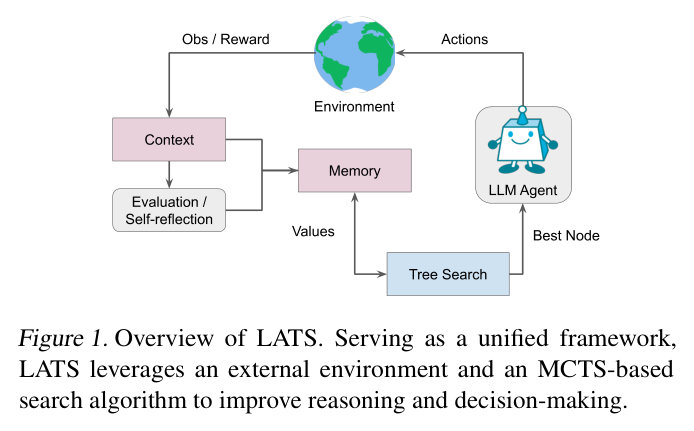
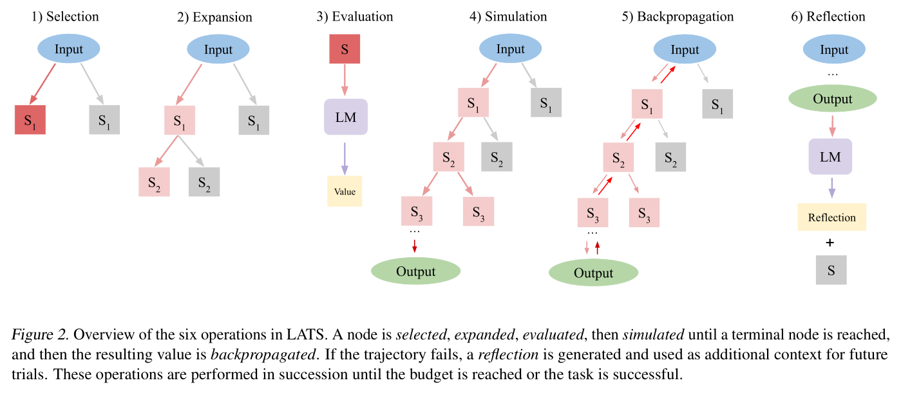
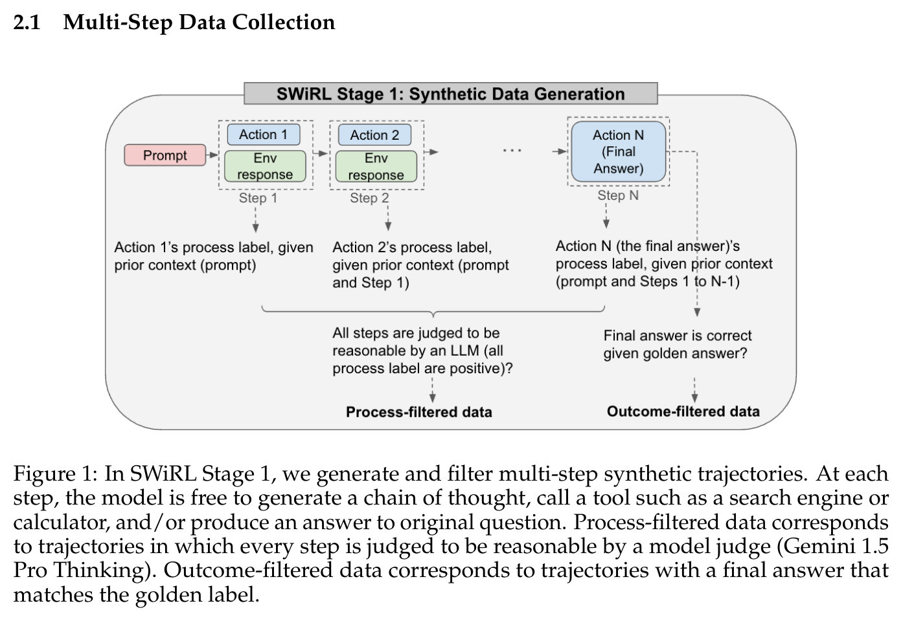
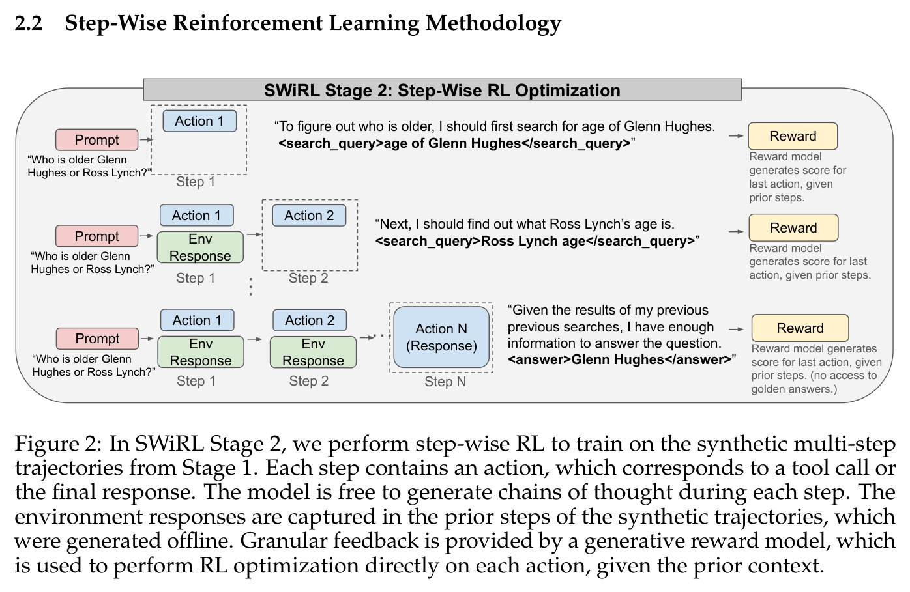
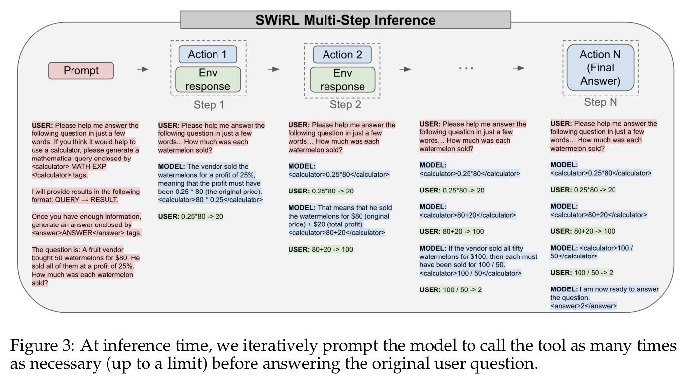
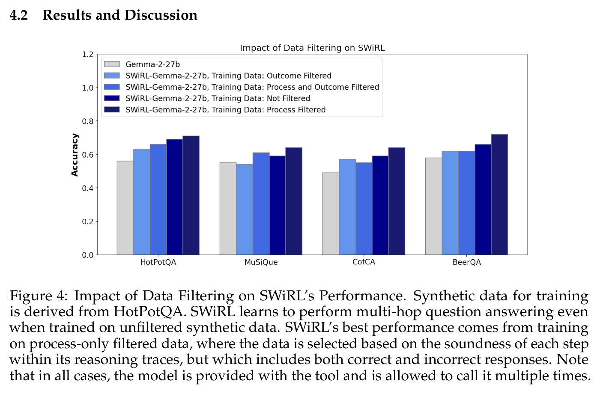
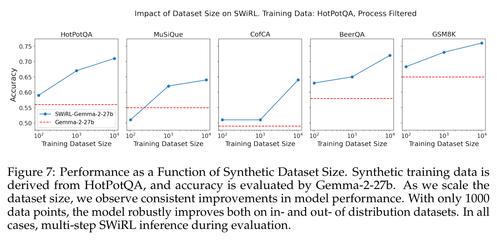
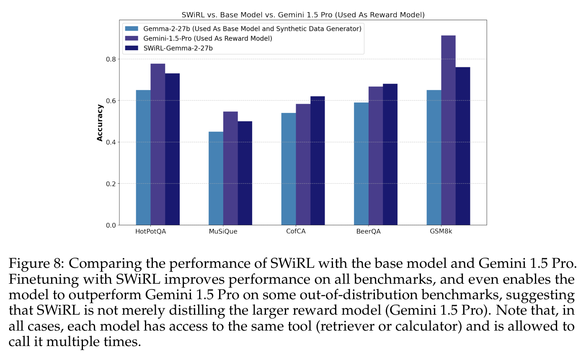
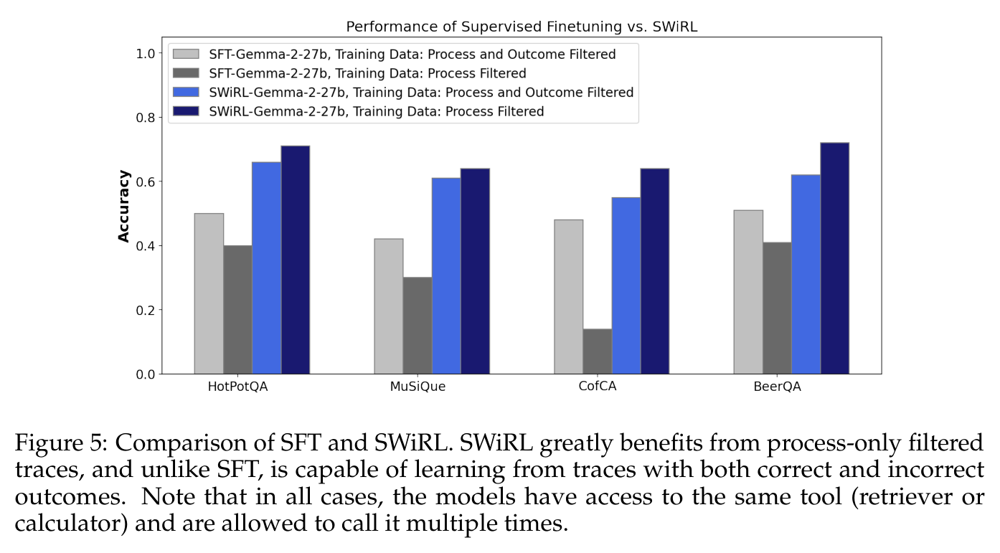

# Lecture 5 — Planning and Multi-Step Reasoning

This lecture is about tasks a model cannot finish in one pass: it has to reason, act on that
reasoning, see what happens, and plan the next step (≈0:05–1:36). The lecture covers three papers
(≈0:05), and each one attaches planning at a different stage. *Language Agent Tree Search* (LATS, 2024) works
at **test time** with no training: it puts a language agent inside Monte Carlo tree search, so the
model explores several action paths, scores them using feedback from the environment, and reflects
on failures. *SPRINT* (2025) is a **post-training** method: it fine-tunes a reasoning model to write
several independent plans at once and run them in parallel, so the same reasoning takes fewer
sequential tokens. *SWiRL* (2025) is also **training**: a model generates its own multi-step
tool-use trajectories offline, another model judges every step, and step-wise reinforcement learning
on those judgements teaches multi-step reasoning that carries over to new tasks and tools.

The captions do not name the lecturer, so this page does not either. The lecturer speaks of SPRINT
and SWiRL as their own group's work ("when we started the project", ≈36:52; "we did not train an
LLM-as-a-Judge", ≈1:01:08).

[Edited transcript](../raw/transcripts/05-planning-and-multi-step-reasoning.md) ·
[verbatim captions](../raw/transcripts/original/05-planning-and-multi-step-reasoning.md) ·
[video](https://www.youtube.com/watch?v=Ml_fp9XkB8Y) ·
[course website](https://cs329a.stanford.edu/) · [sources](../sources.md)

> **Numbering.** This is catalog position 5 ("Part 5 | Planning and Multi-Step Reasoning") and site
> schedule row 5, "Multi-step Reasoning/Planning" (Mon Oct 6). The mapping is confirmed by the
> transcript, which discusses three of the five readings the site lists for row 5 — LATS, SPRINT and
> SWiRL, in that order. The recording does not discuss the other two, ADaPT and *Wider or Deeper?*;
> they are summarised from their abstracts [at the end of this page](#readings-the-recording-does-not-discuss).

## Readings

The course publishes no slides. Its course material is the five papers the course site lists for this
lecture. Licences were checked on each arXiv abstract page: only LATS and SWiRL are CC BY 4.0, and
only those two are transcribed here, main body only. SPRINT is CC BY-NC-SA 4.0, and ADaPT and
*Wider or Deeper?* carry arXiv's non-exclusive licence; those three are linked, discussed and cited by
section, figure and table, and neither their text nor their figures are reproduced.

| Reading | In this KB | Where the lecture covers it |
|---|---|---|
| Zhou et al. (2024), [Language Agent Tree Search Unifies Reasoning Acting and Planning in Language Models](https://arxiv.org/abs/2310.04406) | [main body](../raw/papers/05-lats.md) (CC BY 4.0; appendices not transcribed) | ≈0:05–23:29 |
| Biju et al. (2025), [SPRINT: Enabling Interleaved Planning and Parallelized Execution in Reasoning Models](https://arxiv.org/abs/2506.05745) | linked only (CC BY-NC-SA 4.0) | ≈23:29–50:03 |
| Goldie et al. (2025), [SWiRL: Synthetic Data Generation & Multi-Step RL for Reasoning & Tool Use](https://arxiv.org/abs/2504.04736) | [main body](../raw/papers/05-swirl.md) (CC BY 4.0; appendices not transcribed) | ≈50:03–1:14:33 |
| Prasad et al. (2024), [ADaPT: As-Needed Decomposition and Planning with Language Models](https://arxiv.org/abs/2311.05772) | linked only (arXiv non-exclusive licence) | not discussed |
| Inoue et al. (2025), [Wider or Deeper? Scaling LLM Inference-Time Compute with Adaptive Branching Tree Search](https://arxiv.org/abs/2503.04412) | linked only (arXiv non-exclusive licence) | not discussed |

The years in citations are those of the arXiv versions consulted. The site lists LATS as "Zhou et al.
2023", the year it first appeared on arXiv; the version used here is the ICML 2024 one. The paper
SWiRL's arXiv entry prints its title without the "SWiRL:" prefix the site gives it.

**About the figures on this page.** Each figure is cropped from the published PDF with its printed
caption, for the two CC BY readings only. This KB does not read values off charts: what a figure shows
is what its caption and the paper's text say. Numbers on this page come from the papers' text and
tables.

## Language Agent Tree Search (Zhou et al., 2024)

Full text: [raw/papers/05-lats.md](../raw/papers/05-lats.md) (main body).

### Reasoning, acting and search in one loop

The lecture opens with a trip-planning prompt to show what multi-step tasks need (≈0:50–1:36).
**Reasoning** works out what needs to be done — the budget, the plan. **Acting** gathers more
information or acts on the reasoning, for example by browsing the web or reading a subreddit or a
travel blog. **Search** uses what came back to refine the plan so far, perhaps by considering other
destinations. Solving the problem takes a series of all three.

LATS set out to move beyond generating one plan and executing it, toward **diversity and exploration**
of the paths a model can take. It does this by bringing known techniques from reinforcement learning
and multi-step planning, including **Monte Carlo tree search** (MCTS), into the LLM's reasoning, and
by letting the model take in feedback as it explores the environment and use it to refine later plans
(≈2:23–3:11). In the lecture's Hawaii example, sampled actions such as asking friends who have been to
Hawaii or reading related subreddits each get a score, and the tree grows from the higher-scoring
action. Sibling actions can be executed in parallel, and MCTS supplies the mix of exploration and
exploitation (≈3:11–5:37).

The paper states the gap the same way. Reasoning methods such as chain of thought, tree of thoughts
and RAP rely on the model's internal knowledge. Acting methods such as ReAct and Reflexion use
environment feedback, but they refine a single trajectory without considering alternatives at each step
(Zhou et al., §2, §3.1). LATS expands ReAct into a search over the space of possible reasoning and
acting steps (§1). Its key observation is that **many language-model tasks allow reverting to an
earlier step**, because a state can be restored by copying its text back into the context. Classical
MCTS needs an environment model that can undo steps, and that requirement "does not exist for many LM
tasks" (§1, §3.2).

*Zhou et al. (2024), Figure 1: overview of LATS as a unified framework using an external environment and an MCTS-based search algorithm.*

### What it adds to earlier work

The lecture places LATS against two earlier papers (≈5:37–7:57). **Math-Shepherd**, from
[lecture 3](03-robust-verification.md), uses a verifier to guide search at test time: reasoning
trajectories are scored by the verifier, and the scores decide what to expand. In LATS the scores come
from the **outcomes of the actions** the model takes, together with the model's reflection on how a
trajectory went and the observations from the environment. **ReAct**, from
[lecture 4](04-learning-from-feedback-with-tools-code.md), interleaves reasoning with actions; LATS
keeps that interaction with the environment and adds memory, reflection and much more planning. The
intuition, as the lecture puts it, combines three things: chain of thought's decomposition into steps,
a tree built out of sampled actions and searched, and ReAct's feedback from actions folded into the
search (≈7:11).

The paper uses ReAct's formalism (§4.1). With an input $x$, a pretrained language model $p_\theta$,
observations $o_t$ and actions $a_t$, the action space $\hat{A} = A \cup Z$ contains both permissible
actions $A$ and reasoning traces $Z$. A tree node $s = [x, a_{1 \cdots i}, o_{1 \cdots i}]$ is the input
together with the actions and observations so far (§4.2). In environments without feedback, such as
pure reasoning tasks, LATS uses chain of thought as its base prompt instead (§4.1).

### The six operations

LATS runs six operations in succession until the task succeeds or a budget is reached: **selection,
expansion, evaluation, simulation, backpropagation and reflection** (≈7:57; Zhou et al., §4.2). The
lecture walks through them on a maze prompt: *navigate through a maze to reach an exit*, starting in a
dimly lit room with a door on the left and one on the right (≈7:57).

*Zhou et al. (2024), Figure 2: the six operations of LATS — a node is selected, expanded, evaluated and simulated to a terminal node, the value is backpropagated, and a failed trajectory produces a reflection used as context in later trials.*

1. **Selection** picks the node to expand, using UCT (below) (≈8:44). In the paper this starts at the
   root and picks a child at each level until it reaches a leaf (§4.2).
2. **Expansion** samples several actions from that node. In the maze, three are sampled: open the left
   door, open the right door, inspect the room for clues. Each action is **executed in the
   environment**, and its observation — for the left door, a dark corridor with paintings — is
   appended to the context (≈8:44–9:29). The paper samples $n$ actions, giving $n$ new children, and
   keeps the tree in an external long-term memory (§4.2).
3. **Evaluation** scores each new state (≈9:29–11:04). One part is an **LM score**: the model is
   prompted, as an LLM judge, to rate how promising the state is between 0 and 1. The other is a
   **self-consistency score**: if many actions are sampled and grouped by type, an action that is
   sampled more often scores higher. The lecture says the two are added together, and its example gives
   one state a high self-consistency score because its action was sampled 75% of the time. The
   paper's value function weights the two with a hyperparameter $\lambda$,
   $V(s) = \lambda \cdot \text{LM}(s) + (1 - \lambda) \cdot \text{SC}(s)$ (§4.2). What distinguishes it from tree of thoughts, the paper says, is that the value is computed **after**
   the environment's feedback, which improves value assignment (§4.2).
4. **Simulation** expands the chosen node until a terminal state — success, failure, or the expansion
   budget (≈11:04–11:50). In the maze, the highest-valued state is expanded greedily, the model takes
   the staircase, and the observation is an exit door clearly marked (≈11:50–12:38). In the paper,
   simulation prioritises the highest-valued nodes at each depth, and success is defined by the
   environment, for instance completing a purchase (§4.2).
5. **Backpropagation** uses the trajectory's outcome to update the values of the states along it, which
   then influence later selection (≈12:38).
6. **Reflection** has the model write down what led to the trajectory's outcome, which the lecture says
   "has been very helpful" to the method's overall quality (≈16:27). The lecture describes this for a
   trajectory that fails or succeeds. The paper generates a reflection when it reaches an
   **unsuccessful** terminal node: the model gets the trajectory and its reward, summarises the errors
   and proposes alternatives, and both are stored and given as context to the agent and the value
   function in later iterations (§4.2, Figure 2). The paper calls this "a semantic gradient signal"
   that lets the agent learn from trial and error without reinforcement learning (§4.2).

### UCT and the backpropagated value

Selection needs one number per node, and LATS takes it from the MCTS literature: **UCT**, upper
confidence bounds applied to trees (≈13:23). It balances **exploitation** against **exploration**. Going
only by the highest current value could miss nodes that look worse now but lead somewhere better
(≈14:08). With $V(s)$ the value of child state $s$, $N(s)$ its visit count, $N(p)$ its parent's visit
count and $w$ the exploration weight (Zhou et al., §3.2, Equation 1):

$$UCT(s) = V(s) + w \sqrt{\frac{\ln N(p)}{N(s)}} \tag{1}$$

The lecture reads it as the value of the node plus a hyperparameter times an exploration term
(≈14:08). A node visited rarely relative to its parent gets a larger exploration term; a node visited
many times gets a smaller one, so its UCT drops relative to the parent's unexplored children
(≈14:54).

At the end of a trajectory, the return $r$ updates each value along the path. The lecture states it as
the old value times the number of visits minus one, plus the return, all divided by the number of visits
(≈15:40), which is the MCTS update in the paper's preliminaries (§3.2):

$$V(s) = \frac{V_{\text{old}}(s) \left( N(s) - 1 \right) + r}{N(s)}$$

The paper's LATS section writes the update along a trajectory $s_0, \dots, s_l$ as
$N(s_i) = N(s_{i-1}) + 1$ and $V(s_i) = \frac{V(s_{i-1}) N(s_{i-1}) + r}{N(s_i)}$, where $r$ is the
reward (§4.2).

Asked about the form of the formula, the lecturer says there is mathematics and theoretical intuition
behind it but no proof that it is optimal; it is considered a good way of balancing the two
(≈15:40–16:27).

### Results

**HotPotQA.** Answering these questions requires retrieval from at least two Wikipedia pages by
design, so the process is multi-step (≈17:14). The lecture's point is that performance improves
significantly as more trajectories are sampled, and that reflection and the reasoning traces give a
further boost: LATS turns more test-time compute into better solutions (≈17:14–18:01). The paper runs
GPT-3.5 on 100 questions and gives the agent ReAct's search and lookup API. It uses an **oracle
setup**: the environment says whether a submitted answer is correct. The paper notes this is
consistent with earlier work and lets it focus on how well the agent incorporates external feedback
(§5.1). Its acting-based results, Table 3 (exact match; $n$ children expanded per step, $k = 50$
trajectories):

| Prompt method (Table 3) | HotpotQA (EM) |
|---|---|
| ReAct | 0.32 |
| ReAct (best of $k$) | 0.38 |
| Reflexion | 0.51 |
| ToT (ReAct) | 0.39 |
| RAP (ReAct) | 0.54 |
| LATS (ReAct) | 0.63 |
| LATS ($n = 3$) | 0.58 |
| LATS ($n = 10$) | 0.65 |
| LATS (CoT + ReAct) | **0.71** |

Tree of thoughts and RAP adapted to ReAct prompting do worse than their reasoning-only versions (0.55
and 0.60 in Table 2), which the paper reads as evidence that adapting search algorithms to
decision-making is non-trivial (§5.1). Varying the number of sampled trajectories, LATS reaches 0.44,
0.52 and 0.61 at $k$ = 10, 30 and 50, expanding fewer nodes than ToT or RAP at each budget (§5.4,
Table 10). Removing reflection drops LATS from 0.63 to 0.58, replacing MCTS with depth-first search
drops it to 0.42, and removing the LM value heuristic drops it to 0.37 (§5.4, Table 8).

**WebShop.** An online-shopping environment built for practical applications, where an instruction
such as a small portable folding desk, already fully assembled, with a given colour, finish and price,
has to be turned into a purchase over several steps (≈18:01–18:46). The lecture says LATS gets very
high results with no fine-tuning, at test time alone, close to human experts (≈18:46). The paper's
Table 6:

| Method (Table 6) | Score | Success rate |
|---|---|---|
| ReAct | 53.8 | 28.0 |
| ReAct (best of k) | 59.1 | 32.0 |
| Reflexion | 64.2 | 35.0 |
| LATS (ReAct) | **75.9** | **38.0** |
| IL | 59.9 | 29.1 |
| IL+RL | 62.4 | 28.7 |
| Fine-tuning | 67.5 | 45.0 |
| Expert | 82.1 | 59.6 |

So LATS's score comes near the experts' while its success rate stays well below theirs, and below the
fine-tuned model's. The paper's own claim is a score "comparable to gradient-based fine-tuning"
(abstract). Its reflections on WebShop were often generic and less useful (§5.3).

**Tasks the lecture does not discuss.** On programming, LATS uses test-suite and compiler feedback
and reaches 92.7 $\text{pass@}1$ on HumanEval with GPT-4, and 81.1 on MBPP with GPT-3.5 (§5.2, Tables 4 and
5). On Game of 24, a purely internal reasoning task, it has a success rate of 0.44 against 0.40 for RAP
(§5.4, Table 7).

### Strengths and limits

To summarise, the lecturer says LATS combines reasoning, taking actions and planning, and brings known
ideas such as MCTS into the language-model world, with strong results across domains. Because it works
at test time and is modular, it is portable and relatively easy to build (≈18:46–19:35).

The lecture names two limits. The first is **cost**: every expansion and backpropagation adds cost,
and the lecturer says the cost–benefit was not really analysed in the paper (≈19:35). The version
transcribed here does include a cost analysis. It compares sample complexity and token consumption
upon success on HotPotQA: LATS has the same $O(kn)$ sample complexity as other tree-search methods and
used fewer tokens than ToT or RAP (§5.4, Tables 9 and 10). Its conclusion lists higher computational
cost than ReAct or Reflexion as a limitation (§6). The second is **irreversible actions**: a model that
pays for a service or runs a transaction cannot simply back up, so the approach may not adapt to those
scenarios (≈19:35–20:21). The paper names the same assumption as its second limitation. It notes that
reverting is feasible in many real-world applications (§6).

### Discussion

The class discusses the paper's strengths and weaknesses and how to extend it (≈20:21).

- **Why UCT and not other bandit algorithms?** A student notes that UCT comes from the upper
  confidence bound in bandit learning, and asks whether the paper tried other algorithms. It did not.
  The whole literature on multi-armed bandits and other ways to balance exploration and exploitation
  could be tried here, and the paper's main contribution is a platform others can plug such approaches
  into (≈21:09–21:55).
- **What about repeated actions?** If the same action appears at several nodes, does the tree treat them
  as independent trajectories? Under a given parent, a repeated action increases that action's count,
  which enters the UCT formula. The structure is assumed to be a tree, not a fully connected graph
  (≈21:55–23:29).

## SPRINT (Biju et al., 2025)

Not transcribed in this KB (CC BY-NC-SA 4.0); read it at [arXiv](https://arxiv.org/abs/2506.05745). The
lecturer introduces it as a NeurIPS 2025 paper, not yet presented at the conference at the time, and
as a way to use the model itself to think better **in parallel** (≈23:29).

### Longer thinking, much of it independent

Reasoning models such as o1 and Gemini 2.5 Pro think more on harder problems, and longer thinking
goes with higher accuracy (≈23:29–24:19). The lecture shows two training curves from DeepSeek-R1:
accuracy on math problems rising through training, and average response length rising with it
(≈24:19); the captions garble the benchmark's name. Those charts come from DeepSeek-R1's work, not from SPRINT's main body, so this page cites
them to the transcript only.

These long reasoning steps help, but many of them are **independent of each other**. The model tries
alternative approaches, decomposes a task into subtasks that could run in parallel, and verifies
earlier steps. Laid out as a graph, parts of the computation do not depend on each other, so there is
no need to wait for them to be generated one after another (≈25:04–25:52). The paper makes the same
observation (Biju et al., §1). It also sets SPRINT against both families of test-time scaling:
sequential reasoning models produce very long outputs, and parallel methods such as repeated sampling
and self-consistency lack coordination across paths (§1, §2).

### A planner and a pool of executors

SPRINT is a post-training and fine-tuning framework that lets a reasoning model generate its response
as a **planner** and a set of **executors**. The planner creates plans; executors carry them out, in
parallel; and this repeats, interleaving rounds of planning with rounds of parallel execution
(≈25:52–26:38). In the paper each round is a **stage** with three phases (§3.1, Figure 1):

1. **Planning.** The planner sees the cumulative context — the query, earlier plans and execution
   results — and writes the current stage's plan inside `<Plan_i>` tags. It may reason as it goes.
   Each subtask it delegates is written inside `<prompt_i.j>` tags, and an executor starts as soon as
   a prompt closes.
2. **Parallel executions.** Each executor carries out its subtask with its own chain of thought,
   concurrently with the others.
3. **Syncing.** The results, inside `<execution_i.j>` tags, are appended to the context in prompt order,
   and the planner either starts the next stage or gives the final answer.

The lecture's picture of why this matters is latency and cost. Multi-step reasoning makes inference
expensive, and waiting for a response is slow (≈31:17–32:04). A sequential model writes plan 1,
executes it, writes plan 2, executes it. After SPRINT fine-tuning, the model writes plans 1 and 2
together, and their executions run at the same time — possibly as tool calls, for example a calculator
in Python (≈32:04–32:57; Figure 3).

### Building the training data with an LLM

The lecturer frames the data pipeline as a pattern worth carrying beyond this paper: to teach a model a
behaviour, use LLMs themselves to create the fine-tuning data (≈27:24). The steps (≈27:24–30:30;
Biju et al., §3.2, Figure 2):

1. **Step extraction.** DeepSeek-R1 generates reasoning traces for questions. GPT-4o splits each trace
   into steps and marks, within each step, the **planning** part and the **execution** part; some plans
   have several executions (≈27:24–28:56). In the paper, very short executions are merged back into
   their plan, making them plan-only steps, which discourages trivial executor calls (§3.2). The
   lecture mentions this measure in answering a question (≈42:23).
2. **DAG creation.** A model then identifies which steps depend on which — in the lecture's example,
   steps 2 and 4 both depend on step 1 but not on each other — giving a directed acyclic graph of the
   trace (≈28:56–29:45). The paper uses GPT-4o-mini for this (§3.2).
3. **Packing.** Steps are grouped into stages that can run in parallel: step 1 first, then steps 2 and 3
   together, and so on (≈29:45). The paper packs by depth in the DAG, with an adjustment: a step whose
   parent is plan-only can join that parent's stage (§3.2).
4. **Fine-tuning.** The reasoning model is fine-tuned, by supervised fine-tuning only, on the traces
   rewritten with these tags. At inference it then outputs plans and their parallel executions itself
   (≈29:45–31:17). The paper keeps only trajectories whose parallelization ratio — the number of steps
   divided by the number of stages — is at least 1.5 (§3.2).

### Recipe and results

The recipe (≈36:05–36:52): generate 6,000 thinking trajectories on the MATH dataset, keep those with
more parallelization, and fine-tune **DeepSeek-R1-Distill-Qwen-7B** on the reformatted trajectories.
In the paper the 6,000 are DeepSeek-R1 trajectories on MATH's training set; filtering for correct
answers and running the pipeline leaves about 1,700 training samples (§4.1). The main baseline is
**RFT**, the same 7B model fine-tuned on the same 1,700 trajectories without the plan–execution
format (§4.1). The lecture calls RFT a rejection fine-tuning method (≈45:27); the paper expands it as
"reasoning fine-tuned model" (§4.1).

**Accuracy went up as well.** The project set out to reduce sequential token generation, but the
structured format also raised accuracy: "the model seems to like these more structured way of
thinking" (≈36:52). The lecture describes a jump of about 3.5% over the 7B base model, while being
much more efficient than a 32B model in sequential tokens (≈37:39). The paper reports MATH-500 accuracy
rising from 89.1% for the base model to 92.5%, against 91.0% for RFT, with 440 (about 15%) fewer
sequential tokens than RFT on average. Both fine-tuned models come close to the accuracy of the much
larger R1-Distill-32B (§1, §4.2, Figure 4, Table 2).

**Out of domain.** Trained only on MATH, the model also does better on **Countdown** and **GPQA
Diamond**, with more parallelism and higher accuracy, without training on either (≈37:39–39:16). In the
paper's Table 2, SPRINT reaches 85.9% on Countdown with 2,284 sequential tokens against RFT's 84.9% and
4,917, and 51.0% on GPQA-Diamond with 6,336 against 50.5% and 7,103 (§4.2).

**Savings grow with problem length.** The lecture speaks of reducing sequential tokens by "something
like 40%" on MATH, and stresses that savings are task-dependent and largest on problems that need more
thinking (≈44:41). Where the baseline's reasoning is short, planning adds overhead and can be worse than
the baseline (≈45:27–46:13). The paper measures this against RFT's trajectory length: a 5% increase in
sequential tokens on short problems, and a 39% reduction on problems where RFT needs more than 8,000
tokens (§4.2, Figure 6). It also estimates runtime, rather than measuring it: 9% faster than RFT on
MATH-500 (36.92 s against 40.57 s per problem), and 38% faster on the long-reasoning subset (§4.2).

**Where the parallelism is.** Harder problems need more rounds of planning and execution — perhaps
intuitive — and less intuitively, there is more parallelism and exploration in the early stages, while
later stages converge on fewer plans and dive deep into one (≈40:48–41:35). The paper reports the same
pattern (§4.2, Figure 5).

As an aside on how long reasoning has become, the lecturer points to the Claude Sonnet 4.5 system card,
whose prompt encourages the model to use tools as much as possible, at least 100 times. The lecturer
takes it as a sign that problems now go well beyond 8,000–10,000 tokens (≈46:13).

### Questions on SPRINT

- **What if the model needs to replan?** The model still sees the whole context and can revise or
  reverse a plan. Training only teaches it that, whenever plans can run in parallel — including
  revisions of earlier plans — it should write them together, rather than waiting for plan 1's
  execution to write plan 2 (≈33:42–35:16).
- **Does this change the model's architecture?** No. It is still next-token prediction. Because the
  model has learned to emit tags marking plans and executions, the system can branch out at those tags
  and run the executions in parallel (≈35:16–36:05).
- **What if parallel branches are each right but wrong together?** Everything is condensed back into
  the context, and the model is expected to resolve contradictions before its final answer. Sequential
  reasoning can contradict itself too. Here the plans are mostly different steps of one solution
  rather than competing approaches (≈39:16–40:48).
- **How are parallel tasks load-balanced?** A straggler is still possible: if step 4 takes much longer
  than step 2, the stage waits for step 4, but not for step 4 plus step 2. Merging executions that are
  too simple back into the plan creates bigger parallel chunks, and balancing across stages is room for
  optimisation (≈41:35–43:10).
- **How wide is the tree?** The lecturer does not know the exact width. Parallelism is task-dependent,
  and this approach needs it to exist, but many reasoning problems, such as MATH and GPQA, have it
  (≈43:10–44:41).
- **Does inference match the training format?** In training, independent plans 1 and 2 sit next to
  each other, followed by executions 1 and 2. At inference the model still writes plans and executions
  in order, but executions start as soon as their plans are written, and run in parallel; the results
  return to the context before the next plans (≈47:00–49:17).

**Open directions**, as the lecturer lists them (≈49:17–50:03): this work used supervised fine-tuning,
but RL methods such as GRPO could get much more from the data, and generalisation usually works well
with RL; parallel and overlapping tool use; and realising the wall-clock speed-up in an implementation.
The paper's limitations section names the same three: hardware-aware decoding to turn fewer sequential
tokens into real wall-clock gains, parallelising tool calls (it cites SWiRL among such tool-use
methods), and latency-aware RL beyond supervised data (§5).

## SWiRL (Goldie et al., 2025)

Full text: [raw/papers/05-swirl.md](../raw/papers/05-swirl.md) (main body).

### Why multi-step training

SWiRL continues the theme of multi-step synthetic data generation and helping the model do multi-step
work better. It was to be presented the following week at COLM, the Conference on Language Modeling,
in Montreal (≈50:03). Unlike LATS, it **trains** the model (≈50:51).

Many real tasks need several steps of reasoning and tool use: answering a multi-hop question with a
search engine, solving math problems, a software project, planning a trip, analysing data (≈50:51).
The lecture names three difficulties (≈51:38–53:10). Errors **compound** over steps. **Live tools**
during training are a problem, because they fail, they are slow, and training is already slow. And
fine-tuning methods from earlier lectures — RLHF, RL from AI feedback, RL from execution feedback — are
largely **single-step**: the model produces a final answer, the reward depends only on that answer,
and it is propagated back. SWiRL wants more control over how the steps are generated. The paper makes
the same point about RLHF, RLAIF and RLEF (Goldie et al., §1). See
[lecture 4](04-learning-from-feedback-with-tools-code.md).

The design goals (≈53:10–54:48) are these. The model should solve complex multi-step tasks; know when
to call a tool and how to write the query; keep its reasoning accurate across steps; recover from
errors; and know when to stop calling tools and answer. It should avoid tool calls during training,
and it should generalise to new tools and tasks.

### Stage 1: synthetic multi-step data

The model is prompted **one step at a time**, and at each step it is free to reason with a chain of
thought, call a tool, or give a final answer (≈54:48). Its first action is typically reasoning followed
by a tool call. The tool's response is shown to the model with the same prompt plus the previous
context, and it takes the next action (≈55:37). Iterative prompting builds multi-step trajectories of
different lengths, say 1 to 3 or 5 steps (≈56:25). Each step is then labelled by an **LLM judge**, which
sees the prior context and the current action (reasoning plus a tool call) and estimates how good it is
(≈56:25–57:10). All of this runs **offline**, in parallel across many questions (≈57:10).

*Goldie et al. (2025), Figure 1: SWiRL Stage 1 — generating and filtering multi-step synthetic trajectories, where process filtering keeps trajectories whose every step a model judge (Gemini 1.5 Pro Thinking) finds reasonable and outcome filtering keeps those whose final answer matches the golden label.*

The paper writes a trajectory as $\tau = (s_1, a_1, \dots, s_K, a_K)$. The first state $s_1$ is the
prompt. Each later state $s_i$ holds the whole context so far — the previous state and action, and
the tool's response to that action — and $a_i$ is the model's response in state $s_i$ (§2.1). The data
come from Gemma 2: 50,000 trajectories seeded by 10,000 HotPotQA training questions (five each, with
"Easy" questions removed) and 37,500 seeded by GSM8K's 7,500 training questions. Trajectories are capped
at 5 steps for HotPotQA and 10 for GSM8K (§1, §2.1).

The trajectories can then be **filtered** four ways (≈57:10–58:42; §2.1). **No filtering.** **Process
filtering** keeps trajectories where the judge found every step reasonable given the steps before it;
in the paper the judge is Gemini 1.5 Pro Thinking, giving a binary judgement, and no golden labels are
used. **Outcome filtering** keeps trajectories whose final answer is correct, whatever the step labels
say. **Process and outcome filtering** keeps only trajectories that pass both.

### Stage 2: step-wise RL, with no tool calls

Training is reinforcement learning, and the lecture walks through the paper's figure with a question:
*who is older*, a person named Glenn — "I don't know the last name," the lecturer says — or Ross Lynch
(≈58:42); the paper's Figure 2 prints the name as Glenn Hughes. Action 1 decides to search first for the first person's age, and the judge gives it a
reward. The model is shown that search's result, already in the training data, and its next action
searches for the second person's age, which is rewarded too. Given both results, the model outputs the
final answer inside answer tags, which is rewarded as well (≈58:42–59:29).

The point to notice, the lecturer says, is that **the tools are never called during training**. Every
tool call and environment response was collected offline. During RL, the model is shown the prompt and
the recorded steps up to action $k$ with their environment responses, and asked for the next action.
That action is **not executed**; the judge rewards it and the reward drives the RL update. The authors
found that an LLM judges a proposed action's quality well enough without seeing it executed
(≈59:29–1:01:08).

*Goldie et al. (2025), Figure 2: SWiRL Stage 2 — step-wise RL on the synthetic trajectories, where environment responses come from the offline trajectories and a generative reward model scores each action given its prior context.*

The objective (≈1:02:44–1:04:18) is the expected reward of a single action given all the context so
far, for every step from the first action to the last. In the paper (§2.2):

$$J(\theta) = \mathbb{E}_ {s \sim \mathrm{T}, a \sim \pi_\theta(s)} \left[ R(a \mid s) \right]$$

Here $\pi_\theta$ is the base model being fine-tuned, $\mathrm{T}$ is the set of all states in the synthetic
trajectories, and $R(a \mid s)$ comes from a generative reward model, Gemini 1.5 Pro, judging response $a$
in context $s$. No golden labels are used, and the reward is optimised with the same policy gradient
algorithm Gemma 2 used for human-feedback reward (§2.2).

**Questions.** *Was the judge trained?* No; it was prompted (≈1:01:08). *How can a judge that never
sees the tool's output give a sensible score?* It judges the **query** the model wrote for the tool, not
the tool's result. Whether a query asking for this person's age is a good search query can be judged without
knowing the age. This is process feedback — a process reward per step — and the earlier tool results
are already in the prior context (≈1:01:55–1:02:44). See [verifiers](verifiers.md) for process rewards.

### Inference

At inference the model is prompted iteratively, and this time the tools do run (≈1:04:18–1:05:54). The
prompt asks it to answer in a few words, describes the tool — for example a calculator, used by writing
a math query inside tags — and says to produce answer tags once it has enough information. Each tool
call is executed, its output is shown to the model with the question and the history, and the model
takes its next action, until it answers. In the paper, search queries are embedded with a Gecko model
and looked up in a vector database, and calculator expressions run in a SymPy interpreter. The
process ends when the model answers or reaches the query limit, 5 for question answering and 10 for math
(§2.3, Figure 3).

*Goldie et al. (2025), Figure 3: at inference time the model is prompted iteratively to call the tool as many times as needed, up to a limit, before answering the user's question.*

### Results

The setup (≈1:05:54–1:06:44): **Gemma-2-27b** generates the synthetic data, from HotPotQA and GSM8K
questions — "something like 50k" — processed with the four filters.

**Process filtering beats outcome filtering.** Surprisingly at first, training on **process-filtered**
data, where the judge approved the steps but the final answers were not checked, helped more than
training only on trajectories with correct outcomes, or with correct processes and outcomes
(≈1:06:44–1:07:29). The lecture's explanation: trajectories the model already gets right do not teach
it to solve problems it could not, while sound steps that did not reach the right answer can
(≈1:07:29–1:08:14). The paper finds process-only filtering consistently best. Outcome-filtered data is
less effective than unfiltered data everywhere except MuSiQue, and the paper hypothesises that SWiRL
benefits from seeing both positive and negative examples (§4.2, Figure 4).

*Goldie et al. (2025), Figure 4: impact of data filtering on SWiRL's performance, with synthetic training data from HotPotQA; the best performance comes from process-only filtered data, which includes both correct and incorrect responses.*

**It generalises across tasks and tools.** This was the most interesting finding, and one the lecturer
says they also see in SPRINT (≈1:08:14). Trained on GSM8K math with SymPy as a calculator, the model
improves on HotPotQA from 65 to 71. Trained on HotPotQA itself with a search tool, the gain is 65 to 73,
and a HotPotQA-trained model also does well on GSM8K (≈1:08:14–1:09:03). So the model seems to be
learning to think in steps and invoke a tool, beyond using a specific tool (≈1:09:03). The paper's
Table 2:

| Model (Table 2) | GSM8K (math) | HotPotQA (qa) | CofCA (qa) | BeerQA (qa) | MuSiQue (qa) |
|---|---|---|---|---|---|
| Base Model | 0.65 | 0.65 | 0.54 | 0.59 | 0.45 |
| SWiRL on GSM8K (math) | 0.79 | 0.71 | 0.56 | 0.68 | 0.49 |
| SWiRL on HotPotQA (qa) | 0.76 | 0.73 | 0.62 | 0.68 | 0.50 |

The abstract states the cross-task gains as relative figures: training only on HotPotQA improves GSM8K
by 16.9%, and the conclusion gives 9.2% the other way (abstract, §5).

**More synthetic data helps, even on another task.** With training on HotPotQA with search, test
accuracy rises from 100 to 10,000 training examples, including on GSM8K math. The lecturer calls this
"the most important graph from this paper": synthetic data made in environments where it is easier to
create can teach behaviour that generalises to new tools and domains, and scaling it up could be very
powerful (≈1:09:51–1:10:41). In the paper, 100 examples are not enough, 1,000 give solid gains on every
dataset, and 10,000 give more (§4.2, Figure 7).

*Goldie et al. (2025), Figure 7: performance as a function of synthetic dataset size, with training data from HotPotQA and accuracy judged by Gemma-2-27b.*

**Why it works: better steps.** The average **process reward per step** rises after SWiRL training, both
in distribution (HotPotQA) and out of distribution (GSM8K), so the model reasons more correctly per step
(≈1:10:41–1:11:28). The paper's Table 3 gives the mean process label, scored with the same judge and
prompt as process filtering, on 500 trajectories each: on HotPotQA 82.5% for the base model and 91.0%
after SWiRL, and on GSM8K 87.5% and 91.6% (§4.2).

**Against a frontier model.** The lecture shows SWiRL compared with frontier models (≈1:12:15). In the
paper the fine-tuned Gemma-2-27b beats its base model everywhere, and beats Gemini 1.5 Pro — its own
reward model — on some out-of-distribution benchmarks, CofCA and BeerQA. The authors read this as SWiRL
not merely distilling the larger reward model (§4.2, Figure 8).

*Goldie et al. (2025), Figure 8: SWiRL compared with the base model and Gemini 1.5 Pro; each model has the same tool and may call it several times.*

**RL beats supervised fine-tuning, and wants different data.** The same process could be run with
supervised fine-tuning, but multi-step RL does better by a good amount (≈1:12:15). SFT benefited from
training data that was **both process- and outcome-filtered**, which worked better for it than
process-only data (≈1:12:15–1:13:02). The lecturer's explanation is that SFT is imitation learning: it
teaches the model to repeat trajectories, so incorrect outcomes hurt. RL instead gives the model a new
chance to take a new action within the prior steps, and rewards that action, which is how it breaks
out (≈1:13:02). The paper attributes it to SFT's tendency to memorise rather than generalise, and
reports that SFT actually degraded performance relative to the base model (§4.2, Figure 5).

*Goldie et al. (2025), Figure 5: SFT compared with SWiRL; SWiRL benefits from process-only filtered traces and, unlike SFT, learns from traces with both correct and incorrect outcomes.*

Two results in the paper are not discussed in the lecture. First, the gains are not only from
the tool: multi-step tool use at inference helps both the base and SWiRL models, but SWiRL gains even
without a tool, which the paper takes as better decomposition of problems (§4.2, Figure 6). Second,
against published baselines, SWiRL raises Gemma 2-27b's partial-match accuracy from 58.6 to 67.8 on
HotpotQA, 31.7 to 39.3 on CofCA and 35.4 to 43.6 on MuSiQue (§4, Table 1). The lecture moves past
"some other results" for lack of time (≈1:13:02).

### Summary

SWiRL generalises across datasets and tools and transfers to disparate tasks. It learns better from
process-filtered data and gains a lot from more synthetic data, in and out of domain. After fine-tuning,
the model's process correctness improves — it gets better at multi-step thinking — on both
in-distribution and out-of-distribution data (≈1:13:48–1:14:33). The paper summarises its gains as an
average 15% over baselines across the multi-hop question-answering and math tasks (§5).

## What connects the three

The lecturer draws some of the lines explicitly. Using **LLMs to create training data** for a
behaviour is presented in SPRINT as a pattern "we're seeing it in the following work" (≈27:24), and SWiRL is
introduced as a continuation of multi-step synthetic data generation (≈50:03). **Generalisation beyond
the training domain** appears in both: SPRINT trained on math improves on Countdown and GPQA Diamond
(≈38:30), and SWiRL trained on math improves question answering and vice versa, "something that we are
seeing in the SPRINT project as well" (≈1:08:14). And SPRINT's own open direction, RL in place of
supervised fine-tuning (≈49:17), is what SWiRL does for multi-step tool use.

The three also split along the axis the course has followed since
[lecture 2](02-test-time-compute-scaling.md). LATS spends **test-time compute** on search, and pays for it
in cost and in needing reversible actions. SPRINT and SWiRL spend **training** to change how the model
reasons: SPRINT to cut latency, SWiRL to improve accuracy on multi-step tool use. See
[test-time scaling](test-time-scaling.md) and [self-improvement](self-improvement.md).

## Readings the recording does not discuss

The site lists two further readings for this lecture that the recording does not mention. Both carry
arXiv's non-exclusive licence and are linked only. What follows is from their abstracts, not the lecture.

- **ADaPT: As-Needed Decomposition and Planning with Language Models** (Prasad et al., 2024;
  [arXiv](https://arxiv.org/abs/2311.05772)). The abstract describes two ways language models are used
  as agents: **iterative executors**, which decide the next action each step, and **plan-and-execute**
  methods, which write a plan and execute its sub-tasks. Both struggle with task complexity, because
  failing any one sub-task can fail the whole task. ADaPT plans and decomposes a sub-task **only when
  the executor cannot do it**, recursively, adapting to both the task's complexity and the model's
  capability. It reports success rates up to 28.3% higher on ALFWorld, 27% on WebShop and 33% on
  TextCraft, a compositional dataset it introduces. SPRINT's related work cites ADaPT among methods that
  decompose tasks into subtasks with sequential execution (Biju et al., §2).
- **Wider or Deeper? Scaling LLM Inference-Time Compute with Adaptive Branching Tree Search** (Inoue et
  al., 2025; [arXiv](https://arxiv.org/abs/2503.04412)). The abstract starts from repeated sampling — see
  [lecture 2](02-test-time-compute-scaling.md) — which is effective but uses no external feedback
  signals to refine answers, even where tasks such as coding provide them. **Adaptive Branching Monte
  Carlo Tree Search (AB-MCTS)** generalises repeated sampling with multi-turn exploration and
  exploitation. At each node of the search tree it decides whether to "go wider", expanding new
  candidate responses, or "go deeper", revisiting existing ones, based on the feedback. On complex
  coding and engineering tasks with frontier models, it outperforms both repeated sampling and standard
  MCTS. Its code is released as TreeQuest by Sakana AI.

## Related pages

- [Agents and agentic workflows](agentic-workflows.md) — LATS as ReAct plus tree search, SPRINT's
  planner and executors, and SWiRL's training for multi-step tool use.
- [Test-time scaling](test-time-scaling.md) — tree search with environment feedback as another way to
  spend inference compute, and SPRINT's parallelising of a single reasoning trace.
- [Self-improvement](self-improvement.md) — a model's own trajectories, judged by another model, as
  training data that generalises.
- [Verifiers](verifiers.md) — an LLM judge as LATS's value function and as SWiRL's process reward.
- [The LLM training pipeline](llm-training-pipeline.md) — step-wise RL for multi-step tasks, and why RL
  and supervised fine-tuning want differently filtered data.
- [Reasoning models](reasoning-models.md) — long sequential thinking, and training a reasoning model to
  plan and execute in parallel.
- [Lecture 4 — Learning from Feedback with Tools/Code](04-learning-from-feedback-with-tools-code.md) —
  ReAct, which LATS builds on, and the single-step RLHF, RLAIF and RLEF that SWiRL extends.
