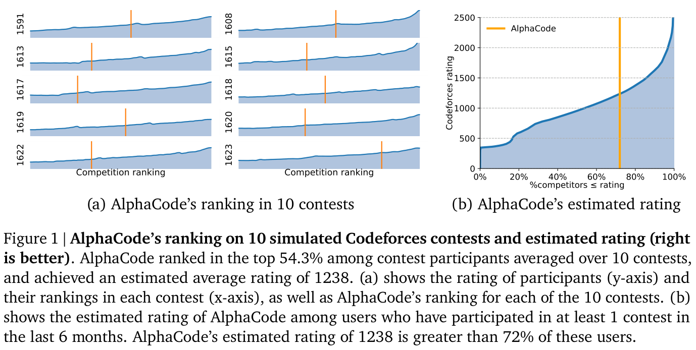
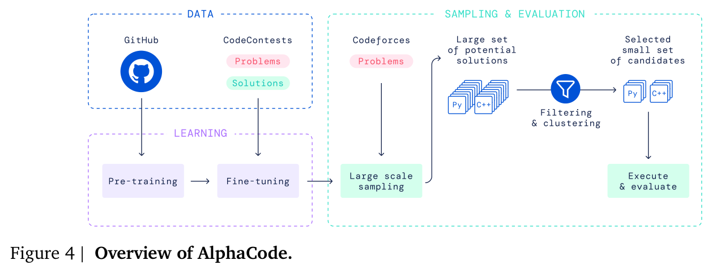
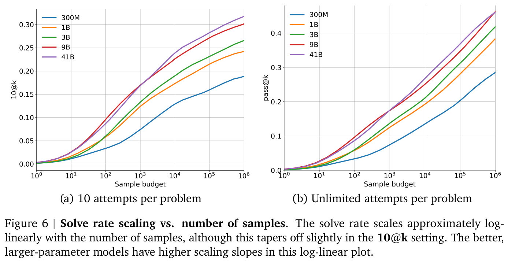
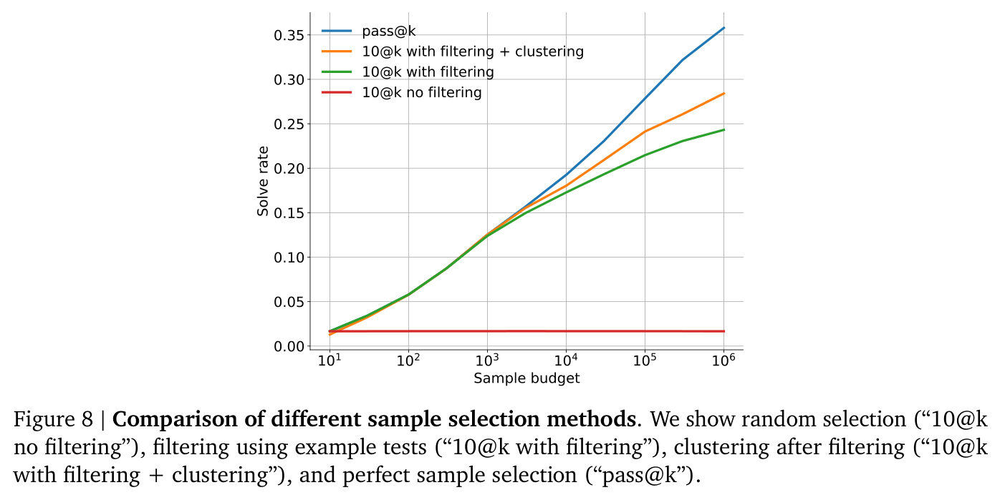
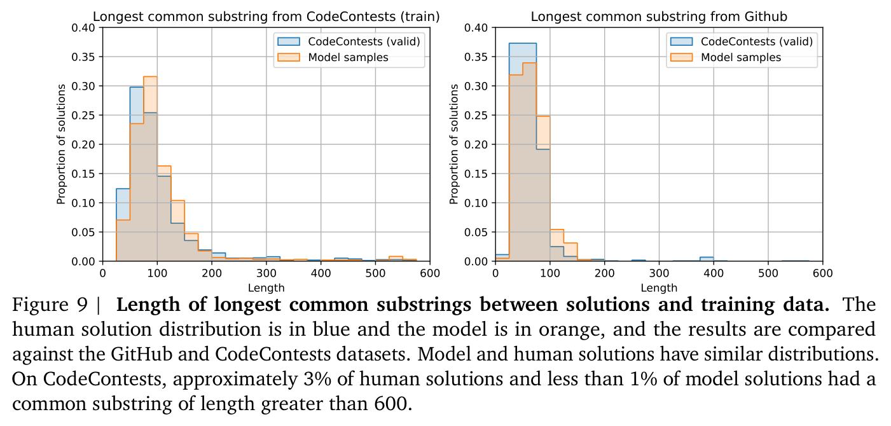
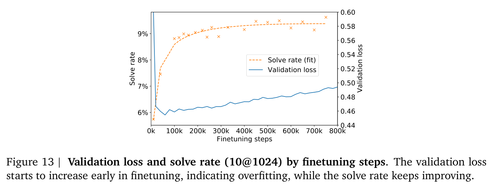

# Lecture 7 — Self-Improvement and Deep Research Agents

This lecture is about improving what a model delivers by **searching** over what it can produce. Its premise
is that "the solutions lie in the search space of the models", and the question is how to curate the answer
out of that space (≈0:52). It looks at two kinds of search. The first is the code-generation search of
*AlphaCode* (2022) and *AlphaCode 2* (2023). They sample up to a million programs per competitive-programming
problem, filter them on the problem's example tests, cluster them by behaviour, and submit at most ten.
AlphaCode 2 swaps the purpose-trained models for fine-tuned Gemini Pro models and adds a learned scoring
model. It reaches AlphaCode's solve rate with about 100 samples instead of a million. The second is the
retrieval search of *Search-o1* (2025), which builds a deep research agent on a large reasoning model. The
model issues search queries mid-reasoning whenever it hits a knowledge gap, and a separate
*Reason-in-Documents* step condenses what comes back before it enters the reasoning chain.

The lecture ties both to the homeworks. The AlphaCode search patterns come up again in homework 2, which is
built on HumanEval, and the agentic search in homework 3 (≈0:05, ≈46:18).

The captions do not name the lecturer, so this page does not either. At ≈22:03 the lecturer credits an
earlier derivation to Azalia Mirhoseini, the course's co-instructor, in the third person.

[Edited transcript](../raw/transcripts/07-self-improvement-and-deep-research-agents.md) ·
[verbatim captions](../raw/transcripts/original/07-self-improvement-and-deep-research-agents.md) ·
[video](https://www.youtube.com/watch?v=Uni9dqyuuDM) ·
[course website](https://cs329a.stanford.edu/) · [sources](../sources.md)

> **Numbering.** This is catalog position 7 ("Part 7 | Self-Improvement and Deep Research Agents"), and it is
> site schedule row 8, "Self improvement with Search & Deep Research Agents" (Fri Oct 17). The transcript
> confirms the mapping: it discusses all three readings row 8 lists, in order — AlphaCode (≈0:52–24:20),
> AlphaCode 2 (≈24:20–39:21) and Search-o1 (≈46:18–1:08:19) — and none of row 7's (*Automated Design of
> Agentic Systems*, *The AI Scientist*, AlphaEvolve). Row 7, "Open-Ended Evolution of Self-Improving Agents"
> (Mon Oct 13), has no video in the catalog. The lecture itself points to it: at ≈45:31–46:18 it calls
> human-in-the-loop work "a scientist style of work that folks covered last lecture", and the lecture before
> row 8 on the schedule is row 7, which lists *The AI Scientist*. Lecture 6 had previewed AlphaCode for "next
> Friday" ([lecture 6](06-train-time-scaling-scaling-rl.md), ≈12:29).

## Readings

The course publishes no slides. Its course material is the three papers the course site lists for this
lecture. Their licences differ, and so does how much of each this KB holds.

| Reading | In this KB | Where the lecture covers it |
|---|---|---|
| Li et al. (2022), [Competition-Level Code Generation with AlphaCode](https://arxiv.org/pdf/2203.07814) | [main body](../raw/papers/07-alphacode.md) (CC BY 4.0 on arXiv; appendices not transcribed) | ≈0:52–24:20 |
| AlphaCode Team, Google DeepMind (2023), [AlphaCode 2 Technical Report](https://storage.googleapis.com/deepmind-media/AlphaCode2/AlphaCode2_Tech_Report.pdf) | linked only (all rights reserved) | ≈24:20–39:21 |
| Li et al. (2025), [Search-o1: Agentic Search-Enhanced Large Reasoning Models](https://arxiv.org/pdf/2501.05366) | linked only (arXiv non-exclusive licence) | ≈46:18–1:08:19 |

**Licences.** AlphaCode's arXiv abstract page gives the paper a CC BY 4.0 licence, while the PDF itself
prints "© 2022 DeepMind. All rights reserved". This KB relies on the arXiv licence grant and transcribes
the paper's main body. The AlphaCode 2 report is a PDF on Google DeepMind's storage that prints "© 2023
Google DeepMind. All rights reserved", and Search-o1 carries arXiv's non-exclusive licence. Neither of
those two is reproduced: they are discussed and cited here by section heading, figure, table and equation.
Checked 2026-09-15.

The two "Li et al." are different author lists: Yujia Li and colleagues at DeepMind for AlphaCode, and
Xiaoxi Li and colleagues at Renmin University of China and Tsinghua University for Search-o1. The AlphaCode 2
report is credited to the AlphaCode Team and asks to be cited as Leblond et al. (2023). It has no numbered
sections, so it is cited by heading.

**About the figures on this page.** The images are AlphaCode's own figures, cropped from the published
PDF with their printed captions. This KB does not read values off charts: what a figure shows is what its
caption and the paper's text say. Numbers on this page come from the papers' text and tables. The AlphaCode
2 report and Search-o1 have no images here.

## Two kinds of search

The lecture's framing is that a model's outputs already contain a solution often enough. The work is in
finding it (≈0:52). For code, that means sampling a great many programs and choosing which few to submit.
For knowledge-heavy reasoning, it means looking things up at the moment the model needs them, and passing
back only what helps (≈0:05). [Lecture 2](02-test-time-compute-scaling.md) showed that repeated sampling
raises coverage; this lecture is about the **selection** that has to follow it when you cannot check every
sample against the ground truth.

## AlphaCode (Li et al., 2022)

### The problem: competitive programming

Code assistants mostly autocomplete a line, and a developer can judge a one-line suggestion quickly, which is
why success rates there are high (≈0:52, ≈3:13). Competitive programming asks for much more. A problem comes
with a long natural-language description and example inputs and outputs — a contract saying which outputs a
program must produce for which inputs (≈1:40). The solver has to understand the problem and work out an
approach before writing any code, and solutions are long (≈2:26–3:13). The lecture contrasts this with
HumanEval, where a small function is to be completed from explicit instructions (≈2:26).

The paper makes the same distinction. It describes solving a problem in three steps: understanding a
multi-paragraph description, creating an efficient algorithm — "a great leap" from what the problem is to how
to solve it — and implementing it within time and memory limits. Contests typically give 5 to 10 problems
and about 3 hours, and grade submissions on hidden tests with penalties for incorrect submissions (§2.1).

AlphaCode's headline result is a simulated ranking in the **top 54.3%** of participants, averaged over 10
Codeforces contests with more than 5,000 participants each (abstract, §5.1). The lecture recalls it as "top
54%" and describes it as the first time AI was shown to solve such problems end to end (≈2:26). The paper's
own claim is that "this is the first time that a computer system has been competitive with human participants
in programming competitions" (§5.1).

*Li et al. (2022), Figure 1: AlphaCode's ranking on 10 simulated Codeforces contests and its estimated rating. It ranked in the top 54.3% of contest participants averaged over the 10 contests, with an estimated average rating of 1238, greater than 72% of users who had competed in the last 6 months.*

### The pipeline

The lecture walks through AlphaCode's block diagram stage by stage (≈3:13–4:46). A model is pre-trained and
fine-tuned, a very large number of solutions is sampled from it, and a selection stage decides which few are
run against the hidden tests. The lecture points out that this selection stage is new. So far in the course
the loop has been closed by running tests on whatever the model outputs; here a selection step sits
**before** execution and evaluation (≈4:46). The paper lists the same four steps (§4):

1. pre-train a transformer language model on GitHub code;
2. fine-tune it on a dataset of competitive programming problems, using GOLD with tempering as the training
   objective;
3. generate a very large number of samples per problem;
4. filter the samples down to at most 10 candidate submissions, using the example tests and clustering on
   program behaviour.

The paper calls the large-scale sampling followed by filtering "unique to our setup", and says many of its
design decisions were made to make sampling efficient (§4).

*Li et al. (2022), Figure 4: overview of AlphaCode.*

The lecture notes that this predates building on large general-purpose models: AlphaCode pre-trains its own
models, which AlphaCode 2 later replaces with a large language model (≈3:13–4:00).

### Pre-training and fine-tuning

AlphaCode's models are **encoder–decoder** transformers (≈6:22; §4.1). The paper's reasoning is that a
problem description is on average twice as long as its solution. So the encoder takes 1536 tokens and the
decoder 768, with a shallow encoder and a deep decoder, and multi-query attention to cut the cost of sampling
(§4.1). Models range from 300M to 41B parameters (Table 3). The lecture mentions that decoder-only models were
also tried "in AlphaCode 2" (≈6:22). The AlphaCode paper itself compares a decoder-only model of the same
size (Table 6: 18.5% against the encoder–decoder's 17.3% at 10@10K, but about a quarter of the samples per
TPU-second). The AlphaCode 2 report says only that its models are fine-tuned Gemini Pro models.

**Pre-training** uses GitHub code — "about 700 gigabytes" in the lecture (≈5:33), 715.1 GB after filtering
in the paper (§3.1). The decoder is trained with next-token prediction and the encoder with a masked
language modelling loss, which the paper calls "essential for improving the representation learning of the
encoder" (§4.2; ≈4:46–5:33).

**Fine-tuning** uses CodeContests, a dataset the authors built from Codeforces problems, solutions and tests,
with a strict temporal split so that all training data predates the validation problems, and those predate
the test problems (§3.2; ≈4:00). The lecture singles out two tricks (≈5:33–6:22):

- **GOLD.** The lecture describes it as adding a weighting to the next-token loss: tokens the model already
  finds likely get more weight and unlikely ones less, which "will help improve the precision". The paper's
  motivation is that a problem has many valid solutions. Maximum likelihood spreads weight over every
  solution in the training set, "like recall", whereas the metric only asks whether one correct solution is
  found, "like precision". GOLD is "an offline RL algorithm which allows the model to both learn from tokens
  it already assigns high likelihood to, and to ignore tokens that are not in its distribution" (§4.3). The
  lecture introduces GOLD as a regularization technique. In the paper the regularizer is **tempering** —
  dividing the logits by a temperature $T=0.2$ during training — and GOLD is the training objective.
- **Value conditioning and prediction.** CodeContests contains incorrect submissions as well as correct ones.
  In value conditioning, whether a submission was correct is written into the problem description, and at
  sampling time the model is always conditioned on "correct". In value prediction, an auxiliary head
  classifies whether a submission is correct during training only (§4.3, Figure 5).

Each enhancement adds to the solve rate in the paper's build-up ablation. Together with clustering, the five
take a 1B model's 10@100K solve rate from 15.2% to 24.1% (§5.3.4, Table 8).

### Sampling at scale

AlphaCode generates up to **a million samples per problem** — "1 million is a large number" — half in
Python and half in C++ (≈6:22). To keep so many samples diverse, it also randomizes the problem tags and
difficulty ratings written into the prompt and samples at a relatively high temperature (≈7:09; §4.4). The
paper picks tags at random from the 50 most popular and ratings uniformly between 800 and 3500, because
neither is known for a new problem in a live contest, and finds the randomization helps, "potentially by
increasing diversity of the samples" (§4.4). Its analysis confirms that the extra diversity is what matters.
Sampling random tags per sample beats giving the model the problem's true tags, which in turn beats one fixed
random set per problem (§6.4, Table 13).

### Filtering and clustering

A contest limits submissions, so AlphaCode submits at most 10 per problem however many it samples (§4.5). It
narrows a million samples to ten in two steps (≈7:09–8:41):

- **Filtering.** Keep only samples that pass the example tests given in the problem statement. This removes
  about 99% of samples, but can still leave tens of thousands per problem. On about 10% of problems no sample
  passes at all (§4.5; Table 9).
- **Clustering.** Many survivors are "syntactically different but semantically equivalent", and submitting
  several of them wastes the budget. AlphaCode trains a separate **test input generation model** to write new
  test inputs from a problem description. It then runs every remaining program on those inputs and groups
  programs that produce the same outputs (≈7:09; §4.6). The generated inputs need not be valid; "imperfect
  and even invalid test inputs can still be useful for grouping sampled programs". Submitting one program per
  cluster, from the largest cluster down, works best. The paper's guess is that "there are many ways solutions
  can be incorrect while correct solutions tend to behave the same" (§4.6).

In the lecture's words, clustering is what lets you pick a set of solutions diverse enough to be worth
evaluating (≈7:55). The survivors are then submitted to Codeforces, which judges correctness and ranks
AlphaCode against human competitors (≈7:55–8:41). The CodeContests test set gives a second, offline signal
(≈8:41).

### The Codeforces evaluation

The authors ran AlphaCode as if live on the 10 Codeforces contests held between 2021/12/01 and 2021/12/28
with more than 5,000 participants. They generated samples, filtered on the example tests, clustered and
submitted, then repeated the whole procedure twice more to measure variance (§5.1; ≈8:41–9:26). The system
was an ensemble of the 41B and 9B models. Table 4 gives, for each contest, the percentage of users who
performed better than AlphaCode (lower is better), averaged over the three runs:

| | Best | Estimated | Worst |
|---|---|---|---|
| Average over the 10 contests | 48.4% | **54.3%** | 77.2% |

*Li et al. (2022), Table 4, average column. "Estimated" uses simulated time and incorrect-submission penalties; "Best" and "Worst" use the minimum and maximum possible time penalties. The per-contest columns are in the [paper file](../raw/papers/07-alphacode.md).*

With 10 submissions per problem, AlphaCode needed an average of 2.4 submissions for each problem it solved.
Its estimated Codeforces rating of 1238 is within the top 28% of users who competed in the previous 6 months
(§5.1). The lecture recalls these as an "average ranking of 54.3, assuming 10 submissions per problem, so not
1 million", and "competitive with 28% of the competitors in the last six months" (≈9:26).

**Why do the contests differ so much?** A student points out that some contests go well and others 20
points worse (≈10:13–11:01). In Table 4, contest 1623's estimated ranking is 20.9%, while 1613's is 66.1% and
1615's 62.4%. The lecturer turns the question back to the class, then offers two hypotheses. Contest problems
may sit closer to or further from the training distribution. And while large-scale sampling decides whether
any sample is correct, the ability to *select* a correct candidate also varies by contest: "the selection
stage can also be a bottleneck", since some solutions are almost correct but not completely (≈11:49–13:24).

### $\text{pass@}k$ and $10\text{@}k$

Two metrics recur in the rest of the AlphaCode discussion (≈13:24–15:45). The paper defines $n\text{@}k$ as
the "percentage of problems solved using $n$ submissions from $k$ samples per problem" (§2.2). A model draws
$k$ samples and may evaluate $n \leq k$ of them against the hidden tests; the problem counts as solved if any
of the $n$ passes all tests.

- $\text{pass@}k$ lets every sample be submitted, so $\text{pass@}k = k\text{@}k$. It "measures mostly the
  search aspect of the sampling process" — the **coverage** of [lecture 2](02-test-time-compute-scaling.md),
  as the lecture puts it (≈14:10) — and it is an upper bound for $k$ samples (§2.2, §5.2).
- $10\text{@}k$ allows only 10 submissions from the $k$ samples. It therefore also measures "the filtering
  process and how models behave at a very large number of samples" (§5.2). You have to search the samples
  yourself before submitting (≈14:57).

Homework 2 uses $\text{pass@}k$ (≈14:10).

### Bigger models and more samples

The lecture reads Table 5, AlphaCode's solve rates on CodeContests at increasing sample budgets
(≈14:57–16:31):

| Approach | Validation 10@1k | 10@10k | 10@100k | 10@1M | Test 10@1k | 10@10k | 10@100k |
|---|---|---|---|---|---|---|---|
| 9B | 16.9% | 22.6% | 27.1% | 30.1% | 14.3% | 21.5% | 25.8% |
| 41B | 16.9% | 23.9% | 28.2% | 31.8% | 15.6% | 23.2% | 27.7% |
| 41B + clustering | 21.0% | 26.2% | 31.8% | **34.2%** | 16.4% | 25.4% | **29.6%** |

*Li et al. (2022), Table 5. The test set has no 10@1M column.*

Three things hold across the table, and the lecture names each (≈15:45–16:31). The larger model does better.
More samples do better, even when only 10 can be submitted. And clustering helps at every budget. The lecture
says the same sweep was run "for test set as well"; the table's test-set columns stop at 100k samples. The
paper adds that no problem in either set was seen in training, because of the temporal split (§5.2).

### Selection is the bottleneck

With 10 submissions, the solve rate still rises **log-linearly** with the number of samples, just as
$\text{pass@}k$ does with repeated sampling. So the trend survives the selection stage (≈17:18–18:06). Better
models have steeper slopes (≈18:06). The paper draws out what that implies. Improving the solve rate needs
exponentially more samples, "and the costs quickly become prohibitive", but "a better model with a higher
slope can reach the same solve rate with exponentially fewer samples". Improving the model is therefore "an
effective way to counter the exponential explosion of sample budget" (§5.3.1). AlphaCode 2 is that argument
put into practice.

*Li et al. (2022), Figure 6: solve rate against the number of samples, with (a) 10 attempts per problem and (b) unlimited attempts per problem. The solve rate scales approximately log-linearly with the number of samples, tapering off slightly with 10 attempts, and larger models have higher slopes.*

Comparing the two panels, the lecturer reads unlimited attempts as reaching "something above 40%" against
about 30% with 10 attempts. That is the lecturer's reading of the chart, and the lecture puts the gap down to
bottlenecking in the selection stage (≈18:06–18:55). The paper makes the gap explicit with a comparison of selection
methods (§5.3.5, Figure 8). Without filtering, randomly chosen submissions leave the solve rate flat as
samples grow. Filtering and then clustering "clearly enable scaling", but "there is still a large gap between
them and the theoretical upper bound" of perfect selection.

*Li et al. (2022), Figure 8: comparison of sample selection methods — random selection ("10@k no filtering"), filtering using example tests ("10@k with filtering"), clustering after filtering ("10@k with filtering + clustering"), and perfect sample selection ("pass@k").*

### Could we just sample a trillion?

A student extrapolates the log-linear trend: six more orders of magnitude of samples, a trillion, should
roughly double the score (≈18:55–19:43). The lecturer gives three answers (≈19:43–22:03):

- **A better model is the easier lever.** AlphaCode 2's stronger model gets the same performance from far
  fewer samples, or much better performance at a million. Base models that are not strong enough "are going
  to hit limits at a certain point".
- **If the log-linear trend continues, yes** — and it might be a project worth exploring if the costs are not
  prohibitive.
- **Diversity has to keep growing.** Extrapolating assumes more samples keep producing more diverse
  solutions. If sampling ten times more does not, the solve rate does not improve. Measuring diversity is
  part of what clustering does.

Asked why the relationship is log-linear rather than some other shape, the lecturer says it "is theoretically
derivable". The derivation was covered earlier in the course, in the Large Language Monkeys paper "or the one
right after that" (≈21:15–22:03). Both are lecture 2 readings; see
[lecture 2](02-test-time-compute-scaling.md) and [scaling laws](scaling-laws.md).

### Takeaways and limits

The lecture's summary of AlphaCode (≈22:03–24:20):

- **Large-scale sampling, filtering and clustering give high coverage.**
- **The model is not copying.** The authors searched the training data and found the generated code had some
  novelty (≈22:48). The paper matched the longest common substrings between correct model solutions and the
  full training data (GitHub and CodeContests). Model and human solutions share substrings with the training
  data at similar rates, and the shared parts are mostly boilerplate for reading input rather than solution
  logic (§6.1, Figure 9).
- **Loss is a poor proxy for solve rate**, because many different solutions can solve a problem (≈22:48). In
  the paper, validation loss starts rising after about 50k fine-tuning steps — normally a sign of overfitting
  — while the solve rate keeps improving. The authors hypothesize that the model moves probability mass from
  atypical solutions towards typical ones (§6.5, Figure 13).
- **Weak spots.** The model did not do well on dynamic programming or constructive algorithms (≈22:48). In
  Table 11 the 41B model's 10@10k solve rate is 8.8% on DP and 14.9% on constructive algorithms, against
  33.8% on bitmasks and 28.2% on math (§6.2).
- **Sampling at this scale is impractical.** Where time is bounded you would want to rank acceptable
  solutions as they are generated (≈23:35).
- **Hard problems need more than one shot.** The approach did not work well on difficult problems, which may
  need more steps; multi-step approaches would do better (≈23:35–24:20).

*Li et al. (2022), Figure 9: lengths of the longest common substrings between solutions and the training data (GitHub and CodeContests), for human solutions (blue) and model solutions (orange). The two distributions are similar.*

*Li et al. (2022), Figure 13: validation loss and solve rate (10@1024) by fine-tuning steps. The validation loss starts to increase early in fine-tuning, indicating overfitting, while the solve rate keeps improving.*

## AlphaCode 2 (AlphaCode Team, 2023)

### What changed

AlphaCode 2 starts from a hypothesis: what if you do not pre-train your own model at all (≈24:20–25:06)? The
work was done at Google, so it starts from **Gemini Pro** and fine-tunes it — "it's not just prompting"
(≈25:06). The lecture lists three further changes (≈25:06–26:40): a *family* of fine-tuned models to make
the samples diverse, a **scoring model** to choose among candidates, and better datasets.

The report lists the system's components as a family of policy models, a sampling mechanism that encourages
diversity, filtering, clustering, and "a scoring model which we use to surface the best candidate out of each
of the 10 biggest code samples clusters" (report, *Overall System*, Figure 1).

### A family of policies, and a scoring model

**Fine-tuning.** The report fine-tunes Gemini Pro in two rounds, both with GOLD as the objective (report,
*Policy and Fine-Tuning*). The first round uses an updated CodeContests of about 15 thousand problems and 30
million human code samples, "containing more problems, more solutions and higher quality, manually-curated
tests on the validation set". Varying the hyperparameters of this round produces a family of fine-tuned
models. The second round is "a few additional steps of fine-tuning on a different, higher-quality dataset".
The report's reason for the family: "Relying on a family of policies instead of a single one allows us to
maximize diversity, which remains key to tackling hard problems."

The lecture's account differs from the report in several details, and a reader should go by the report:

- The lecture says the models vary by hyperparameters, "so different difficulty levels, different tags"
  (≈26:40). It also describes the dataset as "segmented" to fine-tune different models (≈27:29, ≈28:16). The
  report says only that the models differ by hyperparameters. Difficulty ratings and tags appear in the report
  as metadata randomized in the prompt at *sampling* time.
- The lecture calls the dataset "V2 version of CodeContests, which is actually open source" (≈26:40). The
  report's figure labels it "CodeContests v2" and its text calls it an updated version. The report does not say
  it was released; the original CodeContests is published on GitHub (Li et al., 2022, §3.2).
- The lecture says the scoring model is trained on the higher-quality dataset, curated with more human
  annotators so it could estimate correctness better (≈27:29–28:16). The report's text does not say what the
  scoring model is trained on or mention annotators. Its "manually-curated" refers to the tests on the
  updated CodeContests validation set, and its higher-quality dataset is the policies' second fine-tuning
  round.

**Scoring.** A second Gemini Pro model is fine-tuned "to attribute an estimated correctness score between 0
and 1 to code samples" (report, *Scoring Model*). The lecture calls it a reward model. Unlike clustering — "a
heuristic for saying OK, this would be semantically equivalent" — "it's a learned approximation of what should
be given high score and what should be given low score" (≈25:52).

### Sampling, filtering, clustering, reranking

The pipeline keeps AlphaCode's shape (≈29:06–29:51; report, *Sampling* to *Scoring Model*):

1. **Sampling.** Up to a million samples per problem, split evenly across the family of models, with a
   randomized temperature for each sample and randomized difficulty rating and tags in the prompt. **Only
   C++**, "as we found them to be higher quality" — AlphaCode had sampled half Python.
2. **Filtering.** Run each sample on the problem's public tests and discard those with the wrong output, as
   well as the fewer than 5% that do not compile. This removes about 95% of samples.
3. **Clustering.** About 50 thousand candidates remain per problem on average. As in AlphaCode, a separate
   model generates new test inputs, the samples' outputs on them form a signature, samples are grouped by
   signature, and only the 10 largest clusters are kept.
4. **Reranking.** The scoring model scores every sample in those clusters, and the best-scoring sample from
   each becomes one of the 10 submissions.

The lecture gives the post-filtering count as "about 50 case samples" (≈29:06); the report's figure is 50
thousand.

### Results

On 12 recent Codeforces contests with more than 8,000 participants — 77 problems — AlphaCode 2 **solved 43%**
of problems with up to 10 submissions, "a close to 2× improvement over the prior record-setting AlphaCode
system, which solved 25%" (report, *Evaluation*; ≈30:39). On sample efficiency, the report says AlphaCode 2
"requires about 100 samples to reach the level of performance of AlphaCode with a million samples, making it
over 10000× more sample efficient", and that performance still rises roughly log-linearly with more samples
(report, Figure 3). The lecture reads the same curve: at 100 samples AlphaCode 2 matches AlphaCode's million,
and the solve rate keeps improving beyond that (≈29:51–30:39). The lecture attributes the gain to the whole
system — a better base model, more diverse solutions and better scoring (≈30:39).

The report maps the solve rate to rankings by comparing AlphaCode 2's average normalized score with human
contestants' (report, Figure 2). AlphaCode 2 sits at about the **85th percentile** on average, "between the
'Expert' and 'Candidate Master' categories", against an estimated 46% for AlphaCode. In the two contests where
it did best, it outperformed more than 99.5% of participants (report, *Evaluation*; ≈37:46–38:33). The
lecture calls it "a big accomplishment in one single year, just with an improved system" (≈38:33).

### Questions: wasted samples, systems, and the scoring model's data

**95% of samples thrown away seems costly** (≈31:27). A student asks whether better prompting or other
sampling methods were tried. The report does not say. The lecturer asks what earlier work suggests, and the
student proposes homework 1's approach: iterate on a sample rather than drawing a million. The lecturer frames
the million samples as **parallel search**. Self-refinement with feedback would cut the number of samples but
increase the time, and it raises the question of what the feedback would be here. A model improved with RL
would also need less test-time sampling. Both approaches reduce the sampling cost (≈32:18–33:51).

**A system, not a model.** A line of research asks how to build a system that reasons well from an LLM and
closes the loop, then distils that knowledge into a single model, which "becomes a large reasoning model"
(≈34:37). AlphaCode 2 is almost a multi-agent system: one family of models produces outputs and another scores
them. That gives more tricks than depending on what one model can do. The paradigm is that if a solution
exists in the model's output space, you should be able to search for it (≈34:37–35:23).

**Why not train the scoring model on CodeContests v2?** Asked about the scoring model's training data, the
lecturer points to **contamination** (≈35:23–36:10). The scoring model should not see exactly the policies'
training problems, but it does need in-distribution data. It is being taught, for a kind of problem, which of
two solutions to prefer. Mixing the datasets would be possible, but fine-tuning in stages on data of
different quality without mixing risks forgetting what the earlier stage taught (≈36:57). As noted above, the
report does not state the scoring model's training data.

**Takeaways** (≈38:33–39:21). AlphaCode 2 raised performance with *fewer* samples, through a better foundation
model and a scoring model that picks the best candidate. Experimentation is still costly, and the method is
specific to code. Much compute goes on samples with bad syntax that have to be filtered out. The report's own
conclusion agrees: "Our system requires a lot of trial and error, and remains too costly to operate at scale.
Further, it relies heavily on being able to filter out obviously bad code samples" (report, *Discussion and
Conclusion*).

## Discussion: task complexity, and building reasoning in

The lecturer poses two questions for small-group discussion (≈39:21): how would you change these methods
based on task complexity, and how can reasoning be embedded directly into the models?

**By difficulty** (≈40:06–42:24). One student suggests having a model first label each question easy, medium
or hard, and sampling accordingly. Another suggests that simpler problems need fewer samples. The lecturer
agrees and ties it to test-time compute scaling: for simpler problems a solution is more likely to lie in
what the model already outputs. So fewer samples, or iterative refinement of an initial set, should suffice.
Generating many parallel solutions buys diversity of *approach* rather than fixes to an existing attempt.
Compare the difficulty-based allocation in [lecture 2](02-test-time-compute-scaling.md).

**Building reasoning in** (≈42:24–46:18). A student (addressed as Geoffrey) suggests adding hints about which
algorithm solves each training problem. The lecturer generalizes: "As programmers, you think before you write
the answer." Capture that thinking as chain of thought in the training set, or use a STaR-style loop that
gives the model the answer and asks it to produce the reasoning. See [lecture 6](06-train-time-scaling-scaling-rl.md)
and [chain of thought](chain-of-thought.md). Other suggestions: decompose a complex problem and add hints for
the subparts. And a student asks what happens when an early step is right but a later one fails. The lecturer
says these ideas all point towards closing the loop in a multi-step, **tree-search** style — sample a first
step, check it, sample the next, and backtrack — as in [lecture 5](05-planning-and-multi-step-reasoning.md)'s
LATS. Task decomposition works when problems follow common patterns. For out-of-distribution patterns you may
need a human in the loop — the "scientist style of work" the lecture says was covered last lecture (≈45:31–46:18).

## Search-o1 (Li et al., 2025)

### Knowledge gaps in long reasoning

Search-o1 builds a deep research agent on top of a large reasoning model (LRM). The lecture flags it as the
basis of homework 3 (≈46:18–47:03). Its motivation has two parts (≈47:03–47:51). Models have a knowledge
cut-off, so recent events are not in their weights. And when a reasoning model reaches a gap in its knowledge
during a long chain of thought, the gap shows up as **uncertainty in its wording**: on GPQA its chains are full
of "perhaps", "alternatively" and "wait". Left alone, such a gap propagates through the rest of the chain
(≈47:51).

The paper measures this with QwQ-32B-Preview on the GPQA diamond set. Examples of uncertain words are shown
in Figure 1 (left), and their average occurrence per output in Figure 1 (right); "perhaps" averages over 30
occurrences in each reasoning process (§1). Its framing: "an extended chain of thought may cause overthinking
and increased risks of knowledge insufficiency, where any knowledge gap can propagate errors and disrupt the
entire reasoning chain" (§1).

### Why retrieving once is not enough

The obvious fix, from the course's work on learning from tool calls, is retrieval-augmented generation (RAG):
turn the question into a query, retrieve a document, put it in the prompt and answer (≈47:51–48:38). The
problem is that it retrieves **once, at the beginning**. A complex problem needs different information at
different reasoning steps. A weather question may need a single search; a multi-part problem needs to look
things up again partway through (≈48:38–49:23). The lecture says RAG typically improves on direct reasoning
but suffers in multi-step reasoning (≈49:23). The paper is more negative. Its preliminary experiments show
"traditional problem-oriented RAG techniques do not effectively address the knowledge gaps compared to direct
reasoning", because standard RAG "retrieves relevant knowledge only once in a problem-oriented manner" (§1). In
its main results, RAG with QwQ-32B beats direct reasoning on GPQA overall (58.6 vs 58.1) but falls behind on
AIME 2024 (50.0 vs 53.3) and LiveCodeBench (24.1 vs 33.0) (Table 1).

Search-o1 does two things differently (≈49:23–50:09):

1. **The model generates queries on the go.** Whenever it hits a knowledge gap it writes a search query, and
   this can happen many times in one reasoning session.
2. **It analyses the retrieved documents** and puts only the relevant information back into the reasoning
   chain, rather than the documents themselves.

### Agentic RAG: search inside the reasoning chain

The first component, **agentic RAG**, lets the model decide for itself when to retrieve (§3.3; ≈54:59–55:46).
While writing its reasoning chain $\mathcal{R}$, the model may emit a search query $q_ {\text{search}}^{(i)}$
between the special symbols `<|begin_search_query|>` and `<|end_search_query|>`. Here $i$ indexes the search
step, $I$ is the task instruction and $q$ the question. The query is generated like any other text, conditioned
on the reasoning so far, $\mathcal{R}^{(i-1)}$, which includes earlier queries and results (§3.3):

$$P\left(q_ {\text{search}}^{(i)} \mid I, q, \mathcal{R}^{(i-1)}\right) = \prod_{t=1}^{T_q^{(i)}} P\left(q_ {\text{search}, t}^{(i)} \mid q_ {\text{search}, \lt t}^{(i)}, I, q, \mathcal{R}^{(i-1)}\right)$$

where $T_q^{(i)}$ is the query's length in tokens. When the end symbol appears, reasoning pauses, the query is
extracted and a search function returns the top $k_i$ documents, $\mathcal{D}^{(i)} = \texttt{Search}(q_ {\text{search}}^{(i)})$.
In plain agentic RAG these documents go straight into the reasoning chain between `<|begin_search_result|>` and
`<|end_search_result|>`, and reasoning continues (§3.3). The lecture describes the same thing: when the model
shows uncertainty it writes a query between special tokens, a tool call runs, and the returned documents are
inserted into the reasoning chain (≈54:59–55:46).

The paper's agentic RAG baseline, "RAgent", manages document length ReAct-style. It retrieves the top-10
snippets while reasoning, and the model decides which URLs to fetch in full (§4.2).

### Reason-in-Documents

Inserting whole documents has a cost. Documents are long and noisy, and a model's ability to reason over 10
or 20 of them depends on how good its long-context understanding is (≈55:46). The paper names two challenges:
redundant information that "may disrupt the original coherence of reasoning and even introduce noise", and
LRMs' limited ability to understand long documents. It attributes the second to "a degree of catastrophic
forgetting" of general capabilities during their specialization for reasoning (§1).

**Reason-in-Documents** is a separate generation by the same reasoning model, outside the main chain (§3.4).
For search step $i$ it takes the reasoning so far $\mathcal{R}^{(\lt i)}$, the current query and the retrieved
documents. It first writes an analysis of the documents, $r_ {\text{docs}}^{(i)}$, then the refined knowledge
$r_ {\text{final}}^{(i)}$ based on that analysis. Only $r_ {\text{final}}^{(i)}$ goes into the main chain, so
the reasoning and the answer $a$ are conditioned on refined knowledge rather than raw documents:

$$P(\mathcal{R}, a \mid I, q) = \prod_{t=1}^{T_r} P\left(\mathcal{R}_ {t} \mid \mathcal{R}_ {\lt t}, I, q, \lbrace r_ {\text{final}}^{(j)} \rbrace_ {j \leq i(t)}\right) \cdot \prod_{t=1}^{T_a} P\left(a_t \mid a_ {\lt t}, \mathcal{R}, I, q\right)$$

where $T_r$ and $T_a$ are the lengths of the reasoning chain and the answer, and $i(t)$ is the search step
that reasoning token $t$ falls after (§3.4). The lecture calls it a multi-step process inside the retrieval
tool itself: fetch the documents, then extract from them. It compares this to how people research. You do not
just gather every possible reference; you take notes on them, so you can understand and synthesize the
information (≈56:34).

**The worked example** is a chemistry question: how many carbon atoms are in "product 3" at the end of a chain
of reactions (≈50:09; paper Figure 2). The lecture walks through all three approaches (≈50:56–53:17,
≈58:55–59:40):

- **Direct reasoning** meets a term it does not know and guesses from its weights. The guess cascades into
  the final answer, and all the "perhaps"es make the final answer's certainty low.
- **Agentic RAG** searches for the unfamiliar term but inserts the retrieved documents whole. There is too
  much for the model to process, and it still gets the answer wrong — 14 carbon atoms where the answer is 10,
  as the lecturer reads the example.
- **Search-o1** searches, reasons over the documents, extracts the relevant structure and continues with
  coherent reasoning to the correct answer.

The paper's text names the knowledge gap as the "structure of trans-Cinnamaldehyde". Its verdict on agentic
RAG is that the lengthy documents "disrupt the reasoning flow and hurt coherence" (§3.2).

### Questions: what to search for, pausing, and prompting

**How does the model know what to search for** (≈53:17–54:59)? A student notes that in the example, once the
right information is in the prompt, the uncertainty words disappear — but the model has to know which keywords
it does not know. The lecturer's answer, for a real application: decide which parts should not rest on the
LLM's own knowledge and make tool calls for those, much like finding the key entities in the question and
fetching information on them.

**How is reasoning paused and resumed** (≈56:34–57:20)? The lecturer says there must be some state or memory
buffer holding the query and the previous reasoning, though the figure does not make it obvious. In the paper,
the reasoning sequence itself plays that role. Algorithm 1 generates each sequence until end-of-sequence or
`<|end_search_query|>`, runs the search and Reason-in-Documents, inserts the refined knowledge between the
search-result symbols, and resumes generating the same sequence. Sequences are batched across questions (§3.5,
Algorithm 1).

**Could you just prompt agentic RAG to summarize** (≈57:20–58:55)? A student asks whether telling the model to
summarize the documents before continuing would match Search-o1 on recent models. The lecturer calls it a great
question and suggests trying it in homework 3. Doing it in one prompt assumes the model reasons well over
everything in its context. The lecturer relates this to context engineering, naming a recent paper, "Agentic
Context Engineering". That paper is not on the course's reading list. Reasoning well over a long context is
"where we want to shoot" (≈58:55).

### Results

The paper's backbone is QwQ-32B-Preview. Retrieval uses the Bing Web Search API with the top 10 documents, and
Jina Reader fetches page contents (§4.3). The baselines are direct reasoning, standard RAG (top-10 documents
for the original question) and RAgent (§4.2). An excerpt of Table 1, $\text{pass@}1$ with the 32B reasoning
model:

| Method | GPQA Physics | Chemistry | Biology | Overall | MATH500 | AMC23 | AIME24 | LiveCodeBench |
|---|---|---|---|---|---|---|---|---|
| QwQ-32B (direct reasoning) | 75.6 | 39.8 | 68.4 | 58.1 | 83.2 | 82.5 | 53.3 | 33.0 |
| RAG-QwQ-32B | 76.7 | 38.7 | 73.7 | 58.6 | 84.8 | 82.5 | 50.0 | 24.1 |
| RAgent-QwQ-32B | 76.7 | 46.2 | 68.4 | 61.6 | 85.0 | 85.0 | 56.7 | 26.8 |
| Search-o1 | **77.9** | **47.3** | **78.9** | **63.6** | **86.4** | **85.0** | **56.7** | **33.0** |

*Li et al. (2025), Table 1, excerpt: the GPQA diamond set (198 questions), three math benchmarks, and LiveCodeBench's overall column. Bold marks the best result among the 32B models, as the paper bolds it.*

The paper summarizes that, averaged over the five datasets, Search-o1 exceeds RAgent-QwQ-32B by 4.7% and
QwQ-32B by 3.1% (§4.4).

**More documents** (≈59:40–1:00:29). The lecture shows Figure 3: $\text{pass@}1$ on GPQA's physics, chemistry
and biology and overall, against the number of retrieved documents. The lecturer's reading is that direct
reasoning and RAG do not improve with more documents, while Search-o1 does, because it can summarize what is
relevant. Assuming more documents bring more relevant information, this is "another axes" of scaling — a
parallel refinement, fetching more and condensing it into the context (≈1:00:29). The paper's text says
"Search-o1 can effectively leverage an increasing number of retrieved documents", and that "retrieving even one
document can surpass Direct Reasoning and standard RAG models that use ten retrieved documents" (§4.4, Figure 3).

**Against human experts** (≈1:00:29–1:02:51). On the larger GPQA extended set (546 questions), the paper
compares with scores of domain experts (Table 2):

| | Physics | Chemistry | Biology | Overall |
|---|---|---|---|---|
| Physicists | 57.9 | 31.6 | 42.0 | 39.9 |
| Chemists | 34.5 | 72.6 | 45.6 | 48.9 |
| Biologists | 30.4 | 28.8 | 68.9 | 37.2 |
| QwQ-32B | 61.7 | 36.9 | 61.0 | 51.8 |
| RAG-QwQ-32B | 64.3 | 38.3 | 66.7 | 54.6 |
| Search-o1 | 68.7 | 40.7 | 69.5 | 57.9 |

*Li et al. (2025), Table 2.*

The lecturer tells the class to compare along the diagonal — physicists on physics and so on. The lecture first
says Search-o1 is competitive "in physics and chemistry", then corrects itself to "pretty well in physics here
and in biology here, and in chemistry, not so much" (≈1:01:17–1:02:03). The table bears out the correction:
Search-o1 beats physicists on physics (68.7 vs 57.9) and biologists on biology (69.5 vs 68.9), and trails
chemists on chemistry (40.7 vs 72.6), as the paper says (§4.4). A student asks, laughing, how good these
physicists were. The lecturer's answer: "this is not to say that you're outperforming human experts. It's more
to say that you're competitive with the human experts for this class of problems" (≈1:02:03). Asked whether
chemistry is harder because a formula's meaning changes with small edits, the lecturer says it is possible, as
is weaker training data in chemistry, and invites the student to test the hypothesis on GPQA (≈1:02:51–1:03:38).

**Multi-hop question answering** (≈1:04:24–1:05:12). Standard RAG, and even agentic RAG, saturate on multi-hop
QA, the lecture says, while Search-o1 posts most of the best numbers. Table 3's multi-hop columns, exact match
with F1 in parentheses:

| Method | HotpotQA | 2WIKI | MuSiQue | Bamboogle |
|---|---|---|---|---|
| QwQ-32B (direct reasoning) | 25.4 (33.3) | 34.4 (40.9) | 9.0 (18.9) | 38.4 (53.7) |
| RAG-QwQ-32B | 34.2 (46.4) | 35.6 (46.2) | 10.6 (20.2) | 55.2 (67.4) |
| RAgent-QwQ-32B | 43.0 (55.2) | **58.4** (71.2) | 13.6 (25.5) | 52.0 (64.7) |
| Search-o1 | **45.2 (57.3)** | 58.0 **(71.4)** | **16.6 (28.2)** | **56.0 (67.8)** |

*Li et al. (2025), Table 3, multi-hop columns. Bold marks the best among the paper's 32B models; the 2WIKI exact-match column is RAgent-QwQ-32B's.*

The comparison is with the paper's own baselines, not with a state of the art. On average exact match across the
multi-hop tasks, the paper reports Search-o1 ahead of RAG-QwQ-32B by 29.6% and RAgent-QwQ-32B by 5.3%. On
single-hop QA, agentic RAG brings no significant change over standard RAG (§4.5).

**What about retrieval precision and recall** (≈1:05:12–1:06:00)? The lecturer allows that the right documents
may not have been retrieved. The paper's claim, though, is about the reasoning side: even when several
documents are only loosely related to the query, putting them all in context asks a lot of the model's
reasoning.

### Takeaways, and Search-R1

The gains come from reducing uncertainty and refining knowledge from better documents. Across multiple turns,
the model can identify what it does not know, search again when uncertainty remains after reading, and
construct better searches (≈1:06:00–1:06:47). The lecture says the paper counts uncertainty words — "perhaps",
"wait", "likely" — and finds they go down substantially with Search-o1 (≈1:06:47). The paper's text uses its
uncertainty-word count (Figure 1) to motivate the method and to compare standard RAG with direct reasoning; it
states no Search-o1 count in the text.

In summary (≈1:06:47–1:07:33): building deep research agents on reasoning models is an effective way to bridge
their knowledge gaps. Simple RAG is often not enough, and neither is fetching documents with tool calls. The
model has to search effectively over multiple turns and pick out the relevant information, because reasoning
models on their own do not scale well when given many documents. Larger models often do better.

The lecturer had meant to cover one more paper, **Search-R1**, which is not on the reading list. Where Search-o1
closes the loop with a prompting-based approach, Search-R1 teaches the model to search with reinforcement
learning (≈1:07:33–1:08:19). See [reinforcement learning](reinforcement-learning.md).

## Closing question: do models know when they are right?

A student asks whether the probability a model assigns to its answer correlates with correctness — across 1,000
generations, say, or with RAG (≈1:08:19–1:09:54). The lecturer leaves the RAG half as an experiment. On the
first half, aggregating the log probabilities of the output tokens ("not just sum them") shows models tend to be
**overconfident**. A model that is right 50% of the time may be 80% confident, and it can refuse to change its
answer when corrected (≈1:09:54–1:10:41). There has been work on having a model estimate its confidence in a
second pass and training calibration with RL or RLHF, so that it does not give answers it has low confidence in.
Different models behave differently, and outsiders cannot tell which lab did what (≈1:10:41–1:11:27). The
observed pattern: when the model gets an answer right it is likely confident, but when it is wrong it may still
be overconfident. Hallucination, and a model's ability to know what it knows, are active research areas and
good project topics (≈1:11:27–1:12:15). None of this answer comes from the readings.

## Related pages

- [Test-time scaling](test-time-scaling.md) — repeated sampling and coverage, and where selection caps what
  sampling can reach.
- [Verifiers](verifiers.md) — example tests as a filter, clustering by behaviour on generated inputs, and a
  learned scoring model.
- [Agents and agentic workflows](agentic-workflows.md) — tool use inside the reasoning loop, from ReAct to
  Search-o1's deep research agent.
- [Reasoning models](reasoning-models.md) — what long reasoning chains do when knowledge runs out.
- [Scaling laws](scaling-laws.md) — solve rate against samples and model size.
- [Self-improvement](self-improvement.md) — building a system that searches well, then distilling it into a
  model.
- [Lecture 2 — Test-Time Compute Scaling](02-test-time-compute-scaling.md) — Large Language Monkeys, coverage and
  the inference scaling law.
- [Lecture 4 — Learning from Feedback with Tools/Code](04-learning-from-feedback-with-tools-code.md) — ReAct's
  search actions and RLEF on CodeContests.
- [Lecture 5 — Planning and Multi-Step Reasoning](05-planning-and-multi-step-reasoning.md) — tree search with
  backtracking, which the class discussion reaches for.
- [Lecture 6 — Train Time Scaling/Scaling RL](06-train-time-scaling-scaling-rl.md) — STaR, which the discussion
  proposes for building reasoning into a code model.
